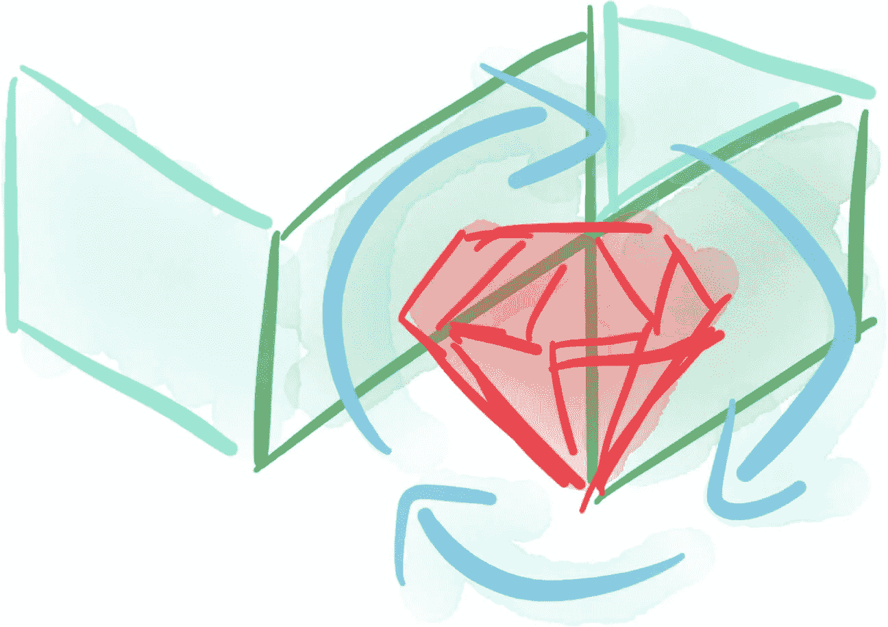
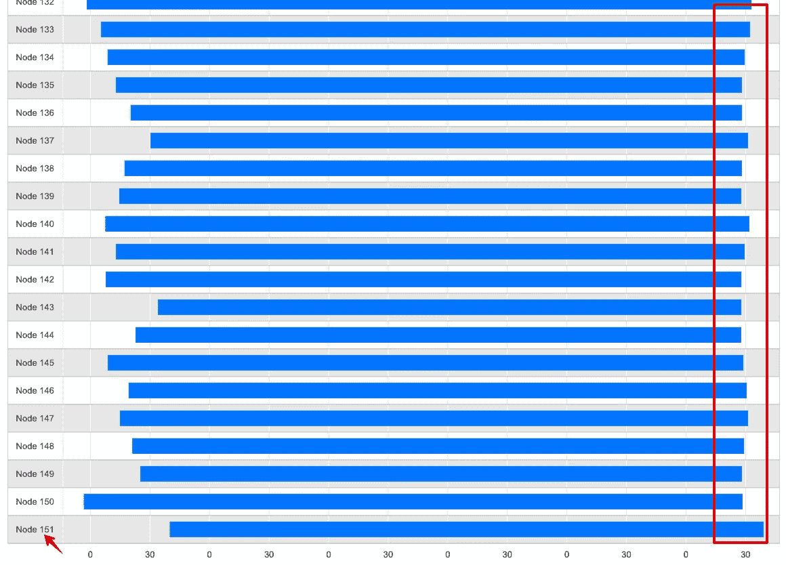
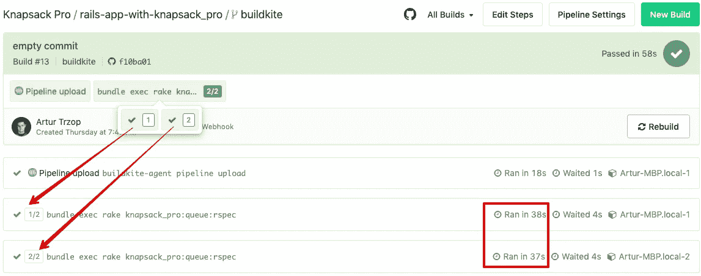

# 具有并行作业的 Buildkite CI 上的自动缩放 RSpec 测试

> 原文：<https://itnext.io/auto-scaling-rspec-tests-on-buildkite-ci-with-parallel-jobs-be75c635572a?source=collection_archive---------4----------------------->

如果您的 RSpec 测试套件运行几个小时，那么您可以使用 Buildkite 代理通过并行作业将其缩短到几分钟。您将学习如何在最佳 CI 构建时间内为您的 Ruby on Rails 项目运行并行测试。我还将向您展示一些对 Buildkite CI 有用的东西，例如:



*   通过使用 151 个并行 Buildkite 代理和[backpack _ pro Ruby gem](https://docs.knapsackpro.com/knapsack_pro-ruby/guide/)，耗时 13 小时 32 分钟的真实 RSpec 测试套件仅在 5 分 20 秒内执行。
*   如何在[背包 Pro](https://knapsackpro.com/?utm_source=medium&utm_medium=blog_post&utm_campaign=medium-auto-scaling-buildkite-ci-build-agents-for-rspec-run-parallel-jobs-in-minutes-instead-of-hours) 中使用队列模式在并行作业之间分发测试文件，以优化 CI 机器的使用。
*   CI Buildkite 并行配置的简单示例。
*   使用 AWS 的弹性 CI 堆栈进行 Buildkite 配置的高级示例。
*   为什么您可能想要使用 AWS Spot 实例
*   如何通过并行 Buildkite 代理之间的测试实例(测试用例)自动分割慢速 RSpec 测试文件

# 一个真正的 RSpec 测试套件需要 13 个小时，而执行只需 5 分钟

我将向您展示运行 RSpec 并行测试的真实项目的结果。我们在这里看到的项目是巨大的，它的 RSpec 测试运行时间是 13 小时 32 分钟。超级慢。您可以想象创建一个 git commit，然后等待 13 个小时，第二天发现您的代码破坏了项目中的其他内容。你不能那样工作！

解决方案是使用 Buildkite 代理在许多 CI 机器上并行运行测试。每台 CI 机器都安装了一个 Buildkite 代理，它将运行 RSpec 测试套件的一部分。下面你可以看到一个在 151 个并行 Buildkite 代理上运行约 13 小时测试套件的例子。这允许在仅仅 5 分 20 秒内运行整个 RSpec 测试套件！



上图来自背包 Pro [用户仪表盘](https://knapsackpro.com/dashboard?utm_source=medium&utm_medium=blog_post&utm_campaign=medium-auto-scaling-buildkite-ci-build-agents-for-rspec-run-parallel-jobs-in-minutes-instead-of-hours)。151 并行作业很多机器。需要整个屏幕才能显示 151 个小节。你只能在图上看到最后几个条形。条形图显示了 RSpec 测试文件是如何在并行机器之间分割的。

你可以看到每台并行机器在相似的时间完成工作。所有条形的右边缘彼此非常接近。这是重要的部分。您希望确保 RSpec 工作在并行作业之间平均分配。这样您可以避免瓶颈——运行太多测试文件的缓慢工作。我会告诉你怎么做。

# 如何使用 backpack Pro 中的队列模式在并行作业之间分发测试文件，以优化 CI 机器的使用

为了尽可能快地运行 CI 构建，我们需要尽可能多地利用我们的可用资源。这意味着运行 RSpec 测试的工作应该在并行机器之间平均分配。

测试套件越大，运行它的时间就越长，当您在网络中的许多机器之间分割运行测试时，会发生更多的边缘情况。一些可能的边缘情况:

*   一些测试文件比其他文件需要更长的时间来运行(例如 E2E 测试文件)
*   一些测试用例失败了，运行得更快，一些没有失败，运行得更久。这会影响 CI 机器运行测试所花费的总时间。
*   一些测试用例需要更长的时间，因为它们必须连接网络/外部 API 等——这增加了它们执行时间的不确定性
*   一些并行机器在引导时间上花费更多的时间:
*   安装 Ruby gems 需要更长时间
*   从缓存中加载 Ruby gems 很慢
*   或者只是 CI 提供程序还没有开始您的工作
*   或者，您的可用代理池中没有足够的可用机器

多种因素会破坏并行节点之间的工作分布。

我们的最终目标是确保所有机器在相似的时间完成工作，因为这意味着每台机器都收到了与其可用能力相适应的工作负载。这意味着，如果一台机器很晚才开始工作，它将只运行一小部分测试。如果另一台机器很早就开始工作，它将运行更多的测试。这将使平行机之间的结束时间变得均匀。多亏了 backpack _ pro Ruby gem 中的队列模式，所有这些都是可能的，它会为你并行运行测试。[队列模式在并行作业之间动态分割测试文件，以确保作业同时完成](https://docs.knapsackpro.com/2020/how-to-speed-up-ruby-and-javascript-tests-with-ci-parallelisation)。

您可以看到一个为 Ruby on Rails 项目跨两个并行 Buildkite 代理运行一个小型 RSpec 测试套件的例子。

# CI Buildkite 并行配置的简单示例

这是一个非常简单的 Buildkite 配置示例，可以运行 2 个并行任务，正如你在截图中看到的。



```
*# .buildkite/pipeline.yml*
env:
  *# You should hide you secrets like API token*
  *# Please follow* [*https://buildkite.com/docs/pipelines/secrets*](https://buildkite.com/docs/pipelines/secrets)
  KNAPSACK_PRO_TEST_SUITE_TOKEN_RSPEC: "204abb31f698a6686120a40efeff31e5"
  *# allow to run the same set of test files on job retry*
  *#* [*https://github.com/KnapsackPro/knapsack_pro-ruby#knapsack_pro_fixed_queue_split-remember-queue-split-on-retry-ci-node*](https://github.com/KnapsackPro/knapsack_pro-ruby#knapsack_pro_fixed_queue_split-remember-queue-split-on-retry-ci-node)
  KNAPSACK_PRO_FIXED_QUEUE_SPLIT: true

steps:
  - command: "bundle exec rake knapsack_pro:queue:rspec"
    parallelism: 2
```

请注意，您应该像 backpack Pro API 令牌一样隐藏您的凭证，而不是将其提交到您的存储库中。你可以参考 [Buildkite 秘密文档](https://buildkite.com/docs/pipelines/secrets)。

# AWS 的高级 Buildkite 配置和弹性 CI 堆栈

当您想要在十几台甚至数百台并行机上运行您的大型 RSpec 项目时，您需要强大的资源。在这种情况下，你可以遵循关于 AWS 设置的 [Buildkite 教程](https://buildkite.com/docs/tutorials/elastic-ci-stack-aws)。面向 AWS 的弹性 CI 堆栈在您自己的 AWS 帐户中为您提供了一个私有的、自动扩展的 Buildkite 代理集群。

# AWS Spot 实例可以为您节省资金

AWS 提供了 Spot 实例。这些机器很便宜，但可以随时被 AWS 收回。这意味着您可以为您的 CI 运行廉价的机器，但是 AWS 可能会不时地杀死您的并行机器之一。这样的场景可以由[背包 Pro](https://knapsackpro.com/?utm_source=medium&utm_medium=blog_post&utm_campaign=medium-auto-scaling-buildkite-ci-build-agents-for-rspec-run-parallel-jobs-in-minutes-instead-of-hours) 来处理。它记得分配给运行测试的 AWS 机器的测试文件集。当机器被撤回并且稍后被 Buildkite 重试特性重试时，正确的测试文件将如你所期望的那样被执行。

# Buildkite 重试功能

Buildkite 配置允许[自动重试你的任务](https://buildkite.com/docs/pipelines/command-step#automatic-retry-attributes)。当您使用 AWS Spot 实例时，这很有帮助。当 AWS 在测试运行时由于撤销而关闭您的机器时，Buildkite 可以自动在新的机器上运行新的作业。

自动重试的另一个用例是当您有[片状 Ruby 测试](https://docs.knapsackpro.com/2021/fix-intermittently-failing-ci-builds-flaky-tests-rspec)时，它们有时会通过绿色或失败红色。在这种情况下，您可以使用 Buildkite 重试失败的作业。

我的建议是将 [rspec-retry gem](https://knapsackpro.com/faq/question/how-to-retry-failed-tests-flaky-tests?utm_source=medium&utm_medium=blog_post&utm_campaign=medium-auto-scaling-buildkite-ci-build-agents-for-rspec-run-parallel-jobs-in-minutes-instead-of-hours) 作为首选。RSpec-retry gem 将只重试失败的测试用例，而不是所有分配给并行机器的测试文件。你可以尝试的第二个选择是依靠 [Buildkite 重试特性](https://buildkite.com/docs/pipelines/command-step#automatic-retry-attributes)。它将重试 CI 节点和 backpack Pro API 分配给它的所有测试。

# 如何通过并行 Buildkite 代理之间的测试实例(测试用例)自动分割大型慢速 RSpec 测试文件

慢速 RSpec 测试文件通常与 E2E 测试相关，如水豚功能规格的浏览器测试。他们可以跑几分钟，有时甚至几十分钟。如果并行作业必须运行单个测试文件 10 分钟，而其他并行作业在 5 分钟内完成几个较小的测试文件，那么它们可能会成为瓶颈。

有一个解决方案！您可以将 backpack Pro 与 [RSpec split by examples 特性](https://knapsackpro.com/faq/question/how-to-split-slow-rspec-test-files-by-test-examples-by-individual-it?utm_source=medium&utm_medium=blog_post&utm_campaign=medium-auto-scaling-buildkite-ci-build-agents-for-rspec-run-parallel-jobs-in-minutes-instead-of-hours)一起使用，该特性将自动检测项目中的慢速 RSpec 测试文件，并通过测试示例(测试案例)在并行 Buildkite 代理之间拆分它们。

# 摘要


建筑风筝

正如您所看到的，将 Buildkite CI 等一些元素与 AWS 等云基础设施解决方案相结合，并使用 backpack Pro 对测试文件进行最佳分割，可以显著改善您团队的工作。有了[背包 Pro](https://knapsackpro.com/?utm_source=medium&utm_medium=blog_post&utm_campaign=medium-auto-scaling-buildkite-ci-build-agents-for-rspec-run-parallel-jobs-in-minutes-instead-of-hours) 你可以获得巨大的成果和超快的 CI 构建。欢迎[尝试一下](https://knapsackpro.com/?utm_source=medium&utm_medium=blog_post&utm_campaign=medium-auto-scaling-buildkite-ci-build-agents-for-rspec-run-parallel-jobs-in-minutes-instead-of-hours)并加入其他快乐的 Buildkite 用户。

# 相关文章

如果你正在寻找 Docker 配置，你也可以在文章末尾看到存储库示例:[在 Buildkite CI](https://docs.knapsackpro.com/2017/auto-balancing-7-hours-tests-between-100-parallel-jobs-on-ci-buildkite-example) 上自动平衡 100 个并行任务之间的 7 小时测试。


*原载于 2021 年 3 月 19 日 https://docs.knapsackpro.com**的* [*。*](https://docs.knapsackpro.com/2021/auto-scaling-buildkite-ci-build-agents-for-rspec-run-parallel-jobs-in-minutes-instead-of-hours)