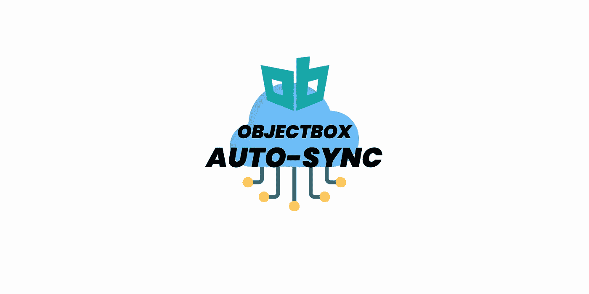
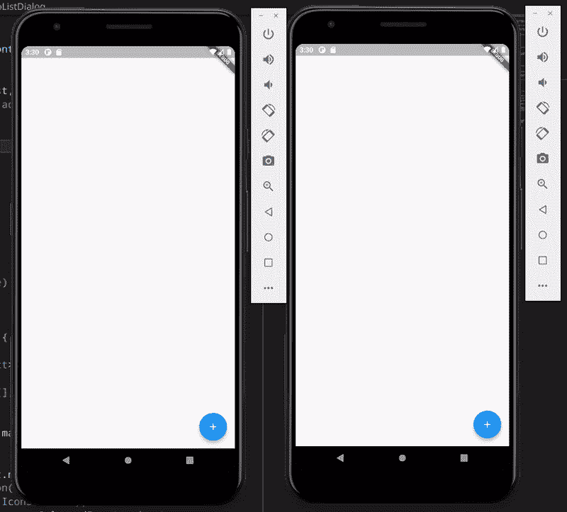
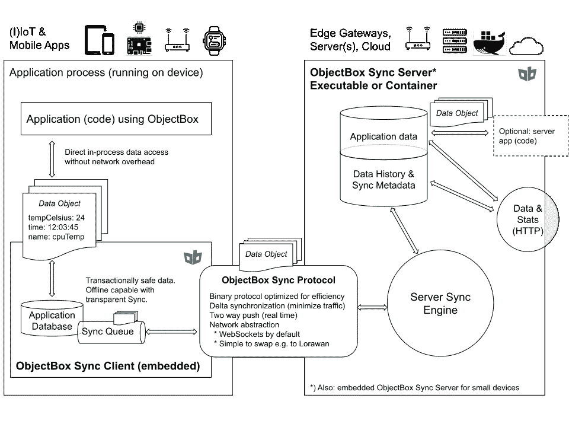
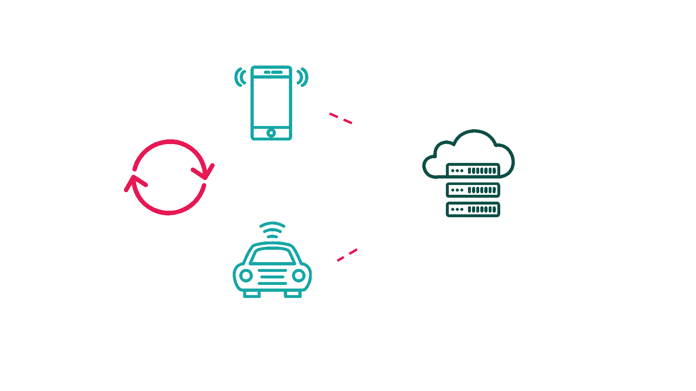

# 使用 ObjectBox 跨设备自动同步数据

> 原文：<https://itnext.io/auto-sync-across-devices-using-objectbox-566af10b0047?source=collection_archive---------3----------------------->



## 数据同步是一个很酷但很难实现的功能，尤其是对物联网来说很有必要。那么我们来看看在 Flutter 中实现起来有多容易！

在我之前的文章中，我提到过 ObjectBox 很酷，因为它不仅速度快，而且还有一个**数据同步特性**

[](/the-fastest-local-database-in-dart-flutter-a65ff5b29fee) [## Dart/Flutter 中最快的本地数据库

### ObjectBox 凭借其性能和自动同步选项改变了游戏规则

itnext.io](/the-fastest-local-database-in-dart-flutter-a65ff5b29fee) 

## 现在，让我们看看这个特性有多酷！

# 动机



> Y 你可以得到文章的项目底！

在开始编写代码之前，

## 我想说一下背后的逻辑！



正如你所看到的，ObjectBox 有一个非常简洁的架构。

简单地说，我有两部分(客户端和服务器)

客户端有一个同步队列。它使用 ObjectBox Sync 协议与服务器通信，并使用 WebSockets 推送和提取更改。

当设备断开连接时，同步客户端将**定期尝试在后台重新连接**，直到重新连接。

如果连接成功，将发送排队的数据，一旦同步目标确认接收，数据将从队列中删除。

在服务器端，服务器施展魔法，同步所有的更改，并将每个更改发送到他们需要的设备上！这使得所有设备同步！

## 现在，让我们开始我们的场景和代码！



边缘到云到边缘

在此场景中，我们将使用边缘到云功能。
这意味着我们将有一台本地服务器和两台设备需要同步。

## 让我们从客户端开始吧！

# **同步客户端**

在客户端，你只需要 3 个步骤来同步你的应用程序！

## 1- **将您的依赖关系更改为同步**

```
dependencies:
  ...
  objectbox_flutter_libs: any **// remove**
  objectbox_**sync**_flutter_libs: any **// add**
```

## 2-给你的模型添加 S `ync()`注释

```
@Entity()
**@Sync()**
class User {
  int id = 0;
  final String name; User(this.name);
}
```

## 3-启动你的同步客户端到 WebSocket！

```
if (Sync.isAvailable()) {
  Sync.client(
    store,
    Platform.isAndroid ?
           'ws://10.0.2.2:9999' :
           'ws://127.0.0.1:9999',
    SyncCredentials.none(),
  ).start();
}
```

就是这样！！你可以走了！

但是等等，这还不行！如你所知，我们还需要一个同步服务器。
不用担心！这也太简单了！！

# **同步服务器**

你也需要 3 个步骤来完成

## 1-从这里的[向对象箱发送一个请求](https://objectbox.io/sync/)

他们会给你一个文件来运行安装说明

在 Linux 上，仅仅在我的控制台上运行一个命令就足够了，但是如果你是 Windows 用户，我猜你需要在 docker 上使用它。

不要担心，这方面有很好的文档，ObjectBox 团队也会帮助你！

## 2-用你的`objectbox-model.json`运行文件

注意:`objectbox-model.json`是 dart 自动生成的文件，请从项目的`/lib`文件夹中获取

```
./sync-server --model=objectbox-model.json --unsecured-no-authentication
```

## 3-喝杯咖啡放松一下，因为你已经做完了！

现在，您可以运行您的设备并进行测试！

要同时运行所有设备，运行这个命令，看看有什么神奇的！

```
flutter run -d all // runs all active devices
```

# 完整示例项目

[](https://github.com/iisprey/objectbox-example) [## GitHub-IIS prey/object box-示例

### 此时您不能执行该操作。您已使用另一个标签页或窗口登录。您已在另一个选项卡中注销，或者…

github.com](https://github.com/iisprey/objectbox-example) 

## 警告

自动同步在 GenyMotion 上无法正常工作，所以请使用真实设备或 Android Studio 的模拟器！(或者 ios(模拟器)也是如此)

# 感谢您的阅读！

我试图尽可能简单地解释。希望你喜欢。

如果你喜欢这篇文章，请点击👏按钮(你知道你可以升到 50 吗？)