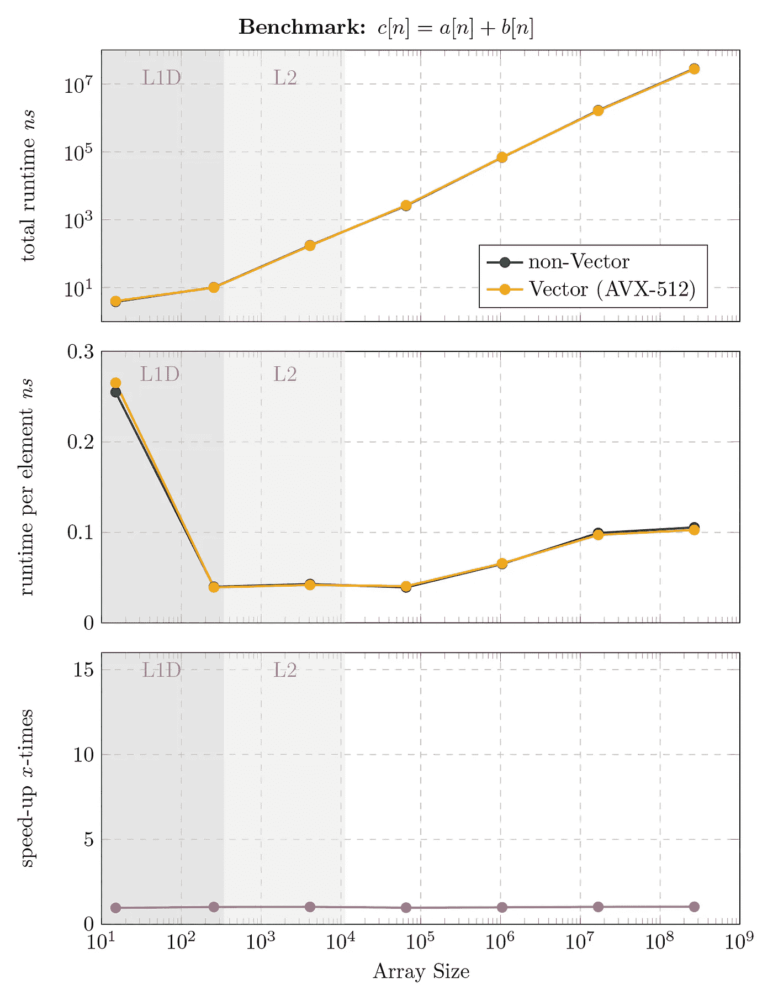
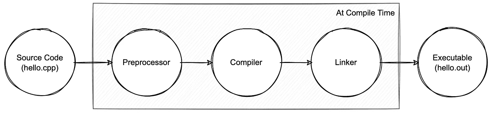
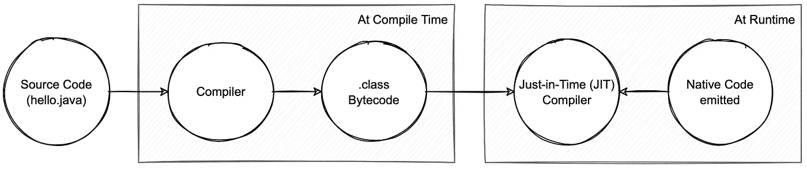
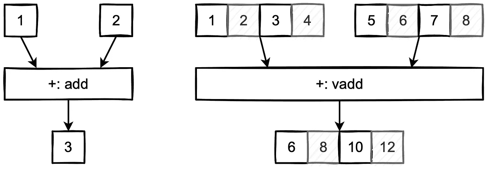
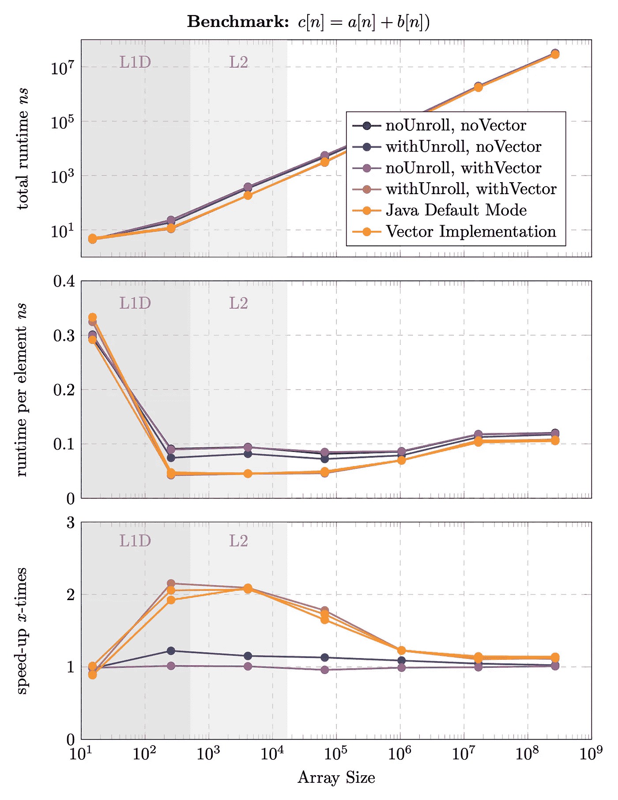

# 自动向量化:如何被编译器优化击败——Java JIT！

> 原文：<https://itnext.io/auto-vectorization-how-to-get-beaten-by-compiler-optimization-java-jit-vector-api-92c72b97fba3?source=collection_archive---------0----------------------->

# 动机

最近，我调查了新的 Vector API 的第三次迭代:
[Java 18:Vector API——我们获得免费加速了吗？！](https://medium.com/@Styp/java-18-vector-api-do-we-get-free-speed-up-c4510eda50d2)

这篇文章旨在跟进一些我在第一篇文章中无法回答的有趣发现。我想总结一下我的发现，并展示 Java Vector API 如何通过利用平台的内在特性来加速代码。融合乘加(FMA)基准测试的结果在某种程度上是意料之中的，并且显示了有希望的结果。然而，简单求和的例子没有显示任何改进。平均加速为 0%，反复运行基准后，仍显示 0%的提升。现在是时候调查这种失望了。


插图我盯着恒星 0x 加速！

简单求和是两个数组 *a* 和 *b* 最基本的相加，结果得到一个数组 *c* 。我们也可以用下面几行代码来表达这一点:

```
public static int[] simpleSum(int[] a, int[] b) {
    int c = new int[a.length];    
    for (var i = 0; i < a.length; i++){
        c[i] = a[i] + b[i];
    }
    return c;
}
```

我们获得的性能显示，在所有不同的阵列大小下，速度都提高了 0 倍，如下图所示:



基准测试及其惊人的 0%加速！非 Vector 表示 Java for-loop 实现，而 Vector 表示基于本地 Vector API 的实现。

基准测试是在具有最宽寄存器的支持 AVX-512 的 CPU 上进行的；因此，预计数据并行指令的运行时改进最为显著。然而，令人着迷的是，一个纯 java 基准测试与高度优化的解决方案不相上下。

# 这种实时编译(JIT)是什么东西？

在这一点上，我们可以假设要么我们的 Vector API 版本没有按预期工作，要么 Java 正在对代码的某些关键区域应用一些加速魔法。然而，为了理解 Java 优化代码的能力，我们需要看看提前机器代码生成和即时机器代码生成之间的根本区别——就像在 Java 中一样。

**提前生成机器代码:**

提前(AoT)机器码生成发生在编译时。这种技术在 C++等语言中使用。在编译过程中，源代码被*转录*为机器码。机器代码取决于目标平台，如 x86、Itanium、ARM、M1。因此，代码仅在编译期间被*接触*，并且*被转录*到目标平台的汇编规范。



解释代码编译的过程(例如 C++)

**即时机器代码生成:**

相反，实时(JiT)机器代码生成工作起来稍微复杂一些。代码不是直接转录成目标平台的汇编语言，而是被转录成称为字节码的中间代码。Java 字节码是一种中间表示，涵盖了 JVM 指令集，同时结合了一些编译器优化。

JIT 编译器读取字节码，并为所需的平台(x86、ARM 等)发出正确的汇编指令。).此外，它可以利用程序流的*知识*应用一些更具体的优化。



基于 JVM 语言的两阶段编译过程。

JIT 编译器结合了两种机器代码翻译方法:解释和提前编译。它负责将字节码翻译成特定于平台的指令。有了增加的运行时知识，就可以进行特定的优化，而这些优化在编译时并不明显。这有助于进一步优化代码，并提高传统语言的运行时性能。

**闪耀时刻到了:**

了解了实时编译器的特性后，有人可能会问，与传统的提前编译相比，它有什么好处。让我们用一个简单的例子来探讨这个问题:

```
public void randomLoop(){
    var rnd = new Random();
    int maxItems = rnd.nextInt();
    for(int i = 0; i < maxItems; i++){
        doSomethingWith(i);
    }
}
```

提前编译器没有合理的机会知道循环将执行多少次迭代。另一方面，即时编译器精确地知道 maxItems 有多大，并且可以针对小*、*中*或*大*循环进行优化！(这个片段只显示了与提前编译相比，运行时的*知识*优势。当然，不能保证任何实时的编译器改进。)*

# ***优化选项***

***循环展开:** 循环展开是一种最小化循环开销的优化技术，如边界检查、变量增加等。不是检查循环计数器(I)并随每个元素增加，而是在一个循环体中完成多个元素，以最小化开销:*

```
*public void normalLoop(){
    for(int i = 0; i < 128; i++){
        doSomethingWith(i);
    }
}public void unrolledLoop(){
    for(int i = 0; i < 32; i+=4){
        doSomethingWith(i+0);
        doSomethingWith(i+1);
        doSomethingWith(i+2);
        doSomethingWith(i+3);
    }
}*
```

*只要迭代次数已知，这是提前编译期间使用的一种流行技术。(曾经问过自己为什么 C++ *常量变量*如此重要——现在你知道了！)实时编译器知道运行时的循环大小，因此可以根据变量的大小强制展开循环。*

***矢量化:** 另一种潜在的方法是自动矢量化(Auto-vectorization)。基于向量的指令触发处理器的特定 SIMD(单指令、多数据)寄存器，这些寄存器可以在同一个指令周期内对多个元素执行一个操作。被剪切的 *simpleSum* 代码是一个可以用矢量化进行优化的完美例子。有了 Javas Vector API，我们可以编写平台无关但 SIMD 优化的代码。*

**

*单指令、单数据(SISD) — vs —单指令、多数据(SIMD)*

*这个介绍引出了一个开放性的问题:**为什么我在比较一个原始实现和一个 Vector API 加速实现时没有得到任何加速？***

# *找到罪魁祸首:自动矢量化还是循环展开？*

*我们现在已经提出了两种策略来优化简单的算术运算循环。最后，是时候证明哪些 JIT 优化消除了手动调整代码的潜在加速。*

*JVM 由各种诊断标志组成，这些标志支持将发出的汇编代码存储到日志文件中。此外，还可以打开和关闭一些 JIT 特性。JIT 特性的启用和禁用有助于研究优化技术及其对代码运行时的影响。例如，关闭自动向量化和循环展开，可以为 simpleSum 示例生成最原始的汇编代码:*

```
**Operation: add a[i]+b[i] and move data to c[i]:*
0x11dad89e0:   mov    0x10(%r8,%r13,*4*),%eax
0x11dad89e5:   add    0x10(%r11,%r13,*4*),%eax
0x11dad89ea:   mov    %eax,0x10(%rbx,%r13,*4*)       ;*iastore *Operation: Increment Loop-Counter i:*                                                         *ch.styp.TestMain*::addArray@*27* (line *37*)
0x11dad89ef:   inc    %r13d                        ;*iinc *Operation: Compare Loop-Counter i, and jump to add-Block:*                                                       *ch.styp.TestMain*::addArray@*28* (line *36*)
0x11dad89f2:   cmp    %r9d,%r13d
0x11dad89f5:   jl     0x11dad89e0                  ;*goto* 
```

*截取的下一个生成的代码是打开了循环展开特性的代码。因此，此配置会生成以下代码:*

```
**Operation: add a[i+0]+b[i+0] and move data to c[i+0]:* 0x11bd3e240:   mov    0x10(%rbp,%rdi,*4*),%esi
0x11bd3e244:   add    0x10(%rdx,%rdi,*4*),%esi
0x11bd3e248:   mov    %esi,0x10(%r8,%rdi,*4*)*Operation: add a[i+1]+b[i+1] and move data to c[i+1]:*
0x11bd3e24d:   mov    0x14(%rbp,%rdi,*4*),%r10d
0x11bd3e252:   add    0x14(%rdx,%rdi,*4*),%r10d
0x11bd3e257:   mov    %r10d,0x14(%r8,%rdi,*4*)*Operation: add a[i+2]+b[i+2] and move data to c[i+2]:* 0x11bd3e25c:   mov    0x18(%rdx,%rdi,*4*),%r10d
0x11bd3e261:   add    0x18(%rbp,%rdi,*4*),%r10d
0x11bd3e266:   mov    %r10d,0x18(%r8,%rdi,*4*)*Operation: add a[i+3]+b[i+3] and move data to c[i+3]:* 0x11bd3e26b:   mov    0x1c(%rdx,%rdi,*4*),%r10d
0x11bd3e270:   add    0x1c(%rbp,%rdi,*4*),%r10d
0x11bd3e275:   mov    %r10d,0x1c(%r8,%rdi,*4*) *Operation: Increment Loop-Counter i (This time +4):
ch.styp.TestMain*::addArray@*27* (line *37*)
0x11bd3e27a:   add    $0x4,%edi                    ;*iinc *Operation: Compare Loop-Counter i, and jump to add-Block:*                        *ch.styp.TestMain*::addArray@*28* (line *36*)
0x11bd3e27d:   cmp    %eax,%edi
0x11bd3e27f:   jl     0x11bd3e240                  ;*goto*
```

*最后但同样重要的是，我们强化了 Java 必须提供的所有特性，并且我们期望循环展开和向量并行出现在汇编代码中。x86 指令集在向量形式上相当于 mov 和 add，如 *vmov* 和 *vadd* (及其变体)，因此我们希望在发出的汇编代码中看到这些指令:*

```
**Operation: add a[i+0..3]+b[i+0..3] and move data to c[i+0..3]:*
0x112c9d300:   vmovdqu 0x10(%rbp,%r11,*4*),%ymm0
0x112c9d307:   vpaddd 0x10(%r13,%r11,*4*),%ymm0,%ymm0
0x112c9d30e:   vmovdqu %ymm0,0x10(%rdx,%r11,*4*)*Operation: add a[i+4..7]+b[i+4..7] and move data to c[i+4..7]:*
0x112c9d315:   vmovdqu 0x30(%rbp,%r11,*4*),%ymm0
0x112c9d31c:   vpaddd 0x30(%r13,%r11,*4*),%ymm0,%ymm0
0x112c9d323:   vmovdqu %ymm0,0x30(%rdx,%r11,*4*)*Operation: add a[i+8..11]+b[i+8..11] and move data to c[i+8..11]:*
0x112c9d32a:   vmovdqu 0x50(%rbp,%r11,*4*),%ymm0
0x112c9d331:   vpaddd 0x50(%r13,%r11,*4*),%ymm0,%ymm0
0x112c9d338:   vmovdqu %ymm0,0x50(%rdx,%r11,*4*)*Operation: add a[i+12..15]+b[i+12..15] and move data to c[i+12..15]:*
0x112c9d33f:   vmovdqu 0x70(%rbp,%r11,*4*),%ymm0
0x112c9d346:   vpaddd 0x70(%r13,%r11,*4*),%ymm0,%ymm0
0x112c9d34d:   vmovdqu %ymm0,0x70(%rdx,%r11,*4*) *Operation: Increment Loop-Counter i (This time +16):
ch.styp.TestMain*::addArray@*27* (line *37*)
0x112c9d354:   add    $0x20,%r11d                    ;*iinc*Operation: Compare Loop-Counter i, and jump to add-Block:*                        *ch.styp.TestMain*::addArray@*28* (line *36*)
0x112c9d358:   cmp    %eax,%r11d
0x112c9d35b:   jl     0x112c9d300                    ;*goto*
```

**ymm-* 寄存器的出现表明使用了代表 8 个整数的 256 位宽向量运算。这证明了 AVX-2 在这个例子中的用法。(为了更好的可读性，编辑了所有装配片段。)*

*就这样——默认生成的机器码包含向量并行和循环展开，最后一个例子证明了这一点。因此，向量并行实现无法击败 JVM 发出的代码。自动矢量化和循环展开应用得如此巧妙，以至于基于 API 的实现无法带来任何性能提升。令人印象深刻的是，JVM 可以很好地优化简单的代码片段，从而在任何平台上产生最佳性能。*

# *我们来证明一下假设:基准。*

*谈论改进并在汇编代码中展示它们是一回事，但是要完成这项工作，交付基准测试是必要的。有趣的问题是 simpleSum 实现是否效率不高——或者基线是否优化得如此之好，以至于手动应用代码调整(Vector API)无法提供任何进一步的性能优势。
出于完整性原因，不同的 JVM 配置和本地 Vector API 实现已经过基准测试:*

***无展开，无向量:** 在这种情况下，循环展开和自动向量化的 JVM 特性被禁用。该模式用作所有连续实验的基线，生成应用最少优化的汇编代码。*

*   ***使用展开，无向量:** 启用循环展开，但禁用自动向量化。*
*   ***无展开，带向量:** 启用自动向量化，但禁用循环展开。*
*   ***With Unroll，With Vector:** 循环展开和自动向量化的标志都被启用——这是强制应用两种技术，还是仅基于最佳情况基础进行优化，不幸的是没有记录。*
*   ***Java 默认:** 没有附加标志；JVM 在其默认配置下运行。*
*   ***向量实现:** 代码使用向量 API 实现，因此强制作为向量并行代码运行；JVM 设置保留默认模式。*

*选择阵列长度是为了代表最差情况下的适用性。这些测试是在多个 2^n-1.上进行的具体来说，使用了以下值: *15，255，4095，65535，16777215，268435455* 。*

**

*具有循环展开、自动向量化以及两者结合的性能指标评测。包括与本地 Vector API 实现的比较。*

*结果显示预期的行为；在数据保存在本地缓存的区域(L1 数据和 L2)可以看到最显著的加速。
此外，simpleSum 基准测试极大地受益于 Java 运行时默认设置中的循环展开和自动向量化！因此，不可能通过利用 Vector API 来进一步改进:*

```
*+--------------------------+---------------+
|          Method          | Peak Speed-Up |
+--------------------------+---------------+
| No Unroll, No Vector     | 1.00x         |
| With Unroll, No Vector   | 1.22x         |
| No Unroll, With Vector   | 1.01x         |
| With Unroll, With Vector | 2.15x         |
| Java Default             | 2.06x         |
| Vector Implementation    | 2.08x         |
+--------------------------+---------------+*
```

*峰值加速表给基准测试过程带来了更多的启示:循环展开和自动矢量化作为独立的解决方案只能提供很少的好处。但合在一起，它们带来了超过 2 倍的巨大速度提升。*

# ***讨论***

*在最初的博文中，我推测了为什么 Vector API 实现与原始的 Java 实现相比没有显著的速度提升。在这一点上，答案很简单:*JVM 太他妈聪明了，在简单的情况下是不可能打败即时编译器的！——*句号，不讨论！*

*通过观察 JVM 的内部，令人印象深刻的是需要循环展开和自动向量化的组合来产生最大的吞吐量。*

*可以通过比较两个机器代码块来估计假设的计算效率改进。没有循环展开的版本每数组项需要 6 条指令，而有循环展开的版本每 4 项需要 15 条指令；因此，对 4 个项目的 24 条指令到 4 个项目的 15 条指令的简化估计导致 1.6 倍的“非常”假设提升。这纯属理论！*

*矢量化将带来 4 倍的理论性能优势(AVX-2)。然而，在这种情况下，预计不会出现这种上升。与计算操作的原始性质相比，通过寄存器移动数据的开销非常昂贵。因此，测得的加速较低。当循环展开和矢量化相结合时，速度提高了 2 倍，这表明英特尔 x86 架构受益于 SIMD 模式下更长的指令跨度，而不会受到比较指令或跳转指令的干扰。CPU 在向量寄存器中不间断运行的时间越长，加速可能就越高。这导致了矢量指令存在“冷启动”的结论，这会使处理器暂停一段时间。(在我看来，这也提出了一个问题，所有这些 TFLOP 数是代表真实世界，还是仅仅是串联起来产生最优数的汇编指令。)*

# *结论*

*为了结束这篇文章，我坚持我已经经常提到的优化声明:你的里程可能会有所不同。*

*我们已经看到，实时编译器是一个非常强大的优化器；在简单的例子中，它的性能是无法超越的。因此，在未来，要注意优化是一门艺术，基准测试也是一门艺术。研究优化选项可能是值得的，但同时，失望也是可以的——因为 Java 在这方面做得非常好。*

# *确认*

*   *Christoph Amrein 和 Marco Glauser 分享了一些想法并改进了一些想法。*