# 自耦变压器:用于长期序列预测的具有自相关的分解变压器

> 原文：<https://itnext.io/autoformer-decomposition-transformers-with-auto-correlation-for-long-term-series-forecasting-8f5a8b115430?source=collection_archive---------0----------------------->

## 不可否认的是，当涉及到时间序列预测时，我们需要预测长相关性，以便在未来更好地决策，以应对无论哪个行业的挑战。虽然变形金刚在深度学习时代是革命性的，但它们在捕捉长依赖关系方面存在一些困难。正如我在上一篇文章“[Informer:Beyond Efficient Transformer for Long Sequence Time-Series Forecasting](https://rezayazdanfar.medium.com/informer-beyond-efficient-transformer-for-long-sequence-time-series-forecasting-4eeabb669eb)”中所讨论的那样，为了预测长达 480 的序列长度，我们需要超越 Transformer 的算法。这篇文章与前一篇相同，但是对于工业中高度要求的更长的序列长度。本文提供了关于 Autoformer(具有自相关的分解变压器)的信息，以便以出色的性能捕获更长的依赖关系。

> 老实说，当我第一次看到这项研究时，它让我大吃一惊，因为我对时间序列很感兴趣，并且正在研究，这是一个重大的突破。所以，对你来说我也一样。好好享受吧。😉我试图增加乐趣或避免过多关注数学，以防止无聊。

[ [来源](https://giphy.com/gifs/looneytunesworldofmayhem-2tMy2K0QLJIMUhzGUB)

> *在仔细阅读之前，如果你觉得这篇文章有趣，或者我写的主题在你的作品中很实用，请不要犹豫，在 medium 上关注我，从我这里获取更多的文章。*

# 概观

为了使**变形金刚** *在*长依赖*上高效*，我们不得不对它们进行一些修改(*添加了稀疏版本的逐点自关注机制*)，这导致了 ***的信息利用瓶颈*** 。为了超越简单的变压器，研究人员将*自耦变压器*设计成现代的 ***分解*** *架构*与 ***自相关*** 机制。这种设计使得自耦变压器具有增强的分解能力。他们在*系列周期性*随机过程理论*的启发下提出了基于的模型**(你可以找到很多关于 [*随机过程*](https://medium.com/tag/stochastic-process) 的内容)。***

*结果提供了极好的准确性，意味着在 5 个应用中的*六个基准*上 ***相对提高了 38%***:*能源*，*交通*，*经济*，*天气*和*疾病*。*

*此外，**自形成器**是基于*变换器*的模型，遵循 ***残差和编解码器架构*** ，但是**将*变换器*重构**为 ***分解预测架构*** 。*

> *有趣，多么巨大的作品。🤯你同意吗？！我会让它变得可以理解。🙂所以，不用担心。🨊🤞😉*

**

*[ [来源](https://giphy.com/gifs/SWR-Kindernetz-kindernetz-ausschau-halten-alles-im-blick-gfT2U41sXH1ONqPAud) ]*

*在深入了解自耦变压器之前，我先给大家简单介绍一下基本原理:*

> ****基于分解的方法****

*对于 ***【建模】******【时间序列预测】*** ，它是一种典型的**简单**但**稳健**的方法。主要的想法是，他们将数据建模为*趋势*、*季节*和*剩余成分*，而不是像其他传统模型那样仅仅试图捕捉数据中的时间依赖性和自相关性( *ARIMA* 、*图表*、*等*)。).*

*在预测之前，我们经常使用时间序列分解作为 ***分析步骤*** 。此外，我们可以使用它来预测本身，以防您知道数据的前景结构。这种方法包括将它分成 3 或 4 个部分，每个部分代表一个更可预测的类别。*

*这里的自形成器将分解限制为深度模型的内部块，该深度模型可以在整个预测过程中分解秘密序列(包含过去的序列和预测的中间结果)。*

> ****自相关机制****

*在这个机制中，我们**计算*****之间的**关系**变量*** 的当前值和它的 ***过去值*** 。我们使用自相关机制，而不是我们过去使用的注意。自相关的架构如图 1 所示。*

*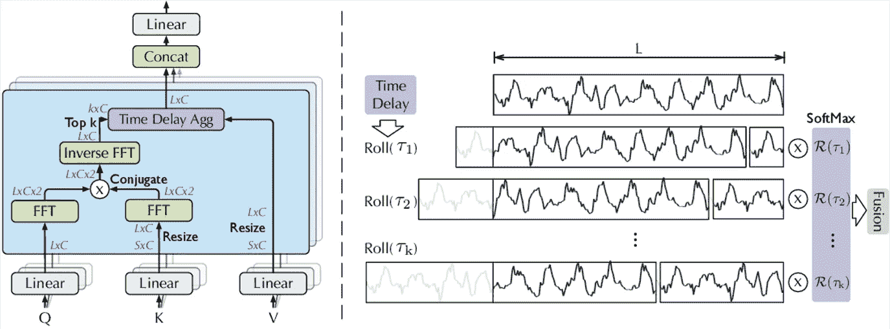*

*图一。自相关(左)和时间延迟累计(右)。我们利用快速傅立叶变换来计算自相关 R(τ),它反映了时间延迟的相似性。然后，基于选定的延迟 T 将相似的子过程滚动到相同的索引，并通过 R(T)进行聚合。[ [来源](https://arxiv.org/abs/2106.13008)*

*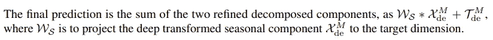*

*自相关通过**计数** 1 来探究 ***基于周期的依赖性*** 。*数列自相关*与，2。*聚合相似子序列*通过 ***延时聚合*** 。*

***基于期间的依赖关系**:*

*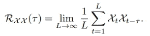*

*Eq 1。*

*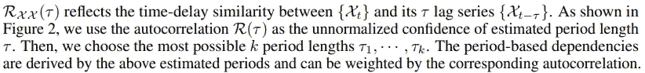*

***延时累计**:*

*在图 1 中可以很容易地看到该块的位置。这种操作不同于自我关注中的点-点-积聚合(为了更好地理解自我关注，请参见:“*”)。**

**对于一个个体头部情况和长度为-L 的时间序列 X，在投影后，我们得到查询 Q，key K，value V，所以，我们可以获得它而不是自我关注。此外，公式可以在等式 2 中看到。**

**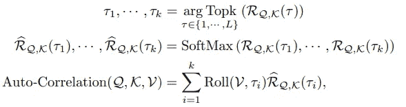**

**等式 2–4。**

**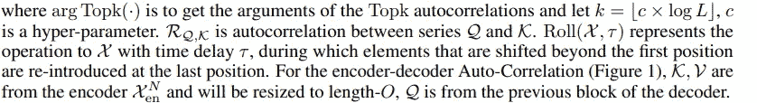**

> **请注意，我没有给出任何关于注意力机制的说明，所以如果你不知道它，我强烈推荐阅读“ [*注意力是你所需要的全部*](https://arxiv.org/pdf/1706.03762.pdf) ”。**

***让我们大致了解一下自耦变压器架构:***

# **自耦变压器概述**

****

**[ [来源](https://giphy.com/gifs/wjcollege-flying-campus-pHYESyIDdjrV0Shdbq) ]**

**预测时间序列中的长期相关性有两个挑战:**

1.  **管理基于时间的复杂模式**
2.  **突破计算效率和信息使用的瓶颈**

**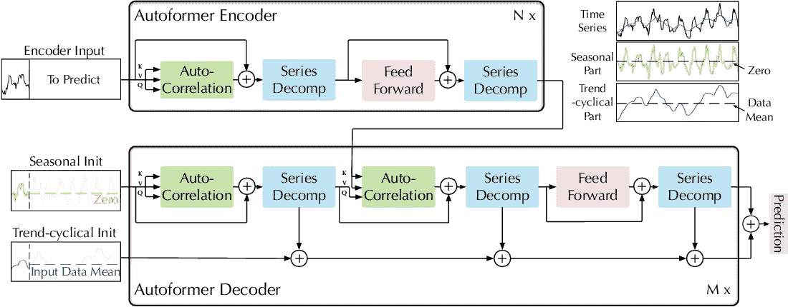**

**图二。自耦变压器架构。编码器通过序列分解块(**蓝色**块)消除长期趋势循环部分，并专注于季节模式建模。编码器-解码器自相关(解码器中的中间**绿色**块)[ [源](https://arxiv.org/abs/2106.13008) ]利用来自编码器的过去季节信息**

**仔细检查总体架构，我们可以发现，我们可以将模型拆分为两个**部分*；所以，它有一个 ***的编解码结构*** 。让我们深入了解这两者的更多细节:***

## **编码器:**

**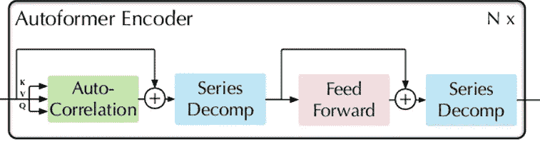**

**图 3。自耦变压器编码器结构[ [来源](https://arxiv.org/abs/2106.13008)**

**这里我们可以理解一些要点:*编码器*的**焦点**是 ***季节性零件造型***；表示*编码器* 的**输出**包含 ***过去的季节信息*** 。然后，我们使用**编码器的输出**(作为 ***交叉信息*** )来帮助**解码器更好地预测。图 3 右上方的 **N x** 。传达 ***编码器层*** 的**号。当然，数学(*我不想讨论它们；所以，我只是用论文的插图*提到了他们:******

**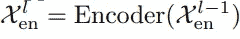**

**情商。5**

**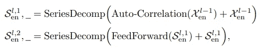**

**等式 6 和 7**

**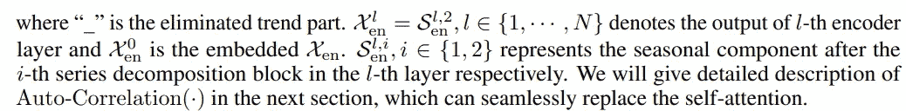**

## **解码器**

**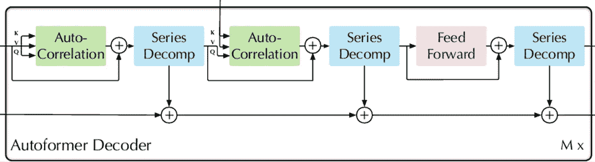**

**图 4。自耦变压器解码器结构[ [来源](https://arxiv.org/abs/2106.13008)**

**图 4。显示了解码器的架构，包括两部分:**

1.  *****累加*** 结构(*为趋势-周期成分*)**
2.  *****叠加自相关*** 机制(季节性成分*)***

***我们可以看到，解码器包括一个 ***自相关(*** *细化预测* ***)*** 和 ***编码器-解码器自相关(*** *使用过去的季节信息* ***)。*** 图 4 右下方的 **M x** 。传达**解码器层的**号**。** 还有公式:***

**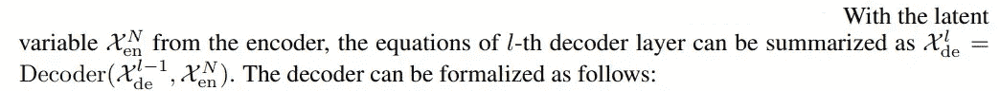****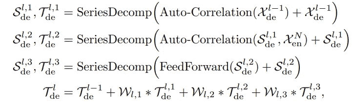**

**情商。8–11**

**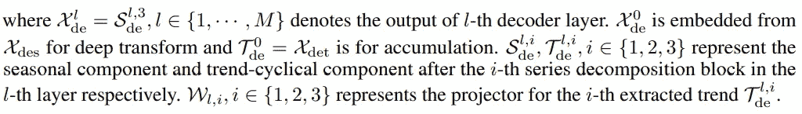**

# **自相关与自我关注家庭**

**我说过，当在最先进的算法中广泛使用自我关注时，我们使用自相关而不是自我关注。但不是在这项研究中。顺便说一句，研究人员在*自相关*和 ***各种*** *自我关注结构*之间进行了**比较**。(*我不打算说明自我注意的结构，只是把它们与我们的自相关性进行比较*)**

**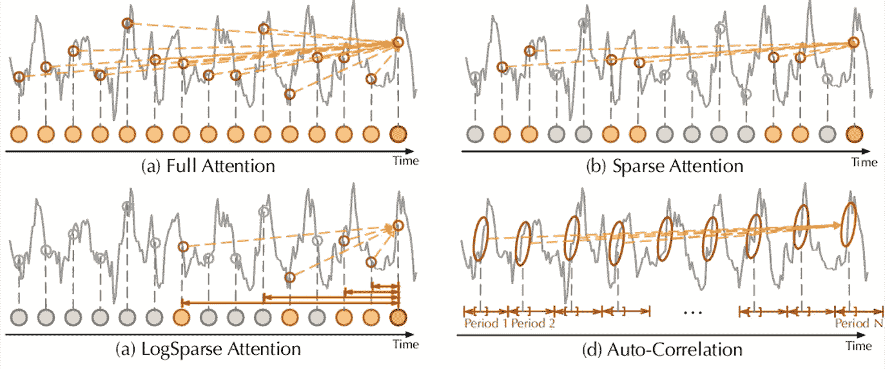**

**图 5。自相关与自我关注家庭。**充分注意** ( **a** )适应所有时间点之间的充分联系。**稀疏注意力** ( **b** )基于提议的相似性度量选择点。**对数稀疏注意力** ( **c** )选择遵循指数递增间隔的点。**自相关** ( **d** )关注的是基础期间子序列之间的联系。[ [来源](https://arxiv.org/abs/2106.13008)**

**尽管一些自我关注( *LogSparse* 和 *Sparse Attention* )考虑 ***局部信息*** ，它们使用它来**辅助*发现点状依赖*** 。在*信息聚合*方面，研究人员采用 ***延时块*** 从 ***潜在周期中收集*相似子序列*。*** 在对面，*通过*点积执行此操作。****

***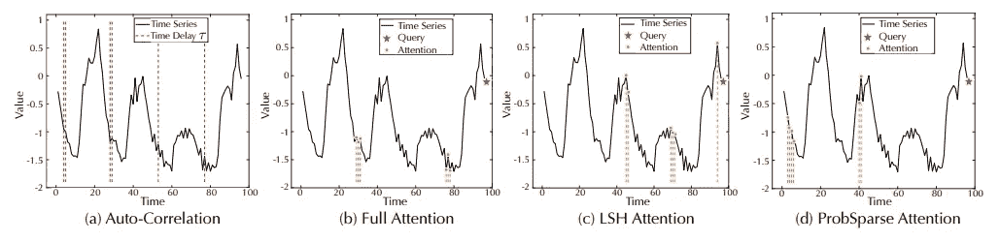***

***图 6。学习依赖的可视化。为了清除，我们选择自相关的前 6 个时间延迟大小 T1，…，T6，并在原始序列中标记它们(**红色**线)。出于自我关注，关于上一时间步的前 5 个相似点(**红色**星)也用**橙色**点标记。[ [来源](https://arxiv.org/abs/2106.13008) ]***

***此外，为了分析使用注意力或自相关的效率，我们可以参见图 7。如下图:***

******

***图 7。效率分析。对于记忆，我们在 Autoformer 中用自关注族代替自相关，并用输入 96 记录记忆。对于运行时间，我们运行自相关或自我关注 1000 次，以获得每步的执行时间。输出长度呈指数增长。[ [来源](https://arxiv.org/abs/2106.13008) ]***

# ***模型评估***

***研究人员用单变量和多变量时间序列数据的其他最新模型评估了该模型。评估部分使用了六个真实数据集，包括:***

1.  ***ETT(电力变压器温度)| 2。[电](https://archive.ics.uci.edu/ml/datasets/ElectricityLoadDiagrams20112014) | 3。Exchange | 4。[交通](http://pems.dot.ca.gov/) |5。[天气](https://www.bgc-jena.mpg.de/wetter/) | 6。 [ILI](https://gis.cdc.gov/grasp/fluview/fluportaldashboard.html)***

***`please note that I didn't provide any information about the datasets. If your want to explore this you just need to google it.😉`***

***两个指标(MSE 和 MAE)用于显示评估。比较结果总结在两个表中(表 1 和表 2)。***

***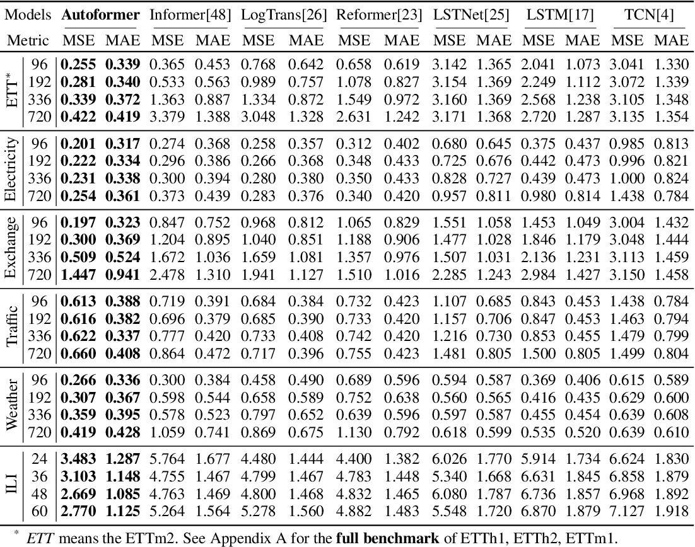***

***表 1。**预测长度**不同的多元结果****O = {**96**， **192** ， **336** ， **720** }。我们设定**输入长度 I** 为 **ILI** 的 **36** 和 **96** 的**其余**。**较低的** MSE 或 MAW 表示**更好的预测。** [ [来源](https://arxiv.org/abs/2106.13008) ]***

***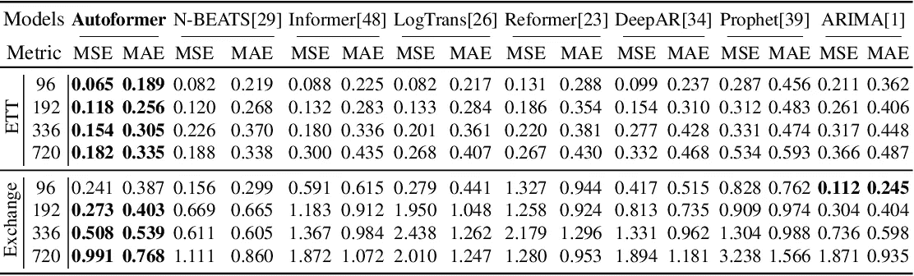***

***表二。**典型数据集上**不同预测长度** O={ **96** ， **192** ， **336** ， **720** }的单变量结果。我们设定**输入长度 I** 为 **96** 。一个**较低的** **MSE** 和 **MAE** 表示一个**较好的预测**。[ [来源](https://arxiv.org/abs/2106.13008) ]*****

# ***主要参考:***

1.  ***[吴，h，等，*自形成器:用于长期序列预测的具有自相关的分解变压器。*神经信息处理系统进展，2021。 **34** 。](https://arxiv.org/abs/2106.13008)***

> **此外，这篇文章是为了在我未来的时间序列工作中使用而写的，所以我试图彻底了解它的各个方面；如果您发现任何错误或差距，请让我知道立即修复它。最后，如果你有什么问题，尽管问；我会尽快回复。**
> 
> **请注意，这篇文章是为了我将来的研究回顾和复习这个主题的材料。如果你发现任何错误，请让我知道。同时，你可以直接在 Twitter [这里](https://twitter.com/reza__yazdanfar)或者 LinkedIn [这里](http://www.linkedin.com/in/rezayazdanfar)联系我。**