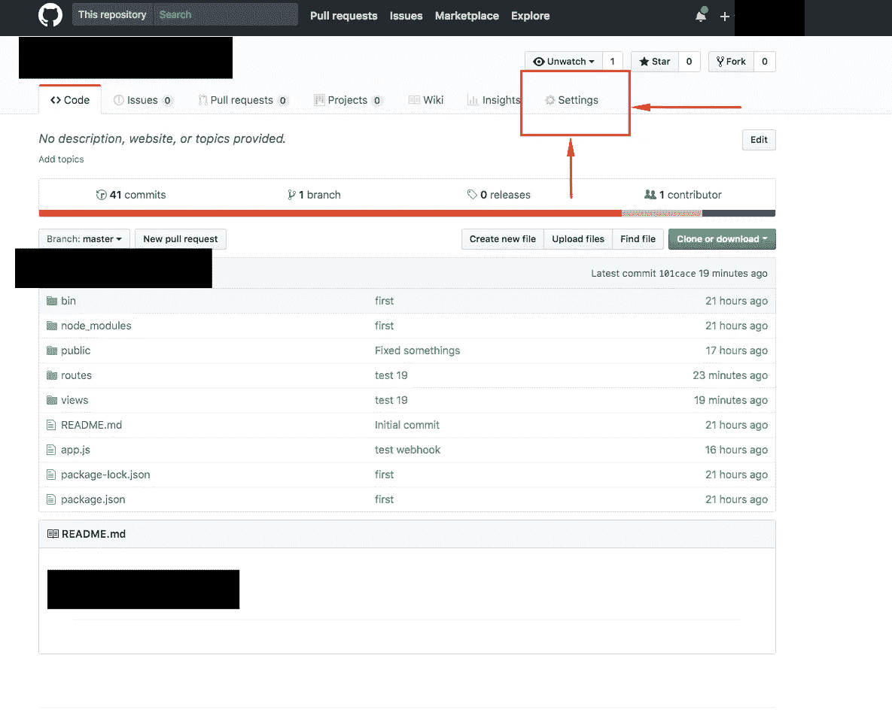
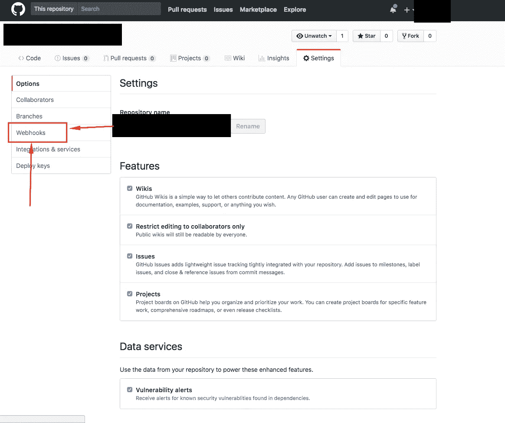

# 使用 Github Web Hooks 自动部署

> 原文：<https://itnext.io/automate-deployment-with-webhooks-18735f1c7f84?source=collection_archive---------1----------------------->

> [点击这里在 LinkedIn 上分享这篇文章](https://www.linkedin.com/cws/share?url=https%3A%2F%2Fitnext.io%2Fautomate-deployment-with-webhooks-18735f1c7f84%3Futm_source%3Dmedium_sharelink%26utm_medium%3Dsocial%26utm_campaign%3Dbuffer)

我最近在做我的作品集网站，我不得不在我的 [**数字海洋**](http://digitalocean.com/) 机器上做很多 DevOps 的东西。我用 [**nginx**](https://www.nginx.com/) 的反向代理来运行我的节点应用程序。在这样做的时候，我不得不四处搜索 nginx 配置，我碰到有人在谈论这些叫做 Github Web hooks 的东西。这听起来很新奇，所以我去官方的 Github 网页查看了一下。一开始，我很困惑。我听说过网络挂钩，但我想不出为什么有人会使用它。当我继续阅读时，我逐渐意识到我可以在我的投资组合网站中使用它来自动化我的部署。这怎么可能呢？用 Web 钩子实现自动化部署意味着什么？是新的 Javascript 框架吗？

# 自动化部署

简而言之，当您对 repo 的主分支进行提交时，您的网站服务器会自动拉出主分支，关闭服务器并使用您的新提交重新启动它。
这意味着在提交到主分支后，您不必手动 SSH 到您的服务器并运行 shell 命令。
这是一个过于简化的自动化版本。所有公司都在他们的生产版本中使用它，在部署之前运行测试、版本、A/B 测试。如今基本上一切都是自动化的。如果你想在自己的项目中开始这样做，请继续阅读。

# 网钩

当您将提交从本地机器推送到在线存储库(Github、BitBucket 等)时，您实际上是将文件发送到 Github 管理的服务器。当你进行推送时，Github 的人可以为你提供一个进入他们服务器的管道/峰值。
所以你可以想到 Github 办公室的 Bob ，他一生中唯一的工作就是当你的存储库中有推送时得到提醒。Github 让你与 Bob 进行对话，并与他达成协议，无论何时进行推送，他都会向你的端点发送一个带有推送数据的请求。因此，您现在需要做的就是创建一个接受 post 请求的简单端点。然后你可以把这个端点交给鲍勃。这就是网络钩子的全部。它是鲍勃。

# 创建您的端点

如果你熟悉 Node 和 Express，这对你来说会很简单。只要用你使用的任何语言创建一个端点就可以了。

# 告诉鲍勃这件事

1.  转到您的回购设置

存储库设置

2.单击 Webhooks 选项卡

Webhooks 选项卡

然后添加一个 webhook。

您将被问到以下问题:

1.  有效负载 URL
2.  内容类型
3.  您希望哪个事件触发此 webhook？

对于有效负载 url，只需添加您的网站的 URL，后跟您的端点。所以在我的例子中，我使用 subhannaeem.com/webhooks/github 作为我的有效载荷 URL。

> 本地主机在这里不起作用。Github 需要一个唯一的 URL。

对于内容类型，选择适合您的内容。我使用 Node，所以我选择了 JSON。

最后一个问题，我选择的选项:**只是** `**push**` **事件。** 如果有人对我的回购提出提取请求或其他操作，我不想收到通知。我只想知道是否对我的回购主分支进行了推送。我们一会儿就会谈到这一点。

点击保存，你就可以开始了！

# 设置部署脚本

现在我们已经设置了端点和 WebHook，我们需要对 Github 发送给我们的数据做些什么。
让我们在这里回顾一下。
我们推动回购。Github 的 Bob 接收我们的推送，并向我们的端点发送请求。然后我们检查请求是否包含正确的数据。如果是，那么我们重新启动服务器，通过向 bob 发送一个 **200 响应**来告诉他一切正常。如果数据无效，我们向他发送一个 **500 响应**。

如何重启服务器？让我们创建一个部署脚本。它会存在于我们的服务器上。它将负责拉动我们的分支并重新启动我们的 web 应用程序。我们将从我们的 web 应用程序代码中执行这个脚本。

deploy.sh

我将这个部署脚本放在我的`/home`目录中。我确保它有足够的权限来执行。如果你在执行这个文件时收到一个错误，使用`chmod`给它权限。
我的 web 应用程序位于`/home/portfolio-website` 目录中。

这个脚本只是一组 shell 命令，您应该非常熟悉。
我们进入*/首页/作品集-网站*目录。我们从主分支提取。然后我们使用 [**pm2**](https://www.npmjs.com/package/pm2) 模块在后台运行一个守护进程来运行我们的节点服务器。如果你使用 node 那么你一定熟悉 [**pm2**](https://www.npmjs.com/package/pm2) 。如果没有，那么就使用您用来启动服务器的命令。

现在我们需要从我们的 web 应用程序代码中调用这个脚本。在 NodeJs 中有一个叫做 [**的子进程**](https://nodejs.org/api/child_process.html) 。您的节点代码可以旋转虚拟终端窗口，然后在其中运行命令。当然，这是一种简化的思考方式。实际上，子进程提供了很多特性。如果你想了解更多关于子进程的信息，请阅读这篇文章。如果您现在只想运行一些命令，那么请继续阅读。

所以这里我们首先检查发送方和分支。如果推送的发送者确实是 *Donald* (这里使用您的 Github 用户名)，并且如果分支是 Master，那么运行`deploy()`函数。
`deploy()`函数启动一个子进程并执行一个命令。该命令转到`/home`目录并执行部署脚本。在执行时，如果我收到某种错误，我会发送一个 500。否则我发 200。

现在，每当您对 repo 的主分支进行提交时，您将运行部署脚本，该脚本将依次在您的服务器上提取主分支并重启 web 应用程序。
所以从现在开始，如果你想在你的网站上有所改变，你所要做的就是推送到主分支。

就是这样。很酷吧？您可以根据自己的需求轻松扩展这一功能。执行 shell 命令时不再有 SSH 和错误。干杯！