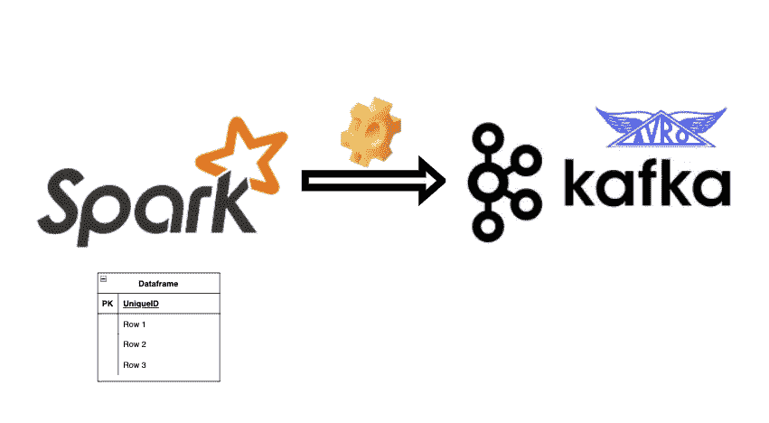

# 从 Spark 数据帧自动生成 Avro 模式

> 原文：<https://itnext.io/automate-generating-avro-schemas-from-a-spark-dataframe-6e8956f03500?source=collection_archive---------3----------------------->

## 一个有用的脚本，可以将你的 Spark 模式转换成 Avro 格式，从而将数据转换成 Kafka 格式

如果您在数据架构中使用 Spark，并希望将数据从 dataframe 生成到 Kafka 中，您需要首先编写一个 Avro 模式。数据帧的模式遵循 Spark 类型系统，因此必须转换为 Avro 格式。这个过程并不特别困难，但是当数据帧有许多维时，它变得非常耗时。当你试图用错误的 Avro 模式从 Spark 写入 Kafka 时，你得到的错误消息有时也有点含糊不清，任何错误，如遗漏了一个卷毛或没有正确拼写一个字段，都有可能占用你很大一部分时间。因此，我觉得有必要创建一个小脚本来消除这个过程中的人为错误，并减少花费在手动可重复任务上的时间。

所以事不宜迟，这里是可扩展/可重用的脚本:

这种映射覆盖了最常用的类型，使一切都可以为空，但是如果你想转换一个合适的类型或者使一个字段不可以为空，你可以扩展或者修改这个脚本。我在本文下面留下了 Spark 和 Avro 打字系统文档的链接。

希望这篇简短的文章对你有用，当我有时间练习 Leetcode 的时候，在另一篇类似的文章中再见！

*   火花数据类型参考:[https://spark.apache.org/docs/latest/sql-ref-datatypes.html](https://spark.apache.org/docs/latest/sql-ref-datatypes.html)
*   Avro 原语&逻辑类型参考:[https://avro . Apache . org/docs/current/spec . html # schema _ Primitive](https://avro.apache.org/docs/current/spec.html#schema_primitive)