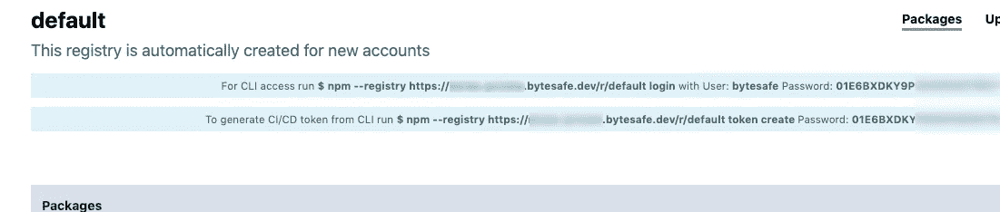
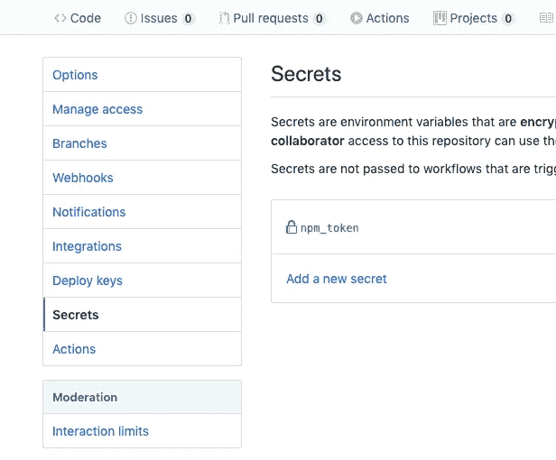
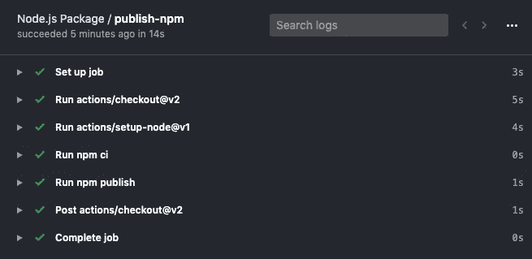

# 使用 Github 动作自动执行 npm 包的 JavaScript 部署

> 原文：<https://itnext.io/automate-javascript-deployment-of-npm-packages-with-github-actions-ad82e2acb075?source=collection_archive---------4----------------------->


Factorio 和 CI/CD 管道有什么共同点？

## 使用 Github 操作构建和发布 npm 包

面对现实吧，手动的、通常非常繁琐的任务可以通过 Github Actions 等现代工具轻松实现自动化。当与私有注册中心结合时，我们可以通过更好地跟踪我们的代码供应管道来促进协作和提高质量。

全面披露:我是 bytes safe(https://bytesafe.dev/)产品的创始人之一，该产品提供免费、安全和高度可用的私人 NPM 注册。

下面我将一步一步地描述一个简单的工作流程，用于构建和发布 Javascript npm 包。我们将使用一个私有注册表，在将代码释放到野外之前，它可以被用作沙箱。通过这种方式，您可以在最终用户之前发现潜在的错误。我们将使用 Github 动作来自动化构建


## 运送什么，嗯…当然是一个包裹！

因此，您可能需要为您的工作流构建一些更有趣的东西，但是在这篇文章中，我们将创建一个名为“@niclas-test/test”的新的空包，下面的 package.json 描述了这个包。

## 第一步。定义包

我们将用一些基本信息、包名、git 位置等设置 package.json。

让我们给这个包添加一些有趣的东西:

**index.js**

很好，我们的包完成了，让我们去 Github 并定义我们的 Github 动作工作流，我们将留在本地环境中，用代码定义工作流。

## 第二步。定义 Github 操作工作流的构建过程

Github 动作驻留在专用目录 *github/workflows*

在上面的片段中需要指出一些事情

1.  **触发**，即启动包的构建和部署，“on: push: branches: master”告诉 Github 在所有提交给 master 的基础上构建，但也许你也在构建特性分支，只需根据你的需要进行相应的更改。
2.  注册表的**端点**，也就是我们将工件发送到哪里
3.  向注册中心认证所需的**凭证**，

## 第三步。建立一个私有注册表

在这篇文章中，我们将把我们的包发布到一个[字节安全私有注册表](https://bytesafe.dev)。注册和使用都是免费的，现在就去注册并建立你自己的私人注册吧，只需要不到一分钟的时间。我会在这里等。

(当然还有其他选项，工作流程应该是相似的)

完成了吗？太好了！

在 Github 工作流脚本中，我们提到了 npm 向私有注册中心进行身份验证时使用的密码:

```
NODE_AUTH_TOKEN: ${{secrets.npm_token}}
```

您在 Github 存储库中配置这个秘密。正是这个访问令牌使您能够将包上传/发布到注册表。

在同一个帐户中额外设置 Bytesafe 注册表是微不足道的，但是我们将满足于在创建帐户时提供的“默认”注册表。

此注册表的凭据显示在注册表详细信息页面下的[https://bytes safe . dev](https://bytesafe.dev/)上:



为了获取所需的令牌，我们使用以下选项运行标准的 NPM 命令进行登录:

```
$ npm --registry https://<**account**>.bytesafe.dev/r/<**registry**> login
Username: bytesafe
Password: ****** 
Email: (this IS public) user[@yourdoma.in](mailto:niclas@bitfront.se)
Logged in as bytesafe on https://<**account**>.bytesafe.dev/r/<**registry**>
```

## 第四步。获取用于自动构建管道的 API 令牌

成功登录后，您可以使用以下命令获得令牌:

```
$ npm --registry https://<**account**>.bytesafe.dev/r/<**registry**> token create
npm password: 
┌────────────────┬────────────────────────────┐
│ token          │ 01E54TK8T🤐🤐🤐🤐🤐🤐B0TQ│
├────────────────┼────────────────────────────┤
│ readonly       │ false                      │
├────────────────┼────────────────────────────┤
│ cidr_whitelist │ null                       │
├────────────────┼────────────────────────────┤
│ created        │ 2020-04-05T09:26:26Z       │
└────────────────┴────────────────────────────┘
```

## 第五步。向 Github 操作添加令牌

接下来，将令牌添加到 Github 存储库中，单击**设置**->-**秘密** - > " **添加新的秘密**，并将其命名为" **npm_token** "，输入上面令牌行中的数据。



## 第六步…你就完成了。

继续做:

```
$ git push
```

前往 GitHub 和你的库的 **actions 标签**并查看构建进度，很可能你来晚了，构建通常很快:



对于验证:返回 Bytesafe web 控制台并验证该包是否已发货:


现在，您已经有了一个(非常)基本的管道，它将在提交的基础上构建您的代码，以控制和部署软件包到您的私有 npm 注册表，准备好供您和您的团队的应用程序使用。


基础管道？