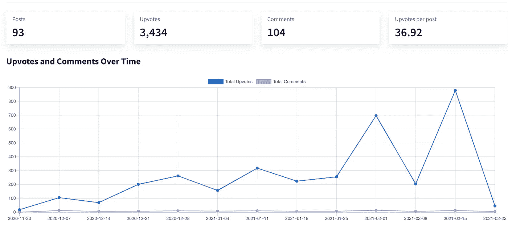

# 在 Reddit 上自动发布你的 Instagram 照片

> 原文：<https://itnext.io/automate-posting-your-instagram-photos-on-reddit-35c1be19d1e6?source=collection_archive---------3----------------------->

## 自动化是你的朋友。

[亚历山大·奈特](https://unsplash.com/@agk42?utm_source=medium&utm_medium=referral)在 [Unsplash](https://unsplash.com?utm_source=medium&utm_medium=referral) 上拍照

如果你想扩大你的 instagram，Reddit 是一个让你的帖子出现在更多人面前并建立你的观众群的好方法。如果您尝试手动发布，可能会花费大量的时间和精力。这也是为什么每次你发 Instagram 我都想办法发到 reddit 的原因。

# 我使用的工具:

*   稍后(允许您提前安排 Instagram，可选择发布到 Reddit——提供免费计划)
*   [推迟](https://www.postpone.app/?via=rhys)(发布到 reddit 的程序——每月 10 美元，链接是我从中赚取一小笔佣金的附属程序)
*   Zapier(将 Instagram 链接到延期的程序——如果你在 instagram 上发布的内容不多，这可以是免费的，但如果你发布的内容相当多，每月可能要花费 25 美元)

# 设置:

## 第一步。

建立一个 Zapier 帐户并创建一个新的 Zap。称之为类似 insta 到 reddit 的东西。

## 第二步。

添加触发器“Instagram 中我的账户发布的新媒体”并连接您的 instagram 账户。

## 第三步。

我给我的 Instagram 帖子加标题，这样我就可以推断出在 Reddit 上使用标题的第一行。为此，添加“运行 Javascript”动作。命名输入数据标题，并从下拉列表中选择标题。在代码部分添加以下代码:

这将输出标题的第一行，稍后您将使用它。

## 第四步。(可选)

添加动作“文本”,选择“转换”,然后选择“转换为 ASCII”。选择输入作为您刚刚处理的标题。一些子编辑有过滤器，如果你的标题不是 ASCII 码，它会自动标记你的文章，所以这是一个安全的步骤。

## 第五步。

接下来，你必须上传图像到 Imgur。为此，您需要[在 Imgur](https://api.imgur.com/oauth2/addclient) 上注册一个应用程序。记下您的客户端 ID，因为您将需要它来上传图像到 Imgur。添加另一个“运行 Javascript”动作。这里有两个输入字段。来自 instagram 操作的媒体 imageUrl 和来自标题运行 Javascript 操作的 imageTitle。将以下代码粘贴到代码字段中，并用您的客户 ID 替换< IMGUR-CLIENT-ID >。

我们将图像上传到 Imgur，以确保 Reddit 显示完整的图像。

## 第六步。

最后添加“在 Reddit 延期中安排 Reddit 帖子”操作(这仅从[延期](https://www.postpone.app/?via=rhys)开始邀请)。链接您的延期帐户，为您发布的子编辑添加相关标题，例如，如果您发布到 r/ITAP，他们要求标题为“ITAP of …”在我们的情况下，它将是“来自步骤 4 >的<标题的 ITAP”。在链接部分填写 Imgur 上传的数据链接。键入你想要发布的子编辑的名称和你想要发布的时间，例如“明天下午 1 点”([推迟](https://www.postpone.app/?via=rhys)有一个方便的功能，如果你需要什么时候发布的灵感，可以计算每个子编辑的前几篇热门帖子的平均发布时间)。

## 第七步。

如果标题适合多个子编辑，那么您可以在上面的操作中交叉发布到每个子编辑。否则，您可以添加第二个“为 Reddit 推迟安排 Reddit 帖子”操作。

使用这种方法，我的帖子已经被转发了 3500 次，有超过 100 条评论。

推迟所有时间统计

这可以围绕你的内容创造一种社区感，reddit 的一个伟大之处在于，你不知道什么会得到很多支持，总有机会传播开来。如果你是个人，这种方法可能有点贵，但是如果你想发展一个品牌或者想让你的作品吸引更多的眼球，这是一个完美的选择。