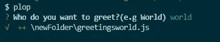
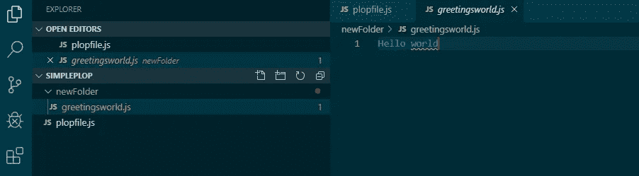
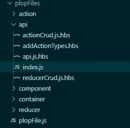

# 使用 PlopJs 自动化重复性工作

> 原文：<https://itnext.io/automate-repetitive-work-with-plopjs-a20a98e5fa4?source=collection_archive---------5----------------------->

你从事的项目有很多重复的、容易出错的、细致的工作吗？如果是这样，伙计，你需要了解一下 [plopJs](https://plopjs.com) 。去年，我参与了一个大型的 React 项目，如果没有它，我们将无法在规定的时间内交付。最近，我加入了一个. Net 核心项目，该项目有一个非常面向细节(并且耗时)的架构，其中大量的工作是确保正确的东西被“插”在正确的地方。这时我想起扑通一声，心想嗯…如果我可以生成所有这些样板代码，并节省我的精力来关注真正重要的事情，会怎么样？

***所以这里来一个关于 plopJs 的快速介绍:***

***什么是扑通？***

一个快速，强大，最重要的是，易于使用的代码生成器。

它由问题、操作和一个用来生成代码的模板组成。

*问题*:你对用户有什么要求？例如，你想创建一个控制器吗？控制器的名称是什么？

*动作*:你会怎么处理答案？创建一个新文件，修改一个现有文件，创建许多文件？

*模板*:这是您想要通过替换一些值来生成的基本代码

好了，说够了！给我看看代码！


首先，我们需要安装扑通。

在首选命令行上打开项目目录。

要在项目上安装它，请使用:

```
 $ npm install --save-dev plop
```

要全局安装它:

```
$ npm install -g plop
```

现在在你的文件夹中创建一个新文件，名为 *plopfile.js* (为什么不具体一点呢？:P)

这就是乐趣的开始。这里是一个基本的扑通发生器，让我们看看:

让我们一行一行地快速浏览一下:

第 1 行:函数接收扑通。

第 3 行:调用方法 *setGenerator* ，传递生成器名‘简单文件’和生成器期望的对象。

第 4 行:设置对象描述，例如生成器将做什么。

第 5 行:用你需要的问题设置 prompts 数组(prompts 使用 [inquirer.js](https://github.com/SBoudrias/Inquirer.js/) 作为其引擎)。

第 7 行:定义题型；它是一个列表，一个输入还是一个检查表？在我们的例子中，它是一个输入类型，因为我们希望存储类型化的值。

第 8 行:存储用户输入值的变量名。

第 9 行:你希望你的问题显示的信息。

接下来是你想对给出的答案采取的行动。

第 14 行:定义你想采取的行动类型；在本例中，我们使用 add，因为我们想要创建一个新文件。它可以是 *addMany* 、 *modify* 或任何其他内置选项。

第 15 行:定义创建新文件的路径和文件名。

第 16 行:定义你的模板；在我们的例子中，我们正在做一个内嵌模板，它将被嵌入到我们的输出文件中。

现在完成后，回到你的终端窗口，输入*扑通:*



它会问你问题并等待你的回答(在我们的例子中，是 world)。

之后，您将会看到它为您创建了新文件的确认信息。



就这样，您已经定义了一个基本的生成器，并且可以使用了。

通常这是不够的。您最终需要的是在单独的文件中实际创建您的生成器，并在 plopFile.js 中引用它们

这里有一个例子。

```
**const** componentGenerator = require('./component/index.js');**const** containerGenerator = require('./container/index.js');**const** actionGenerator = require('./action/index.js');**const** reducerGenerator = require('./reducer/index.js');**const** apiGenerator = require('./api/index.js'); module.exports = plop **=>** {plop.addHelper('upperCase', text **=>** text.toUpperCase());plop.setGenerator('component', componentGenerator);plop.setGenerator('container', containerGenerator);plop.setGenerator('action', actionGenerator);plop.setGenerator('reducer', reducerGenerator);plop.setGenerator('api', apiGenerator);};
```

这是项目文件夹的样子，而 index.js 是我的 api 生成器，注意 api.js.hbs 文件，这些是模板，它们使用手柄引擎，这就是为什么扩展*。哈佛商学院*

*免责声明。js 在。实际上并不需要 hbs，我喜欢它是因为它让我对我要创建的文件有了一定的了解，所以我看着它，看到了一个模板(。hbs)，它将为我创建一个 api.js 文件。*



我的 plopFile 在根目录中，而生成器及其模板被组织到单独的文件夹中。如你所见，对于我的 API 生成器，我有 4 个不同的模板，它们是 React 项目示例的一部分。我还添加了动作文件，修改了 actionTypes 列表*添加了新创建的动作*，并添加了 API 和 reducer 文件。

因此，概括地说，通过几个简单的问题，我能够快速生成 3 个新文件并修改现有文件。当然，他们仍然需要一些小的调整，但大部分和相互引用已经为我创建和定义。

就是这样！

让我知道你的想法，如果你在评论中有任何问题。

还有别忘了查看[扑通的文档](https://plopjs.com/documentation/#getting-started)！