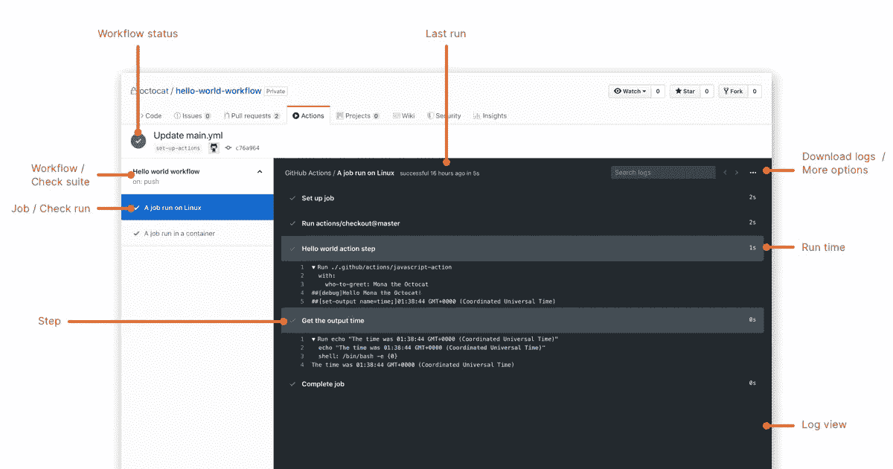
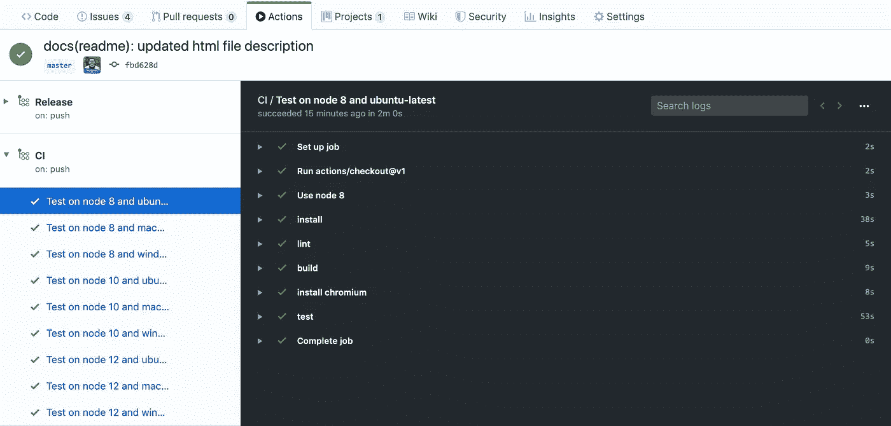
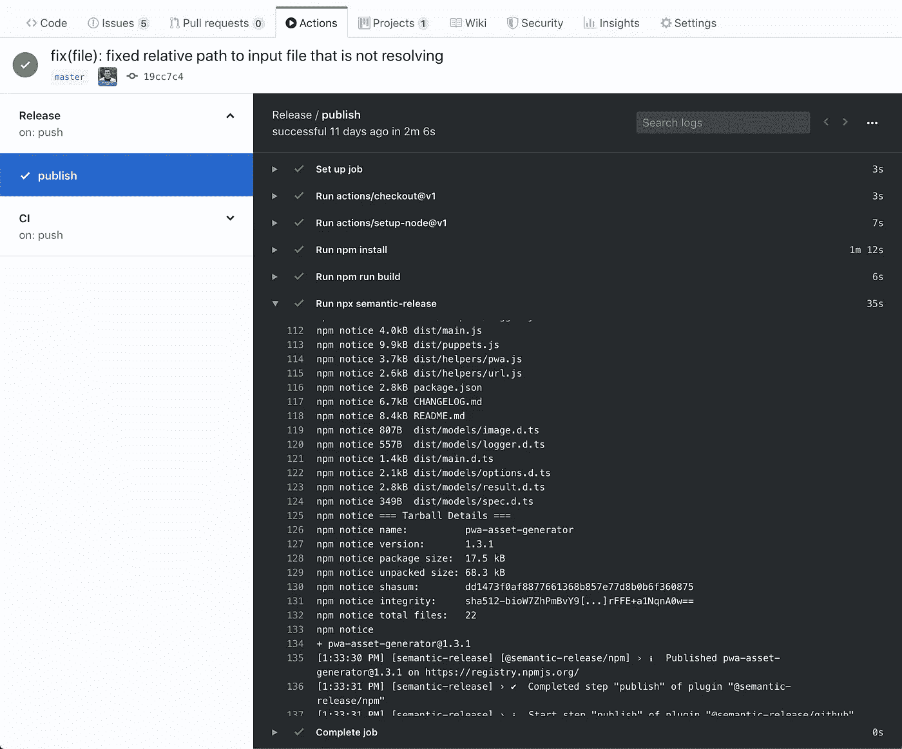
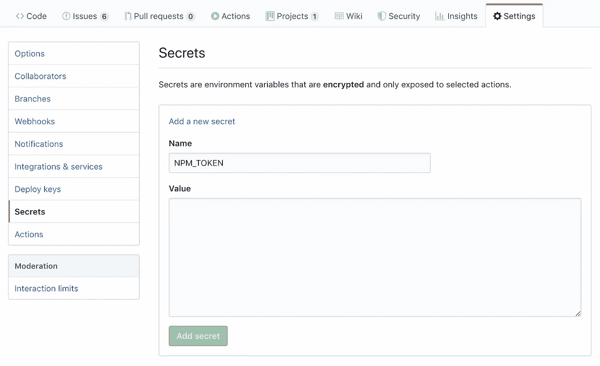
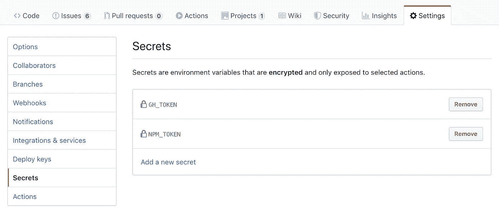
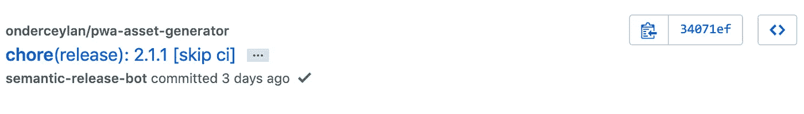
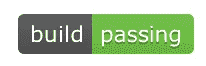
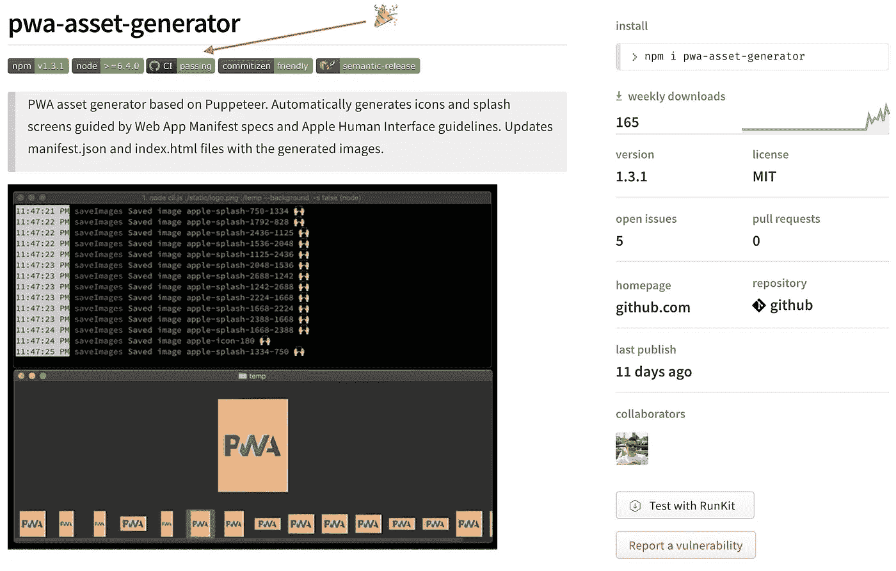

# 使用 GitHub 动作自动化您的集成测试和语义发布

> 原文：<https://itnext.io/automate-your-integration-tests-and-semantic-releases-with-github-actions-43875ad83092?source=collection_archive---------3----------------------->

我最近将我的一个开源项目的 CI/CD 管道从 Travis CI 迁移到 GitHub actions。我是较早获得 GitHub Actions 测试版的成员之一，作为回报，我愿意与社区分享我的迁移经验。

[本文所涉及的项目](https://github.com/onderceylan/pwa-asset-generator)和示例基于 **node.js** 、 **eslint** 、 **TypeScript** 、 **Jest、semantic-release** 和 **npm** 栈。这些原则对于任何其他技术堆栈都是一样的，所以您应该也能够在自己的项目中使用类似的流程。


在本文中，我们将重点构建两条管道；

*   **CI** —构建 TypeScript node.js 项目，链接代码并对项目运行测试
*   **发布** —构建项目，并使用[语义发布](https://semantic-release.gitbook.io/semantic-release/)将 npm 包部署到 npm 存储库

无论您是**从 Travis CI 迁移到 GitHub actions** 还是**从 CircleCI 迁移到 GitHub actions** 还是**在 GitHub 上开始一个新的开源项目**，这篇文章都会让您的 CI/CD 之旅有一个良好的开端。

# 关于 GitHub 动作

GitHub 宣布了自己的持续集成服务，作为 Travis CI、Circle CI 等服务的替代方案。

它像 Travis CI 和 Circle CI 一样对开源项目是免费的，并且它与 GitHub 生态系统集成得很好。

GitHub 在其持续集成环境中引入了一些概念。工作流、工作、步骤、动作、运行者、事件和工件等核心概念记录在 [GitHub 动作文档](https://help.github.com/en/articles/about-github-actions#core-concepts-for-github-actions)中。



GitHub 动作核心概念概述

我想总结一下我们将在 CI 和 CD 渠道中使用的概念，以便更好地了解我们所处的生态系统。

## 工作流程

工作流基本都是管道，可以在 GitHub 上构建、测试、打包、发布，或者部署任何项目。它们由一个或多个作业组成，可以通过事件来安排或激活。每个工作流必须由存储库中`.github/workflows`文件夹下的 YAML 文件声明。

*例如；* `ci.yml` *表示配置项工作流，或者* `release.yml` *表示发布工作流。*

## 乔布斯

作业基本上是由步骤组成的任务。为每个作业创建一个全新的虚拟环境。工作的依赖关系和配置在工作流文件中声明。

*例如；* `build`作业*用于编译您的项目，或者* `test` *作业用于执行单元/集成测试。*

## 行动

动作基本上是任务，您可以将它们组合成创建作业的步骤。它们是工作流中最小的可移植构件。它提供了一个灵活的架构，因为您可以基于 docker 图像创建自己的操作，使用开源社区共享的操作，以及定制公共操作。为了在工作流中使用，操作必须作为一个步骤包含在内。

*例如；* `actions/checkout`上一步*动作用于检查你的项目，或者*上一步`actions/setup-node`动作*用于设置节点依赖。*

# 创建集成工作流— CI

在我们的环境中，我们将创建一个集成工作流，目标是:

1.  **安装**我们的项目依赖关系到*安装并设置我们的工具集，以进行后续步骤*。
2.  **编译**我们的类型脚本代码到*保证我们没有任何编译问题。*
3.  **我们的打字稿代码的林挺**用 eslint 对*保证我们维护特定的代码质量。*
4.  **使用 Jest 对*的单元和集成测试对***的功能进行测试，以确保我们的产品质量。

为了实现我们的目标，我们需要在存储库的`.github/workflows`文件夹下创建一个新的工作流文件。姑且称之为`CI.yml`，用以下内容创建这个文件。

```
name: CI

on: [push]

jobs:
  test:
    name: Test on node ${{ matrix.node }} and ${{ matrix.os }}

    runs-on: ${{ matrix.os }}

    strategy:
      matrix:
        node: [8, 10, 12]
        os: [ubuntu-latest, macOS-latest, windows-latest]

    steps:
      - uses: actions/checkout@v1 - name: Use node ${{ matrix.node }}
        uses: actions/setup-node@v1
        with:
          node-version: ${{ matrix.node }}
          registry-url: [https://registry.npmjs.org](https://registry.npmjs.org) - name: install
        run: npm install - name: lint
        run: npm run lint - name: build
        run: npm run build - name: test
        run: npm test
```

> 您可能已经注意到，我为我正在使用的操作设置了特定的版本——actions/check out @ v1。当你在测试阶段处理一个工具时，这是一个好主意，否则它可能会引入突破性的变化。



[pwa-asset-generator 的 CI 运行演示——您可以在此处查看详细信息](https://github.com/onderceylan/pwa-asset-generator/commit/fbd628d86a9b4f9839a5bb13699925ffc9a2e7bc/checks?check_suite_id=297499835)

它为管道引入了节点和操作系统矩阵，这意味着测试作业将在 3 x 3 = 9 个环境中运行，即:

*   **对 node 8 和 ubuntu-latest 的测试**
*   **在节点 8 和 macOS 上的测试-最新**
*   **在 node 8 和 windows 上测试-最新**
*   **测试 node 10 和 ubuntu-latest**
*   **在 node 10 和 macOS 上测试-最新**
*   **在节点 10 和 windows 上的测试-最新**
*   **对节点 12 和 ubuntu-latest 的测试**
*   **在节点 12 和 macOS 上的测试-最新**
*   **在节点 12 和 windows 上测试-最新**

在此查看 GitHub 操作支持的环境的完整列表:[https://help . GitHub . com/en/articles/virtual-environments-for-GitHub-actions](https://help.github.com/en/articles/virtual-environments-for-github-actions)

> 测试作业中的步骤也可以是单独的作业，但最好承认这将需要更多的时间来执行，因为我们需要剥离一个新的环境并为每个作业安装依赖项。

> 您还可以基于 cron 安排您的运行，例如**每夜构建**。要了解更多关于工作流程的其他配置选项，请访问[配置工作流程](https://help.github.com/en/articles/configuring-a-workflow)文档。

# 使用语义发布创建自动化发布工作流— CD

我非常喜欢一键式部署，也就是持续部署。使用[语义发布](https://semantic-release.gitbook.io)为部署到 npm 的 node.js 项目设置 CD 管道非常容易。

在这种情况下，我们将创建一个发布工作流，目标是:

1.  **安装**我们的项目依赖关系到*安装并设置我们的工具集，以进行后续步骤*。
2.  **将我们的类型脚本代码编译**到*以确保我们已经准备好构建工件——我们上下文中的 dist 文件夹。*
3.  **发布我们的工件的**和语义——发布到*自动化发布我们主分支上的每个代码推送。*

为了实现我们的目标，我们需要在存储库的`.github/workflows`文件夹下创建一个新的工作流文件。姑且称之为`release.yml`，用以下内容创建这个文件。

```
name: Release

on:
  push:
    branches:
      - master

jobs:
  publish:
    runs-on: ubuntu-latest
    steps:
      - uses: actions/checkout@v1 - uses: actions/setup-node@v1
        with:
          node-version: 12
          registry-url: [https://registry.npmjs.org](https://registry.npmjs.org) - run: npm install - run: npm run build - run: npx semantic-release
        env:
          NODE_AUTH_TOKEN: ${{ secrets.NPM_TOKEN }}
          NPM_TOKEN: ${{ secrets.NPM_TOKEN }}
          GH_TOKEN: ${{ secrets.GH_TOKEN }}
```



在 [pwa-asset-generator 上运行发布的演示——您可以在这里看到详细信息](https://github.com/onderceylan/pwa-asset-generator/commit/19cc7c446b5a1731a0c41bc1b300820f501d70da/checks?check_suite_id=240127658)

## 设置秘密

正如你可能已经注意到的，这里有为语义发布设置的秘密环境变量，这些变量是*将我们的包部署到 npm* 和*在我们的 GitHub repo* 上创建自动任务提交所必需的。

您可以在 GitHub 设置中设置这些机密，并在您的工作流程文件中以以下格式使用它们:${{ secrets。SECRET_NAME }}设置秘密；

1.  导航到 GitHub repo 的**设置**，点击左边栏的**秘密**菜单。然后点击**添加新的秘密**链接。



为您的秘密输入一个名称，稍后您将使用它作为工作流文件中的环境变量。

2.对**NPM _ 令牌**和**GH _ 令牌**机密重复同样的操作，这两个机密都是语义发布在 NPM 上自动发布和在 GitHub 上管理 repo 所必需的。



你可以在你的 npm 控制台上创建你的 npm 令牌:[https://www.npmjs.com/settings/username/tokens](https://www.npmjs.com/settings/username/tokens)

您可以在您的 GitHub 个人资料上创建您的 GitHub 令牌:[https://github.com/settings/tokens](https://github.com/settings/tokens)

> 注意，典型的语义发布设置需要 GitHub 令牌上的这些权限: *read:org，read:packages，repo，user:email，write:packages，write:repo_hook*

# 跳过日常工作提交的工作流运行

语义发布库在每个成功的发布之后自动执行一系列的任务提交。这些提交由[发布说明生成器](https://github.com/semantic-release/release-notes-generator)和 [github](https://github.com/semantic-release/github) 插件自动完成，但不限于此——参见[插件完整列表](https://semantic-release.gitbook.io/semantic-release/extending/plugins-list)。



在 pwa-asset-generator 中查看[所有标记有苦差事](https://github.com/onderceylan/pwa-asset-generator/search?q=chore&type=Commits)的提交

在 repo 中提交杂务之后，GitHub actions 会运行一个额外的工作流，因为任何提交都会触发 CI 工作流的运行。

但是，没有必要运行额外的工作流，最好跳过由任何杂务提交导致的 CI 运行。正如您在上面可能注意到的，任务提交消息包括**【skip ci】**文本，由语义发布为每个任务提交添加。

通过在**粗体**中添加以下配置，我们可以配置 GitHub 动作来跳过包括**【跳过 ci】**消息在内的所有杂务提交的运行；

```
name: Release

on:
  push:
    branches:
      - master

jobs:
  **prepare:
    runs-on: ubuntu-latest
    if: "! contains(github.event.head_commit.message, '[skip ci]')"
    steps:
      - run: echo "${{ github.event.head_commit.message }}"**

  publish:
 **needs: prepare**
    runs-on: ubuntu-latest
    steps:
      - uses: actions/checkout@v1 - uses: actions/setup-node@v1
        with:
          node-version: 12
          registry-url: [https://registry.npmjs.org](https://registry.npmjs.org) - run: npm install - run: npm run build - run: npx semantic-release
        env:
          NODE_AUTH_TOKEN: ${{ secrets.NPM_TOKEN }}
          NPM_TOKEN: ${{ secrets.NPM_TOKEN }}
          GH_TOKEN: ${{ secrets.GH_TOKEN }}
```

上面的配置示例是针对*发布*工作流的，您也可以对您的 *CI* 工作流使用相同的方法。

# 添加工作流程的状态徽章

现在是有趣的部分了。每一个开源项目都应该得到一个徽章/盾牌，向他们的用户展示它得到了很好的维护。开源项目最受欢迎的标志之一是构建状态标志。



你可以在这里找到很多不同厂商的盾牌:[https://shields.io/category/build](https://shields.io/category/build)

GitHub 动作为每个工作流提供了自己的状态徽章。正如你在我的项目 [pwa-asset-generator](https://github.com/onderceylan/pwa-asset-generator) 上看到的，在 [GitHub](https://github.com/onderceylan/pwa-asset-generator) 和 [npm](https://www.npmjs.com/package/pwa-asset-generator) 上，它使用 CI 工作流徽章向用户显示所有集成测试都通过了。



在[pwa-asset-generator](https://www.npmjs.com/package/pwa-asset-generator)readme 上演示 GitHub actions CI 工作流徽章

您可以在项目中使用 SVG 图像链接，以此模式显示 GitHub 操作工作流程的徽章:

https://github . com/{ username }/{ repo }/workflows/{ workflow name }/badge . SVG


SVG 链接显示您的工作流状态以及您的工作流名称

这是 badge 的减价，您可以在项目的自述文件中使用它；

```

```

这是徽章的降价，并链接到您的共同行动；

```
[](https://github.com/{username}/{repo}/actions)
```

> GitHub actions 目前有一个问题，如果最近运行被跳过，在您的状态徽章上显示最新的工作流状态。
> 
> 我向 GitHub 报告了[这个问题。如果你和我一样，认为状态徽章应该在跳过的跑步之前显示最近一次跑步的状态，请随意对这个问题给予表扬。](https://github.community/t5/GitHub-Actions/Badge-shows-no-status-when-latest-run-is-skipped/m-p/36710#M2660)

# 恭喜你！

你成功了！现在您有了一个在 GitHub actions 上运行的项目的自动化集成和部署管道。

如果你需要任何关于 CI/CD 设置的帮助，你可以在推特上给我留言。干杯！