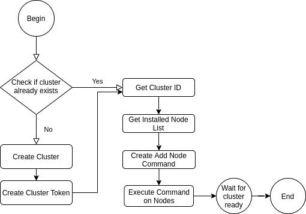
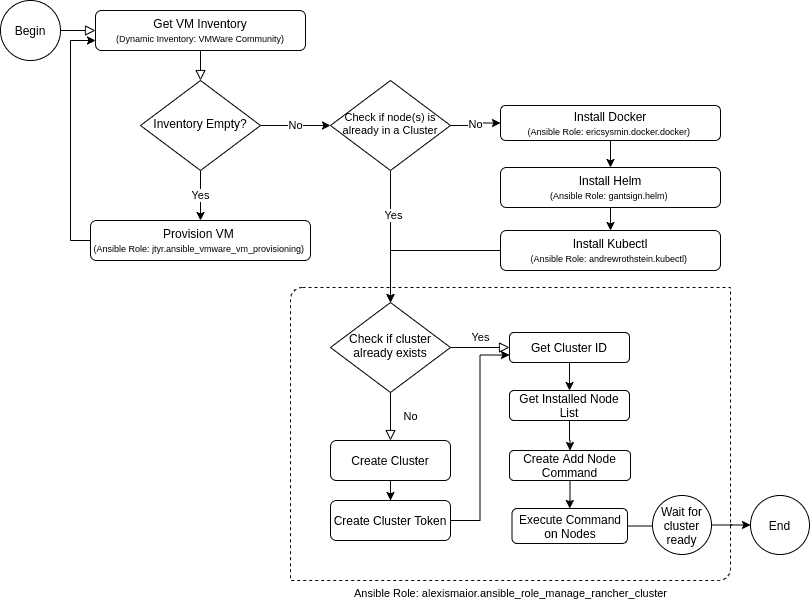
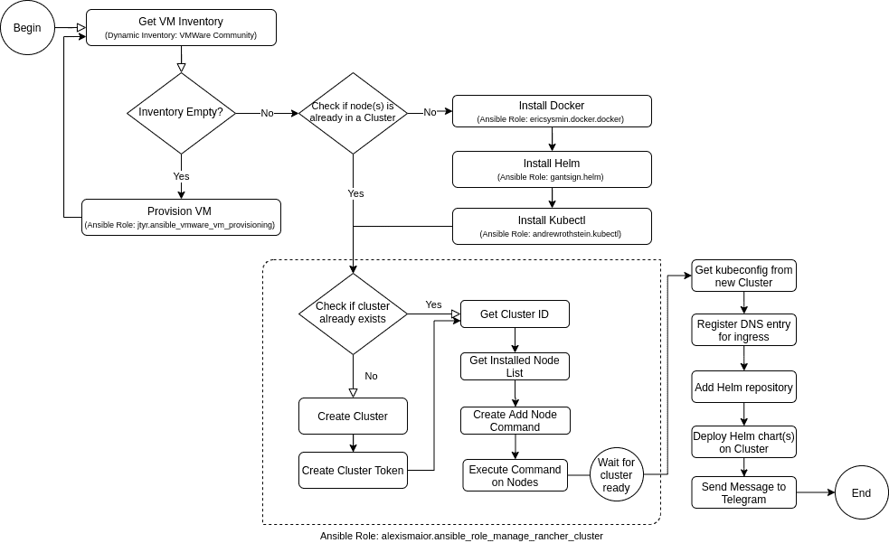
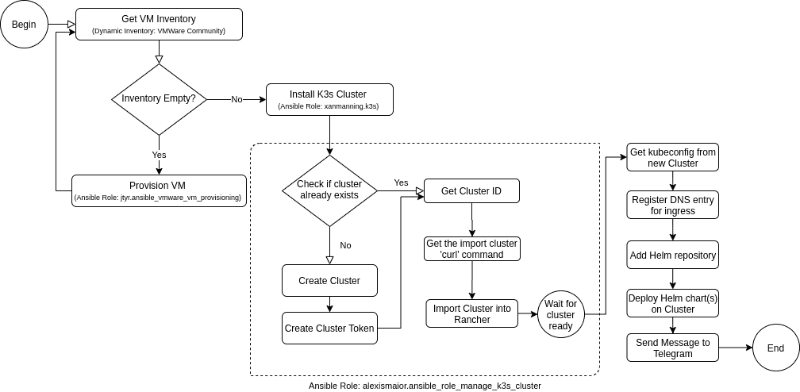
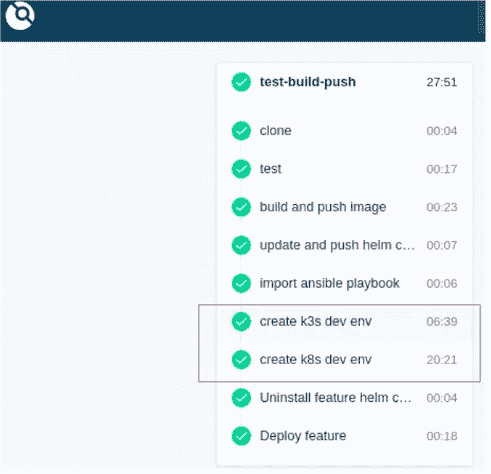

# 使用 Rancher 和 Ansible 自动化您的 Kubernetes 集群引导，并加速您的管道

> 原文：<https://itnext.io/automate-your-kubernetes-cluster-bootstrap-with-rancher-and-ansible-and-speed-up-your-pipeline-365f5e2fa484?source=collection_archive---------2----------------------->

## Ansible 和 Rancher 如何帮助简化 Kubernetes 集群的创建过程。

您希望自动引导 Kubernetes 集群的原因有很多。无论是为了测试您的应用程序，还是仅仅因为您不想在配置上花费太多时间，自动化您的集群创建是利用 DevOps 的一个显而易见的决定。在这里，我们将描述如何使用 Rancher 和 Ansible 提高您的生产率，并将这种自动化集成到您的 k8s 连续交付流程中。

在[这篇文章](https://medium.com/swlh/a-ci-cd-pipeline-project-for-a-trunk-based-development-strategy-in-a-kubernetes-environment-c4ffea9700fe)中，我们描述了 Kubernetes 中的一个 CI/CD 管道项目，该项目依赖于 Rancher 和 Ansible 来自动创建用于测试目的的集群。用例是引导一个临时 k8s 环境，在将它转移到试运行和生产之前，我们可以在其中部署、测试和验证一个新特性。每当该特征与主分支合并时，该临时集群就被解除。

短暂的 Kubernetes 集群非常适合测试。在几分钟内，就可以部署一个高度可用且完全可操作的环境，从而创建一个类似生产的小规模集群。除了您的应用程序的功能需求之外，您还可以验证它的底层配置，比如秘密、配置映射、卷、自动缩放策略等。此外，您可以应用混沌测试来预测集群故障，执行压力测试来分析其可靠性，并执行安全性测试来减少集群漏洞。

[devo PS 景观中的 Rancher](https://rancher.com/) ，为 Kubernetes 集群设置和管理提供了一个很好的解决方案。从单个 Rancher 安装，您可以管理数百个集群(或 100 万个，如来自 [Rancher 2.5](https://rancher.com/products/rancher/2.5) )，在一个一体化平台中集成可观察性、安全性、日志记录和用户管理服务。最重要的是，Rancher 提供了**集群模板**和 **API** ，我们可以与 Ansible 等自动化工具进行交互。

Rancher 中的集群模板是我们在自动化中使用的核心功能之一。Rancher 引导过程依靠 RKE (Rancher Kubernetes 引擎)根据 cluster.yaml 文件中描述的配置来配置新的集群。从 Kubernetes 版本到控制平面属性，所有配置都打包在这个文件中。此外，使用 Rancher，您可以从现有集群创建 RKE 模板。此功能增强了控制，因为我们可以使用与生产环境完全相同的配置来引导集群。

## 牧场主 Kubernetes Bootsrapping 的可行剧本

在 Rancher 中有一个 API 和一个 RKE 模板使我们的工作更容易。使用 Ansible，我们可以自动执行在 Rancher 中创建新的 Kubernetes 集群所需的步骤，并添加一些后期配置，例如来自 ingress 和 Helm Chart 部署的 DNS 条目。[例如，这个剧本](https://galaxy.ansible.com/alexismaior/ansible_role_manage_rancher_cluster)与 Rancher 交互，从模板部署集群。

这是我们在运行第一个行动手册之前需要的信息。这必须作为变量传递给 Ansible:

1.  rancher_host:您的 rancher 安装的 URL。
2.  rancher_clustername:新引导集群的名称。
3.  rancher_user:具有“创建集群”权限的 rancher 用户名。
4.  rancher_pass:您的 rancher_user 的 rancher 密码。
5.  rancher_cluster_template_id:您的 RKE 模板的 id(例如:ctr-abcd)
6.  rancher_cluster_roles:集群中每个节点将承担的角色列表(controlplane、etcd 和/或 worker)。
7.  一个包含将添加到群集的节点的清单文件。

行动手册执行的步骤是:

图一。创建牧场主集群可行行动手册工作流

如果一切按计划进行，集群将在 Rancher UI 下准备就绪并可用。一次成功的 3 节点(Centos 7、4 核、6GB RAM)集群引导的平均时间是 **17 分钟**，但是如果您设置一个单节点集群，时间可能会稍微短一些。这是因为节点注册过程，其中每个节点下载所有需要的容器(包括 Rancher 代理容器)，执行所有安装并与 Rancher master 交互以进行配置。

但是，此过程要求您已经准备好了 Ansible 清单，配置了虚拟机并安装了 docker。这是不灵活的，并且肯定需要手动配置。我们在自动化中所做的是，在运行剧本的这一部分之前，依靠**动态清单**和**责任角色**来充分准备我们的节点。

由于我们的私有云是基于 VMWare 的，因此我们使用了[这个](https://docs.ansible.com/ansible/latest/collections/community/vmware/vmware_vm_inventory_inventory.html)动态清单插件，它查询 vCenter 并根据定义的标准返回虚拟机列表(我们为此使用标签)。不过，如果你选择动态创建虚拟机，你也可以使用像[这样的角色。Ansible 中动态库存的惊人之处在于插件的大量可用性，无论您是在内部部署还是在公共云上，如 AWS、Azure、GCP 等。](https://galaxy.ansible.com/jtyr/ansible_vmware_vm_provisioning)

让我们将这些新步骤添加到行动手册的工作流程中:

图二。使用动态节点准备创建牧场主集群可行行动手册工作流。

好了，现在我们有了一个基于 RKE 模板在 Rancher 上创建 Kubernetes 集群的自动化工具，它利用 Ansible 中的动态清单来基于特定标准创建或重用虚拟机。但是，为了充分利用它，我们还希望在这个集群上部署我们的应用程序，在 DNS 中注册入口端点，并告诉我们的开发人员，他们的集群已经准备好了，部署了他们的新特性。

图三。具有后期操作任务的完整工作流程。

整个过程大约需要 **20 分钟**—k8s 集群引导需要 17 分钟+后期操作任务需要 3 分钟(你希望快速通道吗？继续读！)

总的来说，该流程与我们的 CI/CD 管道相集成，不仅可以动态创建集群，还可以同步主应用产品中部署的 Helm Chats，并最终推出我们希望与客户一起测试/验证的功能。此外，我们执行自动化任务来验证配置、检查性能、安全性和混乱测试。到目前为止，它一直是我们持续交付流程的重要合作伙伴。

## 额外好处:使用 k3s 集群加速您的 Kubernetes 开发/测试环境

好吧，所以你不想等 20 分钟…我也不想。一个不安分的 DevOps 工程师将永远在寻找替代方案，因为他/她对可靠性和性能的承诺，在我看来，这是改进自动化和 CI/CD 工程的本质。

我们最近做的是创建一个 k3s 集群而不是 RKE 集群，并将其导入到我们的 Rancher 安装中。

K3s 是一个轻量级认证的 Kubernetes 发行版，专注于边缘计算。它将所有 Kubernetes 组件封装在一个小的二进制文件中，这也简化了集群引导过程。尽管它的大小和简单性，它仍然提供了基本的和附加的特性，例如入口控制器网络策略和作为容器运行时的 containerd。

对于测试环境，尤其是软件功能测试，k3s 为短暂的环境提供了一个很好的解决方案，因此非常适合 CI/CD 集成。

在我们上一个工作流中，我们必须调整“管理 Rancher 集群”角色，在单个虚拟机中创建一个独立的 k3s，然后将其导入 Rancher。这个过程和原来略有不同。以前的角色从 Rancher 引导 Kubernetes 集群**(称为定制集群)，而这个新的角色首先直接在 VM 节点中创建 k3s 集群，然后将**导入 Rancher** 服务器(导入集群)。**

图 4。创建 k3s 集群可行行动手册工作流

下图显示了我们基于 [drone.io 的](https://www.drone.io/) CI/CD 管道的每个步骤持续时间，用于在 k8s 和 k3s 开发/测试集群中部署新功能。检查两个环境设置时间之间的差异。

无人机 io 中的 CI/CD 管道

通过利用 k3s 作为我们的测试环境，我们注意到集群引导和后期操作任务从 20 分钟明显下降到仅 **6 分钟**。这意味着流水线速度的提高，这将促使开发人员更频繁地交付代码，更快地测试软件。