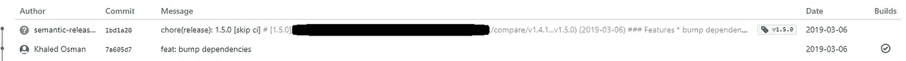
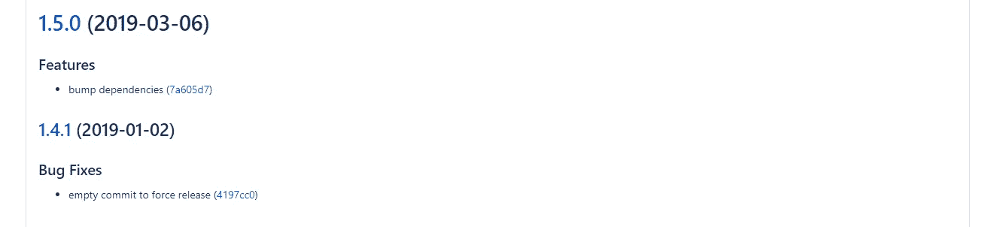

# 如何像老板一样自动化你的发布、版本控制和发布说明

> 原文：<https://itnext.io/automate-your-releases-versioning-and-release-notes-with-semantic-release-d5575b73d986?source=collection_archive---------0----------------------->

在本文中，我们将探索如何通过[语义发布](https://github.com/semantic-release/semantic-release)来自动化发布、变更日志、发布说明生成和语义版本化

如果我告诉你，只需一个命令，你就可以:

1.  将 package.json 版本升级到正确的版本
2.  创建一个 github 版本
3.  创建 git 标签
4.  生成包含发行说明的变更日志
5.  将更改推送到您的 git 存储库
6.  将您的包发布到 npm

## 动机

无论您是有一个开源项目，还是在一家私人公司从事一个其他人在他们的项目中使用的项目，您可能都需要传达您对项目所做的更改，以便其他人可以了解什么发生了更改，并知道是否有任何重大更改。您可能希望自动化您的发布的一些原因是:

1.  遵循语义版本控制，以便向消费者反映项目变更，并区分功能发布、错误修复和重大变更。
2.  生成发行说明/变更日志，以便使用您的库的其他开发人员能够理解每个版本中包含的确切变更及其含义。
3.  向客户和/或项目经理传达变更。
4.  使发布成为您持续集成系统的一部分。
5.  手动生成发行版、修改版本和创建发行说明的过程可能会很痛苦、容易出错且情绪化。
6.  自动创建一个 git 标签，并在 npm 上发布新版本的库。


如果你对你的发布分支所做的每一个拉取请求或者提交都会自动地为你生成一个变更日志，计算出需要的版本变动，为你变动版本并且自动地发布你的库，会怎么样？

遇见[语义发布](https://github.com/semantic-release/semantic-release)。在我们设置之前，使用语义发布有两个要求:“语义版本控制”和“常规提交”。

## 语义版本控制

语义版本化提供了一种获得代表项目开发的有意义的版本号的方法。

> 给定主要版本号。小调。补丁，增加:
> 
> 主要版本当您进行不兼容的 API 更改时，
> 
> 当您以向后兼容的方式添加功能时，次要版本
> 
> 补丁版本当你做向后兼容的 bug 修复。
> 
> 预发布和构建元数据的附加标签可作为主标签的扩展。小调。补丁格式。

## 常规提交

> 常规提交是一种规范，用于向提交消息添加人类和机器可读的含义

如果你不熟悉传统提交，看看[传统提交](https://www.conventionalcommits.org/en/v1.0.0-beta.2/)或[角度提交风格](https://github.com/angular/angular.js/blob/master/DEVELOPERS.md#commits)。基本上，您的提交消息应该以下列之一开始。

*   *专长:新功能*
*   *修复:一个错误修复*
*   *文档:仅文档变更*
*   *样式:不影响代码含义的更改(空白、格式、缺少分号等)*
*   *重构:既不修复 bug 也不增加特性的代码变化*
*   *perf:改进性能的代码更改*
*   *测试:添加缺失或修正现有测试*
*   *苦差事:变更构建过程或辅助工具和库，如文档生成*

# 语义发布配置

现在来看实际设置:

1.首先你需要安装 semantic-release 和基于你的配置你想要使用的插件，你可以在这里看到所有可用插件的列表。

```
npm i -D semantic-release @semantic-release/{git,commit-analyzer,release-notes-generator,npm,changelog} 
```

2.接下来，按照文档[这里](https://github.com/semantic-release/semantic-release/blob/caribou/docs/usage/configuration.md#configuration)根据自己的需求配置语义发布。我的个人配置如下:

```
// package.json
"release": {
     "plugins": [
      "@semantic-release/commit-analyzer",
      "@semantic-release/release-notes-generator",
// if you dont want to publish on npm registry, you can set npmPublish to false       ["@semantic-release/npm",{"npmPublish":false}],
      "@semantic-release/changelog",
      "@semantic-release/git"
    ],
    "branch": "master"
  }
```

3.现在，您应该能够通过从您的持续集成系统运行`npx semantic-release`来自动创建一个发布，或者甚至使用`--no-ci`标志手动创建。

# 持续集成设置

## 使用 Github 手动释放

你所需要的只是设置一个`GH_TOKEN`环境变量，然后你就可以开始了。

## 使用位桶管道

您可以使用以下 [CI 方法](https://github.com/semantic-release/semantic-release/blob/master/docs/recipes/README.md)之一，在我的例子中，我使用了一个私有的 bitbucket 存储库和管道作为 CI，以及一个私有的 npm 注册表，我想将我的库发布到其中，所以我们需要做一些额外的工作。

1.  您可以按照 npm 提供的步骤[使用您的私有注册表和 npm 令牌来配置管道。](https://npme.npmjs.com/docs/tutorials/pipelines.html)
2.  首先，我们需要访问我们的 CI，以便在 npm 上发布我们的库，并设置我们正在使用的 npm 注册中心，以防我们发布到私有注册中心。我们可以通过在存储库的管道设置中设置`NPM_REGISTRY_URL` & `NPM_TOKEN`环境变量来做到这一点。
3.  从存储库的 pipelines settings on bit bucket 向您的 pipelines 设置添加一个 SSH 密钥，以便它可以访问私有存储库并可以推送 release 标记。
4.  在存储库的根目录下创建一个`bitbucket-pipelines.yml`,它将配置构建管道并通过 npx 触发语义发布。

```
# This is a sample build configuration for JavaScript.
# Check our guides at https://confluence.atlassian.com/x/14UWN for more examples.
# Only use spaces to indent your .yml configuration.
# -----
# You can specify a custom docker image from Docker Hub as your build environment.
image: node:latestpipelines:
  default:
    - step:
        caches:
          - node
        script: # Modify the commands below to build your repository.
          # Generates a .npmrc file configured for installing private modules:
          #
          # NPM_REGISTRY_URL: the full URL of your private registry
          #                   defaults to registry.npmjs.org.
          # NPM_TOKEN: secret token for installing private modules. This
          #            this token can be found in your .npmrc, after logging in.
          - printf "//`node -p \"require('url').parse(process.env.NPM_REGISTRY_URL || 'https://registry.npmjs.org').host\"`/:_authToken=${NPM_TOKEN}\nregistry=${NPM_REGISTRY_URL:-https://registry.npmjs.org}\n" >> ~/.npmrc
          - npm install
          - npm test
          - npx semantic-release
```

如果你设置正确，现在每个提交都会在主分支触发一个释放并执行配置好的插件。当合并特性拉请求时，您可以使用挤压合并策略，该策略将多个提交的整个拉请求挤压成单个提交，您甚至可以将提交消息更改为传统的提交样式。

制作一个传统提交风格的提交消息，将其合并到主分支，然后观察奇迹的发生。

一个新的管道被触发并被标记为绿色，语义释放推送一个新的提交，基于以前的提交生成 CHANGELOG.md 文件，一个新的 git 标记用语义正确的版本创建，并且该包被发布到我的私有 npm 注册表。很棒，不是吗？

