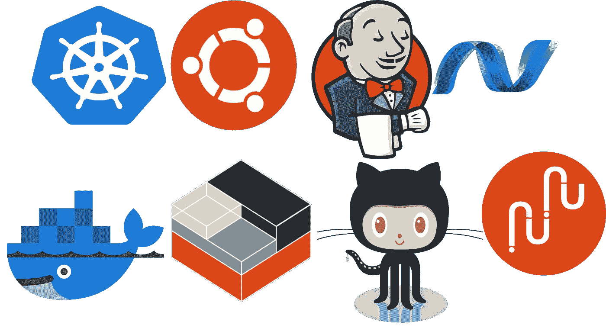
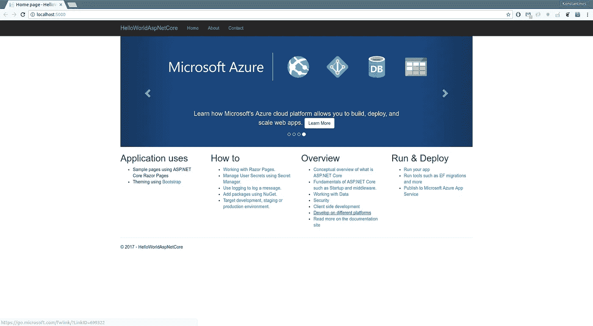
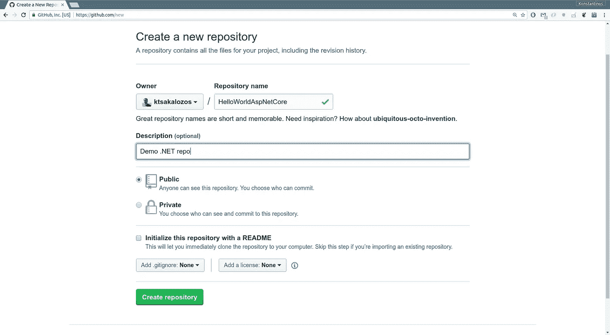
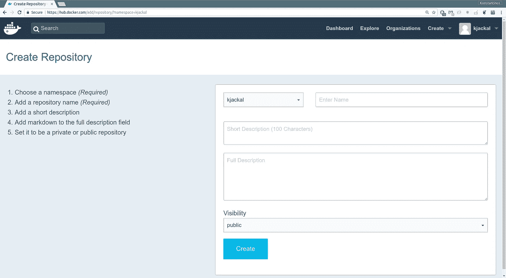
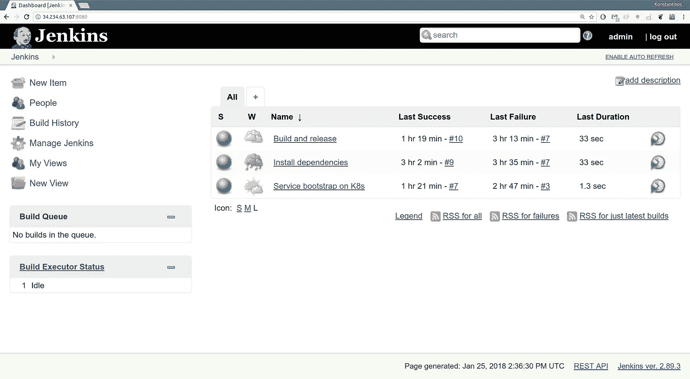
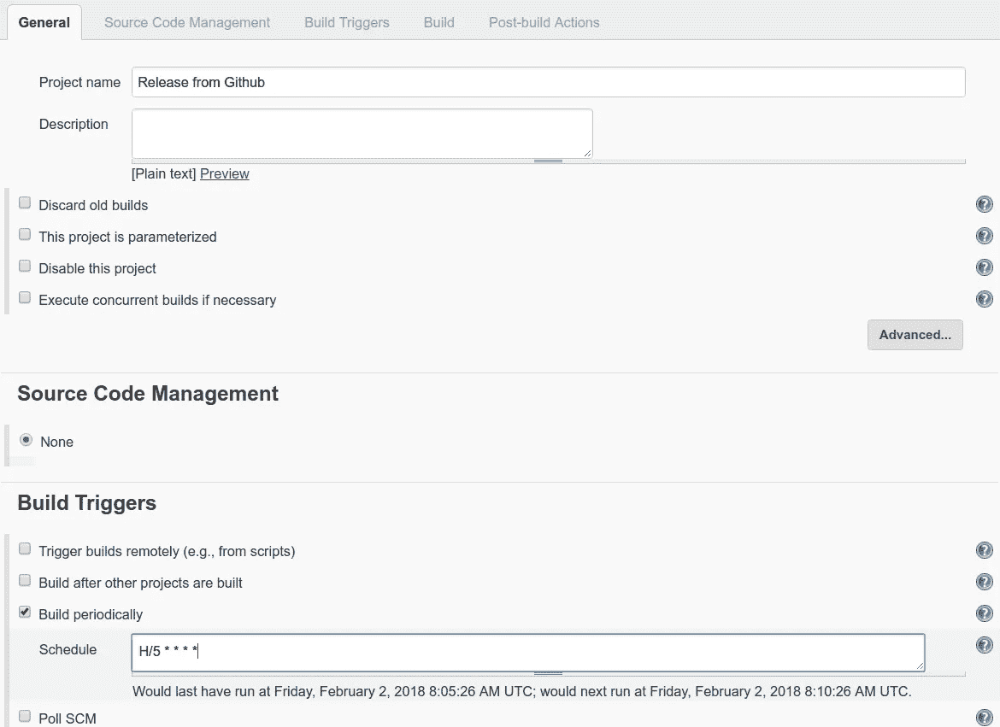
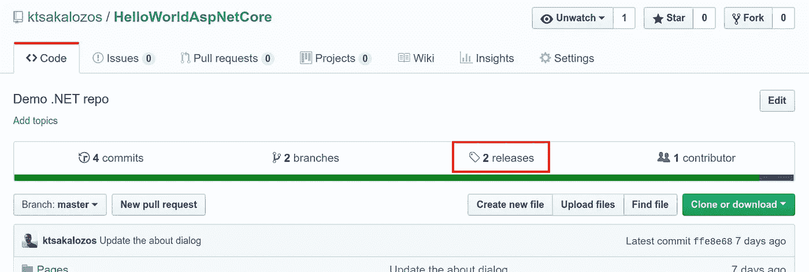
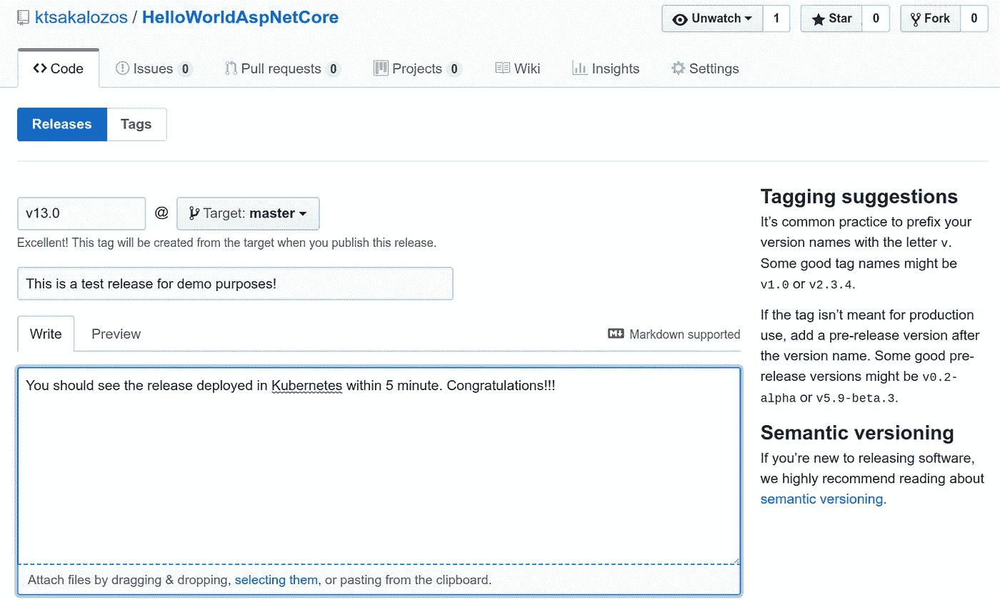

# 在本地 Kubernetes 上自动交付 ASP.NET 核心应用

> 原文：<https://itnext.io/automated-delivery-of-asp-net-core-apps-on-on-prem-kubernetes-1d6327ee1454?source=collection_archive---------0----------------------->

在本帖中，我们将了解如何在本地 Kubernetes 集群上自动部署 ASP.NET 核心应用程序。我们的工作将基于 [Mete Atamel](https://meteatamel.wordpress.com/) 的优秀博客“[在应用引擎](https://meteatamel.wordpress.com/2017/08/15/deploying-asp-net-core-apps-on-app-engine/)上部署 ASP.NET 核心应用”。我们的贡献将是 a)展示如何针对 Kubernetes 部署的公共云和私有云，以及 b)通过基于 Jenkins 的基本 CI/CD 自动交付您的软件。



[*点击这里在 LinkedIn 上分享这篇文章*](https://www.linkedin.com/cws/share?url=https%3A%2F%2Fitnext.io%2Fautomated-delivery-of-asp-net-core-apps-on-on-prem-kubernetes-1d6327ee1454)

## 我们将使用什么

*   一台 Ubuntu 16.04 机器
*   git 命令行客户端(由`sudo apt install git`安装)
*   互联网接入
*   $0，是的，这将是一篇“看看你能免费做多少事”的博文

## 快速大纲

*   在 Ubuntu 机器上创建一个 ASP.NET 核心应用，并将代码推送到 GitHub。
*   将应用程序打包到 Docker 容器中，并上传到 Docker Hub
*   旋转 Kubernetes 星团，规范分布。在这里，我们将在本地部署该集群，但是您可以使用您可以访问的任何私有或公共云。
*   在 Kubernetes 集群上部署应用程序并公开它。
*   在 Kubernetes 旁边部署 Jenkins，并自动交付您的应用。

我们不要浪费时间了，我们还有很长的路要走。

# ASP。Linux 上的 NET 核心应用程序

[正在安装。在 Ubuntu 16.04 上运行. NET 就像添加一个库并获得 dotnet-sdk-2.1.4 一样简单:](https://www.microsoft.com/net/learn/get-started/linuxubuntu)

```
$ curl [https://packages.microsoft.com/keys/microsoft.asc](https://packages.microsoft.com/keys/microsoft.asc) | gpg --dearmor > microsoft.gpg 
$ sudo mv microsoft.gpg /etc/apt/trusted.gpg.d/microsoft.gpg
$ sudo sh -c 'echo "deb [arch=amd64] [https://packages.microsoft.com/repos/microsoft-ubuntu-xenial-prod](https://packages.microsoft.com/repos/microsoft-ubuntu-xenial-prod) xenial main" > /etc/apt/sources.list.d/dotnetdev.list'
$ sudo apt-get install apt-transport-https 
$ sudo apt-get update 
$ sudo apt-get install dotnet-sdk-2.1.4
```

我们现在可以创建我们的应用程序了。这将是 Mete 的 [codelab](https://codelabs.developers.google.com/codelabs/cloud-kubernetes-aspnetcore) 中描述的模板 razor 应用程序，我们甚至不会费心去改变应用程序的名称！

```
$ mkdir -p ~/workspace/dotnet
$ cd ~/workspace/dotnet
$ dotnet new razor -o HelloWorldAspNetCore
$ cd HelloWorldAspNetCore
$ dotnet run
```

您应该会在`[http:*//localhost:5000*](http://localhost:8080)`时在浏览器上看到该应用程序



我们的代码将会放在一个公共的 github 库上，所以如果你还没有一个帐号的话，就创建一个吧([https://github.com](https://github.com/))。单击“新建存储库”按钮创建一个名为 *HelloWorldAspNetCore* 的公共存储库。



为我们的代码创建一个存储库。

让我们在项目的根目录下添加一个. gitignore 文件，并推送我们的代码:

```
$ cd ~/workspace/dotnet/HelloWorldAspNetCore
$ wget [https://raw.githubusercontent.com/OmniSharp/generator-aspnet/master/templates/gitignore.txt](https://raw.githubusercontent.com/OmniSharp/generator-aspnet/master/templates/gitignore.txt)
$ mv [gitignore.txt](https://raw.githubusercontent.com/OmniSharp/generator-aspnet/master/templates/gitignore.txt) .gitignore
$ git init
$ git add .
$ git commit -m "Initial commit"
$ git remote add origin [https://github.com/ktsakalozos/HelloWorldAspNetCore.git](https://github.com/ktsakalozos/HelloWorldAspNetCore.git)
$ git push -u origin master
```

你现在可以放松了！使用 github，您的代码是安全的。

# 将您的应用程序打包到 Docker 容器中

[安装 docker](https://docs.docker.com/engine/installation/linux/docker-ce/ubuntu/#install-docker-ce) 将需要添加各自的存储库并获取 docker-ce:

```
$ sudo apt-get install apt-transport-https ca-certificates curl \
    software-properties-common
$ curl -fsSL https://download.docker.com/linux/ubuntu/gpg | sudo apt-key add -
$ sudo add-apt-repository \
   "deb [arch=amd64] https://download.docker.com/linux/ubuntu \
   $(lsb_release -cs) \
   stable"
$ sudo apt-get update
$ sudo apt-get install docker-ce
$ sudo usermod -a -G docker $USER
$ newgrp docker
```

当我们在设置 docker 的过程中，我们也可以注册 Docker Hub 并创建一个存储库来存储我们的图像。前往 https://hub.docker.com 的[创建一个账户。我会在这里等待:)。](https://hub.docker.com/)

登录 Docker Hub 后，单击“创建存储库”按钮，创建一个新的公共存储库。这是我们推广 docker 形象的地方。对于本博客的其余部分，docker 用户是“kjackal ”,存储库被命名为“hello-dotnet”。这将很快对你更有意义。



新 docker 存储库表单。

要打包我们的应用程序，我们首先需要让 dotnet 编译我们的代码，并将所有依赖项收集到一个文件夹中，以便以后部署。这通过以下方式完成:

```
$ dotnet publish -c Release
```

我们的 docker 容器应该在`bin/Release/netcoreapp2.0/publish/`下打包所有东西。我们在项目的根目录下创建一个“Dockerfile ”,包含以下内容:

```
$ cd ~/workspace/dotnet/HelloWorldAspNetCore/
$ cat ./Dockerfile
FROM gcr.io/google-appengine/aspnetcore:2.0
ADD ./bin/Release/netcoreapp2.0/publish/ /app
ENV ASPNETCORE_URLS=http:*//*:${PORT}*
WORKDIR /app
ENTRYPOINT [ "dotnet", "HelloWorldAspNetCore.dll"]
```

构建容器并测试其工作情况:

```
$ docker build -t kjackal/hello-dotnet:v1 .
$ docker run -p 8080:8080  kjackal/hello-dotnet:v1
```

您应该在 [http://localhost:8080](http://localhost:8080) 看到输出。

是时候将第一个版本推送到 Docker Hub 了:

```
$ docker login
$ docker push kjackal/hello-dotnet:v1
```

Dockerfile 应该是代码的一部分，因此我们提交它并将其推送到 git 存储库:

```
$ git add Dockerfile
$ git commit -m "Adding dockerfile"
$ git push origin master
```

# 部署 Kubernetes 集群

对于本地 Kubernetes 部署，我们将采用 Canonical 的解决方案。原因是(除了我有偏见之外)，Canonical 提供了一个无缝、轻松的过渡，从运行在笔记本电脑上的玩具部署过渡到部署在私有、公共云甚至裸机上的成熟的生产级 Kubernetes。

在这篇博客中，我们展示了如何在您的本地主机(笔记本电脑/台式机)上部署 Kubernetes 和 Jenkins 只要确保您至少有 8GB 的 RAM。我们首先需要让 LXD 运转起来。LXD 是一种真正强大的容器，基于与 Docker 相同的技术。与 Docker 相反，LXD 容器更像虚拟机。让我们简化一下，假设从现在开始，LXD 容器是即时启动且没有性能开销的虚拟机！

在下面的代码片段中，我们安装了 LXD。初始化(`/snap/bin/lxd init`)时，确保使用默认设置，但*不启用 ipv6* 。当被问及*“应该使用什么 IPv6 地址(CIDR 子网表示法，“自动”或“无”)[默认=自动]？”*回复*【无】*。

```
$ sudo snap install lxd
$ sudo usermod -a -G lxd $USER 
$ newgrp lxd
$ /snap/bin/lxd init
```

此时我们可以使用[或者](https://jujucharms.com/)来部署 Kubernetes。召唤本质上是一个坐在 Juju 上面的巫师。

正如 Tim 在[中提到的，安装 Kubernetes with dream-up 非常简单:](https://hackernoon.com/kubernetes-1-7-on-ubuntu-the-easy-way-bcd851d4ed35)

```
$ sudo snap install conjure-up --classic
$ conjure-up
```

Canonical Kubernetes 有两种口味:

1.  kubernetes-core 是一个安装在两台机器上的精简版本，在我们的例子中，两台 LXD 容器运行在本地主机上。
2.  *canonical-kubernetes* 是完整的生产级部署，具有 HA 和[监控](https://medium.com/@kwmonroe/monitor-your-kubernetes-cluster-a856d2603ec3)等特性。

我们将选择 kubernetes-core；在下一个屏幕上，选择 localhost 作为云提供商。遵循向导的步骤，直到最后，并等待部署完成。对于无头部署，您可以执行`conjure-up kubernetes-core localhost`。

要查看我们的部署状态，请查看:

```
$ juju status
```

进入一个 LXD 的容器/机器，我们使用 juju ssh，例如:

```
$ juju ssh kubernetes-master/0
```

在/home/ubuntu 下的 kubernetes-master 中，您可以找到一个用于访问集群的配置文件。我们可以使用以下命令获取该文件:

```
$ juju scp kubernetes-master/0:config .
```

dream-up 已经在本地复制了 Kubernetes 的配置，并为我们安装了 kubectl。多好啊！

# 自动化部署流程，CI/CD

我们将展示几个 Jenkins jobs 来自动化构建、打包和部署我们的应用程序的过程。这里的目的是展示发生在引擎盖下的一切，而不是隐藏在华而不实的 UI 后面。

首先，我们需要一台詹金斯机器。

```
$ juju deploy jenkins
```

我们将 Jenkins 部署在我们的 Kubernetes 集群旁边。这需要一些时间，您可以用`juju status`来检查部署的进度。

接下来，我们需要为 Jenkins 设置一个密码，并公开它，这样我们就可以在端口 8080 上访问它的 UI。在使用 LXD 容器的 localhost 部署中不需要公开 Jenkins，但是为了完整起见，我们在这里展示了它。

```
$ juju config jenkins password='your_secure_password'
$ juju expose jenkins
```

在我们开始创建我们的工作之前，我们需要对 Jenkins 进行更多的配置。我可以事先告诉你，我们的工作需要 sudo 运行，而不要求密码。最简单的方法是在 Jenkins 机器中编辑/etc/sudoers。下面是我们如何用 Juju 在 sudoers 文件中添加一行:

```
$ juju run --unit jenkins/0 -- 'sudo echo "jenkins ALL=(ALL) NOPASSWD: ALL" >> /etc/sudoers'
```

我们也知道詹金斯的工作需要和库伯内特人谈谈。为此，Jenkins 需要 kubeconfig 文件。我们从 kubernetes-master 获取文件，并将其放在 Jenkins 机器的/var/tmp 下:

```
$ juju scp kubernetes-master/0:config .
$ juju scp config  jenkins/0:/var/tmp/
```

最后一部分配置，我保证！我们知道我们的应用程序将在端口 31576 上使用 Kubernetes 节点端口公开。我们需要确保没有防火墙阻挡该端口，并且请求可以到达该端口:

```
$ juju run --application kubernetes-worker -- open-port 31576
```

我们现在准备创建我们的三个主要工作:



我们将创造三个就业机会

*   詹金斯的第一项工作是“安装依赖项”。这项工作只是一个 shell 脚本，它安装了 a)与 kubernetes 对话，b)构建我们的 ASP.NET 应用程序，以及 c)将所有内容打包到 docker 容器中所需的所有软件包。将以下内容放在 shell 脚本作业中，并运行一次:

```
echo "Installing kubectl"
sudo snap install kubectl --classicecho "Installing dotnet"
curl [https://packages.microsoft.com/keys/microsoft.asc](https://packages.microsoft.com/keys/microsoft.asc) | gpg --dearmor > microsoft.gpg 
sudo mv microsoft.gpg /etc/apt/trusted.gpg.d/microsoft.gpg
sudo sh -c 'echo "deb [arch=amd64] [https://packages.microsoft.com/repos/microsoft-ubuntu-xenial-prod](https://packages.microsoft.com/repos/microsoft-ubuntu-xenial-prod) xenial main" > /etc/apt/sources.list.d/dotnetdev.list'
sudo apt-get install apt-transport-https -y 
sudo apt-get update
sudo apt-get install dotnet-sdk-2.1.4 -yecho "Installing docker"
sudo apt-get install apt-transport-https ca-certificates  curl \
    software-properties-common -y
curl -fsSL [https://download.docker.com/linux/ubuntu/gpg](https://download.docker.com/linux/ubuntu/gpg) | sudo apt-key add -
sudo add-apt-repository \
   "deb [arch=amd64] [https://download.docker.com/linux/ubuntu](https://download.docker.com/linux/ubuntu) \
   $(lsb_release -cs) \
   stable"
sudo apt-get update
sudo apt-get install docker-ce -y
```

*   詹金斯的第二份工作是在 Kubernetes 启动服务。它使用我们在上面创建的 v1 映像创建一个部署，并确保记录所有操作(— record param)。这个部署是使用节点端口 31576 公开的。将以下内容放入 Jenkins 作业并运行一次，记住要更新 docker 用户名(kjackal):

```
sudo /snap/bin/kubectl --kubeconfig=/var/tmp/config run hello-dotnet \
    --image=kjackal/hello-dotnet:v1 --port=8080 --recordecho "apiVersion: v1
kind: Service
metadata:
  name: hello-dotnet
spec:
  type: NodePort
  ports:
    - port: 8080
      nodePort: 31576
      name: http
  selector:
    run: hello-dotnet" > /tmp/expose.yamlsudo /snap/bin/kubectl --kubeconfig=/var/tmp/config apply -f /tmp/expose.yaml
```

使用`juju status`找到一个 kubernetes 工人的 IP，打开浏览器 http://<kubernetes-worker-IP>:31576。你的申请由 Kubernetes 提供！但是我们还没有完成。

*   让我们创建第三个作业(“构建和发布”)，从 GitHub 中提取代码，编译它，将它放入一个容器中，并部署该容器。在下面的代码片段中替换存储库和 docker 用户名。然后创建一个 Jenkins 作业:

```
rm -rf HelloWorldAspNetCore
git clone [https://github.com/ktsakalozos/HelloWorldAspNetCore.git](https://github.com/ktsakalozos/HelloWorldAspNetCore.git)
cd HelloWorldAspNetCore
dotnet publish -c Release
sudo docker login -u kjackal -p ${DOCKER_PASS}
sudo docker build -t kjackal/hello-dotnet:${DOCKER_TAG} .
sudo docker push kjackal/hello-dotnet:${DOCKER_TAG}
sudo /snap/bin/kubectl --kubeconfig=/var/tmp/config set image deployment/hello-dotnet hello-dotnet=kjackal/hello-dotnet:${DOCKER_TAG}
```

需要两个参数:${DOCKER_TAG}是一个字符串，${DOCKER_PASS}保存用户的 DOCKER 密码(本例中为 kjackal)。您必须勾选复选框，表明这是一个参数化作业，并添加两个参数。我们准备好了！触发作业并等待其完成。您的代码应该能够找到我们的 Kubernetes 集群。

你不相信我？看看我们部署的首次展示历史。

```
$ kubectl rollout history deployment/hello-dotnet
```

## 从 GitHub 发布

到目前为止一切看起来都很好。每次我们想要发布时，我们将登录到 Jenkins 并触发“构建和发布”作业…让我们试试不同的东西。让我们通过创建一个标签来触发代码的释放。

在 Jenkins 上创建一个“从 Github 发布”作业，并让它每 5 分钟定期运行一次:



每 5 分钟触发一次作业

我们希望该作业寻找新的标记，如果检测到新的标记，就执行通常的编译、打包、部署循环。下面是一个这样的工作:

```
#!/bin/bashREPO="[https://github.com/ktsakalozos/HelloWorldAspNetCore.git](https://github.com/ktsakalozos/HelloWorldAspNetCore.git)"
rm -rf ./HelloWorldAspNetCore
git clone $REPO
cd HelloWorldAspNetCore# Initialise tags list
if [ ! -f /var/tmp/known-tags  ]; then
  git tag > /var/tmp/known-tags
  echo "Initialising. List of preexisting git tags:"
  cat /var/tmp/known-tags
  exit 1
fimv /var/tmp/known-tags /var/tmp/know-tags.old
git tag > /var/tmp/known-tags
diff /var/tmp/known-tags /var/tmp/know-tags.old
if [ $? == '0' ]; then
  echo "No new git tags detected."
  exit 2
fi# We have new tags
last_tag=$(grep -v -f /var/tmp/know-tags.old /var/tmp/known-tags | tail -n 1)
git checkout tags/${last_tag}
echo "Buidling ${last_tag}"
dotnet publish -c Release
sudo docker login -u kjackal -p <replace_with_docker_password>
sudo docker build -t kjackal/hello-dotnet:${last_tag} .
sudo docker push kjackal/hello-dotnet:${last_tag}
sudo /snap/bin/kubectl --kubeconfig=/var/tmp/config set image deployment/hello-dotnet hello-dotnet=kjackal/hello-dotnet:${last_tag}
```

确保您运行此作业一次，以便它得到初始化。之后，每隔 5 分钟，该作业将查看可用的标记，如果没有新的标记出现，该作业将失败。

现在让我们创建一个新的标签/版本。进入你的 GitHub 库点击 releases——如下所示——并填写发布表单。



这里是你找到你的版本的地方。



Github 上的发布表单

在 5 分钟内，你的释放将到达 Kubernetes！而不需要你登录到詹金斯。自动地！

有几点需要注意:

1.  可能会有 Jenkins 插件。但是我们说过，我们将会看到隐藏在引擎盖下的东西，而不是躲在 GUI 后面。
2.  你应该把你的 Jenkins 作业和你的代码放在 GitHub 上。

# 从这里去哪里

到目前为止，您已经看到了在任何 Kubernetes 集群上交付. NET 应用程序的基本但功能齐全的 CI/CD 的各个部分。上面显示的每个步骤都可以根据您的需求进行改进和定制。

*   ASP.NET 应用程序通常会有自动化测试。您可能希望在您的配置项中运行这些测试。Travis 是一个很好的工具，根据你项目的规模和性质，它可能是免费的。或者，你可以设置 Jenkins 运行这些测试，并报告结果。
*   如果您打算分发您的应用程序，而不是将其作为您托管的服务提供，请查看 [Helm](https://github.com/kubernetes/helm) 。
*   尝试不同的发布策略，找到最适合你需求的一个。确保你通读了 [Kubernetes 的部署策略](https://kubernetes.io/docs/concepts/workloads/controllers/deployment/#strategy)。
*   你可以考虑使用 Kubernetes 的[自动缩放功能。](https://kubernetes.io/docs/tasks/run-application/horizontal-pod-autoscale/)
*   这里的库本内特斯集群是在 LXD 集装箱上。您应该使用私有云(例如 Openstack)或公共云。使用[召唤](https://hackernoon.com/kubernetes-1-7-on-ubuntu-the-easy-way-bcd851d4ed35)和 [Juju](http://Juju) 集群部署流程保持不变，与目标云无关。你没有借口。
*   最后，当您迁移到云时，请确保您部署的是 Kubernetes 的规范发行版，而不是 kubernetes-core。您将获得具有 HA 特性的更健壮的部署，[日志记录和监控](https://medium.com/@kwmonroe/monitor-your-kubernetes-cluster-a856d2603ec3)。

# 资源

*   [Mete Atamel](https://meteatamel.wordpress.com/)[https://Mete Atamel . WordPress . com/2017/09/11/Deploying-ASP-net-Core-apps-on-kubernetescontainer-Engine/](https://meteatamel.wordpress.com/2017/09/11/deploying-asp-net-core-apps-on-kubernetescontainer-engine/)
*   ASP。网芯[https://docs.microsoft.com/en-us/aspnet/core/](https://docs.microsoft.com/en-us/aspnet/core/)
*   。净安装[https://www.microsoft.com/net/learn/get-started/linuxubuntu](https://www.microsoft.com/net/learn/get-started/linuxubuntu)
*   Docker 安装[https://docs . docker . com/engine/installation/Linux/docker-ce/Ubuntu/# install-docker-ce](https://docs.docker.com/engine/installation/linux/docker-ce/ubuntu/#install-docker-ce)
*   Juju:工作原理【https://jujucharms.com/how-it-works 
*   https://jujucharms.com/docs/stable/getting-started[的 juju Docs](https://jujucharms.com/docs/stable/getting-started)
*   朱珠[https://jujucharms.com/](https://jujucharms.com/)
*   “Kubernetes 1.7 on Ubuntu，the Easy Way”作者 Tim Van Steen burgh[https://hacker noon . com/Kubernetes-1-7-on-Ubuntu-the-Easy-Way-BCD 851d 4 ed 35](https://hackernoon.com/kubernetes-1-7-on-ubuntu-the-easy-way-bcd851d4ed35)
*   《监控你的 Kubernetes 集群》作者凯文·门罗[https://medium . com/@ kw Monroe/Monitor-your-Kubernetes-Cluster-a856d 2603 ec3](https://medium.com/@kwmonroe/monitor-your-kubernetes-cluster-a856d2603ec3)
*   Kubernetes 部署策略[https://kubernetes . io/docs/concepts/workloads/controllers/Deployment/# strategy](https://kubernetes.io/docs/concepts/workloads/controllers/deployment/#strategy)
*   kubernetes Horizontal Pod Autoscale[https://kubernetes . io/docs/tasks/run-application/Horizontal-Pod-Autoscale/](https://kubernetes.io/docs/tasks/run-application/horizontal-pod-autoscale/)
*   https://travis-ci.org/
*   掌舵[https://github.com/kubernetes/helm](https://github.com/kubernetes/helm)