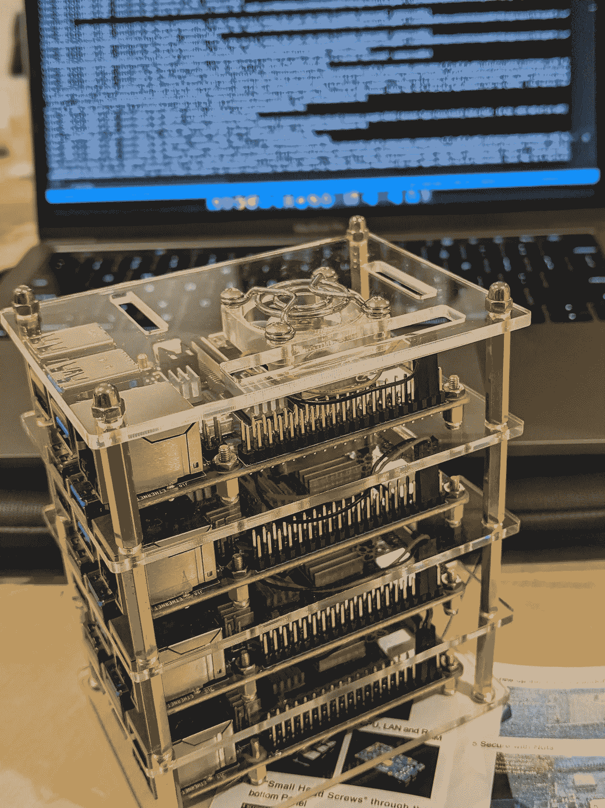

# 在 Raspberry Pis 上自动部署 HA Kubernetes

> 原文：<https://itnext.io/automated-ha-kubernetes-deployment-on-raspberry-pis-408f38cd836c?source=collection_archive---------3----------------------->

了解如何在 Raspberry Pis 上创建 HA Kubernetes 集群。



本指南演示了如何在学习环境中实现企业级安全性、可观察性和整体集群管理。本指南中的所有信息都基于 Raspbernetes 项目。

Raspbernetes 项目的目标是在 Raspberry Pis 上自动设置和管理 Kubernetes 集群。它的目标是完全的声明性和幂等性。

查看有关该项目的更多信息→[https://github.com/raspbernetes](https://github.com/raspbernetes)

# *先决条件*

硬件——我们建议至少有 4 个覆盆子。本指南使用 3 个 Pi 作为主节点，另一个 Pi 作为工作节点。您可以添加更多的 pi 来创建额外的主节点或工作节点。

软件—您需要以下 CLI 工具才能遵循本指南中的步骤:

*   [可回答的](https://docs.ansible.com/ansible/latest/installation_guide/intro_installation.html)
*   [闪光灯](https://github.com/hypriot/flash#installation)
*   [库贝克特尔](https://kubernetes.io/docs/tasks/tools/install-kubectl/)

最后，您需要克隆这个库:[https://github.com/raspbernetes/k8s-cluster-installation](https://github.com/raspbernetes/k8s-cluster-installation)

# 闪存卡

为了给每个节点配置唯一的 IP 和主机名，我们使用 cloud-init。这是一种跨平台云实例初始化的方法，也适用于裸机安装。

本指南中使用的操作系统将是 Ubuntu 20.04，运行以下命令下载映像:

```
# Download the Ubuntu 20.04 Focal image for Raspberry Pis
curl -L "http://cdimage.ubuntu.com/releases/focal/release/ubuntu-  20.04.1-preinstalled-server-arm64+raspi.img.xz" -o ~/Downloads/ubuntu-20.04.1-preinstalled-server-arm64+raspi.img.xz# Extract the downloaded files
unxz -T 0 ~/Downloads/ubuntu-20.04.1-preinstalled-server-arm64+raspi.img.xz
```

以下步骤将在引导时使用 cloud-init 自动为节点配置网络(必须为每个节点重复步骤 4 至 6):

1.  打开[云配置](https://github.com/raspbernetes/k8s-cluster-installation/blob/master/setup/cloud-config.yml)文件。
2.  更新`gateway4`值以匹配您路由器的 IP。(如果不确定，您可以使用本[指南](https://www.howtogeek.com/233952/how-to-find-your-routers-ip-address-on-any-computer-smartphone-or-tablet/#:~:text=Find%20Your%20Router's%20IP%20Address%20in%20Mac%20OS%20X&text=Select%20your%20network%20connection%E2%80%94for,listed%20simply%20as%20%E2%80%9CRouter.%E2%80%9D)找到该 IP)
3.  用您自己的密钥更新`ssh_authorized_keys`值，无需进一步配置即可实现对每个节点的安全 SSH 访问。(强烈推荐，如果您还没有设置 SSH 密钥，有很多指南会解释如何设置 SSH 密钥)
4.  将`hostname`值更新为每个节点唯一的值。
5.  将`addresses`值更新为每个节点的唯一 IP。
6.  使用以下命令将操作系统映像和云初始化配置刷新到 Raspberry Pi 上:

```
flash \
  --userdata setup/cloud-config.yml \
  ~/Downloads/ubuntu-20.04.1-preinstalled-server-arm64+raspi.img
```

# 集群配置

## 基本设置

*注意:这将使用默认 CRI & CNI 配置初始化您的集群，对于更高级的配置，请检查“* [*高级设置*](#14fe) *”选项。*

现在我们已经运行了所有的 Raspberry Pi 节点，并配置了唯一的主机名 IP，我们现在需要在 Ansible [inventory](https://github.com/raspbernetes/k8s-cluster-installation/blob/master/ansible/inventory) 文件中声明这些值。

下面是我如何配置 3 个主节点和 1 个工作节点的例子。

```
[masters]
k8s-master-01 hostname=k8s-master-01 ansible_host=192.168.1.121 ansible_user=pi
k8s-master-02 hostname=k8s-master-02 ansible_host=192.168.1.122 ansible_user=pi
k8s-master-03 hostname=k8s-master-03 ansible_host=192.168.1.123 ansible_user=pi[workers]
k8s-worker-01 hostname=k8s-worker-01 ansible_host=192.168.1.131 ansible_user=pi
```

为所有主机配置清单后，我们还必须配置最后一件事。我们需要分配一个 VIP(“虚拟 IP”)，用于跨 HA 主节点进行负载平衡。

打开 [masters.yml](https://github.com/raspbernetes/k8s-cluster-installation/blob/master/ansible/group_vars/masters.yml) ，将`keepalived_vip`值配置为未分配的 IP。对于我的配置，我使用`192.168.1.200`。

运行以下命令来验证 SSH 连接。

```
env ANSIBLE_CONFIG=ansible/ansible.cfg ansible all -m ping
```

成功的响应应该如下所示:

```
k8s-master-01 | SUCCESS => {
...
"ping": "pong"
...
}
```

*注意:如果每次 ping 的输出都返回成功，那么您可以继续，否则可能会出现库存文件配置错误或网络连接问题。*

现在我们已经测试了网络连接，我们可以运行自动化脚本，这些脚本将负责使用以下内容部署 Kubernetes:

```
env ANSIBLE_CONFIG=ansible/ansible.cfg ansible-playbook ansible/playbooks/all.yml
```

成功完成后，您可以使用`kubectl`与您的 Kubernetes 集群互动:

```
kubectl get nodes --kubeconfig ansible/playbooks/output/k8s-config.yaml
```

预期的输出应该如下所示:

```
NAME            STATUS     ROLES    AGE     VERSION
k8s-master-01   Ready      master   4m45s   v1.18.2
k8s-master-02   Ready      master   70s     v1.18.2
k8s-master-03   Ready      master   79s     v1.18.2
k8s-worker-01   Ready      <none>   16s     v1.18.2
```

**恭喜**！现在，您已经有了一个在 Raspberry Pis 上运行的 Kubernetes 集群。

## 高级设置

本节是对“基本设置”的补充，但是将探索更多可用的高级配置。

配置选项可以在 [group_vars](https://github.com/raspbernetes/k8s-cluster-installation/blob/master/ansible/group_vars) 文件夹中找到，其中有文件 [all.yml](https://github.com/raspbernetes/k8s-cluster-installation/blob/master/ansible/group_vars/all.yml) 、 [masters.yml](https://github.com/raspbernetes/k8s-cluster-installation/blob/master/ansible/group_vars/masters.yml) 和 [workers.yml](https://github.com/raspbernetes/k8s-cluster-installation/blob/master/ansible/group_vars/workers.yml) 。这些文件包含每个角色的可配置变量。

# 清除

使用以下命令拆除集群并删除所有内容:

```
env ANSIBLE_CONFIG=ansible/ansible.cfg ansible-playbook ansible/playbooks/nuke.yml
```

# 摘要

您已经成功地在 Raspberry Pis 上创建了一个具有高可用性拓扑的 Kubernetes 集群。

您已经学习了如何配置网络、刷新操作系统、设置一些基本的集群配置，现在有了 Kubernetes 集群可以继续学习。

如果您喜欢我们的开源项目，请随意贡献，尤其是如果您有目前不可用的用例！在 Raspbernetes Github org [这里](https://github.com/raspbernetes)可以发现更多。

*你觉得这个有用吗？发表评论或给我们点赞！*