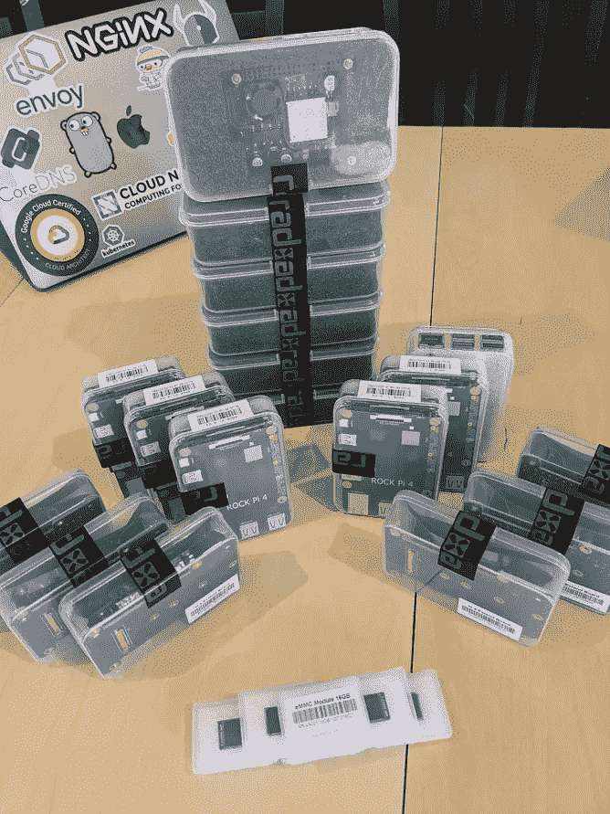

# RockPis 上的自动化 HA Kubernetes 部署

> 原文：<https://itnext.io/automated-ha-kubernetes-deployment-on-rock-pis-d56af4d086ae?source=collection_archive---------3----------------------->

了解如何在 Rock Pis 上创建 HA Kubernetes 集群。



# 先决条件

建议至少有 4 个岩石 Pis。本指南使用 3 个作为主节点，其余的作为工作节点。您可以添加更多的 Rock Pis 来创建额外的主节点或工作节点。

安装以下 CLI 工具，以便能够遵循本指南中的步骤:

*   [Ansible](https://docs.ansible.com/ansible/latest/installation_guide/intro_installation.html)
*   [库贝克特尔](https://kubernetes.io/docs/tasks/tools/install-kubectl/)

# 闪存操作系统

从[下载](https://wiki.radxa.com/Rockpi4/downloads)的 flash 工具 etcher。为您的主机操作系统选择正确的版本。

从可用的[列表](https://wiki.radxa.com/Rockpi4/downloads)中找到并下载您的首选操作系统，并使用 etcher 将您下载的操作系统刷新到您的 microSD/eMMC/SSD。

可以在[入门](https://wiki.radxa.com/Rockpi4/getting_started)中找到刷新设备的说明。

# 准备

在我们可以使用 Ansible 引导 Kubernetes 之前，我们需要做一些小的更改——目前，这是手动的——但是，它确实需要在引导后在每个设备中完成。

1.  设备的 SSH
2.  安装所需的软件包:

```
sudo apt-get update
sudo apt-get install -y wget
```

*注意:您可能会看到一些无法验证的签名错误，这是意料之中的，也正是此操作将解决的问题。*

3.使用 vim 或 nano 编辑`/etc/apt/sources.list.d/apt-radxa-com.list`,如下所示:

```
deb [http://apt.radxa.com/buster-stable/](http://apt.radxa.com/buster-stable/) buster main
deb [http://apt.radxa.com/buster-testing/](http://apt.radxa.com/buster-testing/) buster main
```

4.执行以下命令:

```
wget -O - apt.radxa.com/buster-testing/public.key|sudo apt-key add -
wget -O - apt.radxa.com/buster-stable/public.key|sudo apt-key add -
```

确保在每台设备上重复此操作！！

# 设置 Kubernetes 集群

现在我们已经运行了所有的 Rock Pi 节点，您现在需要更新 Ansible [inventory](https://github.com/raspbernetes/k8s-cluster-installation/blob/master/ansible/inventory) 文件中的值。

下面是我如何配置 3 个主节点和 1 个工作节点的例子。本例中的 **ansible_user** 和 **ansible_ssh_pass** 的值只有默认的 Rock Pi ssh 凭证。

```
[cluster:children]
masters
workers[k8s:children]
masters
workers[masters]
k8s-master-01 hostname=k8s-master-01 ansible_host=192.168.1.111 ansible_user=rock ansible_ssh_pass=rockk8s-master-02 hostname=k8s-master-02 ansible_host=192.168.1.112 ansible_user=rock ansible_ssh_pass=rockk8s-master-03 hostname=k8s-master-03 ansible_host=192.168.1.113 ansible_user=rock ansible_ssh_pass=rock[workers]
k8s-worker-01 hostname=k8s-worker-01 ansible_host=192.168.1.114 ansible_user=rock ansible_ssh_pass=rockk8s-worker-02 hostname=k8s-worker-02 ansible_host=192.168.1.116 ansible_user=rock ansible_ssh_pass=rockk8s-worker-03 hostname=k8s-worker-03 ansible_host=192.168.1.117 ansible_user=rock ansible_ssh_pass=rock
```

为所有主机配置清单后，我们还必须配置最后一件事。我们需要分配一个 VIP(“虚拟 IP”)，用于跨 HA 主节点进行负载平衡。

打开 [masters.yml](https://github.com/raspbernetes/k8s-cluster-installation/blob/master/ansible/group_vars/masters.yml) ，将`keepalived_vip`值配置为一个未分配的 IP。对于我的配置，我使用`192.168.1.200`。

运行以下命令来验证 SSH 连接。

```
env ANSIBLE_CONFIG=ansible/ansible.cfg ansible all -m ping
```

成功的响应应该如下所示:

```
k8s-master-01 | SUCCESS => {
...
"ping": "pong"
...
}
```

*注意:如果每次 ping 的输出都返回成功，那么您可以继续，否则可能会出现库存文件配置错误或网络连接问题。*

现在我们已经测试了网络连接，我们可以运行自动化脚本，这些脚本将负责使用以下内容部署 Kubernetes:

```
env ANSIBLE_CONFIG=ansible/ansible.cfg ansible-playbook \
  --extra-vars "ansible_become_pass=rock" \
  ansible/playbooks/all.yml
```

成功完成后，您可以使用`kubectl`与您的 Kubernetes 集群互动:

```
kubectl get nodes --kubeconfig ansible/playbooks/output/k8s-config.yaml
```

预期的输出应该如下所示:

```
NAME            STATUS   ROLES                  AGE     VERSION
k8s-master-01   Ready    control-plane,master   3h45m   v1.20.2
k8s-master-02   Ready    control-plane,master   3h44m   v1.20.2
k8s-master-03   Ready    control-plane,master   3h44m   v1.20.2
k8s-worker-01   Ready    <none>                 3h44m   v1.20.2
```

**恭喜**！现在，您已经有了一个在 Rock Pis 上运行的 Kubernetes 集群。