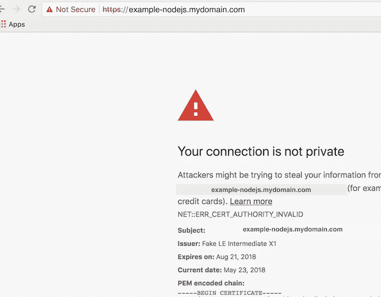

# 用于 Kubernetes 的带有 cert-manager 和 letsencrypt 的自动化 TLS

> 原文：<https://itnext.io/automated-tls-with-cert-manager-and-letsencrypt-for-kubernetes-7daaa5e0cae4?source=collection_archive---------0----------------------->


你是否梦想过有一天，当一项新服务出现时，会自动创建并更新免费的 TLS 证书？那一天已经到来。如果你已经跳上了酷车，并在生产中运行 Kubernetes，那么`[cert-manager](https://github.com/jetstack/cert-manager)`是必须的。`cert-manager`是一个在 Kubernetes 中自动创建和管理 TLS 证书的服务，它就像它的名字一样酷。

以下是我启动和运行 cert-manager 的步骤。

**设置证书管理器概述**

要在 kubernetes 集群中实现这一设置，有 3 个主要环节:

1.  cert-manager 服务确保 TLS 证书有效、最新，并在需要时更新。
2.  定义要使用的证书颁发机构的 clusterIssuer 资源
3.  定义应该创建的证书的证书资源

以下步骤假设 [nginx-ingress 控制器](https://github.com/kubernetes/charts/tree/master/stable/nginx-ingress)正在 kubernetes 集群中运行，并且有一种方法可以创建 DNS 记录。此外，假设[舵](https://helm.sh/)已安装。

**下面是我在我的 Kubernetes 集群中启动和运行** `**cert-manger**` **的步骤概述。**

1.  从[官方掌舵图](https://github.com/kubernetes/charts/tree/master/stable/cert-manager)中启动证书管理器
2.  创建一个 lets encrypt CA[cluster issuer](https://cert-manager.readthedocs.io/en/latest/reference/clusterissuers.html)k8s 资源
3.  在 kubernetes 集群中启动一个应用程序(带有入口),以便在 TLS 端点进行访问。
4.  创建一个[证书](https://cert-manager.readthedocs.io/en/latest/reference/certificates.html)对象，描述如何为测试应用程序创建 TLS 证书

**设置证书管理器的详细信息**

以下是更详细的步骤:

1.  展开`[cert-manager](https://github.com/kubernetes/charts/tree/master/stable/cert-manager)` [舵图](https://github.com/kubernetes/charts/tree/master/stable/cert-manager)。创建 [values.yaml](https://github.com/JessicaGreben/example-nodejs/blob/master/deploy/cert-manager-setup/cert-manager-values.yaml) 文件，然后运行:`helm-install --name my-release -f cert-manager-values.yaml cert-manager`。cert-manager 可以配置为通过 Ingresss 上的批注自动为 Ingres 资源提供 TLS 证书。这就是我如何设置 cert-manager 的，因此，我在 values.yaml 文件中添加了两个设置`ingressShim.defaultIssuerName`和`ingressShim.defaultIssuerKind`。点击阅读更多关于[Ingres shim 的信息。参见我的价值观文件](https://cert-manager.readthedocs.io/en/latest/reference/ingress-shim.html)[此处](https://github.com/JessicaGreben/example-nodejs/blob/master/deploy/cert-manager-setup/cert-manager-values.yaml)。

2.创建 [letsencrypt CA 集群颁发者](https://github.com/JessicaGreben/example-nodejs/blob/master/deploy/cert-manager-setup/letsencrypt-clusterissuer-staging.yaml)。在这里，我使用 letsencrypt staging ACME 服务器只是为了测试，一旦成功，我将切换到 letsencrypt 生产服务器。我通过运行创建了以下文件:`kubectl create -f letsencrypt-clusterissuer-staging.yaml`。

```
apiVersion: certmanager.k8s.io/v1alpha1
kind: ClusterIssuer
metadata:
  name: letsencrypt-staging
spec:
  acme:
    # The ACME server URL
    server: [https://acme-staging.api.letsencrypt.org/directory](https://acme-staging.api.letsencrypt.org/directory)
    # Email address used for ACME registration
    email: [myemail@gmail.com](mailto:myemail@gmail.com)
    # Name of a secret used to store the ACME account private key
    privateKeySecretRef:
      name: letsencrypt-staging
    # Enable the HTTP-01 challenge provider
    http01: {}
```

3.创建一个配置了 TLS 的测试应用程序。创建 kubernetes 清单文件(我在这里创建了一个舵图)包括一个[部署](https://github.com/JessicaGreben/example-nodejs/blob/master/deploy/charts/example-nodejs/templates/deployment.yaml)、[服务](https://github.com/JessicaGreben/example-nodejs/blob/master/deploy/charts/example-nodejs/templates/service.yaml)和[入口](https://github.com/JessicaGreben/example-nodejs/blob/master/deploy/charts/example-nodejs/templates/ingress.yaml)。入口需要[注释](https://github.com/JessicaGreben/example-nodejs/blob/master/deploy/charts/example-nodejs/templates/ingress.yaml#L8)来告诉 cert-manager 使用什么 CA 来创建 TLS 证书。域`example-nodejs.mydomain.com`必须有一个配置为向 nginx 入口控制器负载平衡器发送流量的 DNS 记录。

```
apiVersion: extensions/v1beta1
kind: Ingress
metadata:
  name: myapp-ingress
  annotations:
    kubernetes.io/ingress.class: nginx
    certmanager.k8s.io/cluster-issuer: letsencrypt-staging
spec:
  tls:
  - hosts:
    - example-nodejs.mydomain.com
    secretName: example-nodejs-crt
  rules:
  - host: example-nodejs.mydomain.com
    http:
      paths:
      - path: /
        backend:
          serviceName: example-nodejs
          servicePort: 8080
```

4.创建配置了 [acme http 质询](https://ietf-wg-acme.github.io/acme/draft-ietf-acme-acme.html#rfc.section.8.3)的`[certificate](https://github.com/JessicaGreben/example-nodejs/blob/master/deploy/charts/example-nodejs/templates/certificate.yaml)`资源。

```
apiVersion: certmanager.k8s.io/v1alpha1
kind: Certificate
metadata:
  name: example-nodejs-crt
spec:
  secretName: example-nodejs-crt
  dnsNames:
  - example-nodejs.mydomain.com
  acme:
    config:
    - http01:
        ingressClass: nginx
      domains:
      - example-nodejs.mydomain.com
  issuerRef:
    name: letsencrypt-staging
    kind: ClusterIssuer
```

创建此资源后，应该会创建一个 tls 证书。如果没有，请检查 cert-manger 服务的日志中是否有错误。

一旦所有这些部分都设置好了，当您试图在浏览器中访问应用程序时，仍然会得到一个错误，因为证书是用[临时 letsencrypt 服务器](https://github.com/JessicaGreben/example-nodejs/blob/master/deploy/cert-manager-setup/letsencrypt-clusterissuer-staging.yaml#L8)创建的，但是这仍然显示证书*已成功创建*。



一旦设置成功，就创建一个[生产集群发布者](https://github.com/JessicaGreben/example-nodejs/blob/master/deploy/cert-manager-setup/letsencrypt-clusterissuer-prod.yaml)，并用`letsencrypt-prod`集群发布者替换所有对`letsencrypt-staging`集群发布者的引用。

**有趣的额外背景信息，如果你感兴趣:**

**什么是 letsencrypt？** Letsencrypt 是一个颁发免费 TLS 证书的证书颁发机构。它于 2016 年推出，其目的是通过使使用 TLS 变得更容易和更便宜，来尝试建立一个更安全的互联网。

**什么是** [**极致协议**](https://en.wikipedia.org/wiki/Automated_Certificate_Management_Environment) **？ACME 代表自动化证书管理环境。它是一个协议，用于自动化[认证机构](https://en.wikipedia.org/wiki/Certificate_authority)及其用户的 web 服务器之间的交互，允许以非常低的成本自动化部署[公钥基础设施](https://en.wikipedia.org/wiki/Public_key_infrastructure)。它是由[互联网安全研究小组](https://en.wikipedia.org/wiki/Internet_Security_Research_Group) (ISRG)为他们的[让我们加密](https://en.wikipedia.org/wiki/Let%27s_Encrypt)服务设计的。**

**资源:**

*   让我们来解密它是如何工作的
*   [证书管理器](https://github.com/jetstack/cert-manager)
*   [我的应用示例](https://github.com/JessicaGreben/example-nodejs)和这篇博文的掌舵图