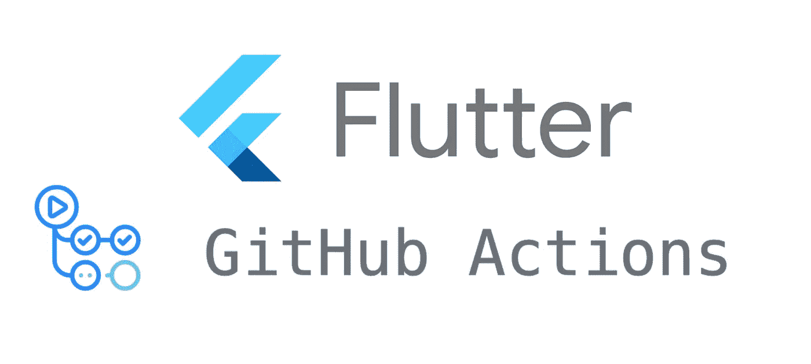

# 使用 GitHub 动作的自动化单元测试

> 原文：<https://itnext.io/automated-unit-testing-with-github-actions-1305759fc726?source=collection_archive---------2----------------------->



今天我们将讨论一个非常简单的方法，你可以用 GitHub 的动作来自动化你的 Flutter 项目的单元测试。这可以非常方便地防止损坏的代码进入生产环境，甚至可以作为代码评审的健全性检查。

# 我们开始吧

首先，让我们看看我们的结果会是什么样子…

```
name: Flutter Testingon:
  workflow_dispatch:
  pull_request:
    branches: [main]jobs:
  test:
    runs-on: ubuntu-latest
    steps:
      - uses: actions/checkout@v2.3.4
      - uses: subosito/flutter-action@v1.5.3
      - name: Install packages
        run: flutter pub get
      - name: Run generator
        run: flutter pub run build_runner build
      - name: Run test
        run: flutter test test
```

现在让我们深入了解一下这里发生了什么。

首先，我们简单地从一个名称和触发器开始，这个动作将触发任何针对主分支和“workflow_dispatch”的拉请求，这是 GitHub 的手动操作。

工作部分是实际工作发生的地方。

GitHub 公开了 Linux、Windows 和 macOS 环境，供您在其中运行操作，因为单元测试是平台不可知的，我更喜欢在 Linux 上运行这些，部分原因是它是“最便宜的”选择，而对于开源项目，您有无限的分钟，私人项目集体限制为每月 2000 分钟，时间乘数基于所使用的平台，您可以在这里阅读有关。

这些步骤描述了您的操作的流程顺序，几乎总是从 [actions/checkout@v2.3.4](https://github.com/actions/checkout) 开始，也就是将代码签出到操作实例中的操作。

当我们试图测试一个 flutter 项目时，我们需要将 Flutter 安装到实例中，为此我们调用了[subosito/Flutter-action @ v 1 . 5 . 3](https://github.com/subosito/flutter-action)，但默认情况下这将安装最新的稳定版本，但您可以将其配置到另一个版本，甚至将其固定到特定版本。

接下来，我们开始与自己的代码进行交互，首先运行 flutter pub get，这样我们就可以将所有的包安装到实例中。

对于我们这些在项目中使用代码生成的人来说,“运行生成器”是一个可选的步骤，如果您还没有在本地运行它，您可以跳过它。

最后，我们用`flutter test test`运行我们的测试，虽然第二个“test”不是必需的，但它实际上是对测试文件夹的路径引用，我需要定义它，以便一些模仿功能在我的一些项目中正确工作。

# 真的就这么简单

是的，真的很简单，这就是你所需要的能够使用 GitHub actions 运行你的自动化测试，需要多长时间取决于你的项目的大小。我最小的项目是几个文件，只需要一分多钟，我最大的项目之一是几千个文件，在 12k LOC 上进行 1k 多一点的测试，80%的覆盖率只需要 9 分钟。

我希望您对此感兴趣，如果您有任何问题、评论或改进，请随时发表评论。享受你的颤振发展之旅:D

如果你喜欢，一颗心会很棒，如果你真的喜欢，一杯[咖啡](https://www.buymeacoffee.com/remelehane)会很棒。

感谢阅读。

[](/learning-by-solving-a-problem-ca99da38180f) [## 通过解决“问题”来学习

### 通过解决“问题”来学习

通过解决“问题”来学习 itnext.io](/learning-by-solving-a-problem-ca99da38180f) [](/why-choose-flutter-3bdc9b58f218) [## 为什么选择 Flutter？

### 因此，您是一名开发人员，正在为您的公司寻找下一个有趣的游乐场或评估可行的技术…

itnext.io](/why-choose-flutter-3bdc9b58f218) 

*原载于 2021 年 9 月 12 日*[*https://remelehane . dev*](https://remelehane.dev/posts/automated-unit-testing-with-github-actions/)*。*