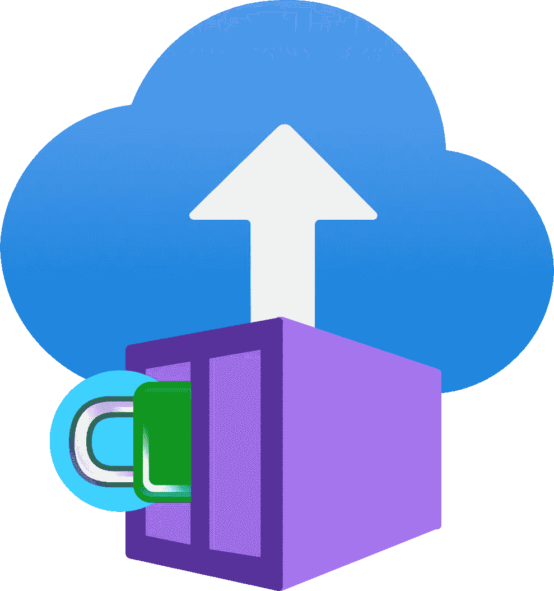

# 带有 Azure 容器实例(ACI)的自动 HTTPS

> 原文：<https://itnext.io/automatic-https-with-azure-container-instances-aci-4c4c8b03e8c9?source=collection_archive---------0----------------------->

让我们假设您想要将一个简单的容器化应用程序或服务部署到 Azure cloud。此外，您的服务需要能够通过 HTTPS 公开访问。这篇技术文章向您展示了如何实现这个目标。

## Azure 容器实例

根据架构指南[选择 Azure 计算服务](https://docs.microsoft.com/en-us/azure/architecture/guide/technology-choices/compute-decision-tree)您有几种选择来部署您的容器化服务，其中之一是 [Azure 容器实例(ACI)](https://docs.microsoft.com/en-us/azure/container-instances/container-instances-overview) :

> 容器实例:在 Azure 中运行容器的最快和最简单的方式，无需提供任何虚拟机，也无需采用更高级别的服务。

*简单*也意味着你无法获得成熟的流程编排解决方案的所有选项和功能，例如[Azure Kubernetes Service(AKS)](https://docs.microsoft.com/en-us/azure/aks/)。ACI 提供了 sidecars 和持久卷等功能。然而，使用 ACI，您必须忍受升级部署时的停机时间。

您必须手动设置 TLS。有一个指南，[Enable TLS with a sidecar container](https://docs.microsoft.com/en-us/azure/container-instances/container-instances-container-group-ssl)，它告诉你如何用 Nginx 和自签名证书设置 HTTPS。呃。该指南还提到 Caddy 是另一家 TLS 提供商，但没有提供更多细节。

## 小盒子

> Caddy[2 是一个强大的企业级开源 web 服务器，具有用 Go 编写的自动 HTTPS。](https://caddyserver.com/)

好，听起来不错！[自动 HTTPS](https://caddyserver.com/docs/automatic-https) 听起来确实耐人寻味。这是什么意思？" Caddy 自动为您的站点获取和更新 TLS 证书。它甚至引起了 OCSP 的反应。”哇！但是这是怎么做到的呢？

“Caddy 使用来自公共 ACME CA 的证书通过 HTTPS 提供公共 DNS 名称，例如[让我们加密](https://letsencrypt.org/)。这意味着，您只需要一个公共 DNS 记录，并且 Caddy 需要通过端口 80 和 443 可到达。不错！

## 安装说明

所以让我们结合 ACI 和 Caddy 来实现我们的目标。我将使用 Terraform 在 Azure 中建立基础设施。我们将从一个新的 Terraform 文件开始，并用 Azure 提供者(*Azure erm*)和 Azure 区域的本地值对其进行配置:

接下来，我们将定义三个资源，以便为 Caddy 提供持久存储:

这是必需的，以便来自“让我们加密”的证书不会在部署之间丢失。如果您频繁部署，而 Caddy 不记得以前的证书，您可能会遇到加密的[速率限制](https://letsencrypt.org/docs/rate-limits/)，这意味着您在一段时间内将无法为您的域获得任何新证书。

现在我们准备定义我们的主资源，容器实例(在 Terraform 中称为 [*容器组*](https://registry.terraform.io/providers/hashicorp/azurerm/latest/docs/resources/container_group) ):

注意，我们定义了两个容器。在第 9 行，我们使用了一个 Nginx 非特权映像，它作为我们真实服务的代理，监听端口 8080。

在第 16 行，我们定义了另一个包含 Caddy 服务器的容器(sidecar)。如前所述，Caddy 需要端口 80 和 443，所以我们分配了这些端口。另外，请注意，我们使用的是公共 IP(第 7 行)，并且定义了 DNS 子域(第 6 行)。

第 32–38 行包含共享卷的配置，它引用了我们之前定义的存储资源。Caddy 将其数据存储在 */data* 目录中。

第 40 行包含了启动 Caddy 的所有魔力。我们告诉它充当我们主服务的反向代理，要监听的地址( *from* 参数)，以及我们主服务的转发地址( *to* 参数)，即 *localhost:8080* 。就是这样。Caddy 可以从一行程序开始，几乎不需要任何配置！(这是一个我称之为*零配置*的概念，我将在以后的文章中讨论它。)

最后，我们打印新服务的地址，该地址应该可以通过 HTTPS 使用来自 Let's Encrypt 的有效证书进行访问。

让我们使用 [Azure CLI](https://registry.terraform.io/providers/hashicorp/azurerm/latest/docs/guides/azure_cli) (az)登录，并初始化和应用我们的新 Terraform 配置:

干得好！让我们通过调用输出中提供的 URL 在浏览器中测试我们的服务。如果页面显示“欢迎使用 nginx！”并且浏览器不会抱怨无效的证书，那么我们就达到了我们的目标。

您需要了解一些限制:首先，对于每个服务，您必须启动一个单独的 Caddy 服务。这消耗了额外的资源。其次，您还必须确保您的服务不监听端口 80 和 443，因为这些端口是为 Caddy 保留的。第三，球童需要一个公共 IP。

## 结论

在本技术指南中，我展示了如何克服 ACI 在管理 HTTPS 连接的 TLS 证书方面的一个缺点。