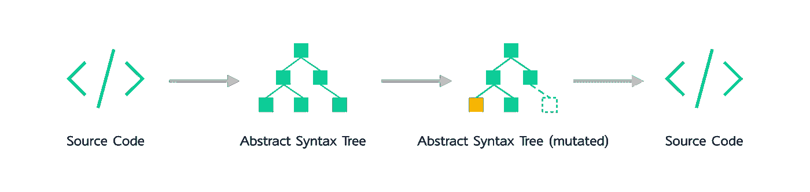
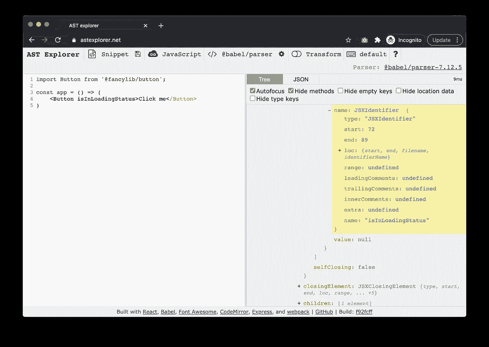
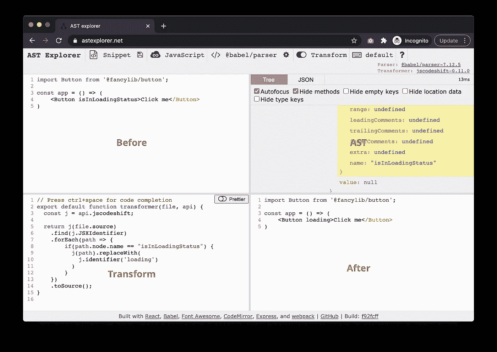

# 使用 jscodeshift/codemods 进行自动重构

> 原文：<https://itnext.io/automatic-refactoring-with-jscodeshift-codemods-45c219eaf992?source=collection_archive---------0----------------------->

在本文中，我想通过`jscodeshift`的一些用法来介绍一些关于如何在日常工作中应用自动重构的技巧。更具体地说，我将在最近开发和维护设计系统的过程中，介绍我们如何使用`jscodeshift`来升级突破性的 API 更改，以最小化对我们的消费者的影响。

当您的*组件*有内部或外部消费者时，如果您没有访问消费代码库的权限(您不能直接对代码库应用更改)，那么这里讨论的技术和模式对您也是有用的。如果你的日常工作更多的是关于如何为应用程序使用现有的组件库，我认为它也是有用的。毕竟，在大多数软件系统中，我们同时是消费者和提供者。

# 一个简单的用例

现在让我们想象你有一个花哨的组件库(姑且称之为 fancylib)发布，在库中有一个`Button`。按钮有一个名为`loading`的属性，用来表示它正在异步工作。


(图片来源:[https://xd . adobe . com/ideas/process/ui-design/design-interactive-buttons-States/](https://xd.adobe.com/ideas/process/ui-design/designing-interactive-buttons-states/))

在代码中，这个`loading`由于某种原因被定义为一个叫做`isInLoadingStatus`的公共道具。用户可以利用它来控制`Button`的状态。

```
import Button from '@fancylib/button';
​
const app = () => (
    <Button isInLoadingStatus>Click me</Button>
)
```

在一次代码审查会议上，一个实习生问了一个以前没有人问过的问题:所有的`boolean`状态在其他地方都被命名为一个工作，比如`checked`、`disabled`。所以为了遵循惯例，我们应该将`isInLoadingStatus`重命名为`loading`。多好的主意啊！

```
import Button from '@fancylib/button';
​
const app = () => (
    <Button loading>Click me</Button>
)
```

而且如果你能接触到`Button`的所有用法，字符串替换几乎是一个直接且 80%高效的解决方案。然而，简单地使用`Shift+F6`会有很多问题。

## 更复杂的案件

例如，如果使用者有自己的按钮包装，如下面的代码片段，则全局搜索/替换将是不可能的:

```
import Button as FancyButton from '@fancylib/button';
​
const MyEvenFancierButton = (props: FancyButtonProps) => (
    const theme = {
        backgroundColor: "orangered",
        color: "white"
    };
    <FancyButton {...props} theme={theme}>Click me</FancyButton>
);
```

此外，作为一个流行的库，`Button`有许多内部和外部用户，当然你不能访问所有的用户。你需要其他方法。

你需要一个更复杂的工具——一个能理解使用代码结构的工具——来帮你做脏活。如果整个过程能够以某种方式自动完成，那就太完美了。

## 使用 jscodeshift

`jscodeshift`正是这样一个工具(工具集)。简单来说，`jscodeshift`将源代码解析成一棵树(抽象语法树)，并提供`API`给开发者操纵那棵树上的节点，最终生成回源代码的树。



代码— AST — AST —代码

换句话说，它理解你的代码，并有`API`按照你的意愿修改代码。通过说它是一个工具集，它实际上包含了几个工具:

*   将源代码解析到 AST 的解析器
*   执行`transform`的运行器(可以应用于解析树的脚本)

# 实现转换

让我们看一个简单的脚本来完成上面用`jscodeshift`讨论的自动转换。`jscodeshift`的工作方式是:首先你需要定义一个`transform`脚本，这个脚本需要遵守协议，这样它才能被识别，然后`jscodeshfit`将启动一个`runner`来将这个`transform`应用到一个文件或一个文件夹下的所有文件。比如下面的命令:

```
jscodeshift -t myTransform src
```

注意这里的`myTransform`是您的`transform`脚本名称，`src`是包含您所有要转换的`JavaScript`或`TypeScript`文件的文件夹。

## 定义一个转换函数

换句话说，我们需要将所有的转换逻辑放到`transform`中。本质上`transform`是一个具有某种特征的函数:

```
import { Transform } from "jscodeshift";
​
const transform: Transform = (file, api, options) => {
  //...
};
​
export default transform;
```

`file`有解析过的文件对象，`api`是`jscodeshift` API 对象的处理程序，你可以用它来搜索，变异一个解析过的文件对象。`options`然后是一个可选参数，可以用来传递其他选项(如最终结果的格式)到转换。在函数体中，我们可以使用`jscodeshift`的 API 来操纵 AST 进行修改。

整个过程非常类似于使用`DOM`API 来改变网页上的元素:通过一些属性(css 类名或 HTML id)来查找元素，然后对搜索结果进行一些处理。只有在这里你改变的对象是`Statement`、`Function`或`Condition` s

在我们进入具体的 API 之前，让我们看一下 AST。这将是我们在本文剩余部分的主要关注点。

## 抽象语法树

简而言之，AST 是编译过程中解析短语之后的中间对象。我们的源代码被解析为`Token`,然后`Token`被解析为语法，然后是树。因此，如果你使用像 [AST Explorer](https://astexplorer.net/) 这样的工具来检查你的代码，你可以实时看到这棵树。

例如，我们的片段:

```
import Button from '@fancylib/button';
​
const app = () => (
    <Button isInLoadingStatus>Click me</Button>
)
```

解析后会出现类似右边面板上的树的东西。所有的元素都有一个类型和它的值。比如`isInLoadingStatus`被识别为类型`JSXIdentifier`，变量`app`被识别为`VariableDeclarator`等等。所有这些有效的元素都将是一棵树的一个节点。



AST 浏览器

现在你应该对 AST 有了一个基本的了解，让我们进入`transform`函数。您实际上可以使用来自 [AST Explorer](https://astexplorer.net/) 的 IDE 来做一些快速调试和测试(注意这里我们使用`jscodeshift`作为转换器):

然后我们可以定义`transform`函数如下:

```
// Press ctrl+space for code completion
export default function transformer(file, api) {
  const j = api.jscodeshift;
​
  return j(file.source)
    .find(j.JSXIdentifier)
    .forEach(path => {
      if(path.node.name === "isInLoadingStatus") {
          j(path).replaceWith(
            j.identifier('loading')
          )
        }
    })
    .toSource();
}
```

首先，它会找到所有的`JSXIdentifier`并遍历它们中的每一个，如果值是`isInLoadingStatus`，我们将其更改为`loading`。注意右下角的结果:



使用 AST Explorer 作为调试的 IDE

## 测试驱动开发

此外，作为一个严肃的开发者，我们在大多数情况下不应该依赖在线 IDE。幸运的是,`jscodeshift`和`jest`可以完美地一起工作，这也是在编写转换时应用测试驱动开发的一个极好的场景，因为:

*   投入和产出都是确定的
*   大多数用法(消费者如何使用您的代码)也很容易编写
*   每一步都可以被很好地定义并且很小

并且`jscodeshift`在`jscodeshift/dist/testUtils`中提供了一些助手，所以你可以非常容易地定义一个测试用例:

```
import { defineInlineTest } from 'jscodeshift/dist/testUtils';
import transformer from './transformer';
​
describe('transformer', () => {
  defineInlineTest(
    { default: transformer, parser: 'tsx' }, 
    {},
    `
    import Button from '@fancylib/button';

    export default () => (
      <Button isInLoadingStatus>Click me</Button>
    );
    `,
    `
    import Button from '@fancylib/button';

    export default () => (
      <Button loading>Click me</Button>
    );
    `,
    'change isInLoadingStatus to loading'
  );
});
```

如果你对字符串模板不太适应，它也支持基于文件的测试，这样你可以为更复杂的情况定义`input`和`output`到文件中。

向前看，我们不想用`transform`去换一个不属于我们图书馆的`Button`。例如，另一个库中有`Button`，而`Button`也有一个`isInLoadingStatus`道具。

我们需要一个测试用例来确保我们不会意外地改变它:

```
defineInlineTest(
    { default: transformer, parser: 'tsx' }, 
    {},
    `
    import Button from '@facebook/button';

    export default () => (
      <Button isInLoadingStatus>Click me</Button>
    );
    `,
    `
    import Button from '@facebook/button';

    export default () => (
      <Button isInLoadingStatus>Click me</Button>
    );
    `,
    'should not change isInLoadingStatus to loading from other package'
  );
```

相应的逻辑是:

```
// Press ctrl+space for code completion
export default function transformer(file, api) {
  const j = api.jscodeshift;
  const root = j(file.source);
​
  const specifiers = root
    .find(j.ImportDeclaration)
    .filter((path) => path.node.source.value === "@fancylib/button")
    .find(j.ImportDefaultSpecifier);
​
  if (specifiers.length === 0) {
    return;
  }

  //...
}
```

也就是说，我们首先搜索所有的`import`语句，过滤掉那些不感兴趣的。您可能已经注意到，我们有一堆像`j.ImportDeclaration`和`j.ImportDefaultSpecifier`这样的常量，是的，它们正是来自 AST Explorer 的标记名。

这个过程或多或少类似于我们使用 DOM API 所做的事情:

```
document.querySelectorAll('a')
    .filter(anchor => anchor.classList.includes('button'))
    .forEach(anchor => anchor.style["text-decoration"] = "underline")
```

*如果您发现这里有太多活动部件，不要惊慌，开始时感到有些力不从心是完全正常的*

恐怕把所有的代码都放在一篇文章里会太无聊，所以我就不在这里贴代码片段了，你可以从这里找到[一切。](https://github.com/abruzzi/codemod-demo)

## 潜在的陷阱

当你厌倦了对不同版本的组件做无休止的修补时，在任何地方使用`jscodeshift`都是非常诱人的。但我需要诚实地说，它有一些缺点。

首先，虽然它简化了底层的 API，但是`jscodeshift`API 本身有点麻烦，而且它有一个相对陡峭的学习曲线。一个`transform`的开发过程中会有很多调试。另外，如果你想让`transform`涵盖所有场景，有些情况下成本太高。最后，当一个组件有许多版本时，对于每个主要版本，如果你有一个`transform`的话，如果有人想从一个非常旧的版本升级到最新的版本将会很棘手。将会有一些版本控制等等来确保所有的`transform`可以被等幂地应用。

# 摘要

在本文中，通过一个过于简化的例子，我们介绍了在日常工作中需要自动迁移组件时为什么以及如何使用`jscodeshift`。我们讨论了 AST 和`jscodeshift`的基础知识，以及如何在开发过程中使用 AST Explorer 进行辅助。

# 参考

*   【React 发布的一些代码模块
*   [AST 探险家](https://astexplorer.net/)
*   [本帖中提到的源代码](https://github.com/abruzzi/codemod-demo)
*   [jscodeshift 的另一个详细教程](https://skovy.dev/jscodeshift-custom-transform/)