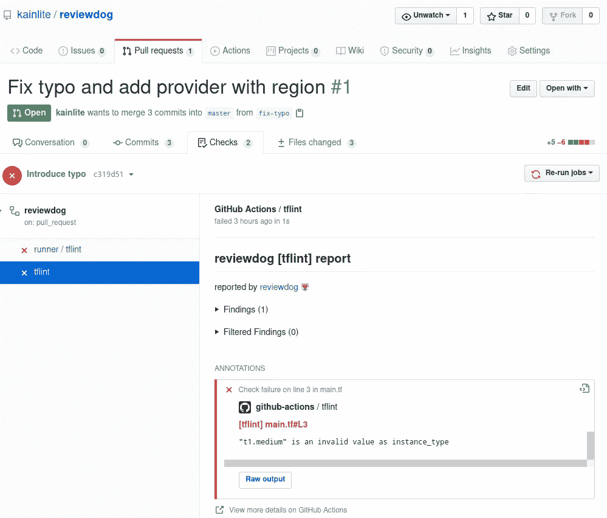
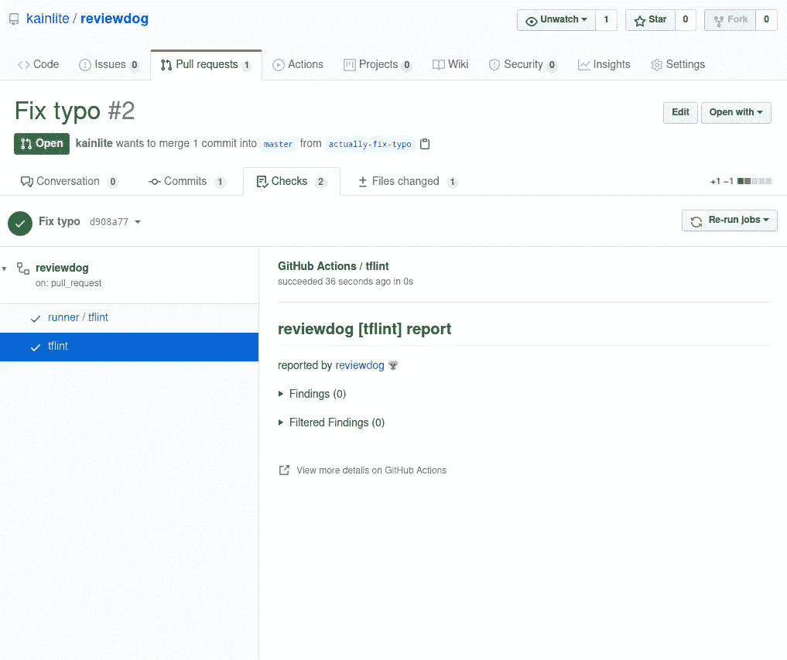

# 带 reviewdog 和 tflint 的自动地形林挺

> 原文：<https://itnext.io/automatic-terraform-linting-with-reviewdog-and-tflint-f4fb66034abb?source=collection_archive---------2----------------------->

**简介**

在本文中，我们将使用 [reviewdog](https://github.com/reviewdog/reviewdog) 和 [tflint github action](https://github.com/reviewdog/action-tflint) 测试如何 lint 并自动检查我们的 terraform 代码的 github pull 请求，这对于防止不必要的更改或错误提交被合并到您的主分支非常有用。为了让它工作，你只需要在你的 repo 中配置一个 Github 动作，就这样，你不需要生成任何令牌或者做任何额外的步骤。

为了让这个例子更简单，我用基本配置创建了这个 [repo](https://github.com/kainlite/reviewdog) 来让它工作。

**地形**

首先，我们需要获得我们的 terraform 代码，正如你所看到的，它是 AWS 中一个简单的 ec2 实例，但是实例类型不存在，我们将很快修复它。

**Github 工作流程**

因为我们正在使用 Github，所以我们可以利用[动作](https://github.com/features/actions)来运行代码的 linter，并在出现错误时标记我们的 PR。

**示例公关**

首先，我们将运行一个有问题的 PR，以查看它的失败和报告是如何工作的(要到达这里，您可以单击 PR 中的 checks 选项卡，然后单击 tflint 步骤，请参见[此处](https://github.com/kainlite/reviewdog/pull/1/checks?check_run_id=793169790))。

**真正起作用的人**

因为我们已经测试了它，它如预期的那样失败了，我们现在可以修复它，现在 reviewdog 和 tflint 对我们的提交感到满意，我们可以合并它(只需在 main.tf 文件中将 t1 改为 t2)。

**闭幕词**

对我来说，这似乎特别有用，因为它可以捕捉到很多肉眼难以捕捉的错误，特别是当我们谈论打字错误时，这也是一个很好的做法，所以你可以这样做，我希望你尝试一下，并记住 reviewdog 可以审查许多不同的语言，我只是选择了 terraform，因为这是我最近使用最多的。

# 正误表

如果您发现任何错误或有任何建议，请给我发消息，以便解决问题。

此外，您可以在[生成的代码](https://github.com/kainlite/kainlite.github.io)和[源代码](https://github.com/kainlite/blog)中查看源代码和变更

*原载于 2020 年 5 月 21 日*[*https://tech squad . rocks*](https://techsquad.rocks/blog/terraform_linter/)*。*