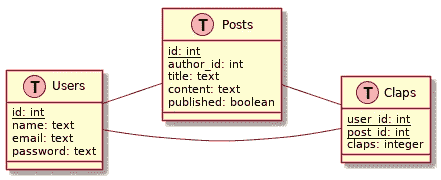
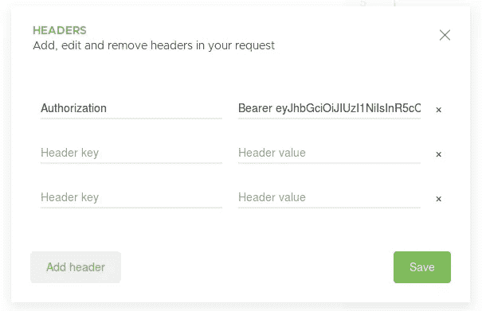

# 使用 PostgreSQL 和 Postgraphile 自动构建和维护 GraphQL APIs

> 原文：<https://itnext.io/automatically-building-and-maintaining-graphql-apis-with-postgresql-and-postgraphile-c497636abd29?source=collection_archive---------1----------------------->

如今，上市时间是构建新服务的核心性能指标之一。对于大多数服务，至少一些 CRUD 操作是必要的，并且大多数应用程序可以被描述为显示数据并让用户操作数据的数据驱动应用程序。实现这些 CRUD 接口并使其保持最新是一项枯燥乏味的任务。大多数框架，如 Rails 和类似 Rails 的框架，已经通过为这些步骤提供生成器来帮助程序员自动化任务，但是当底层数据模式改变时，这些框架就会失败。

在这篇文章中，我将展示 [Postgraphile](https://www.graphile.org/postgraphile/) 如何帮助消除为每个新服务在后端重新创建 CRUD 接口的枯燥工作，而是专注于提供真正商业价值的功能。

假设一个经典的三层服务由前端、后端和数据存储组成(是的，如果我们将服务消费者称为“前端”，甚至大多数微服务都是三层应用)。当设计这样的应用程序时，我们通常从后端开始，考虑类和应用程序状态，然后才考虑底层数据和 API 层。在一个更加功能化的世界中，我们将首先考虑数据本身，以及我们需要如何转换和操作数据来提供业务价值。

在我们的三层方法中，我们不从中间开始，即后端，而是首先定义我们的数据结构以及它们在数据存储(即数据库)中的关系，然后考虑实现后端和前端需要什么。由于操纵数据的后端功能不提供核心业务价值，操纵数据的实现需要自动化。Postgraphile 帮助我们做到了这一点:给定一个(PostgreSQL)数据库，Postgraphile 为该数据库提供了一个 GraphQL HTTP API，支持认证、授权，并且是可扩展的。

在我们深入研究示例之前，让我们回顾一下我们为该设置选择了哪种技术以及为什么:

## 数据库:PostgreSQL

说正经的:PostgreSQL 是一个很棒的数据库。对于大多数用例，您应该尽可能选择强一致性和关系。而这正是 PostgreSQL 给我们提供的。

为了支持认证和授权，我们使用了[角色](https://www.postgresql.org/docs/current/static/database-roles.html)、[行](https://www.postgresql.org/docs/10/static/sql-createpolicy.html)和列级安全策略。通过这种方式，我们可以识别哪个用户当前登录了，以及他们应该看到什么数据(稍后将详细介绍)

## API 层:GraphQL

GraphQL 是一种用于 API 的查询语言，与手工构建 REST 接口相比，它有很多优点。它有一些类似于 [oData](http://www.odata.org/) 的目标，但不限于 SAP 和微软泡沫。

## 胶水:海报

我们的主要目标是减少实现无聊的 CRUD 操作所需的工作量。Postgraphile 更进一步，完全自动化了该功能的创建和维护。

PostgreSQL 将一个到 PostgreSQL 数据库的连接作为输入，分析它并为数据库提供一个 GraphQL API。在开发过程中，Postgraphile 还可以观察数据库的变化，并立即更新 API。在生产过程中，可以缓存分析结果，以提高毫秒级启动速度(比如在 AWS Lambda 上)。

# 示例:用于中型克隆的 API

让我们构建一个非常简单的 medium 克隆:在我们的克隆中，用户可以发布帖子，并可以通过鼓掌对其他帖子进行评级。数据库模式非常简单:我们有一个用户、帖子和掌声表:

我们的中型克隆的数据库结构

以下 SQL 代码为我们创建了模式:

现在让我们安装并运行 postgraphile(更多细节参见[快速入门指南](https://www.graphile.org/postgraphile/quick-start-guide/)):

就这些！让我们安装 [Altair](https://github.com/imolorhe/altair) 浏览器扩展，而不是使用提供的 GraphiQL 接口。

在右边，您可以找到文档浏览器，并看到所有支持的查询和变化。我们已经可以开始查询和修改数据库，但是让我们首先用一些值填充数据库:

让我们在 Altair 中尝试几个查询:

咳咳…我们不想让用户看到密码。咳咳……我们不希望任何人看到这个表格中的任何信息。除此之外，它看起来很棒。让我们尝试获取所有帖子和相应的作者:

好的。这很好，但是用户不应该看到其他用户未发表的帖子。

在解决问题之前，让我们注册一个新用户:

很好，但是也许我们不应该这样做，尤其是不要以纯文本格式存储密码！(千万，千万不要这么做！想都别想！)

我们已经看到了当前方法的一些问题，我们需要解决哪些问题？

*   为用户提供创建新帐户的方法
*   为用户提供一种登录方式
*   禁止所有人查看用户表
*   客人只能看到已发布的帖子
*   登录的用户只能看到发布的帖子和他们自己的帖子

## 使用 Postgraphile 进行用户和会话管理

Postgraphile 支持一种非常灵活的会话管理方式: [JWT](https://jwt.io/) (JSON Web Tokens)。我们可以为 PostgreSQL 提供一个密钥和一个自定义的 PostgreSQL 数据类型，每当 PostgreSQL 函数返回该数据类型时，PostgreSQL 就会将内容编码为 JWT 令牌并进行签名。每当请求包含用定义的密钥签名的有效授权头时，Postgraphile 就提取该数据并将其存储在 PostgreSQL 变量中。然后，我们可以在 PostgreSQL 查询中访问这些数据。

**警告:** JWT 代币存在严重问题，应小心使用。更多信息见[这篇文章](http://cryto.net/~joepie91/blog/2016/06/13/stop-using-jwt-for-sessions/)。为了简单起见，我们将在这里继续使用它们。请注意，Postgraphile 在用作中间件时，可以通过 pgSettings 选项使用 express 支持的任何形式的身份验证。(更多信息参见[文档](https://www.graphile.org/postgraphile/usage-library/)

从一个例子开始，让我们首先为我们的令牌定义一个数据类型，一个注册和登录函数:

首先，我们定义一个新的类型 jwt_token，它由角色、用户 id 和电子邮件组成。角色字段用于设置当前用户的 [PostgreSQL 角色](https://www.postgresql.org/docs/current/static/database-roles.html)，其他两个字段都应该很明显。

接下来，我们定义两个 PLPGSQL 函数:SIGNUP 和 SIGNIN。这些函数返回 jwt_token 类型，结果将由 Postgraphile 翻译成 jwt 令牌。

现在我们需要告诉 Postgraphile 一个密钥和令牌类型的名称:

我们在 postgraphile 命令中添加了几个标志:

*   **注意**:每当模式更新时，GraphQL API 也会更新，而不需要重新加载服务器
*   **jwt-token-identifier**:JWT 令牌的类型
*   **jwt-secret** :代表 jwt 秘密的随机字符串。当您更改该字符串时，所有以前颁发的 JWT 令牌都将失效
*   **默认角色**:没有提供 JWT 令牌时的默认角色
*   **显示错误堆栈**:为了更好的调试

现在我们可以使用注册变异来创建一个新用户:

数据库按预期相应更新；)当我们现在尝试查询任何其他内容时，我们会得到权限错误，因为我们定义了默认角色 anonymous，但没有授予 anonymous 任何内容。我们稍后将回到这一点。

现在，我们有了 JWT 代币，我们如何使用它呢？要设置 JWT 令牌，只需复制它并在 Altair 中添加一个标题“Authorization ”,带有值“Bearer”和复制的 JWT 令牌:

在 Altair 中设置授权头

很好，现在我们知道谁登录了，可以开始允许人们访问帖子了。在启动 Postgraphile 时，我们定义了默认角色是“anonymous ”,但是当用户登录时，我们将角色“medium_user”分配给 JWT 令牌。现在让我们授予匿名用户和中级用户对 posts 和 claps 表的访问权限。匿名用户只允许读取，medium_users 可以执行所有 CRUD 操作:

太好了！现在每个人都可以查询所有的帖子和掌声，登录用户可以操纵整个数据库。这不是我们想要的。我们需要限制访问已发布的和自己的帖子。此外，我们需要确保用户只能修改他们自己的帖子。

但是首先我们需要一种方法来获取当前用户的 id。因此让我们实现一个简单的函数 current_user_id():

如果没有给定用户 id，此函数返回 null，否则返回 id。我们需要向这两个角色授予执行权限，以简化后续流程。

接下来，让我们更深入地研究 PostgreSQL 的[行级安全策略](https://www.postgresql.org/docs/current/static/ddl-rowsecurity.html)，以限制访问和修改权限:

我们现在只允许匿名用户访问已发布的帖子，允许中级用户访问已发布的或自己的帖子。WITH CHECK 表达式仅与插入、更新和删除查询相关，并保证当前用户不能创作或删除其他作者的帖子。

让我们在 Postgres CLI 中尝试一下:

我们可以看到现在匿名只能看到发布的帖子。对于已登录的用户来说，情况非常相似。

让我们通过为 claps 表创建行级安全策略来完成我们的示例:

最后，我们将在 Altair 客户端中使用 GraphQL 尝试一些有趣的查询:

# 结论

我们用相对较少的努力创建了一个强大的 GraphQL API，它可以很容易地进一步扩展以满足我们的需求。我们没有写一行低级代码，只有几行 SQL。Postgraphile 需要一些关于 API 外观的假设。但另一方面也给了我们很大的自由和权力去扩展它。但最重要的是，我们没有编写一行特定于 CRUD 的代码！这已经为我们完成，并将自动与底层数据库保持同步。

考虑到这一点，应该有一种方法以非常相似的方式自动构建前端应用程序。给定一个 API，该工具应该创建一个使用该 API 的前端，并允许用户以预期的方式与之交互。作为开发人员，我们应该停止担心枯燥的 CRUD 工作和基于表单的应用程序的重新发明，而是关注真正的商业价值，以满足客户和用户的期限和期望。

对于未来的开发人员来说，能够自动化大部分数据驱动应用程序的创建和维护将是一项至关重要的技能。只有通过自动化这一过程，我们才能跟上我们自己的想法。

我目前正在考虑如何以端到端的方式做到这一点，也就是说，如何在给定一个数据库的情况下，自动生成操作该数据库的优秀前端应用程序，而不丧失定制和扩展它的能力。我想邀请你和我一起思考这个问题，并期待你的反馈。