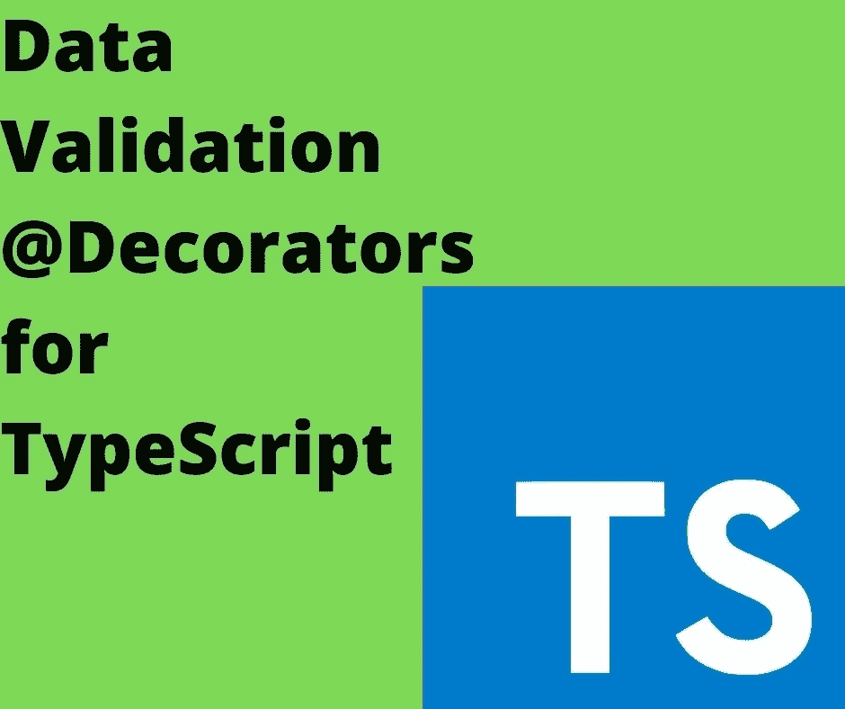

# 在 TypeScript 中自动处理运行时数据验证

> 原文：<https://itnext.io/automatically-handling-runtime-data-validation-in-typescript-b6dad067bdef?source=collection_archive---------6----------------------->

## JavaScript 本身不能进行运行时数据验证，因此类型安全需要数据验证工具



TypeScript 做了出色的编译时类型检查。但这并不意味着 TypeScript 代码确保运行时类型或数据验证或检查。TypeScript 在没有运行时检查的情况下将代码编译成 JavaScript，这为运行时数据问题敞开了大门。

使用在编写时自动显示类型错误的 IDE 编写 TypeScript 代码，可以确保您的代码正确地处理它接收到的数据。理论上，这使得我们的应用程序更加安全。但是，这可能会让你自满。最终，TypeScript 代码变成了 JavaScript，在执行时没有检查，因为它是 JavaScript。

这意味着您的生产代码容易受到坏数据导致的各种故障的影响。除非你了解防御性编程并正确检查你的数据。我们当中有多少人记得在每一个需要的地方都这样做？我们可能有最好的意图每次都在每一步检查数据的有效性，但是让我们诚实地承认我们有时会忘记这样做。

最好实现自动运行时数据检查。数据检查可以内置于 TypeScript 类的定义中，这样每当您将数据分配给类中的字段时，或者每当您调用类方法时，都会进行数据检查。

要发现问题，请考虑以下情况:

```
import { promises as fs } from 'fs'; class jsdata {
     title: string;
     range: number; 
} async function readData(fn: string): Promise<jsdata> {
     const txt = await fs.readFile(fn, 'utf-8');
     const d = JSON.parse(txt);
     const ret = new jsdata();
     ret.title = d.title;
     ret.range = d.range;
     return ret; 
} readData(process.argv[2]) .then(data => {
     console.log(data); 
}) .catch(err => {
     console.error(err); 
});
```

对于一个应用程序来说，获得 JSON 数据，解析它，将数据存储在一个对象中，然后将该对象发送到其他地方是很常见的。这就是这个例子所展示的。

让我们用一些好的数据来运行它:

```
{
     "title": "Fantastic book title",
     "range": 42 
}
```

像这样运行它:

```
$ npx ts-node ./json1.ts ./data1.json jsdata 
{ title: 'Fantastic book title', range: 42 }
```

它按预期工作，给出正确的值，并且这些值符合声明的数据类型。

但是，如果我们给我们神奇的算法一些坏数据会发生什么？

```
{
     "range": "Fantastic book title",
     "title": 42 
}
```

这是相同的数据，但不知何故，一个错误弄乱了标签。这是可能发生的，对吗？

```
$ npx ts-node ./json1.ts ./data2.json jsdata 
{ title: 42, range: 'Fantastic book title' }
```

哎呀，没有错误，现在我们的数据对象有了错误的数据类型。字段`title`被声明为`string`，但它却有`number`，这与`range`有着同样的问题。在实际的生产应用程序中，这种错误可能会产生严重的后果。

我们可能会挠头，想知道这是怎么发生的，因为 TypeScript 类清楚地声明了数据类型。但是，看看实际编译的 JavaScript:

```
"use strict"; 
Object.defineProperty(exports, "__esModule", { value: true }); const fs_1 = require("fs"); class jsdata { } async function readData(fn) {
     const txt = await fs_1.promises.readFile(fn, 'utf-8');
     const d = JSON.parse(txt);
     const ret = new jsdata();
     ret.title = d.title;
     ret.range = d.range;
     return ret; 
} readData(process.argv[2])
.then(data => {
     console.log(data); 
})
.catch(err => {
     console.error(err); 
});
```

您在这里看到任何数据类型或类型检查了吗？事实上，`jsdata`类在这里有一个空的声明。这段代码没有包含任何运行时数据验证的内容。这是运行时执行的代码，而不是上面显示的 TypeScript 代码。

换句话说——如果你写了上面的代码，并且相信自己是安全的，那么你已经被忽悠到啦啦地了。

需要的是运行时数据验证。TypeScript 团队建议使用类型保护，这是确保数据类型正确的小函数。例如，在`JSON.parse`行之后，将会有一行读数`isJSData(d)`，它将检查所需的字段是否存在。

另一种方法是[运行时数据验证](https://www.npmjs.com/package/runtime-data-validation)包中的运行时数据验证装饰器。它们允许在每次为字段赋值或者每次调用方法时进行自动类型检查。

使用这些装饰器重写上面的示例，如下所示:

```
import { promises as fs } from 'fs'; 
import {
     IsInt, IsAscii,
     ValidateParams, ValidateAccessor 
} from 'runtime-data-validation'; class jsdata {
     #title: string; @ValidateAccessor<string>()
     @IsAscii()
     set title(nt: string) { this.#title = nt; }
     get title(): string { return this.#title; } #range: number; @ValidateAccessor<number>()
     @IsInt()
     set range(nr: number) { this.#range = nr; }
     get range(): number { return this.#range; }  
} async function readData(fn: string): Promise<jsdata> {
     const txt = await fs.readFile(fn, 'utf-8');
     const d = JSON.parse(txt);
     const ret = new jsdata();
     ret.title = d.title;
     ret.range = d.range;
     return ret; 
} readData(process.argv[2]) .then(data => {
     console.log({ title: data.title, range: data.range }); 
})
.catch(err => {
     console.error(err); 
});
```

这和上面大体相同。装饰者通过在代码中明确指出什么是预期的数据，为代码增加了一些价值。

在设计`runtime-data-validators`包时，我们发现不能使用附加到类属性的装饰器来实现运行时数据验证。只可能在访问器函数上实现这一点。因此，这个实现依赖于使字段`title`和`range`成为私有字段，并使用访问器函数来代替。

对于成功案例，没有变化:

```
$ npx ts-node ./lib/json/json2.ts ./lib/json/data1.json 
{ title: 'Fantastic book title', range: 42 }
```

代码仍然按预期执行，并产生正确的结果。

```
$ npx ts-node ./lib/json/json2.ts ./lib/json/data2.json 
TypeError: Expected a string but received a number
     at assertString (/home/david/Projects/nodejs/runtime-data-validation-typescript/node_modules/validator/lib/util/assertString.js:17:11)
     at Object.isAscii (/home/david/Projects/nodejs/runtime-data-validation-typescript/node_modules/validator/lib/isAscii.js:17:29)
     at /home/david/Projects/nodejs/runtime-data-validation-typescript/lib/decorators/strings.ts:65:31
     at vfunc (/home/david/Projects/nodejs/runtime-data-validation-typescript/lib/index.ts:87:14)
     at jsdata.descriptor.set (/home/david/Projects/nodejs/runtime-data-validation-typescript/lib/index.ts:247:21)
     at readData (/home/david/Projects/nodejs/typescript-decorators-examples/simple/lib/json/json2.ts:29:14)
```

失败案例现在是真正的失败。在运行时，数据类型被正确实施。此外，堆栈跟踪不仅清楚地描述了问题，还指出了导致问题的正确代码行。

## 摘要

`runtime-data-validation`包包含了一个很长的数据验证装饰者列表。有了它，您的应用程序应该运行得更安全，因为在将数据存储在类字段中或在类方法中使用之前，会自动检查数据。

这个包并不是 JavaScript 中运行时数据验证问题的唯一解决方案。有像 AJV 或 JOI 这样的软件包来帮助数据验证。并且，可以使用 JSON 模式和`@hyperjump/json-schema`包来验证 JSON。

这些方法的问题在于，在对象被验证之后，它们不能防止无效数据被分配给对象。假设您像上面一样读取 JSON，然后验证它，并将 JSON 数据分配给`jsdata`实例。怎样才能阻止代码将不正确的数据分配给实例呢？

使用`runtime-data-validation`，使用验证装饰器的保护存在于对受保护字段的每一次赋值和对受保护方法的每一次使用中。

要了解这些验证装饰器是如何实现的，请参见:[使用装饰器和反射元数据在 TypeScript 中进行运行时数据验证](https://techsparx.com/nodejs/typescript/decorators/runtime-validation.html)

# 关于作者


[**大卫·赫伦**](https://davidherron.com/) :大卫·赫伦是一名作家和软件工程师，专注于技术的明智使用。他对太阳能、风能和电动汽车等清洁能源技术特别感兴趣。David 在硅谷从事了近 30 年的软件工作，从电子邮件系统到视频流，再到 Java 编程语言，他已经出版了几本关于 Node.js 编程和电动汽车的书籍。

*最初发表于*[*https://techsparx.com*](https://techsparx.com/nodejs/typescript/runtime-validation.html)*。*