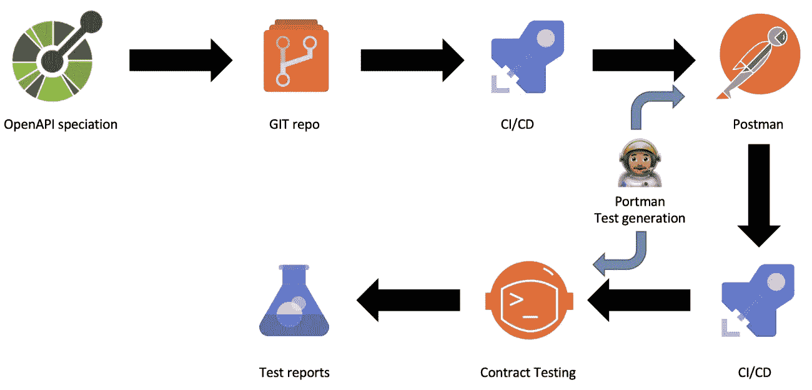

# 用 Portman、Postman 和 Newman 实现 API 测试自动化

> 原文：<https://itnext.io/automating-api-testing-with-portman-postman-and-newman-ec1a869cbc99?source=collection_archive---------2----------------------->

图片来自波特曼博客

几个月前，我换了工作和公司，这是一个受欢迎的变化，但肯定是喝了消防水管！现在事情已经稍微安定下来，我可以回到我喜欢的事情上来了。

我现在工作的团队是一个新团队，我们正在努力找出我们的流程，并尽可能多地实现自动化。为此，我承担了 API 测试的自动化。

我知道我想要遵循和上次一样的蓝图，通过 CI/CD 使用 Newman，正如我在“[用 Newman](/automating-api-testing-with-newman-1e5d0aabcec) 自动化 API 测试”中所写的那样。但是我遇到了一个有趣的工具，叫做[波特曼](https://github.com/apideck-libraries/portman)，我想试试。我上次做的真的很好，但我们必须通过邮递员维护邮递员集合，这有点痛苦。这也将允许我们更接近规范驱动的开发，其中 OpenAPI 规范将驱动一切。

使用 Portman，我们不仅可以生成供 Newman 使用的 Postman 集合，还可以包括我们所有的合同、内容和模糊测试，以及处理身份验证的预请求脚本。

# 需要配置文件

Portman 使用了一些文件，您需要配置这些文件来将所有这些结合在一起。波特曼可以被设置为与邮差团队/工作区同步您的收藏，我正在这样做。关键文件是，名字可以根据你的需要更改，我的名字是基于我在 GitHub 的[波特曼例子中找到的:](https://github.com/apideck-libraries/portman/tree/main/examples)

## 波特曼-cli-options.json

这个文件只是让您在调用 Portman 时不必在命令行中添加任何内容。您当然可以选择将所有内容传递给 Portman，但是将所有内容指定在一个位置并存储在您的 repo 中会更干净一些

## 邮递员-config.api.json

邮递员解析值的选项。为了更好地理解选项是什么，请看[这里](https://github.com/postmanlabs/openapi-to-postman/blob/develop/OPTIONS.md)。我把这个文件和例子中提供的保持一致。

## 。环境-邮递员

如果你正在同步到 Postman cloud，你将把你的 API 密匙放在这个文件中。这个文件对我来说有一个单独的 KVP POSTMAN _ API _ KEY =

## 波特曼-配置. api.json

这是我们将要配置的主文件，在这里您将定义任何全局设置，如预请求脚本、特定测试(内容、合同、模糊化等)或 Portman 的许多其他功能。

我们要做的第一件事是设置预请求脚本，该脚本将处理从登录服务获取 JWT，然后在每个后续请求中使用它。有关创建这个脚本的更多信息，请看我以前写的一篇文章，标题是“[在 Postman / Newman 中自动为集合](/getting-a-bearer-token-in-postman-newman-automatically-for-a-collection-d3001a0dc1ea)获取不记名令牌”

这将在“全局”部分定义。请注意，如果您有多行，您将需要包括“；”在《邮差》里你不会。波特曼也接受代码，这将需要在一个单一的行中看到的要点

接下来我们要定义的是测试，这是一个同时使用内容测试和契约测试的例子。这些都是非常简单的测试，但是你可以扩展很多，看看波特曼的[合同测试](https://github.com/apideck-libraries/portman/tree/main/examples/testsuite-contract-tests)和[内容测试](https://github.com/apideck-libraries/portman/tree/main/examples/testsuite-content-tests)的例子来更好地了解你能做什么。

# 运行波特曼

现在您已经配置了所有的文件，您可以运行 OpenAPI yaml/json 文件到 postman 集合的转换。

因为您设置了 CLI 选项文件，所以您可以只向 portman 命令行传递一个选项，即“CLI Options file<options file="">, Portman 会处理其余的。</options>

现在您可以[将它添加到您的 CI/CD 管道](/automating-api-testing-with-newman-1e5d0aabcec)中，以动态创建您的测试，并确保您在每次构建时都充分测试了您的 API。

# 离别的思绪

看看[波特曼的例子](https://github.com/apideck-libraries/portman/tree/main/examples)，里面有很多很好的信息！文档很不错，但并不是都在同一个地方，所以可能有点难找到，但通过示例工作将提供很多见解！

对于我的设置，我将它同步到一个邮递员团队，以便我们可以通过邮递员应用程序查看邮递员集合。如果你这样做，请记住，虽然该选项被称为同步，但它实际上只是从波特曼到邮递员的覆盖。在我最初的测试中，由于没有将我在 Postman 中对集合所做的编辑保存到 portman-config 文件中，然后运行 portman，这让我很苦恼。

有一个很好的 YouTube 视频，我是通过 [Mostafa Moradian](https://medium.com/u/cb4ccf78bf8e?source=post_page-----ec1a869cbc99--------------------------------) 的一篇文章偶然发现的，其中 Tim Haselaars(波特曼的创始人之一)讲述了他如何使用 Portman、Postman 和 K6 执行完整的 API 和负载测试，所有这些都来自 OpenAPI 规范。这真的让我大开眼界，看到了我们可以通过自动化流程实现的所有可能性。它有点长，但是如果你对自动化你的测试流程感兴趣的话，确实值得一看。

如果你喜欢这篇文章或者我以前写过的任何一篇，请鼓掌或者跟我来。感谢您的阅读！