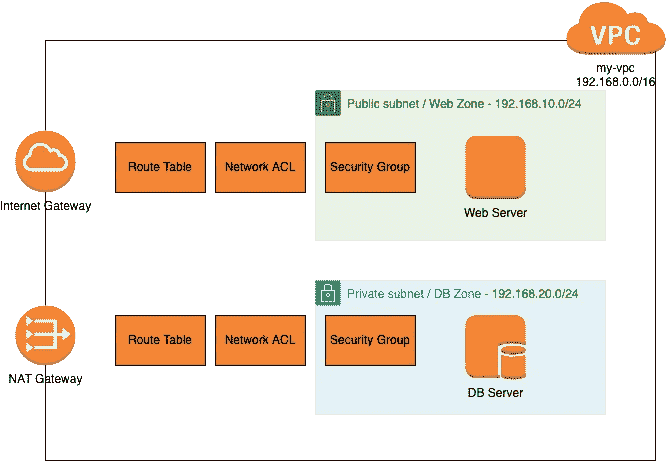

# 使用 Terraform 自动创建 AWS 资源

> 原文：<https://itnext.io/automating-aws-resource-creation-with-terraform-c942c7e304dc?source=collection_archive---------6----------------------->


在学习 AWS 的时候，我被分配到一个有时间限制的沙盒中，来玩 AWS 资源。我最初使用 AWS 控制台创建所需的资源。当这些资源的数量和它们之间的交互增加时，我开始思考我们是否可以自动创建资源。

这是一个已经解决的问题。答案是使用 Infra 作为代码工具— [Terraform](https://www.terraform.io/) 。

## 目标 AWS VPC 环境

我将创建一个 AWS VPC 环境，用于在不同的子网中运行 Web 服务器和 DB 服务器，如下图所示。



## 工具设置

在装有 brew 的 Mac 上安装 terraform 和 aws 命令行工具，

```
brew install terraform
brew install awscli
```

## 地形文件结构

Terraform 将基于多个*的描述性内容运行。tf 文件。运行时，Terraform 将读取所有的`*tf`文件，并按正确的顺序组装它们。

我们从两个文件开始，`main.tf` 和`variables.tf.``main.tf`如下所示:

```
terraform {
  required_providers {
    aws = {
      source  = "hashicorp/aws"
      version = "3.65"
    }
  }
}provider "aws" {
  access_key = var.access_key
  secret_key = var.secret_key
  region     = var.region
}
```

Terraform 的功能是由插件带来的。Terraform 的最新版本允许您在 tf 文件中指定您的提供者。这里我们定义了所需的 AWS 提供者及其版本，然后用凭证设置 AWS 提供者。`var`表示将从变量中读取值，变量在`variables.tf`文件中定义，内容如下。

```
variable "access_key" {
  description = "AWS Access key"
  default     = "A...."
}variable "secret_key" {
  description = "AWS Secret Key"
  default     = "j...."
}variable "region" {
  description = "AWS region for hosting our your network"
  default     = "us-east-1"
}variable "aws_ami" {
  description = "Amazone linux"
  default     = "ami-04ad2567c9e3d7893" //x86_64
}variable "ssh_key_name" {
  description = "ssh key"
  default     = "mykey"
}
```

我们现在可以运行`terraform init`，它将相应地下载定义的提供者，

```
terraform initInitializing the backend...Initializing provider plugins...
- Reusing previous version of hashicorp/aws from the dependency lock file
- Using previously-installed hashicorp/aws v3.65.0Terraform has been successfully initialized!
....
```

基于不同的功能，我们将 AWS 资源分成不同的 tf 文件。资源定义的格式很简单。

```
resource type_of_resource "resource name" {
  attribute = "attribue value"
  ...
}
```

## VPC: vpc.tf

在 vpc.tf 文件中，我们首先开始创建 vpc，将 CIDR 设置为“192.168.0.0/16”

```
resource "aws_vpc" "my-vpc" {
  cidr_block = "192.168.0.0/16"
  instance_tenancy = "default"
  enable_dns_hostnames = true tags = {
    Name = "my-vpc"
  }
}
```

然后分别为 web 区域(192.168.20.0/16)和 DB 区域(192.168.20.0/24)创建两个子网，

```
resource "aws_subnet" "web-subnet" {
  cidr_block = "192.168.10.0/24"
  vpc_id = "${aws_vpc.my-vpc.id}"
  #availability_zone = "us-east-1a"
  map_public_ip_on_launch = true tags = {
    Name = "192.168.10.0"
  }
}resource "aws_subnet" "db-subnet" {
  cidr_block = "192.168.20.0/24"
  vpc_id = "${aws_vpc.my-vpc.id}"
  #availability_zone = "us-east-1a"
  map_public_ip_on_launch = false tags = {
    Name = "192.168.20.0"
  }
}
```

注意 vpc_id，它的值被定义为`“${aws_vpc.my-vpc.id}”`,这是为了使用名称为“my_vpc”的 aws_vpc 资源，正如我们刚刚在上面定义的那样，获取`id`字段，将其分配给 vpc_id。我们不需要复制 VPC id 值或硬编码它的 id 值。

对于 web-subnet 中的实例，我们将通过将字段`map_public_ip_on_launch`设置为 true 来分配一个公共 IP。而对于 DB 子网，不分配公共 IP。

分别创建互联网网关和 NAT 网关，

```
# Defining the VPC Internet Gateway
resource "aws_internet_gateway" "my-internet-gw" {
  vpc_id = "${aws_vpc.my-vpc.id}" tags = {
    Name = "my-internet-gw"
  }
}# Defining the Elastic IP Address for NAT
resource "aws_eip" "nat" {
  vpc = true
}# Defining the VPC NAT Gateway
resource "aws_nat_gateway" "my-nat-gw" {
  allocation_id = "${aws_eip.nat.id}"
  subnet_id     = "${aws_subnet.web-subnet.id}"
  depends_on = [aws_internet_gateway.my-internet-gw]
  tags = {
    Name = "my nat gateway"
  }
}
```

NAT 网关将使用 web 子网，以便它可以通过 internet 网关与 internet 对话。

现在我们创建路由表。

```
# Defining the route table for web subnet
resource "aws_route_table" "webzone-rt" {
  vpc_id = "${aws_vpc.my-vpc.id}" route {
    cidr_block = "0.0.0.0/0"
    gateway_id = "${aws_internet_gateway.my-internet-gw.id}"
  } tags = {
    Name = "webzone route"
  }
}# Associating the web subnet
resource "aws_route_table_association" "web-rt-association" {
  route_table_id = "${aws_route_table.webzone-rt.id}"
  subnet_id = "${aws_subnet.web-subnet.id}"
}# Defining the route table for private subnet
resource "aws_route_table" "dbzone-rt" {
  vpc_id = "${aws_vpc.my-vpc.id}" route {
    cidr_block = "0.0.0.0/0"
    gateway_id = "${aws_nat_gateway.my-nat-gw.id}"
  } tags = {
    Name = "DB zone route"
  }
}# Associating the DB subnet to the NAT exposed route table
resource "aws_route_table_association" "db-rt-association" {
  route_table_id = "${aws_route_table.dbzone-rt.id}"
  subnet_id = "${aws_subnet.db-subnet.id}"
}
```

在 web 区域中，对于通向外部(0.0.0.0/0)的流量，我们将其路由到互联网网关。在 DB 区域中，流量将通过 NAT 网关路由，以便该区域中的 EC2 实例仍然可以通过 NAT 访问互联网。

我们通过创建`aws_route_table_association`的资源来显式地将子网与其路由表相关联

现在，我们为 EC2 实例创建安全组。

```
# Security Group for web subnet
resource "aws_security_group" "web-sg" {
  name = "web-sg"
  description = "Allow HTTP/SSH Access"
  vpc_id = "${aws_vpc.my-vpc.id}" tags = {
    Name = "web sg"
  } ingress {
    from_port = 80
    to_port = 80
    protocol = "tcp"
    cidr_blocks = ["0.0.0.0/0"]
  } ingress {
    from_port = 22
    to_port = 22
    protocol = "tcp"
    cidr_blocks = ["0.0.0.0/0"]
  } egress {
    from_port       = 0
    to_port         = 0
    protocol        = "-1"
    cidr_blocks     = ["0.0.0.0/0"]
  }
}resource "aws_security_group" "db-sg" {
  name = "db-sg"
  description = "DB zone Access"
  vpc_id = "${aws_vpc.my-vpc.id}" tags = {
    Name = "db sg"
  } ingress {
    from_port = 22
    to_port = 22
    protocol = "tcp"
    cidr_blocks = [aws_subnet.web-subnet.cidr_block]
  }

  ingress {
    from_port = 3306
    to_port = 3306
    protocol = "tcp"
    cidr_blocks = [aws_subnet.web-subnet.cidr_block]
  } egress {
    from_port = 0
    to_port = 0
    protocol = "-1"
    cidr_blocks = ["0.0.0.0/0"]
  }
}
```

对于 web zone EC2 实例，除了 SSH 之外，我们还允许 HTTP 访问。在 DB 区域中，只允许来自 web 区域的 SSH/MySQL(3306)。允许任何传出流量。

VPC 设置完成。网络 ACL 是随着 VPC 的创建而创建的默认 ACL。

我们已经准备好创建我们的 EC2 实例。但在此之前，让我们创建 SSK 密钥对。

## SSH 密钥对:ssh-key.tf

```
resource "aws_key_pair" "mykey" {
  key_name   = "mykey"
  public_key = file(pathexpand("~/.ssh/id_rsa.pub"))
}
```

我们调用 Terraform 函数文件来读取我的本地公共 SSH 密钥的内容，在 AWS 中创建资源并将其命名为`mykey`。

## EC2 实例:ec2.tf

```
resource "aws_instance" "web-server" {
  ami = "${var.aws_ami}"
  subnet_id = "${aws_subnet.web-subnet.id}"
  instance_type = "t2.micro"
  key_name = "${var.ssh_key_name}"
  #user_data = "${file("httpd.sh")}"
  vpc_security_group_ids = ["${aws_security_group.web-sg.id}"]

  tags = {
    Name = "web-server"
  }
}resource "aws_instance" "db-server" {
  ami = "${var.aws_ami}"
  subnet_id = "${aws_subnet.db-subnet.id}"
  instance_type = "t2.micro"
  associate_public_ip_address = false

  key_name = "${var.ssh_key_name}"
  vpc_security_group_ids = ["${aws_security_group.db-sg.id}"]

  tags = {
    Name = "db-server"
  }
}
```

我们使用来自变量 aws_ami 的 AMI 创建 EC2 实例。对于数据库服务器，我们将`associate_public_ip_address`设置为 false，因此没有为它分配公共 IP。

## 创造资源

一旦所有的 tf 文件都准备好了，我们就可以创建资源了，

```
terraform plan
terraform apply -auto-approve
```

这个计划就像一次演习。应用程序将创建资源。

我们可以运行`terraform destroy`来删除所有创建的资源。