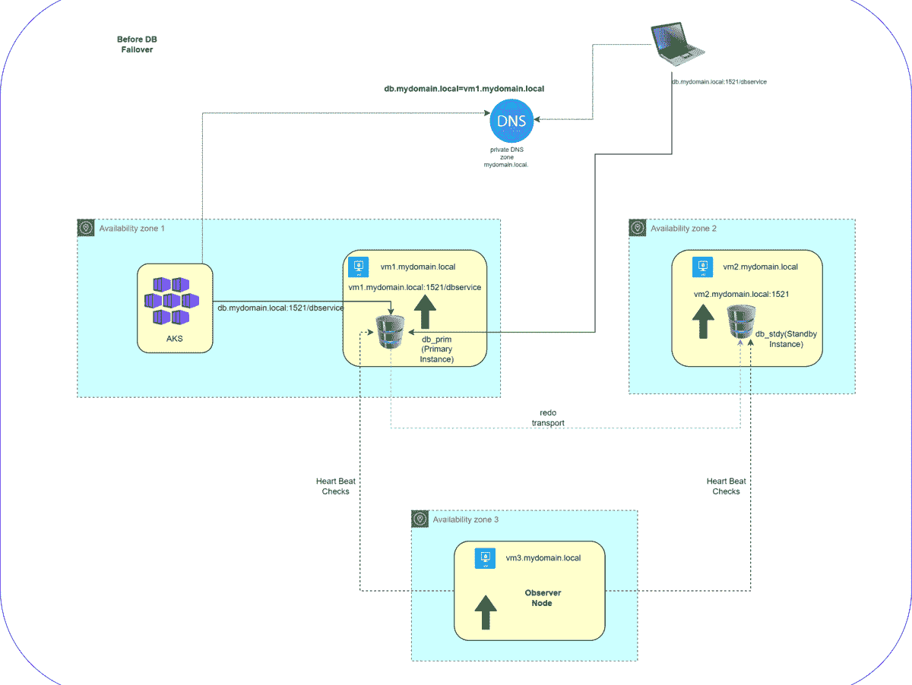
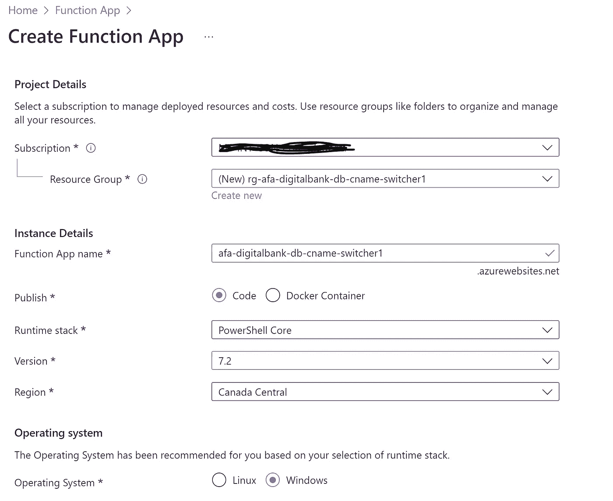
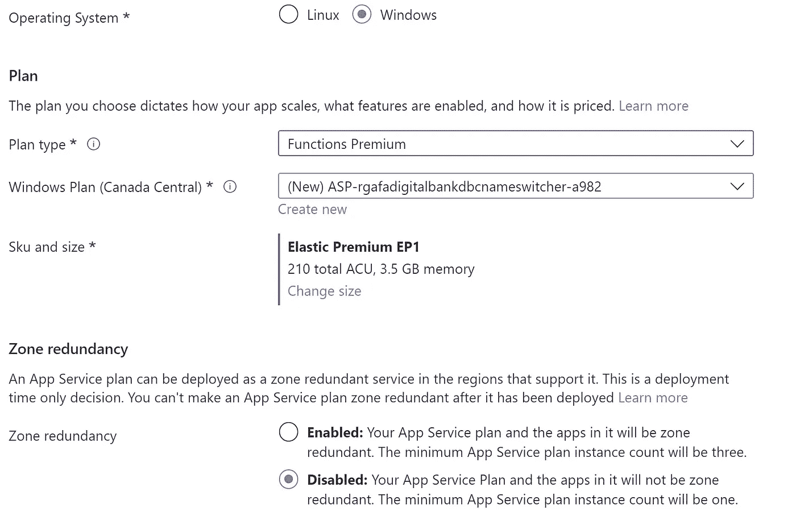
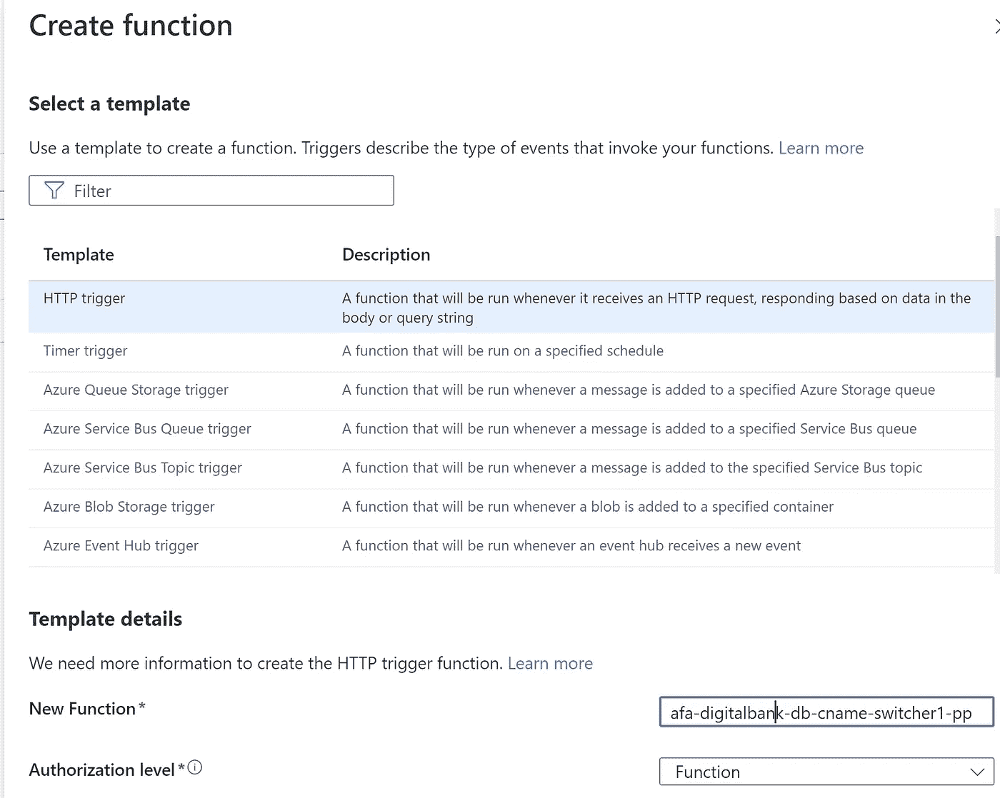
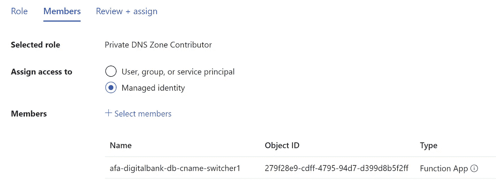
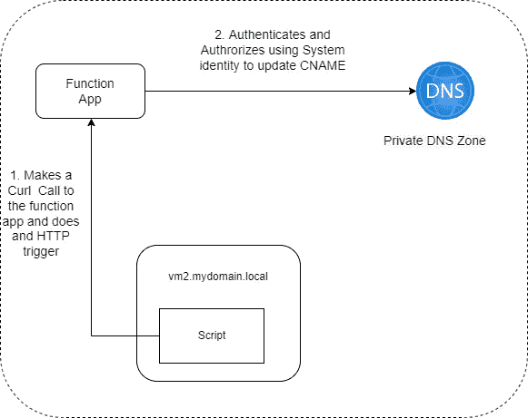
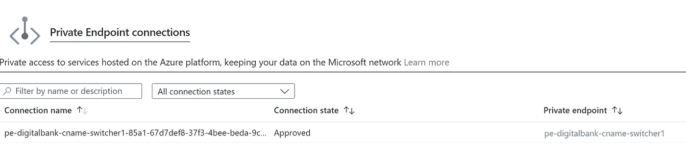
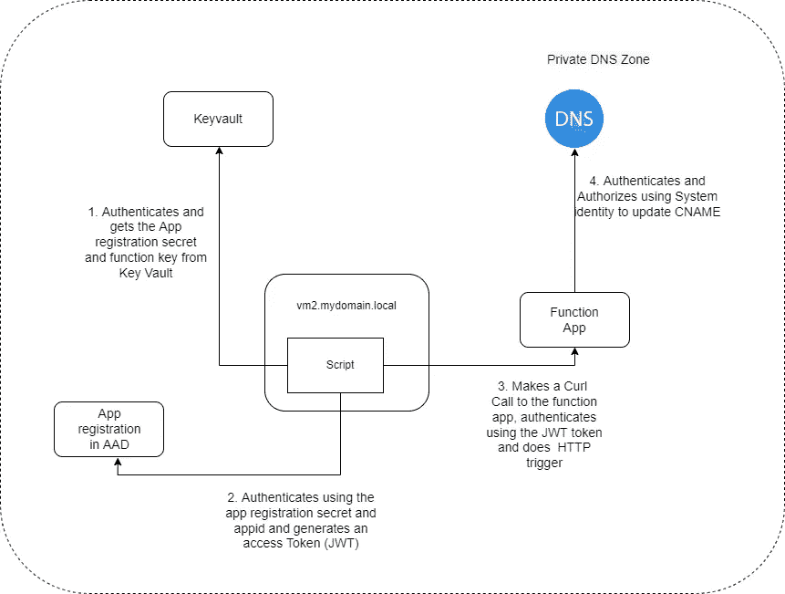

# 使用 Azure Function App 自动化 Oracle DB 客户端故障转移

> 原文：<https://itnext.io/automating-db-client-failover-using-azure-function-app-6ed375ab5666?source=collection_archive---------1----------------------->

# 简介和问题陈述

Oracle Data Guard 是确保 Oracle 数据库高可用性的方法之一。Oracle Data Guard 将备用数据库作为主数据库的副本进行维护。然后，如果主数据库由于计划内或计划外停机而变得不可用，Oracle Data Guard 可以将任何备用数据库切换到主数据库角色，从而最大限度地减少与停机相关的停机时间。

因为这个博客不是关于 Oracle Data Guard 的，如果你想了解更多，请参考[文档](https://docs.oracle.com/en/database/oracle/oracle-database/21/sbydb/introduction-to-oracle-data-guard-concepts.html#GUID-AB9DF863-2C7E-4767-81F2-56AD0FA30B49)了解更多信息。

为了更好地理解这个概念，您可以参考下面的 GIF，它描述了一个使用 Oracle Data Guard 的简单 Oracle 数据库高可用性配置。



图 1 使用 Data Guard 的 Oracle 数据库故障转移

下面是这张 GIF 的几个要点，这样更有意义:

*   可用性区域 1 有一个连接到 Oracle 数据库的 AKS 实例。
*   Oracle Data Guard 确保了 Oracle 数据库的高可用性。
*   这是一个简单的**配置**，其中 Oracle 数据库有两个实例(在单独的 Azure 虚拟机上)，一个是主数据库实例(在可用性区域 1 中)，另一个是备用数据库实例(在可用性区域 2 中)。
*   第三个虚拟机安装了 oracle 客户端软件，并承担 Oracle Data Guard 配置的 [FSFO 观察者](https://www.oracle.com/technical-resources/articles/smiley-fsfo.html)的角色。仅当配置了快速启动故障切换时，才需要观察器
*   所有数据库客户端(AKS Pods 或其他客户端)在其连接字符串中使用**db . my domain . local**[CNAME](https://docs.microsoft.com/en-us/azure/cloud-services/cloud-services-custom-domain-name-portal#cname-or-alias-record)(在私有 DNS 区域中)，并使用 **dbservice** 作为服务名。
*   **db . my domain . local**CNAME 必须始终解析到运行主实例的虚拟机 FQDN。
*   [快速启动故障转移](https://www.oracle.com/technical-resources/articles/smiley-fsfo.html)在 Oracle Data Guard 上配置，因此当主数据库由于任何原因变得不可用时(在这种情况下 vm1.mydomain.local 崩溃)，数据库故障转移到备用数据库实例，Data Guard 将备用实例转换为主实例。
*   所有旧的客户端连接都断开了。**现在必须进行客户机故障转移，以便客户机可以再次开始连接到数据库。这是这篇文章的问题陈述。**

# Oracle 客户端故障转移解决方案

Oracle 为客户端故障转移提供了许多解决方案，详情见[文档](https://docs.oracle.com/database/121/HABPT/config_fcf.htm#HABPT4969)。

*   为 JDBC 客户端配置快速连接故障转移(更新应用程序配置，需要[on](https://docs.oracle.com/en-us/iaas/pl-sql-sdk/doc/ons-package.html)
*   配置应用程序连续性(需要 Oracle 集群件，需要额外的许可)
*   为 OCI 客户机配置快速连接故障转移(Oracle 集群件或 Oracle 重启，需要额外的许可)
*   为故障切换配置 Oracle RAC 数据库(必须安装 Oracle RAC，需要额外的许可)
*   配置 Oracle Data Guard 环境(必须安装 Oracle 集群件，需要额外的许可)

这些选项需要您安装 ons、安装 Oracle RAC、Oracle Clusterware 或 Oracle restart(单个节点上的 Oracle Clusterware ),或者在应用程序端配置某些参数。 [Oracle RAC](https://www.oracle.com/ca-en/database/real-application-clusters/) 解决了大部分与高可用性相关的问题，但它会产生额外的成本，此外，您还需要维护另一个 Oracle 主目录，对于如上所述的设置，它不是一个理想的解决方案。

您不想依赖应用程序配置进行客户端故障切换，也不想向堆栈中添加额外的组件。

# 使用 CNAME 切换进行客户端故障切换

在图 1 中，您注意到客户端在数据库连接字符串中使用了 [CNAME](https://docs.microsoft.com/en-us/azure/cloud-services/cloud-services-custom-domain-name-portal#cname-or-alias-record) 。因此，一旦发生故障转移，CNAME**db . my domain . local**必须指向托管新主实例(旧备用)的虚拟机的 FQDN，即 vm2.mydomain.local，以便客户端可以再次开始连接到数据库。

在 Azure 中，我们可以使用下面的命令来做到这一点。

```
az account set --subscription "Subscription_of_PRIVATE_DNS_ZONE"
az network private-dns record-set cname set-record -g ${v_resourceGroup_pz} -z ${v_DnsZone}  -n ${v_primaryCname} -c "${v_standbyNode}.${v_DnsZone}";
```

此外,“dbservice”数据库服务必须在新的主数据库上启动。每当数据库实例以数据库角色“PRIMARY”启动时，我们可以创建一个触发器来启动“dbservice”。

```
CREATE OR REPLACE TRIGGER startDgServices after startup on database
DECLARE  
db_role VARCHAR(30);  
db_open_mode VARCHAR(30);
BEGIN  
    SELECT DATABASE_ROLE, OPEN_MODE INTO db_role, db_open_mode FROM V$DATABASE;
    IF db_role = 'PRIMARY' THEN 
      DBMS_SERVICE.START_SERVICE('DBSERVICE');
    END IF;
END;
/
```

一旦发生故障转移，当数据库实例作为“主”实例启动时，服务 DBSERVICE 将自动启动。

**这种方法是可以的，但是它有一个很大的缺点，它需要你手动更新私有 DNS 区域中的**[**【CNAME】**](https://docs.microsoft.com/en-us/azure/cloud-services/cloud-services-custom-domain-name-portal#cname-or-alias-record)**。**

只要发生数据库切换或故障转移，就可以通过自动执行 CNAME 更新来解决这个问题。

# 使用 Azure Function App 自动更新 CNAME

您将创建一个函数应用程序，它执行 PowerShell cmdlets 来更新私有 DNS 区域中的 [CNAME](https://docs.microsoft.com/en-us/azure/cloud-services/cloud-services-custom-domain-name-portal#cname-or-alias-record) 。**当 CNAME 指向与托管虚拟机不同的 FQDN 时，将使用 HTTP 触发器从运行主实例的虚拟机触发函数应用**。您可以使用一个脚本通过 curl 来执行 HTTP 触发器。这将在“创建触发器脚本”一节中详细讨论。

# 创建功能应用程序

*   为函数 app 选择合适的值



图 2 功能应用

*   选择适当的计划，您可以选择支持私有端点、虚拟网络集成、自定义域和流量管理器的“高级功能”



图 3 功能应用程序计划

*   导航到身份，对于系统分配的身份，将状态切换到打开，然后单击保存。
*   导航至“功能”并点击创建



图 4 功能创建

选择“HTTP 触发器”作为模板。为函数指定一个合适的名称，然后单击 create。

*   点击“code + Test”，用下面这段代码替换 run.ps1 的现有代码，然后点击“Save”

```
using namespace System.Net# Input bindings are passed in via param block.
param($Request, $TriggerMetadata)# Write to the Azure Functions log stream.
Write-Host "PowerShell HTTP trigger function processed a request."#Set the Variables
$subscriptionId =$env:platformSubscriptionId
$tenantId = $env:tenantId
$dbname = $env:dbnamedgbppr
$dnsrgname = $env:dnsrgname
$dnszone = $env:dnszone#Switch Subscription
Set-AzContext -Subscription $subscriptionId  -Tenant $tenantId
# Interact with query parameters or the body of the request.
$name = $Request.Query.Name
$newprimcname = $Request.Body.Newprimcnameif (-not $name) {
    $name = $Request.Body.Name
}if ($name) {
    Write-Host "Running the DNS switchover for PPR Digitalbank Database"
    $rs = Get-AzPrivateDnsRecordSet -name "$dbname-prim" -RecordType CNAME -ZoneName "$dnszone" -ResourceGroupName "$dnsrgname"
    Remove-AzPrivateDnsRecordConfig -RecordSet $rs -Cname $rs.Records.cname | Set-AzPrivateDnsRecordSet
    Get-AzPrivateDnsRecordSet -name "$dbname-prim" -RecordType CNAME -ZoneName  "$dnszone" -ResourceGroupName "$dnsrgname"| Add-AzPrivateDnsRecordConfig -Cname $newprimcname | Set-AzPrivateDnsRecordSet
    $body1 = "Hello, $name. This HTTP triggered function executed successfully. CNAME $dbname-prim now  switched \n"
}# Associate values to output bindings by calling 'Push-OutputBinding'.
Push-OutputBinding -Name Response -Value ([HttpResponseContext]@{
    StatusCode = [HttpStatusCode]::OK
    Body = $body1 
})
```

*   导航到“配置”，在“应用程序设置”下添加环境变量“platformSubscriptionId”、“tenantId”、“dbnamedgbppr”、“dnsrgname”、“dnszone”
*   导航至应用服务编辑器，并修改 requirements.psd1 以匹配以下内容

```
@{
    # For the latest supported version, go to 'https://www.powershellgallery.com/packages/Az'. 
    # To use the Az module in your function app, please uncomment the line below.
    # 'Az' = '8.*'
    'Az' = '7.*'
}
```

# 授权功能应用程序更新私有 DNS 区域

*   在 Azure 门户上导航到您的私有 DNS 区域
*   导航到 IAM
*   单击添加并添加角色分配
*   选择“专用 DNS 区域贡献者”
*   分配对托管身份的访问权限并选择成员



图 5

*   点击审核和分配

# 创建触发脚本

*   你可以用 bash 或者 Python 或者你喜欢的语言写一个触发脚本。
*   脚本将在托管 Oracle 数据库备用实例的虚拟机上以特定的时间间隔运行。
*   该脚本应获取虚拟机上运行的数据库实例的状态，如果发现该实例的 OPEN_MODE 和 database_role 分别为“读写”和“主”，则验证 CNAME 的 DNS 解析。
*   如果数据库 CNAME(上例中的 db.mydomain.local)指向托管虚拟机的 FQDN，则不需要进行任何更改，否则更新数据库 CNAME 以匹配数据库作为主数据库运行的托管虚拟机的 FQDN。这将通过为我们之前创建的函数应用程序执行 HTTP 触发器来完成。
*   在 Azure Portal 上导航到您的功能应用程序>功能>您的 _function_for_cname_switching。
*   从“获取函数 URL”中复制 URL


图 6

*   您可以使用 curl 实用程序来执行如下函数应用程序的 HTTP 触发器

```
curl -X POST <replace with the URL you copied above(including "code" part) >  \
        -H 'Content-Type: application/json' \
        -d '{"name":"dnscnameswitcher","newprimcname":"<FQDN of VM Hosting new Primary>"}'
```

*   确保更新新主虚拟机的 FQDN 值。
*   在我们目前的项目中，我使用 ansible 来模板化这个脚本，你可以随时联系我们获取代码。
*   您可以安排脚本在备用节点上定期运行。您可以根据需要决定间隔时间。



图 7 没有认证的流程

*   上图显示了没有身份验证的脚本的执行流程

**为什么我们只在备用节点上运行脚本？**

*   如果我们在主节点和备用节点上运行脚本，在裂脑的情况下，主节点与观察节点断开连接，备用节点发生故障转移，两个实例可能同时成为主节点，这可能会导致数据丢失。
*   如果发生故障转移或切换，需要在新的备用节点上重新安排脚本。这可以通过 ansible 轻松实现。这可能需要人工干预。

# 初步安全措施

# 创建私有端点

*   导航至网络，为您的功能应用添加一个[私有端点](https://faun.pub/configure-the-storage-account-access-without-public-ip-7f99c207073c)



图 8 私有端点

*   这将为您在创建私有端点时选择的子网中的功能应用程序分配一个私有 IP
*   现在，当您对该函数进行 HTTP 调用时，将使用私有 IP，并且请求不会通过互联网路由。

# 添加访问限制

*   导航到网络，点击访问限制
*   点击添加规则
*   给规则起一个合适的名字，动作为“允许”
*   源应该是您的虚拟机所属的虚拟网络和子网。
*   这将限制所有传入流量，除了来自属于允许子网的虚拟机的呼叫。

# 添加身份验证

## 添加身份验证提供程序

*   导航至功能应用程序中的“认证”
*   添加身份提供者并选择“Microsoft”
*   使用现有应用注册详细信息添加 Microsoft (AAD)身份提供者。查看[文档](https://docs.microsoft.com/en-us/azure/app-service/configure-authentication-provider-aad)了解详情。
*   添加 app 注册的 appid 和 secret，还要在密钥库中添加这个 secret。
*   还将 appid 添加到“允许的令牌受众”中。
*   将功能 App 的访问限制为“需要认证”
*   未经验证的请求将收到“403 未经授权的请求”错误。

## 调用 HTTP 触发器方式的变化

*   使用身份验证时，您可以使用 curl 实用程序为函数 App 执行 HTTP 触发器，如下所示

```
# get secret for app registration used for authentication
az login --identity > /dev/null
client_secret_sp=`az keyvault secret show --vault-name <vault_name> -n <appregistration_secret_name_in_KV> --query "value" -o tsv# get access token to be used in curl to authenticate the client in function App
ACCESS_TOKEN=$(curl -X POST -H 'Content-Type: application/x-www-form-urlencoded' \
https://login.microsoftonline.com/f1821f56-8d20-4902-bf65-bc7502e367e7/oauth2/token \
-d 'client_id=<AppID_of_appregistration>' \
-d 'grant_type=client_credentials' \
-d 'client_secret='$client_secret_sp \
-d 'resource=<AppID_of_appregistration>' | jq -r .access_token)#making the HTTP trigger request
 curl -X POST <replace with the URL you copied above(including "code" part) >  \
   -H 'Content-Type: application/json' \
   -d '{"name":"dnscnameswitcher","newprimcname":"<FQDN of VM Hosting new Primary>"}'\
   -H "Authorization: Bearer ${ACCESS_TOKEN}"
```

*   您可以从保存应用程序注册密码的密钥库中获取该密码，确保存在允许托管数据库实例的虚拟机的系统身份从密钥库中“获取”密码的访问策略。
*   下图显示了带身份验证的脚本的执行流程



图 9 认证流程

*   目前，这允许您的 Azure AD 租户中的任何客户端应用程序请求访问令牌并向功能应用程序进行身份验证。如果您还想实施*授权*以仅允许某些客户端应用程序，您必须执行一些[附加配置](https://docs.microsoft.com/en-us/azure/app-service/configure-authentication-provider-aad#daemon-client-application-service-to-service-calls)。

## 使用密钥库

*   将功能键存储在密钥库中
*   在密钥库中存储应用程序注册密码
*   不要在脚本中存储任何秘密信息，并在脚本中检索所有信息。

# 结论

这种解决方案在数据库故障转移或切换的情况下工作良好。欢迎提出任何改进建议。

感谢 Emmanuel Eyoma 帮助我解决了一些功能应用程序的问题。

请阅读我的其他文章，并分享您的反馈。如果你喜欢分享的内容，请点赞、评论并订阅新文章。