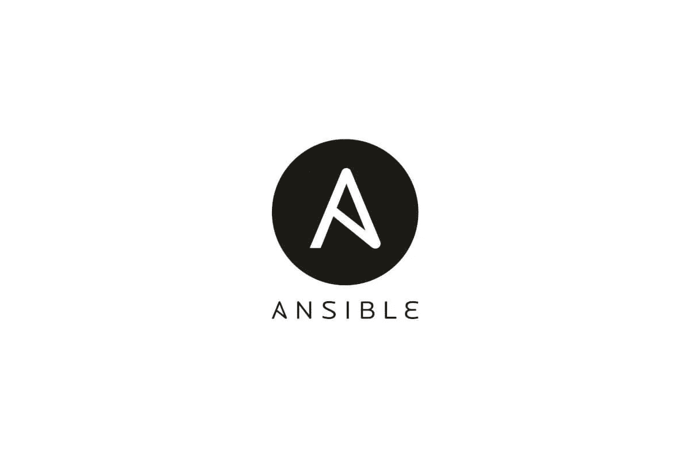

# 使用 Ansible 自动化 Laravel 部署

> 原文：<https://itnext.io/automating-laravel-deployment-using-ansible-e494723fc2c9?source=collection_archive---------2----------------------->



如果你和我一样，几个月来，甚至几年来一直手动地对你的网站进行修改，你应该知道这是一个重复的任务。通常，您从版本控制系统(VCS)中提取变更，运行一些任务来安装生产依赖项和/或编译它们，缓存您的配置，并重新加载某种服务。例如，如果您需要运行数据库迁移，通常是相同的几个步骤加上几个可选步骤。

# 什么是 Ansible？

你知道，如果有些事情是重复的，你可以自动化它。这就是 Ansible 的用武之地。最初，Ansible 是一个帮助服务器编排和在无限数量的服务器上可靠地重复任务的工具。Ansible 最好的部分是你不需要在你的远程机器上安装任何东西。唯一的要求是您需要能够通过 SSH 连接到您的远程机器。如果你能做到这一点，你可以使用 Ansible。

您可以将 Ansible 比作一个通过 SSH 在远程机器上运行命令的大型 bash 脚本。这两者之间的主要区别是 Ansible 使一切变得更加简单，并且具有用于抽象许多任务的内置模块。从 GitHub 提取更改，只指定一个存储库和一个目标文件夹就是这些模块之一。它使写作任务变得更快更容易。

# Ansible 为什么有用？

我提到过 Ansible 最初用于服务器编排。由于 Ansible 本质上是一个易于管理的 bash 文件，所以您可以让它做任何您想做的事情。这包括使用它来部署您的网站，无论是 1 台还是 1000 台服务器。只要可以在所有这些服务器上使用 SSH，就可以在所有这些服务器上进行部署。

由于我的大多数网站都是使用 Laravel 构建的，我将提供一个简单的配置来将您的 Laravel 网站部署到您的服务器，迁移您的数据库，缓存您的配置，并清除您的视图缓存。这是非常基本的，但它是一个起点。这不是一个教程，因为坦率地说，我刚刚开始使用 Ansible。

# 基本配置

然后您需要创建 secrets.yml 文件，您可以使用 ansible vault:

```
ansible-vault create secrets.yml
```

然后用这些信息填充它:

```
github_user: your_username 
github_token: your_github_access_token
```

要编辑该文件，可以使用以下命令

```
ansible-vault edit secrets.yml
```

这仍然是我正在学习的东西，所以这就是为什么这不是一个完整的教程。但是通过把它放在那里，我已经学到了很多关于使用 Ansible 的新东西。

肯定会有更多关于 Ansible 的内容，因为我已经爱上了它的易用性和内置的模块数量。等我对它的工作原理有了更深入的了解，我会为它写一个教程。

发布时间:2020 年 6 月 7 日

*最初发表于*[*【https://roelofjanelsinga.com】*](https://roelofjanelsinga.com/articles/automating-laravel-deployment-using-ansible)*。*