# 在 Oracle 云基础设施中自动审查安全列表规则

> 原文：<https://itnext.io/automating-security-list-rule-reviews-in-oracle-cloud-infrastructure-317a31b7f76e?source=collection_archive---------1----------------------->

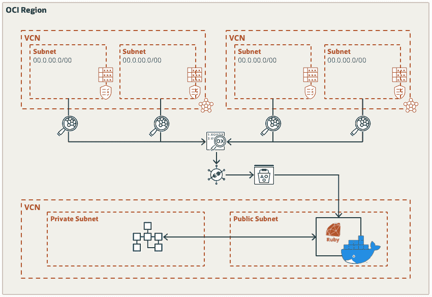

如果您在 Oracle 云基础设施(OCI)中运行工作负载，那么您可能会熟悉虚拟云网络(VCN)资源，如子网、路由表、网关等。这些软件定义的组件允许您在 OCI 构建网络，以便部署和运行您的工作负载。

甲骨文有[文档](https://docs.oracle.com/en-us/iaas/Content/Network/Concepts/waystosecure.htm)解释 VCN 访问和安全特性，包括[安全规则](https://docs.oracle.com/en-us/iaas/Content/Network/Concepts/securityrules.htm)、[安全区域](https://docs.oracle.com/iaas/security-zone/using/security-zones.htm)、本地和[网络防火墙](https://docs.oracle.com/en/solutions/oci-network-firewall/index.html)以及 [IAM 策略](https://docs.public.oneportal.content.oci.oraclecloud.com/en-us/iaas/Content/Identity/Concepts/commonpolicies.htm)等。安全规则由[安全列表](https://docs.oracle.com/en-us/iaas/Content/Network/Concepts/securitylists.htm#Security_Lists)和[网络安全组](https://docs.oracle.com/en-us/iaas/Content/Network/Concepts/networksecuritygroups.htm#Network_Security_Groups) (NSG 的)组成，是您创建的每个 VCN 和子网的基本元素。它们定义了允许哪些流量进出您的子网，以及哪些主机可以相互通信。创建子网时，会自动创建一个包含一些默认规则的安全列表:

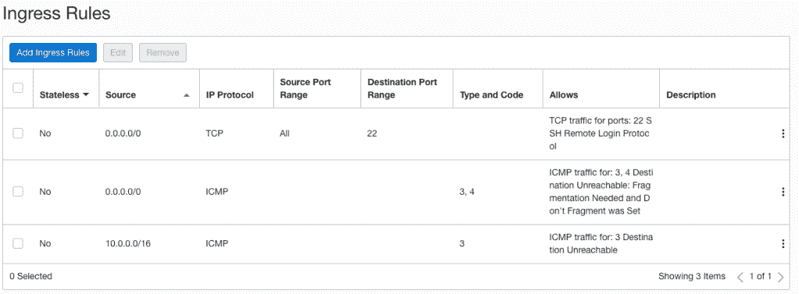

*默认安全列表入口规则*

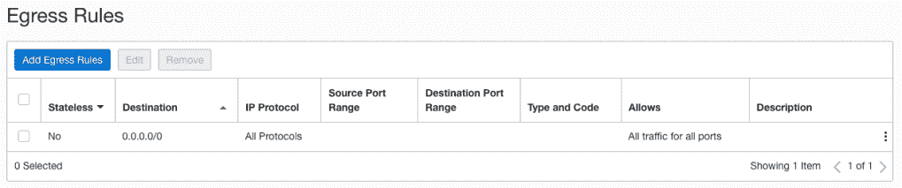

*默认安全列表出口规则*

在实施网络访问控制时，您可以使用安全列表、网络安全组或两者兼有。它们是在数据包级别控制流量的虚拟防火墙功能。我将在以后的帖子中介绍网络安全组的审查，因为我想重点介绍安全列表，特别是如何轻松审查和验证规则，以确保它们符合您的工作负载、组织、安全和合规性要求。

# 为什么要执行规则审查？

因为这是很好的安全操作。通过定期检查规则，可以发现并纠正错误配置和错误，从而降低发生安全事故的可能性。许多信息安全和合规性标准，如支付卡行业数据安全标准(PCI DSS)或国家标准与技术研究所(NIST)特别出版物 800–41，要求或建议组织至少每季度或每半年审查一次防火墙规则。为了履行合规义务，您可能还需要记录并向审计员提供证据，证明定期执行了规则审查并采取了所有必要的措施。

# 简化审查过程

如果您计划进行评审，通常需要首先充分了解以下几件事情:

*   网络架构是什么样的，是否有最新的文档、图表和需求。
*   什么是批准的流量，例如云到本地、云内或进出互联网。
*   需要什么流量协议(TCP / UDP / ICMP)和端口。
*   是否存在由于服务被移动、重新设计或退役而不再需要的任何流。

有时，并不总是能够获得所有需要的信息。最近，我发现自己处于这种情况，我开始思考如何通过查看 OCI 现有的工作负载流量来审查安全列表规则。

OCI 网络服务允许您启用 [VCN 流量日志](https://docs.oracle.com/en-us/iaas/Content/Network/Concepts/vcn_flow_logs.htm)，它记录了与位于您子网内的[VNIC](https://docs.oracle.com/en-us/iaas/Content/Network/Tasks/managingVNICs.htm)建立的每个流量或连接。使用 VCN 流量遥测和安全列表规则定义，我构建了一个在 OCI 运行的工具，它可以:

*   由于端口范围和 IP 范围重叠，识别安全列表中的冗余规则:


重叠安全性列表规则的示例

*   识别不在 VCN 流量日志中观察到的网络流量路径中的安全列表规则和子网:

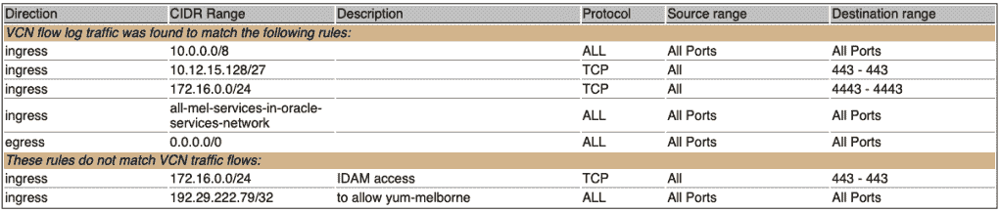

安全性列表规则评估示例

*   了解允许在 VCN 流量日志中观察流量所需的最低规则是什么:

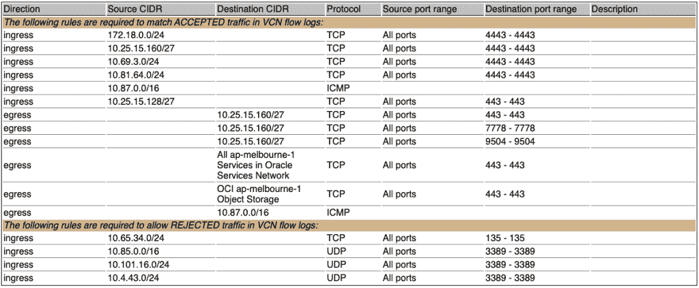

最低安全性列表规则示例

使用上面的示例信息，我可以轻松识别:

*   可能过于宽松的规则，例如允许 10.0.0.0/8 中所有协议和端口的入口规则，它还与 10.12.15.128/27 中更严格的入口规则 TCP 端口 443 重叠。
*   潜在的规则方向错误，例如入口规则允许来自 Oracle 服务网络(OSN)的所有协议和端口，因为我知道我的工作负载连接仅出站到 OSN。
*   哪些规则可能不再需要，例如来自 172.16.0.0/24 的用于 IDAM 访问的入口规则，因为没有流日志匹配该规则。
*   不应该被允许的潜在访问，例如来自 10.25.15.128/27 的 HTTPS 流量，因为我知道这个源网络是要退役的。
*   可能应该允许但当前被拒绝的流量，例如端口 3389 上的入站 UDP RDP 流量。

您能够做出的断言将与我的不同，因为它们是特定于工作负载、网络和环境的。在我的案例中，我需要从报告中获取信息，并与相关团队交谈，以理解为什么规则存在以及为什么需要流程。

从这里开始，我使用工具和团队洞察力作为输入来通知需要删除、添加或修改什么规则。因为此工具依赖于 VCN 流量日志遥测，所以最小规则是根据实际观察到的流量作为有状态规则计算的，其范围为:

*   同一个 VCN 中另一个子网的 CIDR 块，或者
*   一个/24 或/16 CIDR 地址块，它与同一个 VCN 中的任何其它 CIDR 子网都不匹配。

将 CIDR 的范围限定到最大值/24 或/16 是一个有意识的决定，因为我不想让规则将 CIDR 的范围限定到/8 或/0，对一个人来说，解释所需的较小的 CIDR 范围并在合适的情况下扩展到/8 更有意义。因此，在进行任何更改之前，确认工作负载所需的确切源和目标 CIDR、协议和端口范围非常重要。例如，我可能会确定我的本地网络 10.0.0.0/8 应该能够访问我在 TCP 端口 4443 上的工作负载，并因此替换 10.60.3.0/24 和 10.80.64.0/24 的规则。

# 设置和配置

要自己运行此工具，您首先需要为您希望评估相关安全列表规则的所有 OCI 区域和子网启用 VCN 流日志。我建议为所有 VCN 子网启用 VCN 流日志。

对于每个子网，启用流日志。启用第一个子网 VCN 流日志时，创建一个新的日志组。启用后续 VCN 流日志时，选择现有日志组:

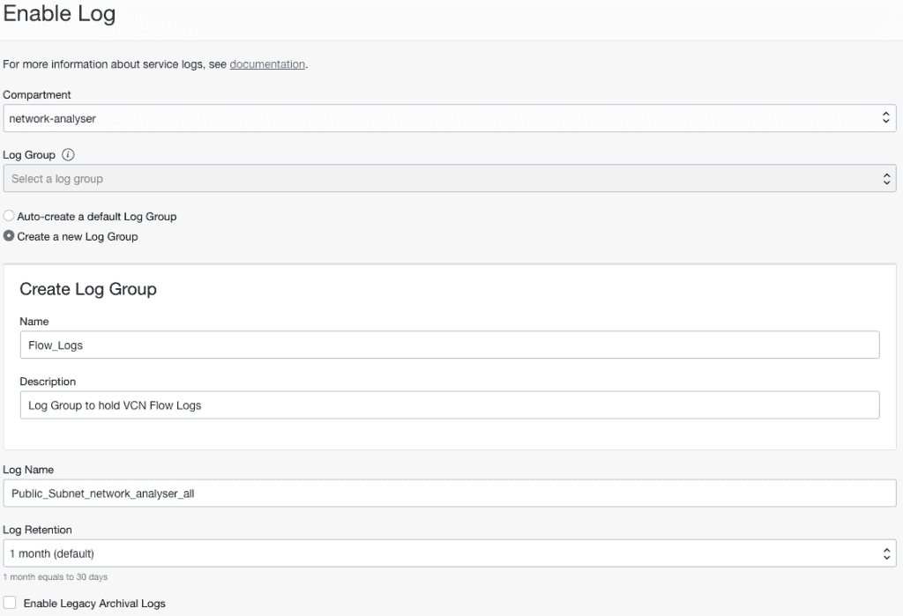

*启用 VCN 流量日志*

现在，我们需要在启用了 VCN 流日志的每个区域创建对象存储桶。确保所有存储桶具有相同的名称:

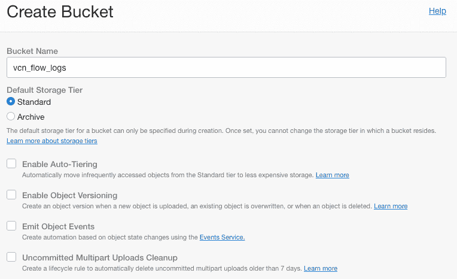

*创建 VCN 流量日志对象存储桶*

现在，我们需要在每个 OCI 地区创建服务连接器，以将我们的日志从记录推到对象存储。选择您在源连接中启用的每个 VCN 流日志。选择您之前创建的对象存储桶作为目标。确保在创建服务连接器之前还单击了“创建默认策略”。

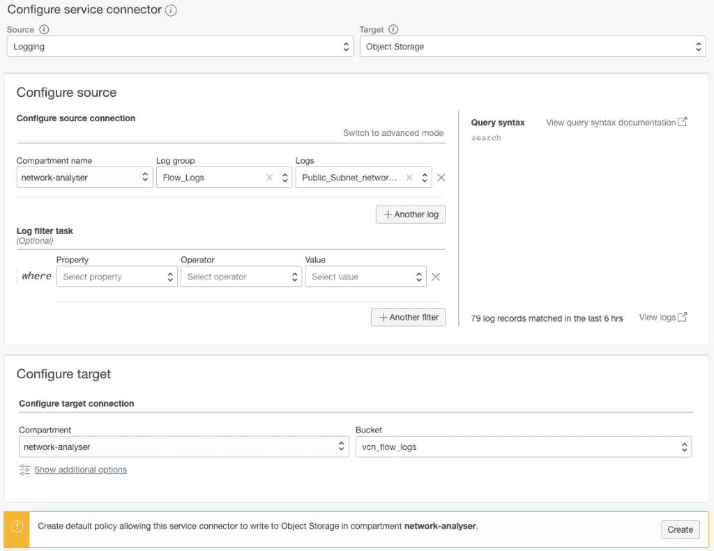

*创建服务连接器*

这就是设置完成。几分钟后，您应该会在对象存储桶中看到日志:

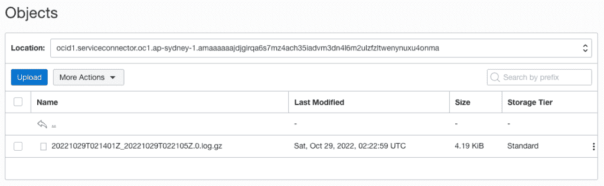

*对象存储桶中的流量日志*

继续之前，请务必留出足够的时间来观察和记录所有流量。如前所述，该工具依赖于 VCN 流量日志，如果没有观察到流量，它可能会将所需的规则标记为未使用，或者忽略最小所需流量的规则。在我的情况下，我等待了一周(7 天)以确保所有典型的交通流量都被捕获。7 天后，我的对象存储桶中大约有 1，300 个文件，总容量为 3GB。

# 运行工具

要运行该工具，您需要创建一个 MySQL 数据库系统，并在 OCI 计算实例来运行 [Docker 容器](https://hub.docker.com/r/scottfletcher/network-advisor)。适当地调整数据库系统和计算实例的规模对于确保该工具能够在合理的时间范围内导入和处理所有数据非常重要。

首先，使用向导创建一个具有互联网连接的虚拟云网络:

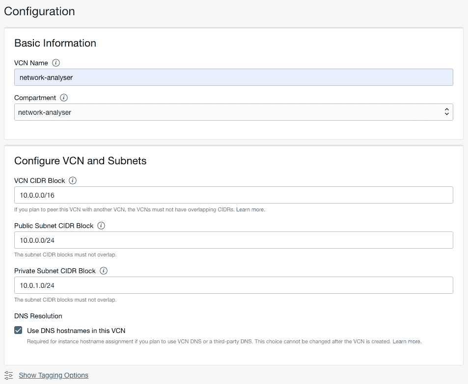

*虚拟云网向导*

现在，在私有子网的安全列表中添加一个入口规则。这将允许我们的计算实例与我们将在专用子网中创建的数据库系统进行对话:

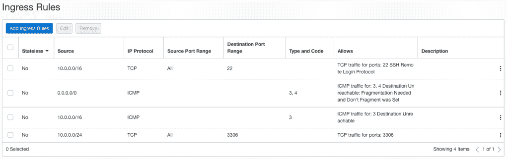

*私有子网安全列表入口规则*

对于 DB 系统，我在私有子网中创建了一个独立的实例。我最初选择的形状是 MySQL。虚拟机标准版 E4.8.128GB，带 200GB 存储。运行该工具后，我验证了我已经导入了近 8000 万条记录:

```
mysql> select count(*) from flowlogs;
+----------+
| count(*) |
+----------+
| 79291781 |
+----------+
1 row in set (2.61 sec)
```

数据库系统使用了所分配的 128GB 内存的 80%以上:

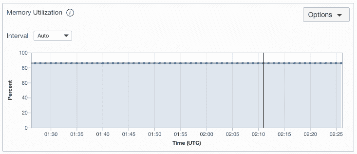

*MySQL DB 系统内存利用率*

查看我的磁盘利用率，我可以看到我大约使用了 200GB 的 50%,所以我知道下次运行该工具时我可能会分配更少的磁盘存储:

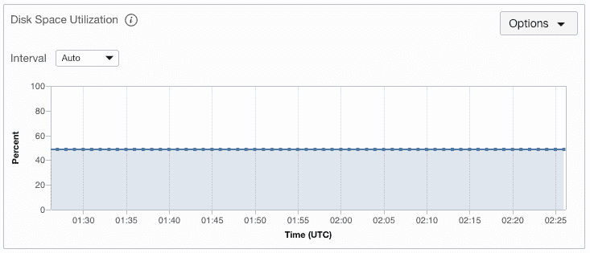

*MySQL DB 系统磁盘空间利用率*

根据对象存储桶中的文件数量，以及您希望脚本运行的速度，您可能希望选择更合适的形状。如果您不确定，您可以选择一个更大的形状，并在工具运行后查看度量。

继续在私有子网中创建一个 MySQL DB 系统。记下您输入的用户名和密码，因为您稍后会用到。我还禁用了备份，因为不需要备份。

现在，在公共子网中创建一个计算实例。我选了一个 Ubuntu 22.04 镜像，AMD。带有 4 个 OCPU 和 32GB 内存的 E4 Flex 外形。

更新您的 SSH 配置文件，并为该主机添加一个条目。我们添加了一个 LocalForward，这样我们就可以查看该工具生成的报告，而不必将端口暴露给互联网，也不必从 docker 容器中复制文件:

```
Host network-analyzer
    Hostname <Public IP Address>
    User ubuntu
    ServerAliveInterval 60
    IdentityFile ~/.ssh/oci_ssh.key
    LocalForward 8000 127.0.0.1:8000
```

连接到实例并安装 Docker:

```
$ ssh network-analyzer$ sudo apt-get install -y ca-certificates curl gnupg lsb-release$ sudo mkdir -p /etc/apt/keyrings$ curl -fsSL [https://download.docker.com/linux/ubuntu/gpg](https://download.docker.com/linux/ubuntu/gpg) | sudo gpg --dearmor -o /etc/apt/keyrings/docker.gpg$ echo   "deb [arch=$(dpkg --print-architecture) signed-by=/etc/apt/keyrings/docker.gpg] [https://download.docker.com/linux/ubuntu](https://download.docker.com/linux/ubuntu) \
$(lsb_release -cs) stable" | sudo tee /etc/apt/sources.list.d/docker.list > /dev/null$ sudo apt-get update$ sudo apt-get install -y docker-ce docker-ce-cli containerd.io docker-compose-plugin$ newgrp docker$ sudo usermod -aG docker $USER
```

现在我们需要将我们的 OCI API 键和配置复制到实例中，因为我们将映射。oci 文件夹添加到 Docker 容器，这样它就可以调用 OCI 来检索存储在对象存储中的 VCN、子网、安全列表和流日志。为此，您可能希望创建一个唯一的只读用户。

```
$ scp -r ~/.oci network-analyzer:.
```

现在我们可以运行 [Docker 容器](https://hub.docker.com/r/scottfletcher/network-advisor)。在本例中，我只为 ap-melbourne-1 地区运行该工具。如果您想在多个地区运行它，那么您可以用逗号分隔的列表输入它们，例如“ap-melbourne-1，ap-sydney-1”。

```
docker run -it --name network-analyser \
--mount type=bind,source=/home/ubuntu/.oci/,target=/root/.oci/,readonly \
-e OCI_REGIONS=ap-melbourne-1 \
-e DB_USERNAME=<username of the db system> \
-e DB_PASSWORD=<password of the db system> \
-e DB_HOST=<IP address of the DB System> \
-e DB_PORT=3306 \
-e OCI_CLI_PROFILE=<OCI profile name> \
-e FLOW_LOG_BUCKET_NAME=<The bucket holding your VCN flow logs> \
-p 8000:8000 \
scottfletcher/network-advisor
```

Docker 将提取最新的容器，连接到数据库系统，创建数据库模式，从对象存储中下载流日志文件，然后开始导入和分析数据:

```
Unable to find image 'scottfletcher/network-advisor:latest' locally
latest: Pulling from scottfletcher/network-advisor
eaead16dc43b: Pull complete 
753dfbed0c96: Pull complete 
7af94765911a: Pull complete 
7654989bc5b3: Pull complete 
3ef60200484e: Pull complete 
c10782f37fdf: Pull complete 
a2f0acfe530e: Pull complete 
e921fc787b87: Pull complete 
447c769910e8: Pull complete 
439c929a1f70: Pull complete 
ae5f4991b66e: Pull complete 
413dda94b7b9: Pull complete 
da662d9d7c74: Pull complete 
dccb605069ec: Pull complete 
ca50647e8508: Pull complete 
Digest: sha256:2298a5aa3c423b1243891919f7f23543ceee94d01bcc6e33210f3fea32f3d873
Status: Downloaded newer image for scottfletcher/network-advisor:latest
Downloading VCN Flow logs
Downloaded item  [####################################]  100%
Importing VCN Flow logs
[#
```

从 1，300 个文件和 16 个子网导入和分析 80M 流量日志大约需要 3 个小时。进度和阶段将显示在屏幕上。该过程完成后，您将看到:

```
******************************
* Report Generation Complete *
* View Report [http://ip:8000](http://ip:8000) *
******************************
[2022-10-29 00:43:26] INFO  WEBrick 1.7.0
[2022-10-29 00:43:26] INFO  ruby 2.7.0 (2019-12-25) [x86_64-linux-gnu]
[2022-10-29 00:43:26] INFO  WEBrick::HTTPServer#start: pid=10 port=8000
```

从您的本地机器上，您将能够连接到 [https://localhost:8000](https://localhost:8000) 并查看生成的报告:

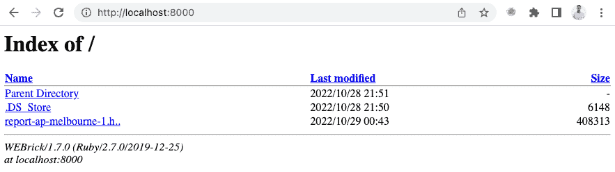

*包含 HTML 报告的目录*

单击报告将在屏幕上显示它:

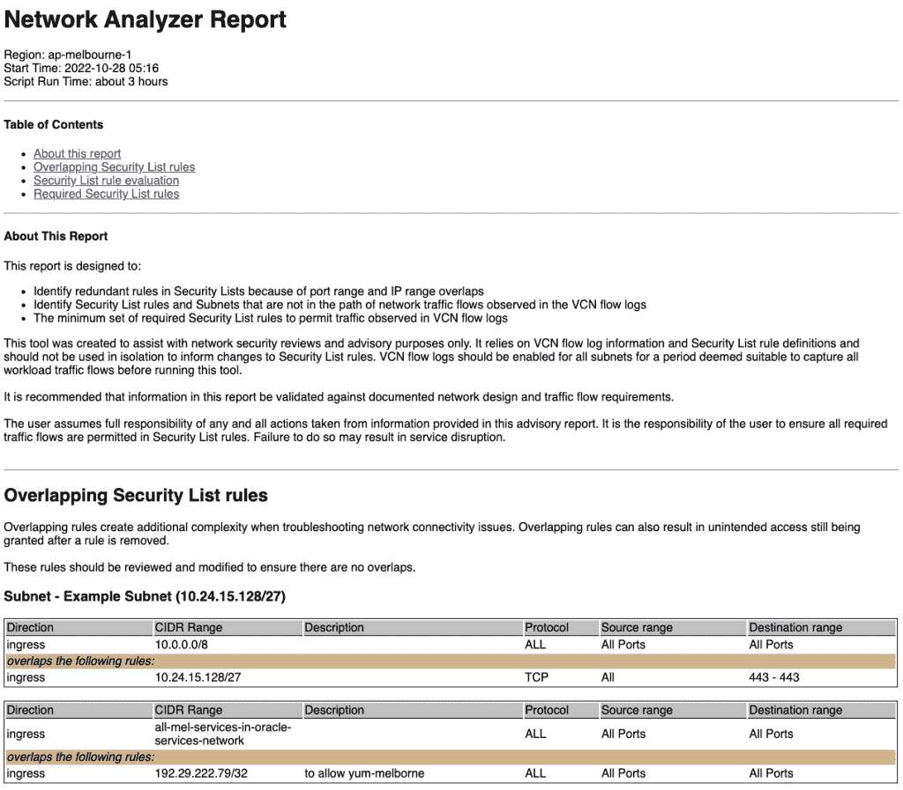

*AP-Melbourne-1 的示例报告*

然后，您可以检查结果并进行安全性列表规则复查。

如果您需要验证报告中的任何发现，您可以在 [OCI 日志](https://docs.oracle.com/en-us/iaas/Content/Logging/Concepts/loggingoverview.htm)中搜索流量日志，或者使用 mysql 客户端直接查询 DB 系统。

要重新运行该工具，只需启动另一个 Docker 容器。确保在生成所需的报告时保存它们，因为这些报告在容器中是短暂的，并且容器在启动时也会删除并重新创建 DB 系统模式。

安全列表规则审查不需要繁琐、耗时或重复。您可以使用此工具来帮助识别规则蔓延、错误，并验证满足您的工作负载、组织、安全性和法规遵从性要求所需的最小规则集。

如果你有任何问题或意见，请随时通过 LinkedIn[https://www.linkedin.com/in/scotti-fletcher/](https://www.linkedin.com/in/scotti-fletcher/)与我联系


*原载于 2022 年 10 月 29 日*[*http://red thunder . blog*](https://redthunder.blog/2022/10/29/automating-security-list-rule-reviews-in-oracle-cloud-infrastructure/)*。*