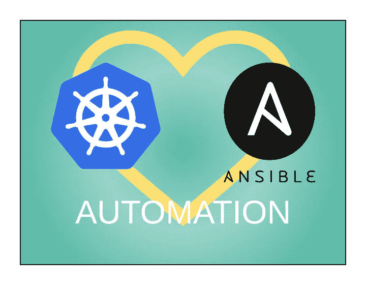

# 使用 Ansible 自动更新 Kubernetes 集群的系统

> 原文：<https://itnext.io/automating-system-updates-for-kubernetes-clusters-using-ansible-94a70f4e1972?source=collection_archive---------1----------------------->



**Kubespray** 是部署自我管理的 Kubernetes 集群的首选工具。Kubespray 建立在 ansi ble 之上，它简化了 Kubernetes 集群的部署、更新和扩展。如果你正在部署自己的裸机 Kubernetes 集群，或者如果你想通过不使用云服务来节省资金，比如 GKE、谷歌云、EKS、AWS 或 Azure，我强烈推荐你使用 Kubespray。

Kubespray 提供了很多管理 Kubernetes 的工具，但是它没有提供任何管理底层基础设施的工具。在这篇文章中，我将展示如何使用 Ansible 来自动化 Kubernetes 集群的零停机系统更新。在 Kubernetes 集群上完成系统更新的过程是:

1.  **封锁**该节点，这样就不会在该节点上安排新的单元
2.  **清空**节点，以便将所有现有工作负载转移到其他节点
3.  更新并重新启动节点
4.  最后**解除节点的锁定**,这样就可以在节点上安排新的 pod

这种方法还可以用于在任何类型的集群上自动执行其他维护任务，而不会导致服务器停机。

我将从 Ansible 剧本开始。定义行动手册有两个重要部分。首先是`serial`设置。通常 Ansible 在清单中的所有节点上并行执行任务，但是一次更新和重新启动所有节点会使所有节点一次脱机，中断服务并导致 Kubernetes 集群进入潜在的不可恢复的不良状态。为了避免这个问题，设置`serial: 1`将导致 Ansible 剧本一次在一个节点上运行。第二个设定是`any_errors_fatal` **。**根据您的集群的规模或其重要程度，如果出现错误，您可能(也可能不会)想要暂停 Ansible Playbook 的操作。

这是我的`playbook.yml`文件:

```
---
- hosts:
    - kube-master
    - kube-node
  become: true
  become_method: sudo
  **serial: 1**
  **any_errors_fatal: "{{ any_errors_fatal | default(true) }}"**

  roles:
    - k8s-rolling-update
```

在设置了`serial: 1`之后，Ansible Playbook 将在一个循环中运行 `k8s-rolling-update`角色，一次一个节点。现在我们来看看角色。

首先，我们要检查每个节点，确保 Kubernets 报告该节点处于**就绪**状态，并且**未被许可**。我们将使用 Ansible 的[命令模块](https://docs.ansible.com/ansible/latest/modules/command_module.html)来运行`kubectl get node`并解析 JSON 输出。我们将通过命令模块而不是 [k8s_info 模块](https://docs.ansible.com/ansible/latest/modules/k8s_info_module.html)运行 kubectl，因为 k8s_info 模块需要在每个节点上安装 OpenShift Python 客户端。Kubespray 不使用 OpenShift Python 客户端，并且通常不可用。

下面是`tasks/main.yml`。该任务仅在`kube-master`库存组的第一个节点上运行`kubectl get node`，并将输出保存到`kubectl_get_node`变量中。我们希望这个命令只在一个节点上运行，所以我们使用了`delegate_to`选项。然后它解析 JSON 输出，如果节点**就绪**且**未被批准**，该任务将运行 3 个其他任务。来自`kubectl get node`的 JSON 输出很复杂，所以`[json_query](https://docs.ansible.com/ansible/latest/user_guide/playbooks_filters.html#json-query-filter)`过滤器用于解析 JSON。json_query 过滤器使用[JMS path](https://jmespath.org)并且可以接受 JMS path 查询。

`drain.yml`将完成封锁和清空(以上列表中的步骤 1 & 2)，`ubuntu.yml`将完成更新和重启(以上列表中的步骤 3)，`uncordon.yml`将解除节点封锁(以上列表中的步骤 4)。我用变量`ansible_distribution`引用`ubuntu.yml`，这样这个角色的未来更新可以包括不同 Linux 发行版的更新任务，而不需要更新`tasks/main.yml`。

```
---
- name: Get the node's details
  command: >-
    {{ bin_dir }}/kubectl get node
    {{ kube_override_hostname|default(inventory_hostname) }}
    -o json
  register: kubectl_get_node
  delegate_to: "{{ groups['kube-master'][0] }}"
  failed_when: false
  changed_when: false

- name: Update Node
  when:
    *# When status.conditions[x].type == Ready then check stats.conditions[x].status for True|False* - kubectl_get_node['stdout'] | from_json | json_query("status.conditions[?type == 'Ready'].status")
    *# If spec.unschedulable is defined then the node is cordoned* - not (kubectl_get_node['stdout'] | from_json).spec.unschedulable is defined
  block:
    - name: Cordon & drain node
      include_tasks: **drain.yml**

    - name: Upgrade the Operating System
      include_tasks: **"{{ ansible_distribution }}.yml"**

    - name: Uncordon node
      include_tasks: **uncordon.yml**
```

现在开始`tasks/drain.yml`中的排水和警戒线任务。第一项任务是从第一个`kube-master`节点运行`kubectl cordon`命令，将工作节点与集群的其他节点隔离开来。接下来，我们将再次运行`kubectl get node`来验证节点已经被封锁。此任务将重试 10 次，中间等待 10 秒钟，直到节点被封锁。最后，最后一个任务将在工作节点上运行`kubectl drain`来驱逐任何正在运行的 pod，这样就可以安全地升级节点上的 Docker 或重启节点，这将在下一步中进行。

```
---
- name: Cordon node
  command: >-
    {{ bin_dir }}/**kubectl cordon**
    {{ kube_override_hostname|default(inventory_hostname) }}
  delegate_to: "{{ groups['kube-master'][0] }}"

- name: Wait for node to cordon
  command: >-
    {{ bin_dir }}/**kubectl get node**
    {{ kube_override_hostname|default(inventory_hostname) }}
    -o json
  register: wait_for_cordon
  **retries: 10**
  **delay: 10**
  delegate_to: "{{ groups['kube-master'][0] }}"
  changed_when: false
  until: (wait_for_cordon['stdout'] | from_json).spec.unschedulable

- name: Drain node
  command: >-
    {{ bin_dir }}/**kubectl drain**
    --force
    --ignore-daemonsets
    --grace-period {{ drain_grace_period }}
    --timeout {{ drain_timeout }}
    --delete-local-data {{ kube_override_hostname|default(inventory_hostname) }}
  delegate_to: "{{ groups['kube-master'][0] }}"
```

从节点上清空所有单元后，您可以在节点上运行任何任务，而不会中断任何服务。在本例中，`tasks/ubuntu.yml`将更新节点上的所有程序包，并在必要时重新启动服务器。首先， [apt 模块](https://docs.ansible.com/ansible/latest/modules/apt_module.html)更新节点上的所有包。然后，该任务通过检查`/var/run/reboot-required`是否存在来查看更新后是否需要重启。如果/var/run/reboot-required 存在，则使用[重启模块](https://docs.ansible.com/ansible/latest/modules/reboot_module.html)重启节点。重新启动模块将重新启动节点，等待代码重新联机，然后继续执行下一个任务。**注意:** `tasks/ubuntu.yml`对于任何任务都不使用`delegate_to`，我们希望将`kubectl`命令的运行委托给一个节点，但是我们希望在轮到节点时在节点上运行更新和重启。

```
---
- name: Update all packages
  apt:
    upgrade: dist
    update_cache: true
    force_apt_get: true

- name: Check if reboot is required
  stat:
    path: /var/run/reboot-required
  register: reboot_required

- name: Reboot the server
  reboot:
    post_reboot_delay: 30
  when: reboot_required.stat.exists
```

最后，一旦节点被更新和重新启动，我们希望取消节点的锁定，以便可以在其上安排新的 pod。`tasks/uncordon.yml`将在更新的节点上运行`kubectl uncordon`命令，然后验证该节点确实是可调度的。

```
---
- name: Uncordon node
  command: >-
    {{ bin_dir }}/kubectl uncordon
    {{ kube_override_hostname|default(inventory_hostname) }}
  delegate_to: "{{ groups['kube-master'][0] }}"

- name: Wait for node to uncordon
  command: >-
    {{ bin_dir }}/kubectl get node
    {{ kube_override_hostname|default(inventory_hostname) }}
    -o json
  register: wait_for_uncordon
  retries: 10
  delay: 10
  delegate_to: "{{ groups['kube-master'][0] }}"
  changed_when: false
  until: not (kubectl_get_node['stdout'] | from_json).spec.unschedulable is defined
```

在第一个节点上运行完`tasks/uncordon.yml`之后，`tasks/drain.yml`将在第二个节点上开始，依此类推，同样是由于剧本中的`serial: 1`设置。就是这样！您可以使用并扩展这个示例，在任何类型的集群上执行任何任务，同样的方法应该适用于 **Hadoop** 和 **Spark** 集群，甚至是 **Mysql** 和 **Postgres** 数据库副本。

可以在[https://github . com/kevincoakley/ansi ble-role-k8s-rolling-update](https://github.com/kevincoakley/ansible-role-k8s-rolling-update)查看工作角色。