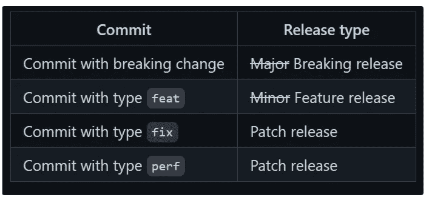
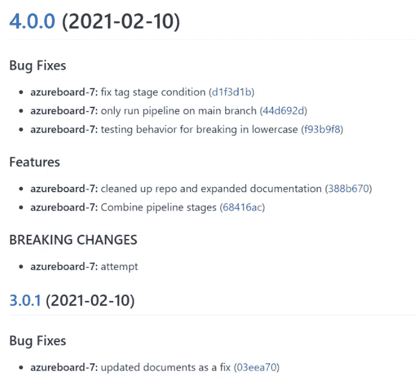

# Terraform 模块的自动化标记和版本控制(或任何语言！)

> 原文：<https://itnext.io/automating-tagging-and-versioning-of-terraform-modules-or-any-language-3a271966c63c?source=collection_archive---------1----------------------->


最近，我们的一些模块需要突破性的变化，我们没有一个好的方法来传达给用户的影响，并允许他们固定到一个特定的版本。虽然精明的 Terraform 用户可以锁定 Git SHA，但这不是理想的方法。因此，我研究了如何对 Terraform 模块进行版本控制，并确保方法的一致性…希望是自动化的。

在深入研究方法和工具之前，有必要快速回顾一下什么是语义版本化。[semver.org](http://semver.org/)将语义版本定义为:

> 给定主要版本号。小调。补丁，增加:
> 
> 主要版本当您进行不兼容的 API 更改时，
> 
> 以向后兼容的方式添加功能时的次要版本，以及
> 
> 补丁版本，当你做向后兼容的错误修正。
> 
> 预发布和构建元数据的附加标签可作为主标签的扩展。小调。补丁格式。

Terraform 已经利用了语义版本化并提供了版本约束。作为一个快速回顾，这里有一些如何使用语义版本并锁定特定或某个范围的版本的例子。

```
version = "~> 1.0.4" # Allows from 1.0.4 to 1.0.xxxx. Only the rightmost component can increment

version = "~> 1.0"   # Allows from 1.0 to 1.xxxxx. Only the rightmost component can increment. Slight variation on previous example.

version = "= 1.0.4"  # Allows only a single version 1.0.4

version = ">= 1.2.0, < 2.0.0" # Ensure to not bump to major revision 2.0.0
```

Terraform 推荐以下模块版本:

*   当依赖于第三方模块时，需要特定的版本，以确保仅在您方便时进行更新。
*   对于在您的组织内维护的模块，如果一致地使用语义版本控制，或者如果有明确定义的发布过程来避免不必要的更新，则指定版本范围可能是合适的。

Terraform 还在[https://www . terra form . io/docs/extend/best-practices/versioning . html](https://www.terraform.io/docs/extend/best-practices/versioning.html)上为模块开发人员提供了关于语义版本化的使用指南。我强烈推荐遵循这个建议，因为它将与超越您的组织的实践保持一致。

# 工具作业

我查看了开源工具和 Azure DevOps 的插件。因为我想要一个可移植的方法，不管 CI/CD 工具如何，我很早就选择了 Azure DevOps 插件。

从开源的角度，我发现了一个叫做语义发布的工具。这是一个 NodeJS 应用程序，使用基于插件的架构，非常灵活。semantic-release 有十几个插件可以与不同的源代码管理系统、模块注册表(PyPi 和 npm)集成，并且能够在版本控制和标记过程中添加/删除步骤。多个插件的使用将在这个博客中演示。

为了总结这篇文章，我分享了一个集成了语义发布的[样本库](https://github.com/patpicos/terraform_module_versioning)。该回购包括:

*   单个虚拟模块(.根目录下的 tf 文件)。这些文件是空的，但是有助于展示模块组件分解成不同的。tf 文件。
*   单元测试框架(测试/和示例/)
*   语义发布配置(。releaserc)
*   azure devo PS(azure-pipelines . YAML)管道，执行静态代码分析、自动化测试和版本控制/标记(本博客的主题)。静态代码分析部分受到了 Adin Ermie 关于这个主题的博客的启发。
*   提交前配置，在每次提交时自动执行代码林挺，并生成文档。参考这篇[博客文章](/terraform-enforcing-doc-generation-and-code-formatting-e7dc6098b3a0)了解更多细节。

本次回购的目的不是展示任何重要的 Terraform 代码；重点是结构和支持 Terraform 模块开发周期。

# 提交约定

首先，语义发布基于遵循特定约定的提交消息的使用。提交分析器插件将解析自上一个模块版本/标签以来的提交，并将确定要生成的版本(主要版本、次要版本、补丁)。**最高影响**提交消息将驱动凸起。

提交分析器插件可以解析多种约定。在本文中，我主要关注默认的角度[约定](https://github.com/angular/angular.js/blob/master/DEVELOPERS.md#-git-commit-guidelines.)。

提交消息格式:

```
<type>(<scope>): <subject>
<BLANK LINE>
<body>
<BLANK LINE>
<footer>
```

类型必须是以下类型之一:

*   专长:新功能
*   **修复**:一个 bug 修复
*   **文档**:仅文档变更
*   **样式**:不影响代码含义的更改(空白、格式、缺少分号等)
*   **重构**:既不修复 bug 也不增加特性的代码变更
*   **perf** :提高性能的代码更改
*   **测试**:添加缺失或修正现有测试
*   **杂务**:对构建过程或者辅助工具和库的变更，比如文档生成

从上面的列表中，semantic-release(提交分析器插件)解析以下提交类型。也可以使用其他类型来驱动版本增量。这将在后面的语义发布配置中解释。主要/突破性发布需要一点澄清。要触发一个主要版本，提交主体需要有单词**中断**或**中断变更**(不区分大小写)。如果在主题中，我重复一遍，需要在提交的主体中，这些关键字将不会触发一个主要的发布。



# 提交示例

让我们来看看我在示例存储库中所做的一些提交。您可以看到标记是由管道自动添加的(使用 gerry()commits)。

提交 f93b9f8 需要一些解释。虽然提交类型是 fix()，这将触发补丁发布，但提交的内容包括单词“ **breaking** ”，这将触发提交分析器将更改提升到主要/重大发布。

```
commit f93b9f85dc4d2cba1b9f97eca95d3c284a468dfe (origin/master)
Author: Patrick Picard <patrick.picard@xxxxx.ca>
Date:   Wed Feb 10 12:10:12 2021 -0500

    fix(azureboard-7): testing behavior for breaking in lowercase

    breaking change attempt
```

此外，如果您查看标记的提交消息，您将看到由提交消息驱动的完整的 changelog。此更改日志数据也将包含在版本中，也将包含在 CHANGELOG.md 中

```
ddb91c7 (HEAD -> main, tag: 4.0.0, origin/main, origin/HEAD) chore(release): 4.0.0 [skip ci]
f93b9f8 (origin/master) fix(azureboard-7): testing behavior for breaking in lowercase
36e7e23 docs(azureboard-7) add known issues
388b670 (origin/final_update) feat(azureboard-7): cleaned up repo and expanded documentation
d1f3d1b fix(azureboard-7): fix tag stage condition
aa03bbd removed unused files
44d692d fix(azureboard-7): only run pipeline on main branch
220e883 Merge branch 'master' of github.com:patpicos/tagging_test
68416ac feat(azureboard-7): Combine pipeline stages
b7fada0 (tag: 3.0.1) chore(release): 3.0.1 [skip ci]
eff59f0 Merge branch 'master' of github.com:patpicos/tagging_test
```

简单回顾一下，这种使用提交消息约定的方法需要工程师的训练来创建高质量的提交消息。只有遵循约定的提交才会驱动版本控制和变更日志文档。一种方法是在合并和进行清理/措辞改进之前压缩您的提交。

纪律严明，回报丰厚！自动化的变更日志生成、明确的提交意图以及自动化的标记和版本控制。

# 将语义发布集成到 CI 管道中

为了演示 CI 管道的语义释放，我使用了 Azure DevOps。管道以两种模式运行:

*   **拉请求** —用 Checkov 运行静态代码分析，用 Terratest 运行单元测试
*   **提交到主分支** —在拉请求之后，合并到主分支、版本、标签，并发布模块版本

要在单个管道中完成这两种模式，需要使用管道级上的条件。管道代码可从以下网址获得

[https://github . com/pat picos/terra form _ module _ versioning/blob/main/azure-pipelines . YAML](https://github.com/patpicos/terraform_module_versioning/blob/main/azure-pipelines.yaml)

除了管道，还有一个用于语义发布的配置文件，[。需要 releaserc](https://github.com/patpicos/terraform_module_versioning/blob/main/.releaserc) 。我没有在这里复制完整的配置，而是包含了一个到 GitHub 的链接，并且将说明它的功能。

首先，您定义了语义发布将作用于哪些分支。在我们的例子中，只有主分支会触发版本控制。可以修改标记格式，但至少必须包括语义版本值${version}。

然后，配置一个插件列表。插件的顺序很重要。

1.  **提交分析器** —定义提交约定(角度)并指定对提交类型的任何覆盖
2.  **发布说明生成器** —生成发布说明/变更日志的内容
3.  **changelog** —将发布说明写入指定文件
4.  **git** —提交对 [CHANGELOG.md](http://changelog.md/) 文件的更改
5.  **github** —发布标签，生成发布，推送变更。

如果您正在打包 Node 或 Python 代码，您还可以包含其他插件来自动化发布。在这种情况下，除了 Git repo，我们不会在任何地方发布这个版本。

语义发布非常强大，因为它可以版本化任何语言。这种方法不依赖于 CI 工具和语言平台。

# 更改日志生成

正如前面提交日志中所演示的，更改日志是从提交消息中生成的。使用当前配置，将生成更改日志:

*   通过解析提交历史并将提交分类为错误修复/功能/重大变更，自动提交到 [CHANGELOG.md](http://changelog.md/) 。
*   将变更日志信息包含到发布本身中(在主体和资产中)。

[CHANGELOG.md](http://changelog.md/) 示例:



# 结论

我希望你喜欢这个较长的条目。我真的很喜欢寻找像语义发布项目这样的开源宝石。它解决了一个经常手工完成的过程；因此容易出错。

语义发布可以用于任何编程语言。此外，它有专门针对某些语言的插件来定制流程。