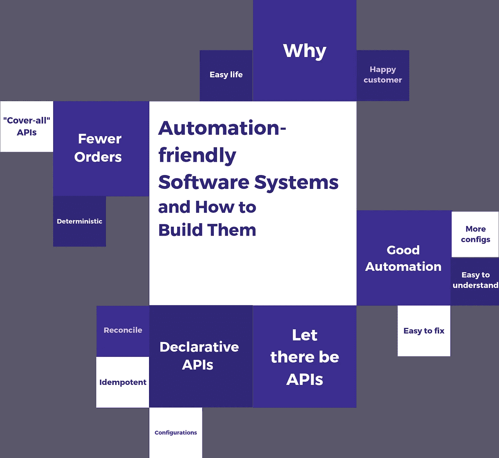
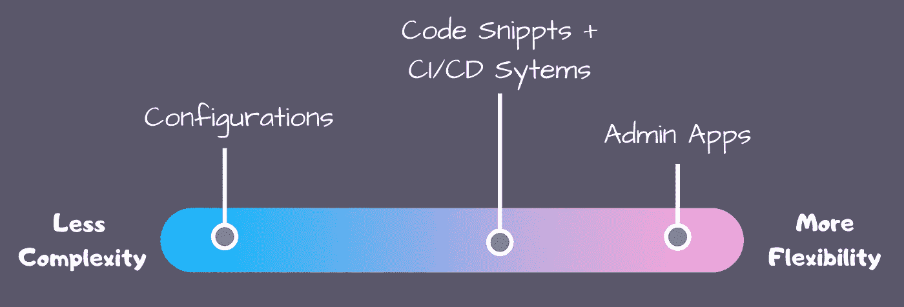
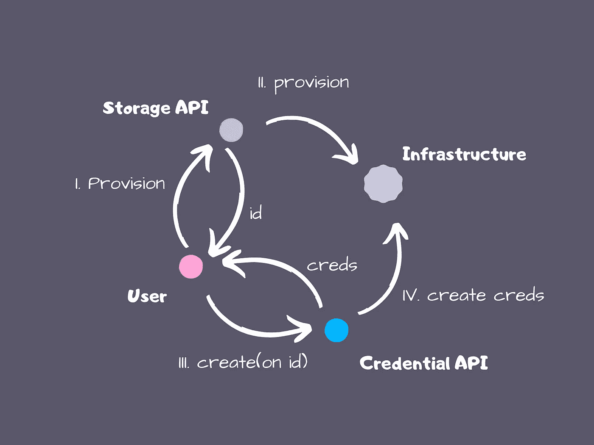
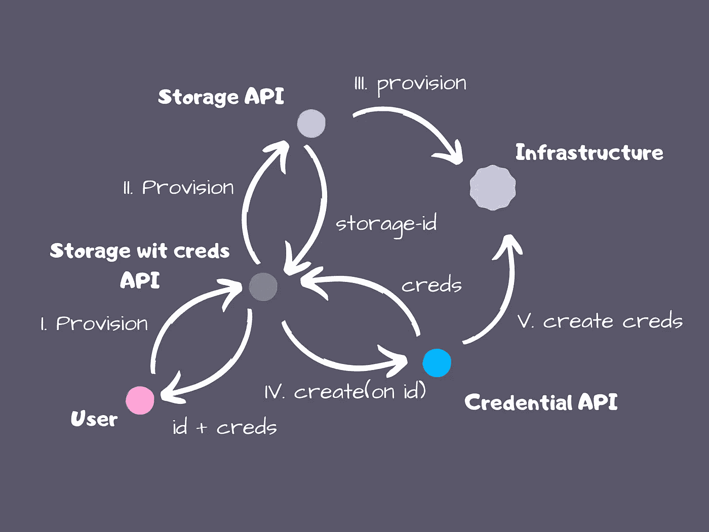
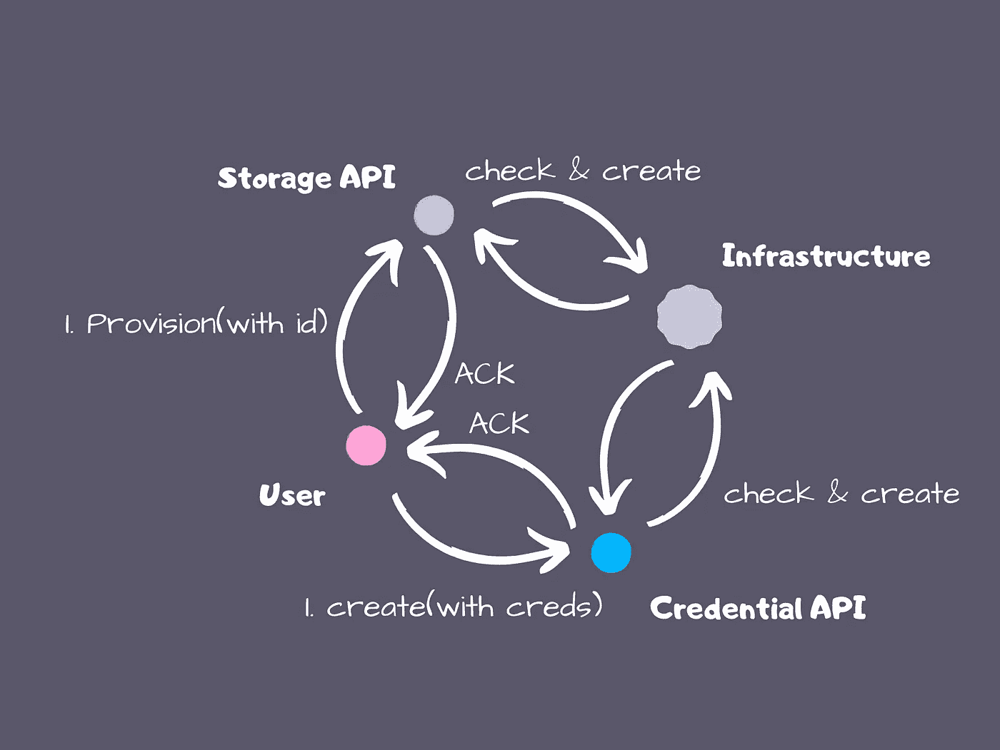

# 自动化友好的软件系统以及如何构建它们

> 原文：<https://itnext.io/automation-friendly-software-systems-and-how-to-build-them-7a7c5e3c1a15?source=collection_archive---------5----------------------->

## 向更好的自动化方向设计软件系统的技巧

# 我为什么要在乎？

一提到“自动化”，我们就会想到 DevOps。在建立了一个 app 或服务之后，我们必须管理它的生命周期。环境设置、供应、维护、升级和退役自然会发挥作用。设计您的应用程序以更好地支持该生命周期的自动化，可以让开发运维以及您的生活变得更加轻松。

然而，当谈到自动化友好时，有一个更重要的角度需要考虑:让您的客户满意。在 SaaS 或 PaaS 的环境中，您的产品将是客户自己的大型系统不可或缺的组成部分。因此，上述客户需要管理你的产品的生命周期，最好是以自动化的方式。即使你认为没有自动化你也可以脱身，但对你的客户来说，情况就不同了。

本文提供了设计软件系统的指导方针，您和您的客户可以在此基础上构建良好的自动化。

# **定义良好的自动化？**

并非所有的自动化都是平等的。最好的自动化，在其核心，必须是**容易理解**和**容易修复**。从自动化用户的角度来看，这可能是调整配置、修改标准 CI/CD 系统(例如 Travis 或 Jenkins)中的代码片段，或者使用内部管理应用程序/仪表板的简单事情。通过拥有更多的代码(朝着图灵完整性)，你以自动化变得更加复杂为代价获得了灵活性。

您的自动化应该支持配置端，因为在您度假时代替您的 sre、支持工程师或新开发人员更有可能是用户，而不是最初的开发人员本身。代码越多，学习曲线就越陡，从而增加了出错的可能性。

复杂性和灵活性之间的权衡

故障是不可避免的，会因为网络中断、凭证错误或仅仅是想法改变而中断您的自动化。在理想的情况下，您的自动化应该能够轻松地修复这些不受欢迎的挫折。当好的自动化失败时，修复应该像“重新运行直到成功”一样简单另一方面，糟糕的自动化会产生一堆临时状态，在重试之前必须手动清除这些状态。

现在我们有了一个可行的自动化度量标准，我们可以继续讨论设计的话题了。

# **让 API 存在**

任何自动化友好的系统都应该有 API——也就是以编程方式操作应用程序状态的方法。黄金法则:人类可以执行的任何动作都应该映射到 API 上。

# **具有协调功能的声明性 API**

尽管拥有 API 是自动化的最低要求，但它们并不一定会使自动化变得更容易。然而，带有协调功能的声明式 API 将您的自动化带到了一个新的高度。

简而言之，声明式 API 关注的是“什么”(期望的状态)，而不是“如何”(状态之间的变化)。使用声明式 API，用户是独裁者，他们只告诉你的系统应该处于什么状态，而命令式 API 则相反，用户通过命令式 API 充当你的系统的指挥者。虽然两者可能实现相同的结果，但它们的侧重点不同会影响用户的自动化体验。

比方说，您的系统提供备份功能。声明式 API 将允许用户指定所需的备份状态，例如，每隔 N 天就有一个备份文件。您的系统会注意到这一点，并不断确保其发生(协调)。命令式 API 将允许用户创建一个备份作业，并让它每 N 天运行一次。实际上，像 Puppet 和 Kubernetes 这样的系统是声明式设计范例的典范。

声明式 API 更可取，因为它们有助于简化自动化，并自然地转换成所需状态的配置。这减少了您需要编写的代码量，并将自动化问题转化为更直接的“配置文件管理”问题。这方面有很多有效的解决方案，比如 Git 和 GitOps。此外，声明式 API 通过将错误归入系统的协调逻辑来减轻失败，系统的协调逻辑能够更好地处理这些错误。自动化必须确保您的系统接收到所需的状态，并观察它如何转换到这些状态。最后，声明式 API 生来就是等幂的，并且可以安全地重新运行。使用命令式 API，您可能会担心重新运行某些自动化任务，比如请求新的资源和生成副本，而声明式 API 为您的系统提供了所需资源的列表。您可以继续发送相同的列表，系统将确保该列表上的所有内容都得到满足，而不是创建重复的列表。

# **订单减少**

虽然声明式 API 让您的系统为自动化做好了充分的准备，但是您还可以做更多的事情。

大多数回避声明式 API 的人表示，他们无法处理复杂的工作流，这些工作流需要按照一定的顺序执行一系列步骤。

让我们使用一个资源创建场景作为例子。假设我们有两个 API，一个用于调配存储，另一个用于创建凭据。用户必须首先调用存储 API，等待 API 与底层基础设施进行交互，然后获取 ID。然后，用户需要将该 ID 传递给凭据 API，以便为新存储创建凭据。很难用声明式 API 和配置来表达这样的操作逻辑，因为它们缺乏命令式的顺序和步骤。您可以通过让人们手动配置他们想要的步骤来“欺骗”,但这只是让您的 API 变得必不可少。这类似于发明你自己的迷你语言，让人们用它编写代码片段。由此产生的解决方案将与任何其他必要的系统具有相同的优点和缺点。

资源创建示例

命令是声明式 API 的致命弱点。作为开发人员，您可以通过消除对订单的需求来提供帮助。以下是你可以尝试的两个技巧:

**将订单移入您的系统**

这可以通过包装命令式逻辑并将一系列 API 调用合并到一个更高级别的“覆盖所有”API 中来实现。在我们的示例中，您的用户希望创建存储和该存储的凭据。通过将所有内容打包到一个“给我一个存储凭证”API 中，您的用户只需要调用它一次，并让您的系统处理返回最终结果所需的特定步骤。

使用“覆盖所有”API 删除订单

**删除步骤间的依赖关系**

当两个步骤不再相互依赖时，命令就变得没有必要了。实现这一点的一个方法是使 API 更具确定性。步骤相互依赖，因为它们缺少来自其他步骤的某些信息来继续进行。回顾我们之前的示例，凭据创建必须等待资源调配，这是因为需要存储 ID，而不是因为新存储准备就绪。如果我们有一个 seer 告诉凭证 API 未来的存储 ID，它可以立即创建一个凭证条目(ID、用户名、密码),或者在存储准备就绪后启动一个协调循环来创建它。的确，在存储准备就绪之前，用户将无法使用凭据，但这实际上与强制解决方案的结果相同。唯一的区别是，在这种情况下，用户先进行配置，获取凭据，然后等待，而在命令式解决方案中，用户在获取凭据之前先进行配置和等待。

那你去哪里找先知呢？如果您的 API 结果是确定性的，那么您不需要这样做。我们通常需要一个 seer 来判断未来的存储 ID，因为它是我们的系统在配置时生成的随机值。不需要这样，因为您可以让您的用户传入一个 ID 供您的系统使用。您不需要太担心用户生成的 id 不够唯一，因为有很多方法可以帮助实现唯一性，比如命名空间(例如，将 ID 设置为{username}/{user-gen-id})或者只是检查和拒绝重复的 ID(例如，twitter 用户名)。

使用确定性 API 和对帐删除订单

总之，确定性 API 将运行一系列命令性步骤转化为在等待所有部分在协调循环的帮助下收敛到期望状态之前发送一次声明性配置。

# **奖励:创建一个 CLI**

不管是不是声明性的，CLI(命令行界面)都是自动化的催化剂。它允许人们用几行脚本来自动化您的系统，而不是创建一个完整的编码项目——至少在开始时是这样。如今这是一种常见的做法，所有主要的 IaaS、PaaS 和 SaaS 服务(如 AWS、Azure 和 IBM Cloud)都使用这种方法。感兴趣的人可以看看 https://github.com/urfave/cli 的和 https://github.com/pallets/click 的这样的框架，让你在构建漂亮而专业的 CLI 时省去很多麻烦。

*表头图片来源:* [*像素*](https://pixabay.com/users/Pexels-2286921/)*/像素*

如果你喜欢这篇文章，[在 Medium 上关注我](https://medium.com/@nealhu)！我撰写关于分布式系统和软件架构的文章，例如:

*   [极简软件架构](/minimalist-software-architecture-426888684e60)。构建大规模多区域分布式系统的经验教训
*   [使用 Kustomize 之前](/before-you-use-kustomize-eaa9529cdd19)。流行的 Kubernetes 配置管理工具 Kustomize 的优缺点