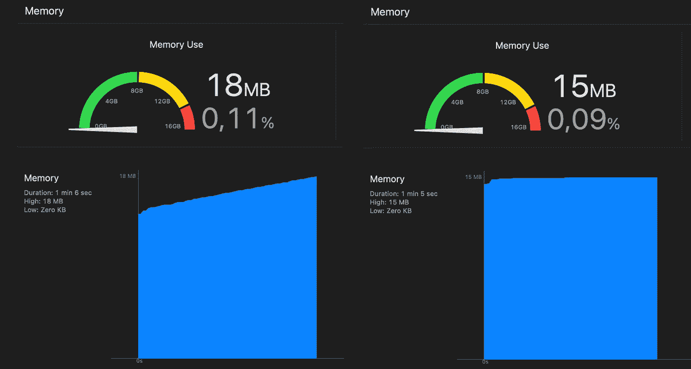
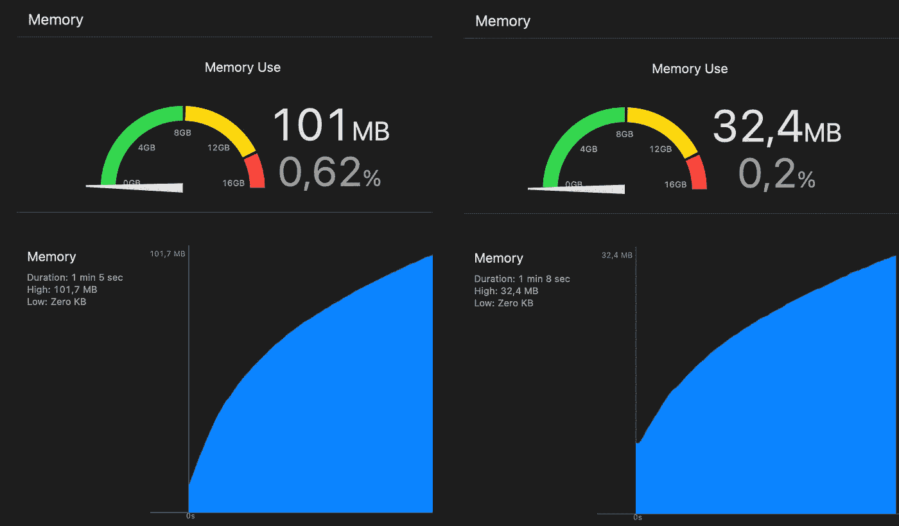

# Autoreleasepool 和 swift

> 原文：<https://itnext.io/autoreleasepool-and-swift-c58d8e9bc448?source=collection_archive---------0----------------------->

swift 中的内存管理由 ARC (=自动引用计数)处理。这意味着对对象的活动引用被计算在内，当对象不再被引用时就被释放。

在 Objective-C 中(尤其是在 Objective-C 的早期，在引入 ARC 之前)，需要手动保留和释放对象。开发人员需要管理每个对象的内存，内存管理中的错误会导致内存泄漏或崩溃。

在 Swift 中，内存管理是通过 ARC 自动完成的，在大多数情况下，开发人员不需要担心如何管理它。不过也有一些例外。例如:

*   闭包中对 self 的引用会扰乱 ARC
*   swift 中 Objective-C 对象的使用

闭包中对 self 的引用可以通过使用关键字 **weak** 和 **unowned** 来处理。我在这里写了一篇关于它的小博文:

 [## Swift 中的弱关键字和无主关键字

### 以及为什么在闭包中使用它们很重要——举个例子。

better 编程. pub](https://betterprogramming.pub/weak-and-unowned-keywords-in-swift-7bda8bdd97c4) 

在 swift 中使用 Objective-C 对象会导致这些对象无法正确发布。此问题的修复程序是 autoreleasepool。

# swift 中的 Autoreleasepool 何时使用？

有多篇文章解释了如何以及为什么应该使用 autoreleasepool，例如:

 [## Swift 中的自动释放池是什么

### 以及如何优化循环中的内存使用

better 编程. pub](https://betterprogramming.pub/what-is-autorelease-pool-in-swift-c652784f329e)  [## 使用 Swift 中的自动释放池清理内存占用

### 在本文中，我们将讨论自动释放池，它减少了循环的内存使用，特别是在 CPU 密集型的…

medium.com](https://medium.com/mediate-tech/cleaning-memory-footprint-with-the-autoreleasepool-in-swift-71ff983b22aa) 

这两个例子都将在循环中创建 UIImage 列为内存泄漏的来源，可以通过将对象初始化放在 autoreleasepool 中来解决。我不会解释 autorelasepool 到底是做什么的，但是会展示一些应该使用它的额外例子。

当我们编写完全 swift 的代码时，那么**就不需要**for auto release pool。然而，当我们使用 Objective-C 对象时，我们应该记住 autoreleasepool。

那么，我们什么时候使用 Objective-C 对象呢？Objective-C 对象是共享公共父类 NSObject 的对象。例如，这些对象是:

*   任何以 NS 开头的东西..(这些类别中的大部分如今都有 swift 的对等物)
*   UIKit 中的任何东西(比如上面例子中的 UIImage)
*   文件管理器
*   URLSessionTask
*   过程
*   和许多其他人..

仅使用 Objective-C 对象的一个实例并不能保证使用 autoreleasepool。然而，当我们在一个循环中初始化这些对象时，内存占用会增长得非常快(如上面的 UIImage 示例所示)。

# 例子

为了给出更多的例子，我将展示在一个循环中使用 URLSessionTask 和 Process 时，使用 autoreleasepool 如何改变内存占用。

## 重复执行 shell 命令

在本例中，我创建了一个助手类，允许用户从 swift 代码运行任何终端查询(swift 代码在这里作为命令行应用程序运行):

然后，我在 for 循环中使用了 shellOptional 函数。一旦没有自动释放池:

一次使用 autoreleasepool:

从下图中可以看出内存占用的差异:

内存使用的差异:不使用和使用自动释放池

如果没有自动释放池，内存使用量会稳步增长。使用 autoreleasepool 时，对象被正确释放，内存使用保持不变。

## 使用 urlSession.dataTask 重复查询

在这个例子中，我对本地主机上的数据库执行了重复查询。执行查询的函数实现如下:

和前面的例子一样，我首先在没有 autoreleasepool 的 for 循环中执行这个查询，然后使用 autoreleasepool。这里可以看出内存使用的差异:

内存使用的差异:有无自动释放池

尽管在这两个例子中，内存使用量都在增长(我不知道是什么原因造成的)，但使用的内存量有很大的不同。

在这两个例子中，我运行程序大约 1 分钟，然后停止执行。在此期间，大约运行了 7000 个查询和 1000 个终端执行。虽然正常情况下一分钟内不会执行那么多，但这很好地展示了随着时间的推移内存使用情况会发生什么。

# 附加注释

Autoreleasepool 仅适用于在 Apple 平台(例如 Mac OS 或 iOS)上运行的 swift 应用程序。在 Linux 上运行 swift 时，Objective-C 类不可用，autoreleasepool 未实施。如果使用 autorelease 的 swift 代码也能在 linux 上运行，则有必要检查代码运行的操作系统。在 Swift 中，这可以使用#if os(Linux)来完成。

# 外卖食品

*   尽管 swift 使用 ARC，但有必要记住内存管理
*   在循环中使用 Objective-C 对象(即 NSObject 子类)时，应该记住内存占用，并使用 Xcode 检查使用了多少内存