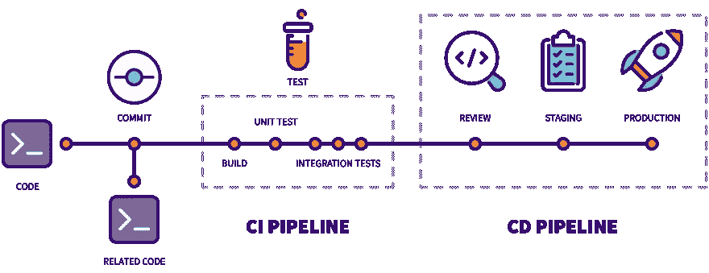

# AWS、GCP 和 Azure 中的 Autoscale Gitlab 运行程序

> 原文：<https://itnext.io/autoscale-gitlab-runners-in-aws-gcp-and-azure-b9b6f4d7e17?source=collection_archive---------1----------------------->

依我拙见，我认为 Gitlab 是托管我们代码的优秀工具。免费和付费计划都包括大量功能，如 git 回购、问题管理、CI/CD 管道代码、包注册、秘密管理等。

不过，有一个问题(根据我的经验)，就是运行 CI/CD 管道的时间限制。

幸运的是，Gitlab 为我们提供了在我们自己的基础设施中运行管道的选择，这种管道被称为 [**Gitlab runner**](https://docs.gitlab.com/runner/install/) 。这意味着在我们自己的服务器/计算机上运行 CI/CD 作业没有限制，只要它们连接到互联网。

Gitlab 跑步者可以这样跑步:

*   独立服务，带有 Linux、Windows、macOS 和 FreeBSD 客户端，
*   码头集装箱，或
*   Kubernetes 部署

在本文中，我们将重点关注使用 [**Docker machine**](https://gitlab.com/gitlab-org/ci-cd/docker-machine) 将 Gitlab runners 作为 Docker 容器运行:

如[文档页面](https://docs.gitlab.com/runner/configuration/autoscale.html)和上图所述，Gitlab 服务器(如 gitlab.com)将持续与 *Bastion 主机(*在我们自己的基础设施中准备)通信，以在新的 CI/CD 作业开始时创建新的虚拟机，然后在作业结束时销毁虚拟机。两个创建&销毁事件都将由堡垒主机中的 Docker 机器执行。

**注意**:这个节点可以是一个虚拟机，一个容器或者一个系统服务。为了简单起见，让我们在运行 CI/CD 作业虚拟机的同一个云中使用一个非常小的虚拟机。

我不会深入探究所有 Gitlab runner 选项，因为它们在[官方页面](https://docs.gitlab.com/runner/configuration/advanced-configuration.html)中有很好的记录。然而，docker machine 文档并没有超越 AWS ec2☹️，因此，我将基于 AWS 示例给出一些 Google 云和 Azure 的例子。

因此，让我们开始查看 [AWS EC2 示例](https://docs.gitlab.com/runner/configuration/runner_autoscale_aws/#getting-it-all-together)来配置 Gitlab runner Bastion 主机:

这种配置将使 Gitlab 能够同时运行多达 10 个作业，使用支持 docker-in-docker 功能的 docker 容器。

现在，让我们转到 **runners.machine** 选项。给定官方页面中记录的 AWS 示例:

我们可以看到，我们只需要按照 Docker 机器的名称( *amazonec2* 、 *google* 、 *azure* 、…)来设置它们的驱动程序，然后定义它们所需的选项(比如访问键、机器大小、网络名称等等)。

这意味着，如果我们看一看不同的 [Docker 机器驱动程序](https://gitlab.com/gitlab-org/ci-cd/docker-machine/-/tree/main/drivers)选项，我们将能够在其他云中旋转虚拟机。这正是我们要做的😊让我们使用 Google Cloud GCE 探索一个类似的配置:

或者作为 Azure 虚拟机:

如你所见，天空是无限的🚀从现在开始，Gitlab runner 应该支持每个 Docker 机器驱动程序及其各自的选项，以按需旋转新的虚拟机来运行 CI/CD 作业。

暂时就这样吧！如果您在使用这些示例时有任何问题，请[告诉我](https://www.linkedin.com/in/nicosingh)。根据我的经验，当 Bastion 主机拥有 IAM 权限在每个云上创建&销毁虚拟机时，上面发布的 GCP 和 Azure 配置都能正常工作。

 [## GitHub 赞助商上的赞助商@nicosingh

### 非常感谢你的支持😊我感谢你对做开源软件和分享知识的认可…

github.com](https://github.com/sponsors/nicosingh)