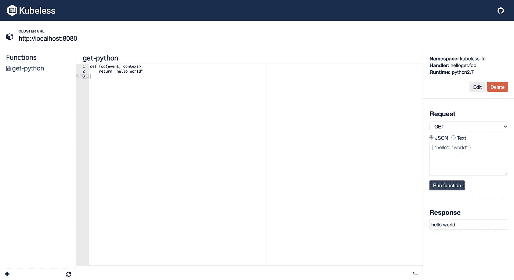
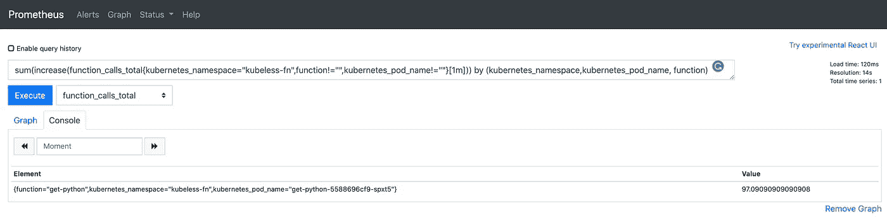
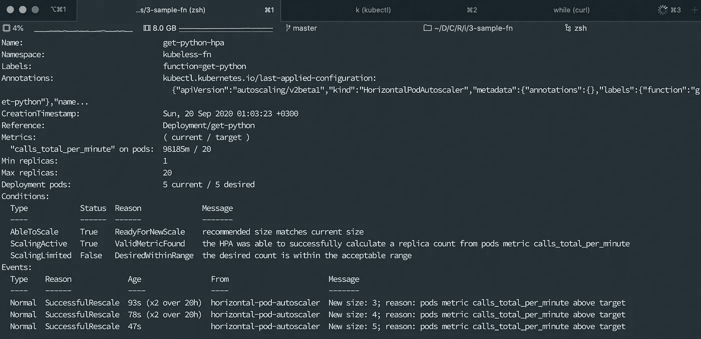
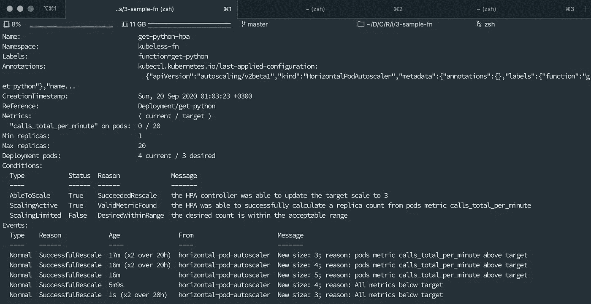

# 带 Prometheus 适配器的自动缩放无 Kubeless 功能

> 原文：<https://itnext.io/autoscale-kubeless-functions-with-prometheus-adapter-f99507a23db6?source=collection_archive---------2----------------------->

由 [Alexander Schimmeck](https://unsplash.com/@alschim?utm_source=medium&utm_medium=referral) 在 [Unsplash](https://unsplash.com?utm_source=medium&utm_medium=referral) 上拍摄

作为 web 生态系统的一部分，我们主要关心的是如何创建一个处理更多请求的应用程序，以及如何让它保持运行。我错了吗？

无论你有什么，比如整体材料、微服务或功能，你都需要找到解决问题的方法。你可以在你的基础设施中添加一台新机器(请不要说，*“ok boomer”*，我不是！)或者观看监控系统的操作，然后单击红色按钮:自动部署新实例并分流流量！或者，你可以在混乱之前创建你的规则，自动缩放，放松并享受它！

# Kubernetes 宇宙怎么样？

如果你住在 Kubernetes，它会帮助你处理与 HorizontalPodAutoscaler 的交易。你可以轻松地说*“嘿！如果我的应用程序的内存/CPU 消耗超过 X，请添加新的 Pod！”*如果您使用**metric-server**cluster add-on，您可以通过`metrics.k8s.io` API 获得这些值。

## 如果我的需求与 CPU 或内存消耗不同怎么办？

例如，我想根据每分钟传入的请求来扩展我的应用程序。这是网络最自然的愿望，不是吗？或者，这是这个故事的主要目标，我想通过总调用计数来扩展我的功能。

让我们向*自定义指标*问好。您可以创建您自己的定制适配器来收集您自己的指标，或者您可以使用[已知的解决方案](https://github.com/kubernetes/metrics/blob/master/IMPLEMENTATIONS.md#custom-metrics-api)。在这条路的尽头，您用`custom.metrics.k8s.io` API 达到了这些值。

在整个故事中，我们将使用 **Prometheus Adapter** 作为已知的解决方案来收集**kubless**功能度量并自动缩放功能。

# 我们开始吧！

在卷起袖子之前，我需要列出环境:

> Kubernetes 版本为 *1.16.13*
> 
> 普罗米修斯版本是 *2.20.1*
> 
> 无库版本是 *1.0.7*
> 
> 头盔版本为 *2.16.1*
> 
> 普罗米修斯适配器版本为 *0.7.0*

*我假设您有一个现成的 Kubernetes 集群和 Prometheus 服务器。如果没有，网上有很多有用的文章可以帮助你设置它们。*

## 在集群上安装 Kubeless，创建你的第一个函数

Kubeless 是“功能即服务”——又名 FaaS*——框架。您可以用它在 Kubernetes 上构建 FaaS 应用程序。这是 KNative 和 OpenFaaS 解决方案的强大替代方案。*

*这是故事中最短的部分。没有自定义的步骤来完成它。你可以按照说明去做，[就在这里](https://kubeless.io/docs/quick-start/)。同样，你可以用一个基本的 UI 来管理你的功能。`kubectl create -f [https://raw.githubusercontent.com/kubeless/kubeless-ui/master/k8s.yaml](https://raw.githubusercontent.com/kubeless/kubeless-ui/master/k8s.yaml)`命令可以用来安装它。*

**

*截图自 Kubeless-UI*

*"如何在 Kubeless 上创建复杂的函数？"不是故事的一部分。所以我们不关注它。您可以按照[演练](https://kubeless.io/docs/quick-start/)来创建您的第一个函数。*

## *安装 Prometheus 适配器*

*Prometheus adapter 使用自定义规则从您的 Kubernetes 集群中收集自定义指标。您可以使用舵轮图以默认值安装它。但是；*

*   **如果您的 Prometheus 服务器没有运行在默认名称空间上，或者没有使用默认端口(9090)。**
*   **如果您想仅将它用于自定义指标(它可以作为 metric-server 的替代方案)。**
*   **如果您想重新列出不同时间间隔内的指标(默认值为 1 分钟)。**
*   **为了定义你的自定义规则(Prometheus 查询来收集指标)。**

*你需要用你的变量来改变一些变量。*

> *图表库中的[有问题](https://github.com/helm/charts/issues/20557)。当您使用`*--set-file*`参数将您的定制规则文件传递给`*helm install*`命令时，它会放置管道符号(|)并破坏生成的模板。所以我们将克隆它(`*git clone https://github.com/helm/charts.git*`)并修改[这个文件](https://github.com/prometheus-community/helm-charts/blob/main/charts/prometheus-adapter/templates/custom-metrics-configmap.yaml)。你得把`*toYaml*`功能换成`*tpl*`。比如说；`*{{toYaml .Values.rules.custom | indent 4 }}*`必须是`*{{tpl .Values.rules.custom . | indent 4 }}*`。*

*Kubeless 将函数的总调用作为一个度量来公开。它被命名为`function_calls_total`，作为一个计数器工作。当你的第一个电话打来时，它就开始计数了。当然，它提供了更多的指标，但我们将把它用于自动缩放功能。*

*目的是在最后一分钟得到总呼叫数。普罗米修斯这边的对等物是:`sum(increase(function_calls_total{kubernetes_namespace="kubeless-fn",function!="",kubernetes_pod_name!=""}[1m])) by (kubernetes_namespace,kubernetes_pod_name,function)`*

**

*查询的输出*

*为了在适配器中使用查询，让我们定义我们的规则:*

*并保存为 *custom-rule.yaml* 。*

*现在，你的文件夹结构应该是这样的；*

**>图表
|_。circleci
|_。github
…
>custom-rule . YAML**

*在文件夹中运行下面的脚本并生成 yaml 文件。它将用于设置 Prometheus 适配器。*

*如你所见，我们的普罗米修斯服务器运行在 `*monitoring*` *命名空间上。**

*最后，运行它:`kubectl apply -f 1-install-prometheus-adapter.yaml`*

*几分钟后，我们检查适配器是否可以到达定制的度量 API:`kubectl logs kubeless-adapter-prometheus-adapter-[RS_RANDOM_STRING]-[POD_ID] -c prometheus-adapter`。如果一切正常，您将不会看到任何错误。*

## *创建虚拟指标*

*在我们收集指标之前，我们将多次调用该函数。您可以将您的函数公开为带有入口对象的服务，但是对于测试场景，我们将使用`port-forward`选项:`kubectl port-forward -n kubeless-fn get-python-[RS_RANDOM_STRING]-[POD_ID] 8080:8080`*

*之后你可以使用这个脚本来调用你的函数:`while true;do sleep 0.3;curl "http://localhost:8080";done`。你的函数一分钟大概会被调用 90~100 次。*

*一分钟后检查 API 结果:`kubectl get --raw "/apis/custom.metrics.k8s.io/v1beta1/namespaces/kubeless-fn/pods/*/calls_total_per_minute" > api-result.json`。输出应该是这样的；*

*`value`田说；`*get-python*` *功能每分钟被调用 91.6 次！**

*如果您有多个功能，每个功能的指标都会显示在那里。*

## *定义 HPA 对象*

*我想用这个宣言说:*如果* `*get-python*` *部署的每分钟总调用数超过 20，则向上扩展应用程序，直到副本数达到 20。**

*根据上面的输出(91.6)，副本数应该是 5 ( `Math.round(91.6 / 20)`)。用这个命令检查结果:`kubectl describe hpa -n kubeless-fn get-python-hpa`*

**

*扩大规模*

*现在，停止你的`while…`命令，等待几分钟。当您重新运行`describe`命令时，您将在 pods: 0 / 20 输出上看到***“calls _ total _ per _ minute”。此外，您将看到所需的副本数量没有改变！****

*是关于稳定窗口的。Kubernetes [文档](https://kubernetes.io/docs/tasks/run-application/horizontal-pod-autoscale/#stabilization-window)说；*

> *当用于缩放的度量保持波动时，稳定窗口用于限制副本的摆动。自动缩放算法使用稳定窗口来考虑从过去计算的期望状态，以防止缩放。*

*默认值为 300 秒/5 分钟。如果你在 5 分钟后运行`describe`命令，你会看到期望的计数下降了:*

**

*现在是时候躺下来享受了。*

*谢谢大家！*