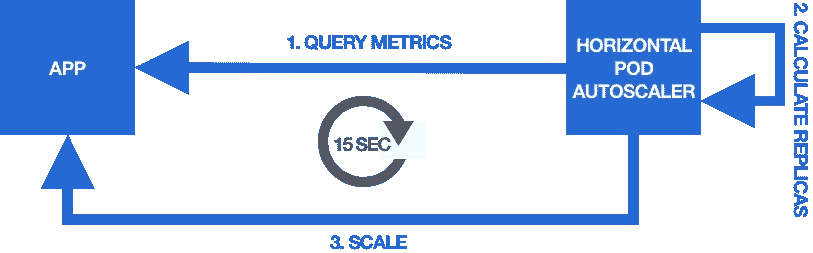
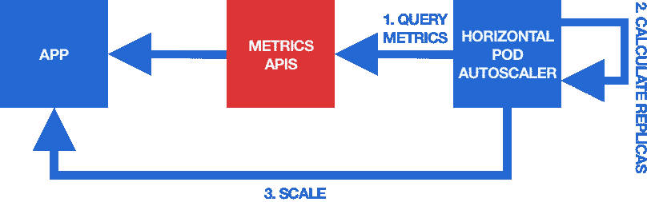
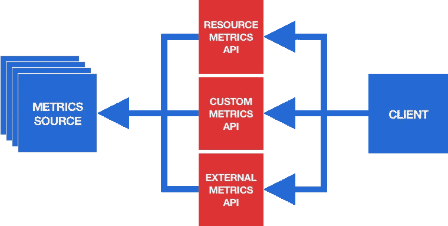
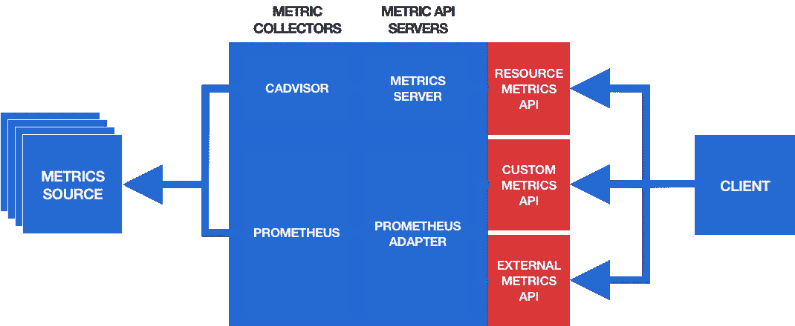

# 使用水平 Pod 自动缩放器在 Kubernetes 上自动缩放应用程序

> 原文：<https://itnext.io/autoscaling-apps-on-kubernetes-with-the-horizontal-pod-autoscaler-798750ab7847?source=collection_archive---------1----------------------->

本文高度概括了 Kubernetes 中的水平 Pod 自动缩放器(HPA)的工作原理和使用方法。

> 这篇文章的前一个版本已经发表在 [learnk8s.io](https://learnk8s.io/autoscaling-apps-kubernetes) 上。

# 内容

1.  [简介 ](#bdb0)
2.  [**Kubernetes**](#cefc)中不同类型的自动缩放
3.  [**什么是水平 Pod 自动缩放器？**](#3417)
4.  [**水平 Pod 自动缩放器是如何配置的？**](#67ab)
5.  [**应用指标是如何获得的？**](#f8ca)
6.  [**把一切放在一起**](#5927)

# 介绍

部署具有静态配置数量副本的无状态应用程序不是最佳选择。

流量模式可能会快速变化，应用程序应该能够适应它们:

*   当请求率增加时，应用程序应该扩展(即增加副本的数量)以保持响应速度。
*   当请求率下降时，应用程序应该缩小规模(即减少副本的数量)以避免浪费资源。

> 在水平缩放的上下文中，向上缩放也称为“向外缩放”，向下缩放也称为“向内缩放”。这与垂直缩放形成对比(见下文)，垂直缩放仅使用术语“放大”和“缩小”。

通过水平 Pod 自动缩放器(HPA)，Kubernetes 以上述方式为自动缩放应用程序提供了出色的支持。

# Kubernetes 中不同类型的自动缩放

首先，为了消除任何误解，让我们澄清一下 Kubernetes 中术语“自动缩放”的用法。

Kubernetes 包括几个自动缩放功能:

*   [**水平窗格自动缩放(HPA)**](https://kubernetes.io/docs/tasks/run-application/horizontal-pod-autoscale/) **:** 调整应用程序的副本窗格数量(水平缩放)
*   [**垂直窗格自动缩放器(VPA)**](https://github.com/kubernetes/autoscaler/tree/master/vertical-pod-autoscaler) **:** 调整应用程序容器的资源请求和限制(垂直缩放)
*   [**集群自动缩放**](https://github.com/kubernetes/autoscaler/tree/master/cluster-autoscaler) **:** 调整集群的节点数量

这些自动缩放器彼此完全独立，它们都使用不同的概念和机制。

*本文专门讨论水平 Pod 自动缩放器。*

# 什么是水平吊舱自动缩放器？

[Horizontal Pod auto scaler(HPA)](https://kubernetes.io/docs/tasks/run-application/horizontal-pod-autoscale/)是一个内置的 Kubernetes 功能，允许根据一个或多个默认或用户定义的指标水平扩展应用程序。

> 水平缩放意味着增加和减少副本的数量。垂直扩展意味着增加和减少单个副本的计算资源。

从技术上讲，HPA 是一个 [Kubernetes 控制器](https://kubernetes.io/docs/concepts/architecture/controller/)，它跟踪并由[*HorizontalPodAutoscaler*](https://kubernetes.io/docs/reference/generated/kubernetes-api/v1.18/#horizontalpodautoscaler-v1-autoscaling)资源配置。

HPA 持续监控关于应用的一个或多个指标，并调整该应用的副本数量，以使指标尽可能接近指定的目标值。

> HPA 可以使用一个`scale`子资源来扩展所有这些 Kubernetes 资源，其中包括[部署](https://kubernetes.io/docs/reference/generated/kubernetes-api/v1.18/#deployment-v1-apps)、[状态集](https://kubernetes.io/docs/reference/generated/kubernetes-api/v1.18/#statefulset-v1-apps)和[复制集](https://kubernetes.io/docs/reference/generated/kubernetes-api/v1.18/#replicaset-v1-apps)。

HPA 执行的控制循环如下:



控制循环的步骤是:

1.  **查询扩展指标**
2.  **计算所需的副本数量**
3.  **将应用扩展到所需的副本数量**

> 默认情况下，该控制循环每隔 [15 秒](https://github.com/kubernetes/kubernetes/blob/master/pkg/controller/podautoscaler/config/v1alpha1/defaults.go#L42)执行一次。

所需副本数量的计算基于扩展指标和用户为这些指标提供的目标值。

在控制循环的每次迭代中，HPA 都会计算一个副本计数，使度量的测量值尽可能接近目标值。

例如，假设扩展指标是应用程序所有副本单元中每秒收到的平均请求数(req/sec ):

*   如果目标值为 10 req/sec，当前值为 20 req/sec，则 app 过载，HPA 必须*按比例增加*app(即增加副本数量)以使度量*减少*并更接近目标值。
*   如果目标值为 10 req/sec，当前值为 2 req/sec，则 app 未得到充分利用，HPA 必须*缩小*app(即减少副本数量)以使指标*增加*并更接近目标值。

计算所需副本数量的算法基于以下公式:

```
**X = N * (c/t)**
```

其中:

*   `X`是所需的副本数量
*   `N`是当前的副本数量
*   `c`是缩放指标的当前值
*   `t`是缩放指标的目标值

> 你可以在 Kubernetes 文档中找到关于 HPA 算法的细节。

这就是 HPA 的高级工作方式，现在我们来看看它是如何配置的。

# 水平 Pod 自动缩放器是如何配置的？

HPA 的配置是通过[*HorizontalPodAutoscaler*](https://kubernetes.io/docs/reference/generated/kubernetes-api/v1.15/#horizontalpodautoscaler-v2beta2-autoscaling)资源完成的。

一个*HorizontalPodAutoscaler*资源允许您指定以下信息:

1.  **规模化应用(如*部署* )**
2.  **允许的最小和最大副本数量**
3.  **缩放指标**
4.  **缩放指标的目标值**

一旦您创建了*HorizontalPodAutoscaler*资源，HPA 就会启动并开始根据您提供的参数监控和自动缩放应用程序。

下面是一个例子*HorizontalPodAutoscaler*资源:

```
apiVersion: autoscaling/v2beta2
kind: HorizontalPodAutoscaler
metadata:
  name: myhpa
spec:
  scaleTargetRef:
    apiVersion: apps/v1
    kind: Deployment
    name: myapp
  minReplicas: 1
  maxReplicas: 10
  metrics:
    - type: Pods
      pods:
        metric:
          name: myapp_requests_per_second
        target:
          type: AverageValue
          averageValue: 50
```

> 存在不同版本的 HorizontalPodAutoscaler 资源，它们的清单结构不同。上面的例子是版本`v2beta2`，在我写这篇文章的时候是最新的版本。

上面的示例*HorizontalPodAutoscaler*资源包括以下信息:

1.  自动缩放(缩放目标)的应用程序是一个名为`myapp`的*部署*
2.  副本的最小和最大数量分别为 1 和 10
3.  缩放度量被称为`myapp_requests_per_second`
4.  缩放指标的目标值是 50

这意味着，HPA 将通过尝试保持应用程序所有单元的`myapp_requests_per_second`指标的平均值尽可能接近 50，在 1 到 10 个副本之间自动缩放`myapp` *部署*。

现在，拼图中仍然缺少一大块。

*什么是* `*myapp_requests_per_second*` *公制，它来自哪里？*

# 如何获得应用程序指标？

HPA 如何获得*HorizontalPodAutoscaler*资源中指定的指标？

事实证明，HPA 从指标 API 查询这些指标(反过来，用于自动扩展的任何应用程序指标都必须通过指标 API 公开):



度量 API 是 Kubernetes 集群中的一个中心位置，不同类型的度量可以在这里向不同类型的客户端公开 HPA 就是这些客户端之一。

有三种不同的指标 API，旨在为不同类型的指标提供服务:



*   [**资源指标 API**](https://github.com/kubernetes/community/blob/master/contributors/design-proposals/instrumentation/resource-metrics-api.md) 提供预定义的 pod 和节点的资源使用指标(目前支持 CPU 和内存使用)。
*   [**自定义指标 API**](https://github.com/kubernetes/community/blob/master/contributors/design-proposals/instrumentation/custom-metrics-api.md) 提供用户指定的自定义指标，这些指标与集群中的 Kubernetes 对象相关联。
*   [**外部指标 API**](https://github.com/kubernetes/community/blob/master/contributors/design-proposals/instrumentation/external-metrics-api.md) 提供用户定义的自定义指标，这些指标*不*与集群中的任何 Kubernetes 对象相关联(这些指标可能来自集群外部的服务，例如云服务)。

从技术角度来看，度量 API 是 [Kubernetes 扩展 API](https://kubernetes.io/docs/concepts/extend-kubernetes/api-extension/apiserver-aggregation/)。这意味着，它们是 Kubernetes 核心 API 的扩展，可以通过 Kubernetes API 服务器访问。

API 服务器上这些指标 API 的端点路径是:

*   `/apis/metrics.k8s.io/v1beta1/`对于资源度量 API
*   `/apis/custom.metrics.k8s.io/v1beta1/`对于自定义指标 API
*   `/apis/external.metrics.k8s.io/v1beta1/`对于外部指标 API

> 默认情况下，Kubernetes 集群中没有启用度量 API。它们必须通过安装适当的扩展 API 服务器来显式启用(见下文)。

上例中的`myapp_requests_per_second`指标是一个用户定义的指标，它与 Pod 相关联(其含义是 Pod 当前每秒接收的请求数)。

这意味着`myapp_requests_per_second`指标必须通过定制的指标 API 来提供。

*但是这个指标是如何进入定制指标 API 的呢？*

答案是，您必须通过定制的度量 API 来安排收集、处理和提供这个度量的事情。

为此，您必须首先启用自定义指标 API。

启用指标 API 是通过在集群中安装一个提供这个特定指标 API 的**指标 API 服务器**来完成的:

*   对于**资源度量 API** ，有一个名为[度量服务器](https://github.com/kubernetes-sigs/metrics-server)的官方度量 API 服务器。
*   对于**自定义指标 API** 和**外部指标 API** ，存在各种第三方指标 API 服务器。其中最受欢迎的大概就是[普罗米修斯适配器](https://github.com/DirectXMan12/k8s-prometheus-adapter)。

> 度量 API 可以相互独立地启用。例如，您可以启用资源指标 API，而不启用其他两个指标 API。

度量 API 服务器通过度量 API 提供度量，但是它通常不从度量源收集原始度量数据。这项工作由另一个称为**指标收集器**的组件来完成(这个可以在集群内部或外部运行):

*   对于**资源度量 API** ，默认的度量收集器是 [cAdvisor](https://github.com/google/cadvisor) ，它被编译到 kubelet 中，因此默认情况下在每个 Kubernetes 集群中运行。它收集节点上所有容器以及整个节点的资源使用度量(如 CPU 和内存)。
*   对于**自定义指标 API** 和**外部指标 API** ，可以使用各种第三方指标收集器。最流行的可能是 [Prometheus](https://prometheus.io/) ，但也可以使用其他通用指标收集系统，如 Datadog 或 Google Stackdriver。

> 指标收集器和指标 API 服务器形成了一个集成的“指标管道”,它们必须能够相互通信。大多数指标收集系统(如 Prometheus)都有一个相关的指标 API 服务器(如 Prometheus Adapter)，它们应该相互配合使用。

启用了所有三个指标 API 的典型设置如下所示:



该设置使用一个由 cAdvisor 和 metrics Server 组成的 Metrics 管道用于资源 Metrics API(官方默认设置)，另一个由 Prometheus 和 Prometheus 适配器组成的 Metrics 管道用于自定义 Metrics API 和外部 Metrics API。

> 需要注意的是，在 vanilla Kubernetes 集群中，默认情况下不会安装这些组件(除了 cAdvisor)。如果您想要利用 metrics APIs(例如，使用 HPA 自动扩展应用程序)，您必须适当地安装和配置它们。

回到`myapp_requests_per_second`指标，这个示例场景中的情况如下:

*   普罗米修斯从属于`myapp` *部署的吊舱中收集度量数据。*
*   Prometheus Adapter 从 Prometheus 获取收集的指标数据，并通过自定义指标 API 将其作为名为`myapp_requests_per_second`的指标。
*   HPA 从自定义指标 API 查询`myapp_requests_per_second`指标，并使用它来自动缩放`myapp` *部署。*

> 如何配置度量收集器(如 Prometheus)来收集特定的度量，以及如何配置度量 API 服务器(如 Prometheus Adapter)来公开特定的度量，这与所使用的度量收集器和度量 API 服务器解决方案高度相关。详情可在相应的文档中找到(例如 [Prometheus](https://prometheus.io/docs/prometheus/latest/configuration/configuration/) 和 [Prometheus 适配器](https://github.com/DirectXMan12/k8s-prometheus-adapter/blob/master/docs/config.md)的文档)。

这相当复杂，所以让我们通过一个例子来概括一下。

# 把所有东西放在一起

为了更好地了解如何协同工作，让我们来看一下根据应用程序 pod 每秒接收的平均请求数，使用 HPA 自动扩展应用程序的具体步骤。

下面假设集群还没有启用指标 API，要自动伸缩的应用程序是名为`myapp`的*部署*，要自动伸缩的指标称为`myapp_requests_per_second`，并且要使用基于 Prometheus 的自定义指标管道(如上所示)。

你要做的是:

1.  检测应用程序以收集原始指标数据(如收到的请求总数)，并将其以 Prometheus 格式公开，以便 Prometheus 可以收集这些数据。这通常通过使用 [Prometheus 客户端库](https://prometheus.io/docs/instrumenting/clientlibs/)来完成。
2.  在集群中安装 [Prometheus](https://prometheus.io/) (理论上也可能在集群外运行)并配置它收集 app 公开的度量数据。配置 Prometheus 收集特定指标是通过所谓的[Prometheus“scrape config”](https://prometheus.io/docs/prometheus/latest/configuration/configuration/)文件完成的。
3.  在集群中安装 [Prometheus 适配器](https://github.com/DirectXMan12/k8s-prometheus-adapter)并配置它定期查询从 Prometheus 收集的指标数据，将其转换为名为`myapp_requests_per_second`的指标，并通过自定义指标 API 公开。使用 [Prometheus 适配器配置文件](https://github.com/DirectXMan12/k8s-prometheus-adapter/blob/master/docs/config.md)配置 Prometheus 适配器。
4.  在集群中创建一个*HorizontalPodAutoscaler*资源，该资源根据名为`myapp_requests_per_second`(由定制度量 API 公开)的度量和一些目标值(比如 50)来定义名为`myapp`的部署。为此，您可以重用本文前面显示的资源。

就这样——一旦创建了*HorizontalPodAutoscaler*, HPA 将开始通过自定义指标 API 监控指定的指标，并适当地自动缩放您的应用程序。

*您可以往后靠，并对您的应用始终适应当前需求充满信心。*

将这些知识付诸实践仍然需要大量的工作。特别是，配置 Prometheus 和 Prometheus Adapter 有许多特殊的细节，以便以正确的方式收集和公开正确的指标。

如果时间允许，我将在以后的文章中提供一个完整的、实用的、一步一步进行设置的演练。

如果你对此感兴趣，请在评论中告诉我！