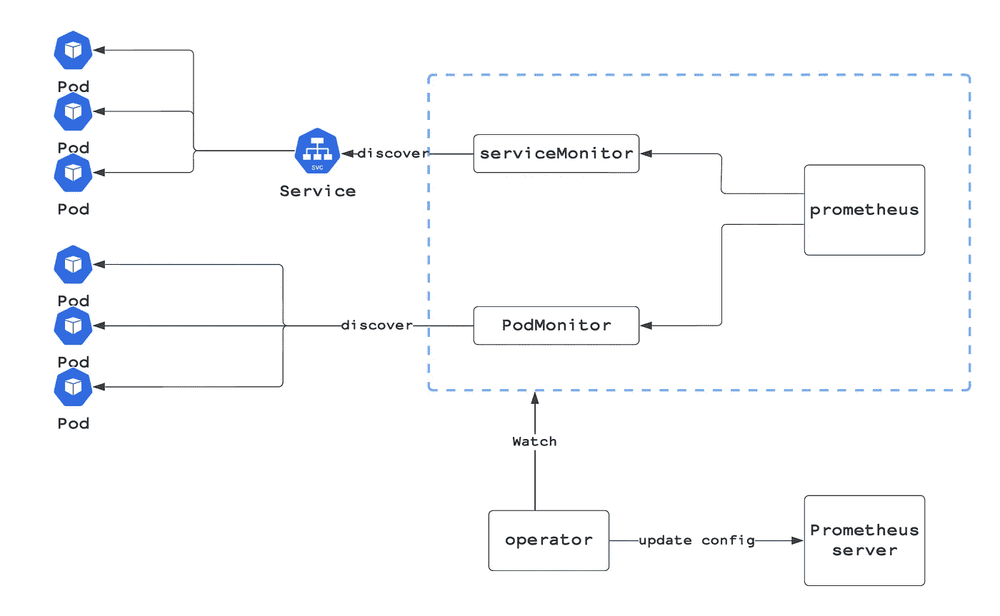
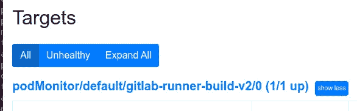
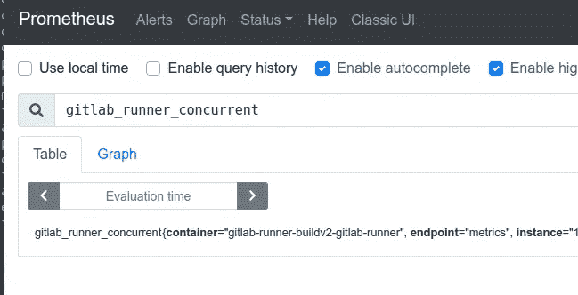
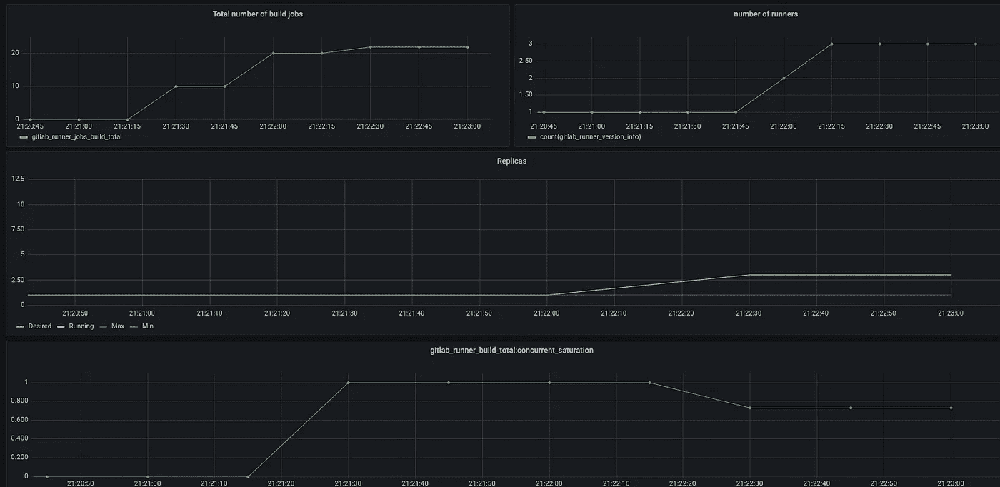

# 在 Kubernetes 上自动缩放 GitLab 跑步者

> 原文：<https://itnext.io/autoscaling-gitlab-runners-on-kubernetes-cf5739e26c05?source=collection_archive---------1----------------------->

## 语境

我们有一个 Kubernetes 集群，上面有 GitLab 自管理实例和 GitLab 运行程序。我们每月运行大约 3 万条管道。我们的大部分工作是用来构建、测试和发布我们的 SaaS 解决方案。

## 问题

我们最大的问题之一是管理冲刺阶段结束时的充电高峰。在 GitLab 运行程序数量固定的情况下，不可能满足查询运行程序的所有作业，导致作业失败、超时和挂起的 MRs。

当我开始深入研究这个问题时，我注意到 GitLab 文档在我的用例中糟糕透顶。我只是想要一个可用的指标来根据工作的数量来增加/减少跑步者的 HPA。社区提出了这个问题[在这里](https://gitlab.com/gitlab-org/gitlab/-/issues/6427)和[在这里](https://gitlab.com/gitlab-org/gitlab-runner/-/issues/27061)，但是我需要一个实际的解决方案来解决我的问题。

**在这篇博客中，我将分享我的想法，以帮助您使用 HPA (horizontal pod autoscaling)基于作业数量高效地扩展 GitLab 运行程序**。

## 先决条件

这里的目标是与观众分享我的研究，以帮助他们实现该机制。

我假设你有:

*   关于 HPA 工作原理、自定义指标、Kubernetes 和 helm v3 的知识
*   一个 Kubernetes 集群开始运行
*   Gitlab 舵图已安装
*   Prometheus 操作符(或者只是一个简单的 Prometheus 实例就可以了):用于从 GitLab 运行程序中获取指标
*   Prometheus 适配器舵图:用于将 Prometheus 指标转换为 HPA 将使用的 API 对象

下表将让您了解我在本文中使用的版本

```
+---------------------+--------------------+-------------+------------------------------------------------------+
|        name         | helm chart version | app version |                        source                        |
+---------------------+--------------------+-------------+------------------------------------------------------+
| prometheus adapter  |             2.17.0 |  v0.9.0     | [https://github.com/prometheus-community/helm-charts/](https://github.com/prometheus-community/helm-charts/) |
| prometheus operator |             22.1.0 |  v0.52.0    | [https://github.com/prometheus-community/helm-charts/](https://github.com/prometheus-community/helm-charts/) |
| gitlab              |              4.8.8 |  13.8.8     | [https://charts.gitlab.io](https://charts.gitlab.io)                             |
| gitlab-runner       |             0.25.0 |  13.8.0     | [https://charts.gitlab.io](https://charts.gitlab.io)                             |
+---------------------+--------------------+-------------+------------------------------------------------------+
```

对于那些需要在他们的家庭实验室中测试设置的人，我推荐使用这个 [git 库](https://gitlab.com/tmaczukin-test-projects/runner-helm-stack/-/tree/master/#gitlab-runner-helm-chart-preparation)作为参考(设置的版本不相同，但是导致相同的结果)

## 工作流程:

```
gitlab runner -> metrics -> prometheus -> prometheus adapter -> hpa -> scaleup/down
```

首先，我们需要理解我们想要实现的机制是如何工作的:

1.  GitLab runner 将暴露默认端口上的指标`9252`
2.  Prometheus 实例通过使用基于 serviceMonitor 或 podMonitor 自定义资源的自动报废来获取指标
3.  Prometheus 将用于创建一个新的指标，我们将在以后使用
4.  Prometheus 适配器将从 Prometheus 实例获取指标，并将它们转换为自定义或外部指标。
5.  HPA 资源将观察自定义指标，并相应地扩大/缩小规模

## 获取指标

为了能够动态获取指标，建议将 Prometheus 运算符与 serviceMonitor /podMonitor 自定义资源(CRD)一起使用。

在 ServiceMonitor 中，我们指定了 Kubernetes 标签，操作员可以使用这些标签来识别 Kubernetes 服务，然后由 Kubernetes 服务来识别我们希望监控的 pod。PodMonitor 使用相同的发现策略，但是没有服务发现层。



普罗米修斯算子

要了解更多关于 Prometheus operator 如何工作以及 serviceMonitor 如何自动发现的信息，请点击[此链接](https://sysdig.com/blog/kubernetes-monitoring-prometheus-operator-part3/)。

现在我们知道了它是如何工作的，让我们实现一个从 GitLab runner 获取指标的 podMonitor。

> 注意:如果你使用 git lab runner helm chart≥[0 . 35 . 0](https://gitlab.com/gitlab-org/charts/gitlab-runner/-/commit/83f766cf29d4762de01b2892adb7fe8a6128fee7)就不需要做这个步骤，只需要启用 values.yaml 中的 servicemonitor 选项即可。

```
apiVersion: monitoring.coreos.com/v1
kind: PodMonitor
metadata:
  name: gitlab-runner-build-v2
  labels:
    app: gitlab-runner-buildv2-gitlab-runner
    release: gitlab-runner-buildv2
spec:
  selector:
    matchLabels:
      app: gitlab-runner-buildv2-gitlab-runner
  podMetricsEndpoints:
  - port: metrics
```

现在你已经创建了 pod 监视器，你通常在 Prometheus 中自动拥有目标:



如果目标没有出现，请检查:

*   标签选择器是否与 pod 的标签匹配
*   端口的名称

要检查指标是否被废弃，请检查特定于 GitLab 跑步者的指标之一，例如`gitlab_runner_concurrent`



## 选择正确的指标来扩大/缩小跑步者

挑战之一是定义 HPA 中使用的指标。

*   **测试 1:** 基于内存的伸缩& & CPU:这不是一个正确的选择，因为 CPU 或内存消耗与运行器的任务数量无关。
*   **测试 2:** 基于` gitlab_runner_jobs`: (gauge)的缩放，当前运行的构建数。当我开始测试时，我注意到当没有作业运行或挂起时，这个指标消失了，这导致了 HPA 端的故障。

> 如果你运行的是 gitlab ≥ 14.6，你就不会有这个问题，因为他们引入了“空闲”指标来减少这个错误。[参考](https://gitlab.com/gitlab-org/gitlab-runner/-/merge_requests/3202)

为了有一个全面的指标来提供挂起的作业总数，我创建了一个名为 gitlab_runner_jobs_total_build 的新的自定义指标，它将对我的所有正在运行的运行者的作业数求和，如果不存在，就将其设置为零。

为此，您需要添加一个普罗米修斯规则来创建度量。

在 Prometheus operator 中，您可以添加一个规则作为自定义资源定义:

(确保定义正确的标签来创建您的自定义指标，例如，我一直在使用”。*gitlab-runner-build。* "过滤我的跑步者)

```
apiVersion: monitoring.coreos.com/v1
kind: PrometheusRule
metadata:
  name: kube-prometheus-stack-build-runner-metrics
  namespace: monitoring
spec:
  groups:
  - name: runners.metrics
    rules:
    - expr: sum(gitlab_runner_jobs{job=~".*gitlab-runner-build.*"}) OR clamp_max(absent(notExists{job=~".*gitlab-runner-build.*"}),0)
      record: gitlab_runner_jobs_build_total
    - expr: gitlab_runner_jobs_build_total/sum(gitlab_runner_concurrent{job=~".*gitlab-runner-build.*"})
      record: gitlab_runner_build_total:concurrent_saturation
    - expr: gitlab_runner_jobs/ on(namespace, pod) gitlab_runner_concurrent
      record: gitlab_runner_jobs:concurrent_saturation
```

> 如果您在 prometheus classic 实例上，您可以直接在配置文件中添加规则

如果你使用普罗米修斯操作员舵图，你可以直接在[值中添加`additionalPrometheusRulesMap`下的规则。yaml](https://github.com/prometheus-community/helm-charts/blob/main/charts/kube-prometheus-stack/values.yaml#L93)

如文件所示，我们添加了 3 个新指标:

*   **git lab _ runner _ jobs _ build _ total:**所有构建运行程序中的构建作业总数
*   **git lab _ runner _ build _ total:concurrent _ saturation:**所有构建运行程序的饱和度
*   **git lab _ runner _ jobs:concurrent _ saturation:**饱和运行程序的数量

当我们开始用**git lab _ runner _ jobs _ build _ total**进行测试时，我们得到了一些不错的结果，但感觉确实是正确的！！

一些更复杂的事情需要理解:一个 GitLab runner pod 可以产生多达 X 个并发的 runner，这些 runner 将为他完成工作并杀死他们自己，你可以在这里了解流程。


GitLab 转轮流量

这就是我们定义**git lab _ runner _ build _ total:concurrent _ saturation 的原因。**该指标将返回所有跑步者的整体饱和度。

让我们做些数学计算:

如果您有一个可以运行 10 个并发作业的运行程序，并且队列中有 5 个作业，那么该运行程序将有 50%的饱和度。

计算饱和度的规则很简单:

```
global_saturation= total number of jobs / total number of concurrent jobs that can be run on all runners
```

如果饱和度太高，无法缓解饱和跑步者的压力，我们将扩大规模；如果没有饱和度，我们将缩小规模。

## 将外部指标用于 HPA

既然我们选择了正确的指标，我们需要将它导出到 API 服务器，以便 HPA 可以使用它作为扩展的参考。P [rometheus 适配器](https://github.com/kubernetes-sigs/prometheus-adapter)将把 Prometheus 公制转换成可由 Kubernetes 使用的自定义公制资源。

下一步是在右侧部分[下方添加一个新的外部指标](https://github.com/prometheus-community/helm-charts/blob/main/charts/prometheus-adapter/values.yaml#L103):

要测试指标是否可访问，请尝试直接卷曲特定指标的 API 服务器:

我们现在可以基于该指标在 GitLab runner 上创建/启用 HPA。

对于使用 helm chart 实现 GitLab runners 的人员，您只需取消注释 HPA [部分](https://gitlab.com/gitlab-org/charts/gitlab-runner/-/blob/main/values.yaml#L661):

> gitlab 跑步者的默认舵图使用 v1/beta1 HPA API。对于更高级的设置，您可以创建自己的 HPA。

## 测试设置

关键时刻到了，我们已经设置了所有需要的组件，让我们测试所选指标的效率。

为了测试运行程序，我们创建了一个 CI，它将产生 50 个并行作业，睡眠时间为 60 秒，以加速运行程序的饱和。

为了监控我们系统的行为，我创建了一个 Grafana，它将监控多个指标(作业数量、运行者数量、自动缩放状态……)你可以在这里免费下载它

> 对于这个设置，我们有一个运行程序，在 k8s 上运行 10 个并发作业

当作业数量达到 10 时，流道饱和，这将触发自动缩放器添加更多流道，直到饱和低于阈值。



处理完所有作业后，自动缩放器会将流道缩小到最小。

## 最后的想法

我们已经注意到这个设置非常有趣，并且在解决我们的问题时非常有效。当我进一步推动测试时，我注意到我们在纵向扩展上有延迟。该指标公开了运行者已经确认的作业。因此，只有当我们让一个跑步者饱和时，我们才会扩大规模。

我计划测试的另一个方面是实现一个作业导出器，它将每 XX 秒调用 [Gitlab 作业 API](https://docs.gitlab.com/ee/api/jobs.html) 。该导出器将获取挂起作业的数量，并将其作为普罗米修斯度量导出。从那里我们可以预测，我们将有一个高的充电峰值，并相应地调整我们的跑步者