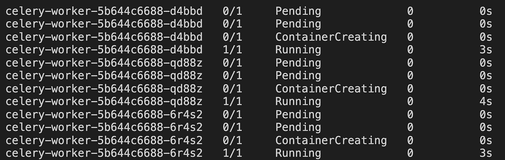
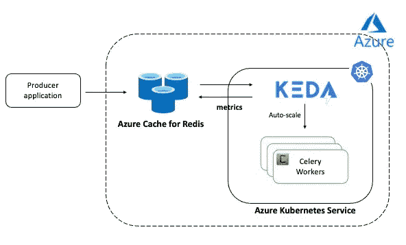

# Kubernetes 上的自动缩放 Redis 应用🚀🚀

> 原文：<https://itnext.io/autoscaling-redis-applications-on-kubernetes-25c1867e95d7?source=collection_archive---------0----------------------->

## 使用 KEDA 放大/缩小芹菜工人容器

这篇博文演示了如何在 Kubernetes 上自动缩放基于 Redis 的应用程序。 [Redis](https://redis.io/) 是一个广泛使用的([并且深受喜爱！](https://redislabs.com/blog/redis-is-the-most-loved-database-for-the-4th-year-in-a-row/))数据库，支持一组丰富的数据结构(字符串、哈希、流、地理空间)，以及其他功能，如发布/订阅消息、集群(HA)等。一种这样的数据结构是支持诸如插入(`LPUSH`、`RPUSH`、`LINSERT`等操作的[列表](https://redis.io/topics/data-types-intro#lists)。)，读取(`LRANGE`)，删除(`LREM`，`LPOP`等。)等。但这还不是全部！

Redis 列表非常通用，用作实现可伸缩架构模式的主干，如消费者-生产者(基于队列)，生产者应用程序将项目推入列表，消费者(也称为工人)处理这些项目。热门项目如`[resque](https://github.com/resque/resque)`、`[sidekiq](https://sidekiq.org/)`、`[celery](https://docs.celeryproject.org/en/stable/getting-started/brokers/redis.html)`等。在后台使用 Redis 实现后台作业。

在这篇博客中，您将学习如何自动扩展使用 Redis 作为代理的芹菜工人。有多种方法可以实现这一点——这个博客使用了一个基于 Kubernetes 的事件驱动自动缩放器(`[KEDA](https://keda.sh/)`)来完成繁重的工作，包括根据工作负载扩大工作人员队伍，如果队列中没有任务，还可以将其缩小到零！



使用 KEDA 自动缩放芹菜工作进程

> *请注意，这篇博文使用了一个* [*Golang*](https://golang.org/) *应用(感谢*[*go celery*](https://github.com/gocelery/gocelery/)*！)作为例子，但这同样适用于 Python 或任何其他使用 Celery 协议的应用程序。*

它涵盖以下主题:

*   从应用程序的基本概述开始
*   设置 infra (AKS、Redis)并随 kEDA 部署 worker 应用程序
*   测试端到端自动缩放的运行情况

> *样例代码可在* [*这个 GitHub 资源库*](https://github.com/abhirockzz/redis-celery-kubernetes-keda) 中找到

首先，这里有一个快速的介绍！

# 芹菜

简单地说，**芹菜**是一个分布式消息处理系统。它使用经纪人来协调客户和员工之间的交流。客户端应用程序向代理添加消息(任务),然后将消息交付给一个或多个工作器——这种设置是水平可伸缩的(并且高度可用),因为您可以让多个工作器分担处理负载。

虽然 Celery 是用 Python 写的，但好在协议可以用任何语言实现。这意味着您可以用完全不同的编程语言编写客户端和工作者应用程序(一个基于 Node.js 的客户端和一个基于 Python 的工作者应用程序)，但它们将能够互操作，只要它们使用 Celery 协议！

# KEDA

KEDA 采用即插即用的架构，并在现有的 Kubernetes 原语(如 Horizontal Pod Autoscaler)的基础上构建(扩展),以根据需要处理的事件数量来扩展任何 Kubernetes 容器。

一个`KEDA`缩放器负责与外部服务集成，以获取驱动自动缩放的指标。我们将使用[Redis 的 KEDA 缩放器](https://keda.sh/docs/scalers/redis-lists/)，它根据 Redis 列表的长度(条目数)自动缩放应用程序。

> 深入探讨不在这篇博文的讨论范围之内。要了解更多，请参考以下资源:[概念](https://keda.sh/docs/2.1/concepts/)、[架构](https://keda.sh/docs/2.1/concepts/#architecture)、[入门博文](https://cloudblogs.microsoft.com/opensource/2020/05/12/scaling-kubernetes-keda-intro-kubernetes-based-event-driven-autoscaling/)、[使用 Kafka 的动手教程](https://levelup.gitconnected.com/auto-scale-kafka-applications-on-kubernetes-with-keda-6fde6aef9d800)等。

在我们深入研究本质之前，这里有一个应用程序的高级概述。

# 高层架构



高层架构

该应用程序包括以下组件:

*   Redis(用作芹菜经纪人)
*   模拟提交任务的客户端应用程序的生成器
*   处理任务的工作应用程序(运行在 Kubernetes 中)

## 生产者应用

生产者是一个向 Redis 提交任务的 Go 应用程序(使用`gocelery`库)。你可以在 GitHub 上查看[代码，但这里有一个片段:](https://github.com/abhirockzz/redis-celery-kubernetes-keda/blob/master/celery-go-app/producer.go)

```
go func() {
        for !closed {
            _, err := celeryClient.Delay(taskName, rdata.FullName(rdata.RandomGender), rdata.Email(), rdata.Address())
            if err != nil {
                panic(err)
            }
            time.Sleep(1 * time.Second)
        }
    }()
```

它运行一个循环(作为 goroutine)并发送随机生成的数据(全名、电子邮件和地址)。

> *producer 应用程序可用作预构建的 Docker 映像*[*abhirockzz/celery-go-producer*](https://hub.docker.com/repository/docker/abhirockzz/celery-go-producer)*，但是，您可以选择使用 repo 中提供的* `*Dockerfile*` *构建另一个映像。*

## 芹菜工人

Celery worker 应用程序处理这些信息(通过 Redis 作业队列)。在这种情况下，处理逻辑包括将数据存储在 Redis `HASH`中(但它可以是任何东西)。你可以在 GitHub 上查看[代码，但这里有一个片段:](https://github.com/abhirockzz/redis-celery-kubernetes-keda/blob/master/celery-go-app/worker.go)

```
save := func(name, email, address string) string {
        sleepFor := rand.Intn(9) + 1
        time.Sleep(time.Duration(sleepFor) * time.Second) info := map[string]string{"name": name, "email": email, "address": address, "worker": workerID, "processed_at": time.Now().UTC().String()} hashName := hashNamePrefix + strconv.Itoa(rand.Intn(1000)+1) _, err := redisPool.Get().Do("HSET", redis.Args{}.Add(hashName).AddFlat(info)...)
        if err != nil {
            log.Fatal(err)
        }
        return hashName
    }
```

添加[睡眠](https://dev.to/abhirockzz/autoscale-redis-applications-on-kubernetes-using-keda-4bca-temp-slug-8481103?preview=430909cfebb8f7ca2982f68c48be98f943ca2755dadc606497190778d83e459653095be962eec082fdc964acff0274bfa083f865d89e546b5066e4d8)是为了让工作应用程序可以在 0 到 10 秒之间暂停(这是随机的)。这将有助于模拟一个“高负载”场景，并有助于演示自动缩放(在接下来的部分中有详细介绍)。

> *worker 应用程序可用作预构建的 Docker 映像*[*abhirockzz/celery-go-worker*](https://hub.docker.com/repository/docker/abhirockzz/celery-go-worker)*，但是，您可以选择使用 repo 中提供的* `*Dockerfile*` *构建另一个映像。*

## KEDA `ScaledObject`

一个`ScaledObject`将我们想要自动伸缩的`Deployment`(在本例中，是芹菜工人应用程序)与度量的来源(Redis 列表的长度)关联起来:

```
apiVersion: keda.sh/v1alpha1
kind: ScaledObject
metadata:
  name: redis-scaledobject
  namespace: default
spec:
  scaleTargetRef:
    kind: Deployment
    name: celery-worker
  pollingInterval: 15
  cooldownPeriod: 200
  maxReplicaCount: 10
  triggers:
    - type: redis
      metadata:
        addressFromEnv: REDIS_HOST
        passwordFromEnv: REDIS_PASSWORD
        enableTLS: "true"
        listName: celery
        listLength: "10"
```

以下是清单中使用的属性的摘要:

*   (`spec.scaleTargetRef.deploymentName`)指定自动缩放的目标`Deployment`。
*   触发类型为`redis`，而`triggers.metadata`部分用于提供更多细节:
*   本例中`address`的值是`REDIS_HOST`，这是期望出现在`Deployment`中的环境变量的名称(运行时)
*   `listName`是 Redis 列表的名称，其待定项用于驱动自动缩放过程
*   `listLength`是阈值(列表项目的数量)，超过该阈值将创建新的`Pod`(针对指定的`Deployment`)。在本例中，将为 Redis 列表中的每一个`10`未决项目创建一个新的`Pod`(为了便于测试，该数字保持较低)
*   `maxReplicaCount`定义应用程序可扩展的上限，即无论扩展标准如何，都是可创建的`Pod`的最大数量

是时候转向实际的东西了。但是，在你去那里之前，请确保你已经准备好了:

# 先决条件

要使用本博客中的应用程序，您需要:

*   Azure 账户。你可以[创建一个免费账户](https://azure.microsoft.com/free/?WT.mc_id=data-18088-abhishgu)获得 12 个月的免费服务。
*   安装了 [Docker](https://docs.docker.com/get-docker/) 和 [Azure CLI](https://docs.microsoft.com/cli/azure/install-azure-cli?WT.mc_id=data-18088-abhishgu)
*   [Kubernetes](http://kubernetes.io/) 和`[kubectl](https://kubernetes.io/docs/tasks/tools/install-kubectl/)`一起集群:我已经使用了 [Azure Kubernetes 服务](https://docs.microsoft.com/azure/aks/?WT.mc_id=data-18088-abhishgu)，尽管`[minikube](https://kubernetes.io/docs/tasks/tools/install-minikube)`应该也能工作。
*   Redis:我已经为 Redis 使用了 [Azure Cache，但是可以自由探索其他选项，例如，你可以使用](https://docs.microsoft.com/azure/azure-cache-for-redis/?WT.mc_id=data-18088-abhishgu)`[Helm](https://github.com/helm/charts/tree/master/stable/redis)` [图表](https://github.com/helm/charts/tree/master/stable/redis)在你的 Kubernetes 集群中安装一个

在接下来的部分中，我们将:

*   安装`KEDA`
*   部署单个组件—芹菜工、`ScaledObject`等。
*   生成负载并测试自动伸缩

# 基本设置

首先，请确保:

*   在 Azure 上建立一个 Kubernetes 集群
*   [为 Redis 实例创建 Azure 缓存](https://docs.microsoft.com/azure/azure-cache-for-redis/quickstart-create-redis?WT.mc_id=data-18088-abhishgu)

## 安装 KEDA

`KEDA`允许[多种安装选项](https://keda.sh/docs/deploy/)。我将[直接使用 YAML](https://keda.sh/docs/deploy/#yaml)

> *KEDA 组件将被安装到* `*keda*` *命名空间中。*

```
kubectl apply -f [https://github.com/kedacore/keda/releases/download/v2.1.0/keda-2.1.0.yaml](https://github.com/kedacore/keda/releases/download/v2.1.0/keda-2.1.0.yaml)
```

这将分别启动`KEDA`操作员和 Metrics API 服务器`Deployment`

```
kubectl get deployment -n kedaNAME                              READY   UP-TO-DATE   AVAILABLE   AGE
keda-operator                     1/1     1            1           1hkeda-operator-metrics-apiserver   1/1     1            1           1h
```

> *在你继续下一步之前，等待* `*Deployment*` *s 成为* `*READY*`

我们现在可以部署自动扩展应用程序所需的组件。首先克隆此存储库，然后切换到正确的文件夹:

```
git clone https://github.com/abhirockzz/redis-celery-kubernetes-keda
cd redis-celery-kubernetes-keda
```

## 部署芹菜工和 KEDA `ScaledObject`

我们需要首先部署`Secret`，因为芹菜工人`Deployment`使用它。首先，对 Redis 实例的密码进行编码(`base64`)(检查 Azure Portal 中的[访问密钥)，以便将其存储为`Secret`。](https://docs.microsoft.com/azure/azure-cache-for-redis/cache-development-faq?WT.mc_id=data-18088-abhishgu#retrieve-host-name-ports-and-access-keys-from-the-azure-portal)

```
echo 'enter_redis_password' | base64
```

在`secret.yaml`的`credentials`属性中替换它。例如，如果密码是`foobared`:

```
echo -n 'foobared' | base64//output: Zm9vYmFyZWQ=
```

`secret.yaml`的最终版本将如下所示(注意`credentials`属性中的编码密码):

```
apiVersion: v1
kind: Secret
metadata:
  name: redis-password
type: Opaque
data:
  credentials: Zm9vYmFyZWQ=
```

创建`Secret`:

```
kubectl apply -f deploy/secret.yaml
```

我们几乎已经准备好部署芹菜工人应用程序了。在此之前，请用 Redis 主机和端口更新`consumer.yaml`文件。以下是片段:

```
...
          env:
            - name: REDIS_PASSWORD
              valueFrom:
                secretKeyRef:
                  name: redis-password
                  key: credentials
            - name: REDIS_HOST
              value: **[replace with redis host and port e.g. foobar.redis.cache.windows.net:6380]**
            - name: REDIS_LIST
              value: celery
...
```

> `*celery*` *是芹菜工创建的 Redis* `*LIST*` *的默认名称——请保持不变。*

部署工人应用程序，检查`Pod`并等待状态转换到`Running`:

```
kubectl apply -f deploy/consumer.yamlkubectl get pods -l=app=celery-worker -wNAME                              READY   STATUS    RESTARTS   AGE
celery-worker-5b644c6688-m8nf4   1/1     Running   0          20s
```

> *您可以使用* `*kubectl logs <pod_name>*`查看日志

展开 KEDA `ScaledObject`:

```
kubectl apply -f deploy/redis-scaledobject.yaml
```

# 自动缩放正在运行

我们已经准备好测试端到端设置了！

## 缩放至零💥💥

检查芹菜工`Pod`:

```
kubectl get pods -l=app=celery-worker//output: No resources found
```

`No resources found`？？？等等，我们已经准备好了一个消费者应用程序`Pod`，刚刚发生了什么？别急，这是`KEDA`在行动！因为 Redis 列表中现在没有条目(因此工人没有工作)，`KEDA`确保没有空闲的`Pod`在运行。

> *这种行为可以通过* `*ScaledObject*` *中的* `*minReplicaCount*` *属性来控制(参考* [*KEDA 文档*](https://keda.sh/docs/concepts/scaling-deployments/#details) *)*

`KEDA`使用`ScaledObject`中的信息创建一个[水平 Pod 自动缩放器](https://kubernetes.io/docs/tasks/run-application/horizontal-pod-autoscale/)对象:

```
kubectl get hpa NAME                          REFERENCE                  TARGETS              MINPODS   MAXPODS   REPLICAS   AGE
keda-hpa-redis-scaledobject   Deployment/celery-worker   <unknown>/10 (avg)   1         10        0          2m51s
```

## 扩大⬆️

让我们运行 Celery producer 应用程序，并通过将项目推入 Redis 列表来模拟一些工作。在此之前，切换到另一个终端并开始观察消费者`Deployment`以跟踪自动缩放:

```
kubectl get pods -l=app=celery-worker -w
```

返回上一个终端并运行应用程序:

```
export REDIS_HOST=[replace with redis host and post info e.g. foobar.redis.cache.windows.net:6380]
export REDIS_PASSWORD=[replace with redis password]docker run --rm -e REDIS_HOST=$REDIS_HOST -e REDIS_PASSWORD=$REDIS_PASSWORD abhirockzz/celery-go-producer//output:
celery producer started...
```

等待几秒钟。在另一个终端中，您会注意到芹菜工人正在被逐渐创建:

```
celery-worker-5b644c6688-2zk5c   0/1   ContainerCreating   0     0s
celery-worker-5b644c6688-2zk5c   1/1   Running             0     4s
celery-worker-5b644c6688-h22hp   0/1   Pending             0     0s
celery-worker-5b644c6688-h22hp   0/1   Pending             0     0s
celery-worker-5b644c6688-h22hp   0/1   ContainerCreating   0     0s
celery-worker-5b644c6688-h22hp   1/1   Running             0     4s
celery-worker-5b644c6688-r2m48   0/1   Pending             0     0s
celery-worker-5b644c6688-r2m48   0/1   Pending             0     0s
celery-worker-5b644c6688-r2m48   0/1   ContainerCreating   0     0s
celery-worker-5b644c6688-r2m48   1/1   Running             0     3s
```

如果您检查`Deployment` ( `kubectl get deployment/celery-worker`)，您将会看到与此类似的内容(取决于创建了多少个`Pod`):

```
NAME            READY   UP-TO-DATE   AVAILABLE   AGE
celery-worker   3/3     3            3           9m51s
```

您也可以检查水平 Pod 自动缩放器。它应该反映相同的统计数据:

```
kubectl get hpaNAME                          REFERENCE                  TARGETS      MINPODS   MAXPODS   REPLICAS   AGE
keda-hpa-redis-scaledobject   Deployment/celery-worker   9/10 (avg)   1         10        3          8m15s
```

如果您碰巧检查了某个工作应用程序的日志，您将会记录如下输出:

```
...
2021/03/01 10:05:36 got info -  Benjamin Moore liammiller233@test.com 9 Franklin Circle,
Burrton, WY, 37213
2021/03/01 10:05:36 worker b2928e0f-2c79-a227-7547-7bd2acdaacba sleeping for 3
2021/03/01 10:05:39 saved hash info users:674
2021/03/01 10:05:39 got info -  Lily Smith jacobwilliams126@example.net 84 Jackson Ter,
New Deal, FM, 53234
2021/03/01 10:05:39 worker b2928e0f-2c79-a227-7547-7bd2acdaacba sleeping for 7
2021/03/01 10:05:46 saved hash info users:473
2021/03/01 10:05:46 got info -  William Williams joshuadavis821@example.com 32 Washington Rdg,
Baldock, MN, 60018
2021/03/01 10:05:46 worker b2928e0f-2c79-a227-7547-7bd2acdaacba sleeping for 9
2021/03/01 10:05:55 saved hash info users:275
...
```

当我们的员工快乐地工作时，让我们也来看看 Redis。使用`redis-cli`:

```
redis-cli -h [redis host e.g. foobar.redis.cache.windows.net] -p 6380 -a [redis password] --tls
```

首先，检查 Redis 列表的长度(在本例中命名为`celery`)。输出将反映 producer 应用程序已经推入但尚未处理的作业数量。

```
**llen celery**(integer) 10
```

工作应用程序使用用户信息创建散列(基于它从生产者应用程序接收的随机数据)。要进行检查，请使用`SCAN`:

```
**scan 0 match users***1) "960"
2) 1) "users:169"
   2) "users:272"
   3) "users:855"
   4) "users:429"
```

检查几个条目(使用`hgetall`)。例如

```
**hgetall users:169**
 1) "name"
 2) "Natalie White"
 3) "email"
 4) "ethanjackson245@test.net"
 5) "address"
 6) "20 Jefferson Ter,\nDerby Center, ME, 18270"
 7) "worker"
 8) "6769253c-9dc3-9232-1860-4bc01ce760a3"
 9) "processed_at"
10) "2021-03-01 10:13:11.230070643 +0000 UTC"
```

除了用户详细信息，请注意处理该记录的工人的 ID**也是可用的。这是为了确认不同的工作实例正在共享工作负载。**

> *我们已经将* `*10*` *设置为* `*ScaledObject*` *清单中的* `*listLength*` *，并将* `*maxReplicaCount*` *指定为* `*10*` *(因此* `*Pod*` *s 的数量将被限制为这个数量)。*

## 缩小⬇️

停止生成器应用程序。

一旦列表中的所有项目都被消耗完，并且列表为空，在到达`cooldown`周期(本例中为`200`秒)后，`Deployment`将按比例缩小。最终，`Pod`的数量会归零。您可以再次“清洗并重复”这一过程，并对您想要发送的消息数量(模拟负载)、您想要扩展到的副本数量、不同的`thresholdCount`等进行不同的实验。

# 打扫

完成后，不要忘记删除您创建的资源:

*   删除芹菜工 app，`ScaledObject`和`Secret` : `kubectl delete -f deploy`
*   到[卸载 KEDA](https://keda.sh/docs/2.1/deploy/#uninstall-2) : `kubectl delete -f [https://github.com/kedacore/keda/releases/download/v2.1.0/keda-2.1.0.yaml](https://github.com/kedacore/keda/releases/download/v2.1.0/keda-2.1.0.yaml)`
*   [如果不再需要，删除 AKS 集群](https://docs.microsoft.com/cli/azure/aks?view=azure-cli-latest&WT.mc_id=data-18088-abhishgu#az_aks_delete):`az aks delete --name <cluster name> --resource-group <group name>`
*   [删除 Redis 实例的 Azure 缓存](https://docs.microsoft.com/azure/azure-cache-for-redis/scripts/delete-cache?WT.mc_id=data-18088-abhishgu) : `az redis delete --name <cache name> --resource-group <group name>`

# 结论

我们在这个博客中讨论过 Redis Scaler，但是`KEDA`提供了[许多这样的 Scaler](https://keda.sh/docs/scalers/)。`KEDA`处理应用程序的自动扩展，但是，如果您可以在 Kubernetes 集群节点之外的基础设施上运行所有这些应用程序实例，例如无服务器平台，会怎么样？

如果这听起来很有趣，请查看 Azure Kubernetes 服务中的[虚拟节点](https://docs.microsoft.com/azure/aks/virtual-nodes?WT.mc_id=data-18088-abhishgu),看看如何使用它们将您的应用无缝扩展到 Azure 容器实例，并从 pods 的快速供应中受益，并且只需为它们的执行时间按秒付费。AKS 的虚拟节点附加组件基于开源项目 [Virtual Kubelet](https://virtual-kubelet.io/) ，这是一个开源 [Kubernetes](https://kubernetes.io/docs/reference/generated/kubelet/) `[kubelet](https://kubernetes.io/docs/reference/generated/kubelet/)`实现。