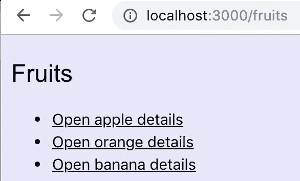
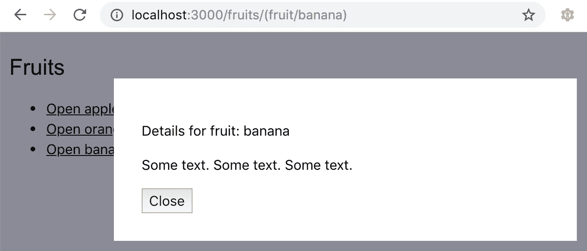
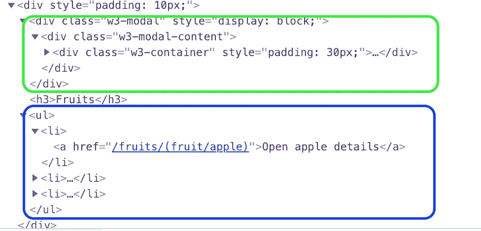
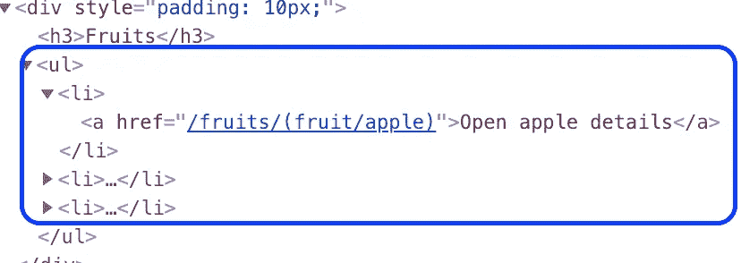

# 带 React 的辅助路由？

> 原文：<https://itnext.io/auxiliary-routing-with-react-e0a4eee36122?source=collection_archive---------2----------------------->

辅助路线是什么？角度路由器支持多条不可靠路线的渲染。最常见的用例是沿着主要路线呈现弹出窗口、模式窗口或侧边栏。你可以在[https://Angular . io/guide/router # displaying-multi-routes-in-named-outlets](https://angular.io/guide/router#displaying-multiple-routes-in-named-outlets)了解更多关于 Angular 辅助路由的信息

## 要求

在这篇博客中，我们将回顾一个由路由器打开和关闭模态对话框的用例。我们将使用 React 和 react-router 包来实现这个应用程序。

让我们看看我们的要求。我们需要:

1.  能够打开页面看到水果列表



2.能够点击一个水果链接，并打开一个关于这个水果的详细信息的模态对话框。应该更新 URL 以包含所选的水果。



3.用户可以用打开模式保存应用程序 URL。当用户使用这个 URL 打开应用程序时，modal 应该与水果列表一起显示。

## 呈现水果列表

该应用程序使用 react-router BrowserRouter 并配置路由和重定向组件。

```
class App extends Component {
  render() {
    return (
      <**BrowserRouter**>
          <**Switch**>
            <**Route** path="/fruits" 
               render={props => <Fruits {...props}/>}></Route>
            <**Redirect** exact path="/" to="/fruits"/>
          </**Switch**>
      </**BrowserRouter**>
    );
  }
}
```

**重定向**组件用于将用户从“/”路径重定向到/fruits 路径。**路线**/水果将呈现水果列表。**开关**用于呈现路由或重定向组件。

以下是水果组件和水果列表:

```
const Fruits = (props) => {
  return (
    <>
    <h3>Fruits</h3>
    <ul>
      <li>apple details</Link></li>
      <li>orange details</Link></li>
      <li>banana details</Link></li>
    </ul>
    </>
  );
};
```

## 莫代尔水果细节

为了显示水果细节，我将使用 W3。CSS 模态。你可以在[https://www.w3schools.com/w3css/w3css_modal.asp](https://www.w3schools.com/w3css/w3css_modal.asp)找到模态的 CSS 样式。

下面是水果莫代尔:

```
const Fruit = (props) => {
  return (
    <div className="w3-modal" style={{display: 'block'}}>
      <div className="w3-modal-content">
        <div className="w3-container">
          <p>Details for fruit: {props.name}</p>
          <p>Some text. Some text. Some text.</p>
        </div>
      </div>
    </div>
  );
};
```

## 添加路线

到目前为止，我们创建了一个呈现水果列表的组件和一个特定水果的模态组件。现在让我们添加路由来满足我们的要求。

## 链接到模态

正如我在开始提到的，Angular '辅助符号将用于在一个 URL 中表示主路径(水果列表)和次路径(带有水果细节的模态)。

URL 将看起来像这样—[http://localhost:3000/fruits/(fruit/apple)](http://localhost:3000/fruits/(fruit/apple))我们的链接看起来像这样:

```
<Link to="/fruits/(fruit/apple)">Open apple details</Link> 
```

## 通向模态的路线

我们需要添加一个路由来呈现页面中的模态。我们可以像这样把它添加到水果成分中:

```
const Fruits = (props) => {
  const basePath = props.match.path;
  return (
    <>
 **<Route path="fruits/\\(fruit/:name\\)"
      render={props => 
         <Fruit name={props.match.params.name}{...props}/>}
     />**

    <h3>Fruits</h3>
    <ul>
          ....
    </ul>
    </>
  );
};
```

如您所见，模态和列表将与[http://localhost:3000/fruits/(fruit/apple)](http://localhost:3000/fruits/(fruit/apple))URL 一起呈现:



并且只有 URL 为[http://localhost:3000/fruits](http://localhost:3000/fruits/(fruit/apple))时的列表



## 封闭模态

要关闭这个模态，我们只需要从 URL 中删除次要路径(/fruit/banana)。关闭按钮的功能将推出新的路线/水果。

```
const Fruit = (props) => {
 ** const handleClose = () => {
    props.history.push('/fruits');
  };**

  return (
    <div className="w3-modal" style={{display: 'block'}}>
      <div className="w3-modal-content">
        <div className="w3-container" style={{padding: 30}}>
....
         ** <button onClick={handleClose}>Close</button>**
        </div>
      </div>
    </div>
  );
};
```

现在一切都按要求工作了，我们可以用 **props.match.path.** 替换/fruits 字符串

您可以在以下位置查看工作示例: