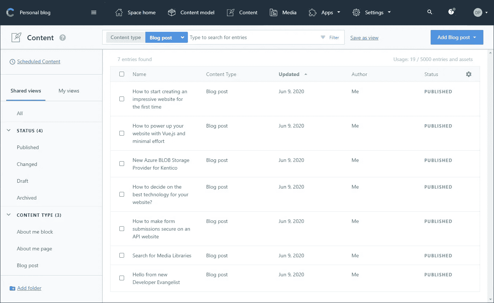
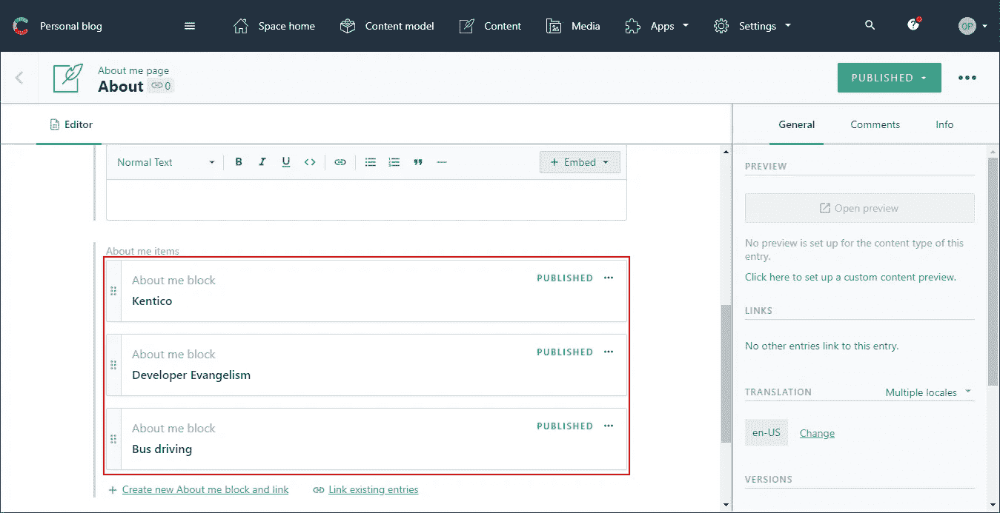
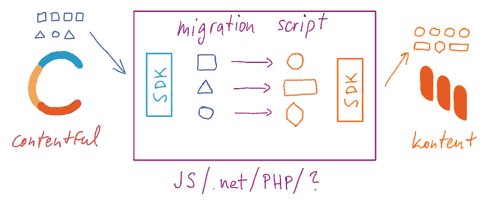
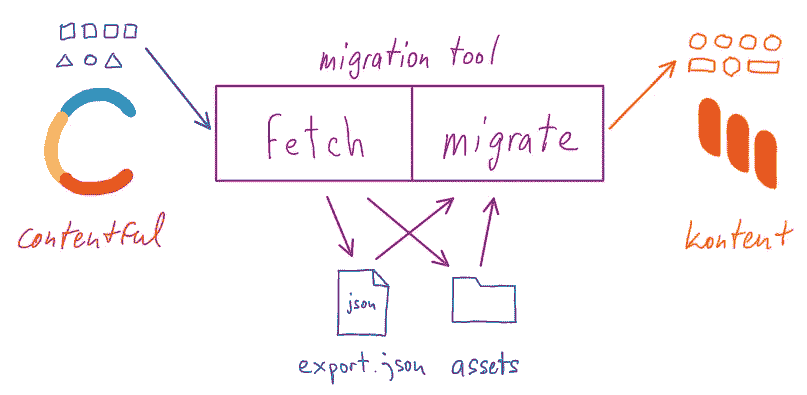
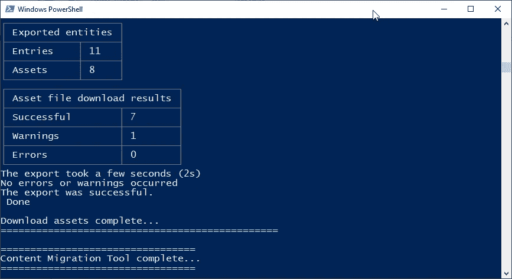
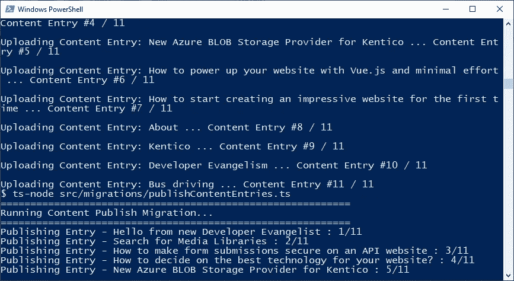
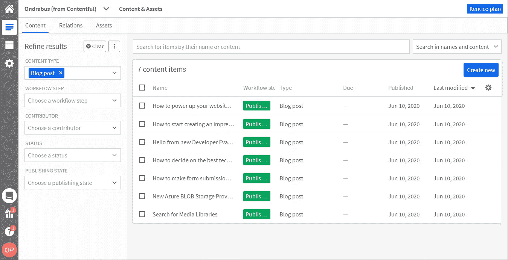
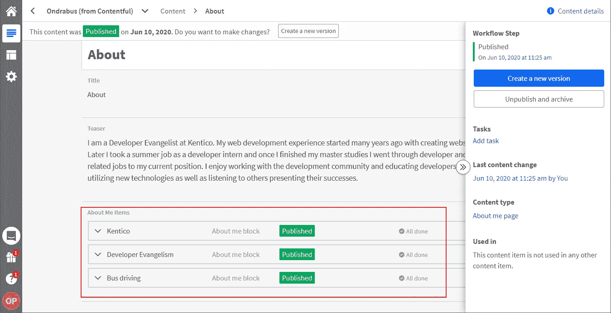
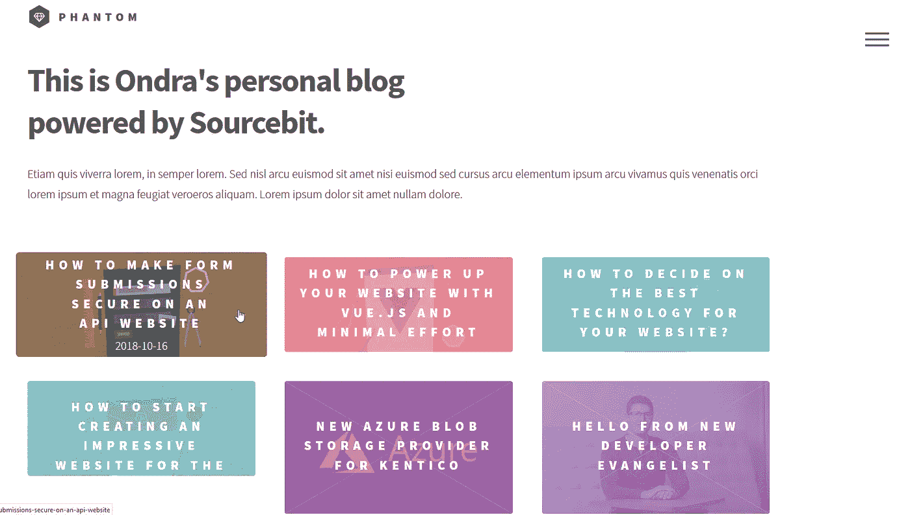
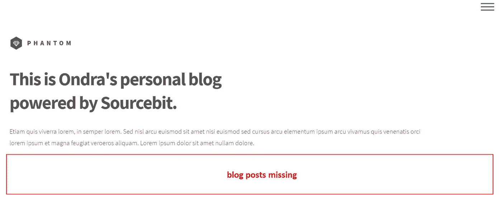

# 避免无头 CMS 供应商锁定:从 Contentful 迁移到 Kontent

> 原文：<https://itnext.io/avoid-headless-cms-vendor-lock-in-migrating-from-contentful-to-kontent-a95c579b0266?source=collection_archive---------7----------------------->


在单一系统时代，一开始就选择正确的系统是至关重要的。这个决定不可避免地让您与一家供应商合作了多年。如今，在微服务时代，供应商声称在他们的系统之间切换很容易。让我们来看看切换你的无头 CMS 时“容易”是什么意思，以及这个决定是否会让你丢掉工作。

在本文中，我将首先解释迁移的实际含义以及您需要采取的一般步骤。在第二部分中，我将把一个真正有内容的项目迁移到 Kentico Kontent，并指出棘手的部分。

# 迁移

几年前，我的一个朋友问我是否可以将她的网站——她拥有一家食品配送服务——迁移到 Prestashop。该网站是建立在一个定制的 CMS 之上的，这个 CMS 是由一个当时已经不存在的机构建立的。所以我下载了网站备份，并开始工作。

对于每一次迁移，或者至少是以 web 为中心的迁移，我们关注两件事:数据和前端迁移。

# 数据迁移

第一件事是产品数据。她的电子商店有将近 500 种三明治、沙拉、甜点和其他商品。每个项目都有一套图片、营养表、描述、标签等等。可以想象，将它们手动复制粘贴到新的解决方案中需要一周的时间。所以我创建了一个迁移脚本。然后是另一个类别。另一个用于内容页面。另一个…你明白了。这仍然是可行的，您挑选您需要的数据，并将其映射到新的数据结构。

迁移中最糟糕的部分是非结构化数据。对我来说，这些是内容页。超过 50%的内容存储在组件、小部件中，硬编码在模板中，等等，这使得几乎不可能以编程方式提取数据。处理所有边缘情况的迁移脚本实现可能比手动复制粘贴花费更长的时间。

# 前端迁移

迁移的第二部分是前端。这变得更加容易，因为您可以使用相同的前端资产，而不必花费数天时间来优化外观。除非您在迁移过程中进行外观刷新。但是我仍然需要找到所有的代码块，并把它们从 XSLT 翻译成 Smarty，因为这是 Prestashop 用来做模板的。

# 微服务时代

你看，处理从一个整体到另一个整体的迁移是很棘手的。我们必须在有意义的迁移工作和将要手动复制的工作之间划一条线。最终，我花了超过 5 周的时间。

如今，我们倾向于使用微服务架构，这改变了所有迁移的一个关键方面。内容结构。

为了能够涵盖编辑人员页面的所有用例，monoliths 允许他们的用户和开发人员在任何结构之外保存数据。您的组件需要存储键值对吗？或者只是一点 HTML？没问题。

代表微服务领域内容存储的无头 CMS 解决了“非结构化数据”问题。他们不得不这么做。虽然 monoliths 是以网络为中心的，但 headless CMSs 将内容交付给多个渠道。因此，它们不能让你在任何地方存储任何东西，而是引导你始终结构化你的内容。例如，智能手表应用程序会用丰富的 HTML 代码做什么？

他们还通过与实施分离简化了前端迁移。实际上，您仍然需要在您的实现中解决不同的数据方案，但是我们已经看到了数据规范化工具，例如 Sourcebit，它使这个过程变得更加容易。如果您有兴趣，[请阅读有关 Sourcebit](https://kontent.ai/blog/sourcebit-how-to-make-friends-with-various-data-sources-in-the-jamstack) 的更多信息。

# 无头 CMS 之间的内容迁移

但是让我们来看看真正的东西。我用 Contentful 存储了七篇博客文章和来自我的[个人网站](https://ondrabus.com)的*关于我的*页面的内容。



它们实际上涵盖了 CMS 的很大一部分功能，因为博客文章需要图像、URL slug 和富文本，而 *About m* e 页面包含嵌套项目(如下所述)。



所有这些都通过 Sourcebit 连接到 Next.js 网站。我想把所有东西都移植到另一个无头 CMS 上，Kentico Kontent。

# 纯 API 迁移

第一种选择是使用这些无头 CMS 的管理 API 并创建迁移脚本。这有点类似于我在朋友的网站上做的事情。我创建了几个 SQL 查询来调整数据并将其存储在另一个 MySQL 数据库中。有了管理 API，事情变得简单多了。您可以访问用于实现迁移脚本的平台的所有工具。通常，CMSs 还会为您提供一个处理通信的 SDK，以便您可以专注于实际的数据迁移。



在我的例子中，Contentful 和 Kontent 都有针对 JavaScript 和。NET，这几天我用的最多的是哪些平台。

# 迁移工具

但是你肯定不是第一个试图将内容从一个 CMS 转移到另一个 CMS 的人。就像我不是第一个尝试从 Windows 向 Apple TV 传输视频的人一样，除了在这种情况下，第一个问题实际上有一个解决方案。开源软件现在非常流行，很多开发人员将他们的实现提供给社区，所以我总是检查是否有工具可以在源和目标 CMS 之间进行迁移。

对于从 Contentful 到 Kontent 的迁移，有一个由马修·卡斯特里隆-马德里加尔开发的开源工具。他用它在这两个 CMS 之间迁移一个大型复杂的项目，所以它不是一个真正的实验工具。该实现包含一组 shell 脚本，这些脚本从 Contentful 下载内容模型和内容项，将其存储在本地，并对 Kontent 运行相应的 API 调用，以在那里创建相同的结构和数据。



因此，换句话说，您必须为迁移编写相同的代码。

# 配置

让我们来看看它是如何工作的。首先，我们需要建立到两个 CMS 的连接:

```
yarn program --contentful_setup
yarn program --kontent_setup 
```

该工具要求项目 id 和 API 密钥，并将它们存储在本地配置文件 *.environments.json* 和 *export/config.json* 中。

# 行动

然后，我们可以开始从 Contentful 获取数据。

*注意:如果您在 Windows 上运行，您将需要使用*[*git bash*](https://git-scm.com/)*客户端来运行迁移。您可能还需要在* `*./src/index.ts*` *中调整 shell 执行，如* [*这里的*](https://github.com/Kentico/kontent-migration-contentful/issues/5) *所述。*

`yarn program --fetch`

这将触发内容模型、内容项目和资产到本地文件夹结构的下载。



然后，通过以下方式将数据映射到 Kontent 结构并输入到 Kontent 中:

`yarn program --migrate`

一旦我们执行了这个命令，迁移工具就开始将数据上传到 CMS 中。它在屏幕上显示进度并记录失败的操作:



我偶然发现了两个我必须解决的问题:

*   **语言**
    在你开始上传数据到 Kontent 之前，把你在 Kontent 中默认语言的代码名改成你在 Contentful 中使用的代码名。我用的是 *en-US* 。如果您在 Kontent 中保留默认语言的默认" *default"* codename，您将会多一种语言。
*   **结算项目**
    出问题。尤其是在网站开发方面。如果我们的代码马上就能工作，我们倾向于不信任它:-)。如果导入失败或工具配置错误，可以重复导入。要确保您的项目是干净的，并为下一次导入做好准备，请使用 [Kontent 模板管理器的清理器](https://kentico.github.io/kontent-template-manager/cleanup)。有时，您还需要从 Contentful 重新获取数据。

我以这些博客帖子结尾:



并且这些嵌套项正确地定位在*关于我*页面内容项中:



导入也正确地处理了所有资产。现在让我们看看如何调整前端。

# 在前端交换无头 CMS

[我的网站](https://github.com/ondrabus/personal-blog-template)是用 Next.js 和 Sourcebit 搭建的，这应该可以最小化在数据提供者之间切换所需的努力。如果你不熟悉 Sourcebit 的工作方式，可以看看[这篇文章](https://kontent.ai/blog/sourcebit-how-to-make-friends-with-various-data-sources-in-the-jamstack)或观看[这段视频](https://www.youtube.com/watch?v=FTfRLzEGEgk)。假设我将数据导入到一个空白的 Kontent 项目中，我希望进行更简单的配置更改，而不是钻研模板和组件代码。

这是网站连接到 Contentful 时的样子:



我们可以通过重新初始化 Sourcebit 来更改数据源，并通过在项目根目录下运行以下命令来选择新的 CMS:

`npm init sourcebit`

im 被提示添加新的项目 ID 和语言代码名称。对我来说，只有一种语言的新代号是 *en-US* 。该向导的所有其他步骤将与旧的 CMS 完全相同。

# 需要的改变

在切换后立即运行项目会显示一些需要修复的错误:



*   **图片**
    看起来博文没有渲染。然而，问题是图像丢失了。如果博客文章内容项包含图像，那么在使用 Contentful 时，它的 URL 在`post.page.image`下可用，而不是在`post.page.image.url`下。
    如果博文使用了远程图像，则字段的代号为`post.page.image_url`而不是`post.page.imageUrl`。
*   **富文本解析**
    每个 CMS 处理富文本解析的方式略有不同。用于来自 Contentful 的数据的[实现的解析器](https://github.com/ondrabus/personal-blog-template/blob/contentful/pages/blog/%5Bslug%5D.js#L19)因此已经过时，我们需要为 Kontent 添加一个新的[。](https://github.com/ondrabus/personal-blog-template/blob/kentico-kontent/pages/blog/%5Bslug%5D.js#L24)

这些小小的不同是我唯一需要做的改变。现在，网站成功迁移，并使用不同 CMS 中的数据。

# 只是一个实验？

那么，你认为这个过程简单吗？

在我的例子中，内容迁移只需要访问配置。有些情况下，您需要调整脚本，因为由于不同的功能集，不同 CMS 之间的 1:1 数据转换并不总是可能的。这是可能的，因为实现是开源的。

经过一些小的调整后，前端迁移工作正常，这主要归功于 Sourcebit 完成的数据规范化。

你看，现在，移民已经不是什么可怕的事情了。在决定我们下一个项目要使用的工具之前，我们仍然应该做适当的研究。但是如果我们犯了一个错误或者后来找到了一个更好的工具，因为微服务的工具正在以惊人的速度发展。

看看我的 GitHub 上的[实现是什么样子。](https://github.com/ondrabus/personal-blog-template)

*原发表于*[*https://kontent . ai*](https://kontent.ai/blog/a-contentful-kontent-migration)*。*