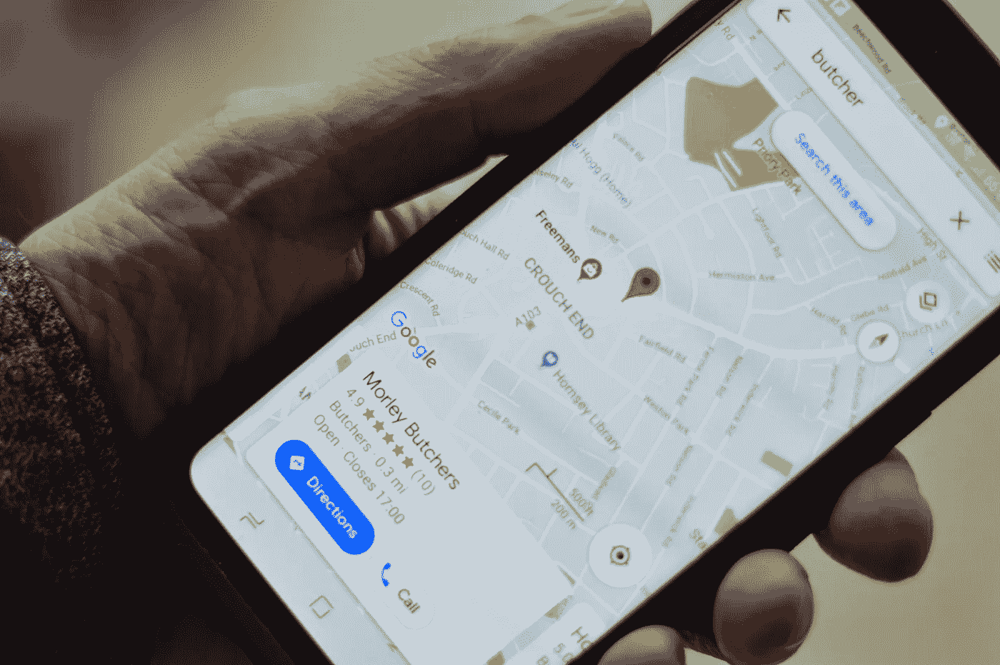
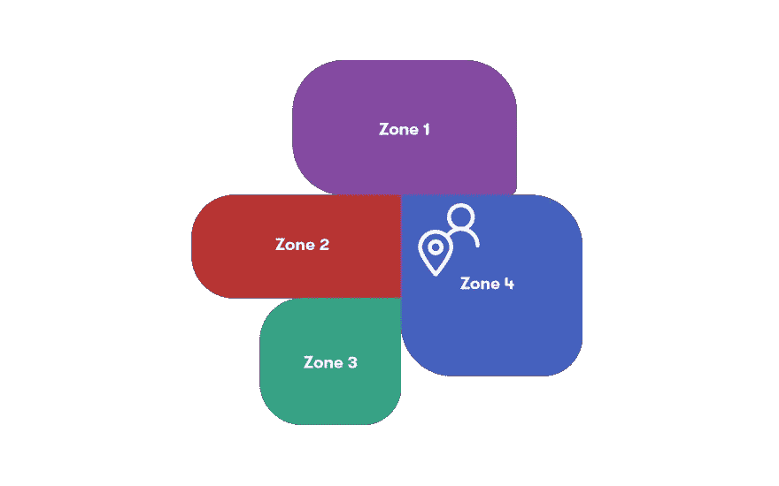
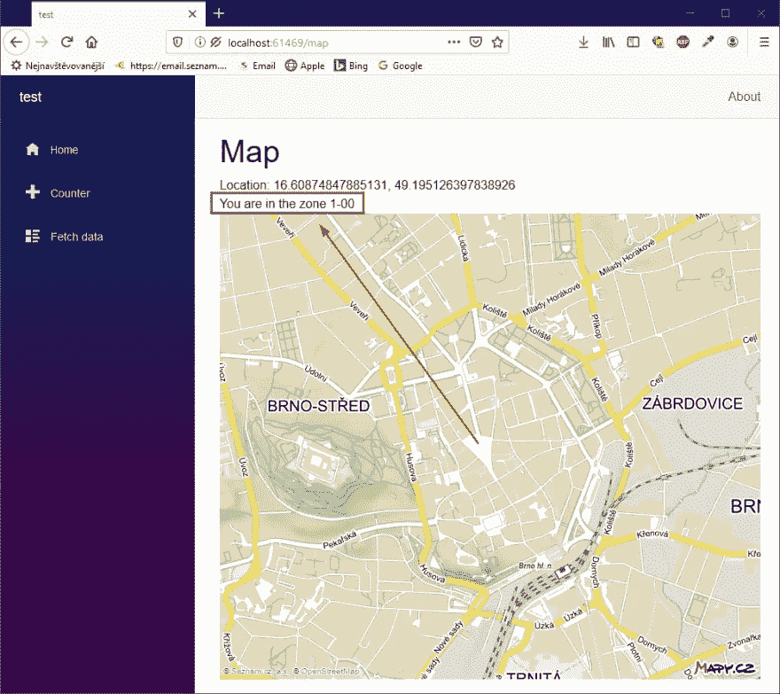
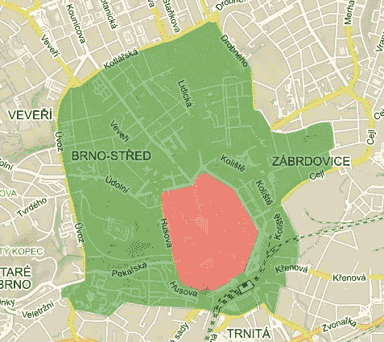
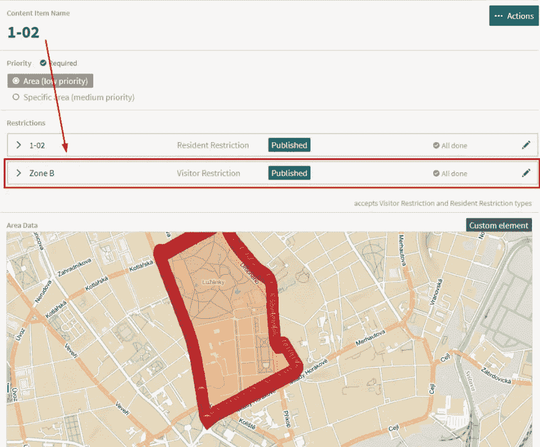
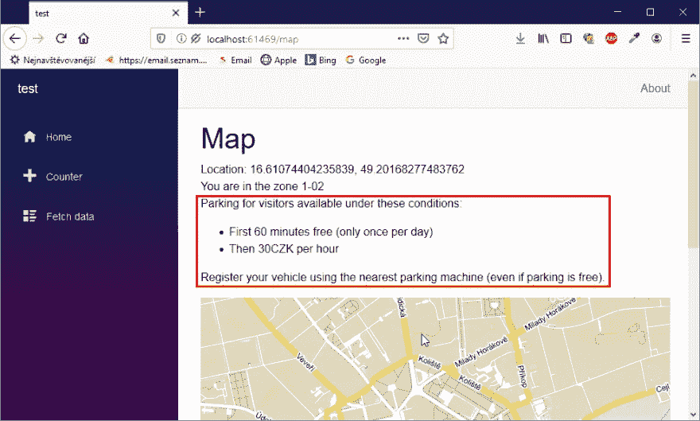
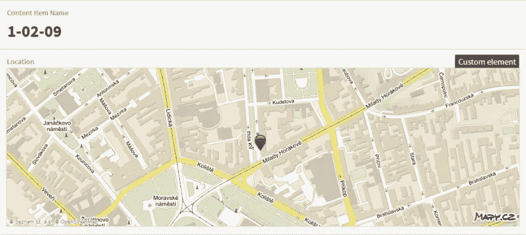
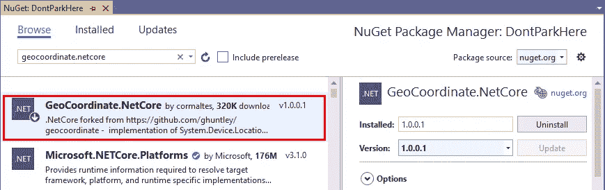
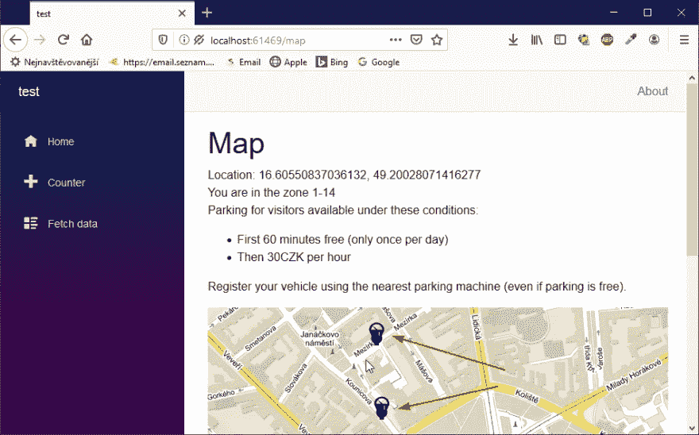

# 使用 Blazor 和地理定位功能避免停车罚款

> 原文：<https://itnext.io/avoiding-parking-fines-with-blazor-and-geolocation-d45a9a831d93?source=collection_archive---------2----------------------->



> [*上次*](https://dev.to/ondrabus/how-to-build-an-interactive-spa-with-blazor-4k8n) *我们从头开始构建了一个带有交互式地图的客户端 Blazor 站点。但是对于帮助司机的网站来说，它需要更多的功能。它应该检查游客在哪里停车，并告诉他们在哪里可以支付多少钱。否则，他们会被罚款或者他们的车会被拖走。布拉佐能搞定吗？*

在上一篇文章中，我开始建立一个网站，上面有我的家乡布尔诺的互动地图。该网站应该自动检查访客的位置，并解释在该地区停车的规则。如果适用，它应该在地图上显示最近的停车机器。

我解释了数据模型和使用 Blazor 时需要的一些关键功能，比如 Blazor 模板、JS 互操作、依赖注入和 NuGet。

今天，我将解释更多的高级功能。该项目的剩余任务是:

*   通过游客的 GPS 坐标找到该区域
*   检查适用的限制
*   显示附近的停车机器

# 将 GPS 坐标与区域的多边形进行匹配

我们知道网站的访问者站在哪里。坐标要么从他或她的移动设备中的 GPS 模块共享，要么通过点击交互式地图中的某个点来提供。在另一侧(即在 CMS 中),有其边界的所有区域和坐标。



为了进行多边形内部的点计算，我创建了一个简单的辅助类 **Helpers/ZoneHelper.cs** 。

```
public static class ZoneHelper {
    public static bool IsPointInside(Location point, Zone zone)
    {
        // pre-check using a minimum bounding box
        if (point.Latitude < zone.LatMin || point.Latitude > zone.LatMax || point.Longitude < zone.LonMin || point.Longitude > zone.LonMax)
        {
            return false;
        }

        var polygon = zone.Points;
        int i, j;
        bool c = false;
        for (i = 0, j = polygon.Count - 1; i < polygon.Count; j = i++)
        {
            if ((((polygon[i].Latitude <= point.Latitude) && (point.Latitude < polygon[j].Latitude)) || ((polygon[j].Latitude <= point.Latitude) && (point.Latitude < polygon[i].Latitude))) && (point.Longitude < (polygon[j].Longitude - polygon[i].Longitude) * (point.Latitude - polygon[i].Latitude) / (polygon[j].Latitude - polygon[i].Latitude) + polygon[i].Longitude))
            {
                c = !c;
            }
        }

        return c;
    }
 }
```

*注:多边形包含点的代码取自此处* *的* [*。*](https://wrf.ecse.rpi.edu/Research/Short_Notes/pnpoly.html)

您会看到这段代码已经为 Zone 使用了一个模型。它是 **Models/Zone.cs** 中的一个 POCO 类(没有功能，只是数据的占位符):

```
public class Zone {
   public decimal LatMin { get; set; }
   public decimal LatMax { get; set; }
   public decimal LonMin { get; set; }
   public decimal LonMax { get; set; }
   public List<Location> Points { get; set; }
   public string Name { get; set; }
} 
```

如果您还使用了一个 headless CMS，那么您可以从存储在 CMS 中的内容类型定义中生成模型。然而，我更喜欢创建自己的模型并在实现中映射它们，因为它们更灵活。

为了从 CMS 获取区域数据，我创建了一个新服务**Services/iclouddeliveryservice . cs**。它是一个有意的接口，为我想使用的无头系统提供一些抽象。这让我有可能在未来转换到不同的供应商。

此时，我正在使用 Kontent 存储所有数据。如果你对数据收集的实际实现感兴趣，可以看看 [GitHub 库](https://github.com/ondrabus/dont-park-here-client/tree/065658749c1bf3e21077e574ef8cd30e8699efd7)。

```
public interface ICloudDeliveryService
{
    Task<IEnumerable<T>> GetAllItems<T>();
}
```

云交付服务仅通过 API 收集数据。我们仍然需要获得这些区域的数据，并提供一种通过 GPS 坐标获得匹配区域的方法。当我们知道 GPS 位置或访问者点击地图时，前端会调用它。为此，我创建了**服务/区域服务. cs** 。

```
public class ZoneService
{
    private ICloudDeliveryService _cloudDeliveryService;
    private static List<Zone> _zones = null;

    public ZoneService(ICloudDeliveryService cloudDeliveryService)
    {
        _cloudDeliveryService = cloudDeliveryService;
    }

    public async Task<IReadOnlyList<Zone>> GetAllZonesAsync()
    {
        if (_zones == null)
        {
            _zones = await _cloudDeliveryService.GetAllItems<Zone>();
        } return _zones;
    } public async Task<Zone> GetZoneByPoint(Location point)
    {
        var zones = await GetAllZonesAsync();
        return zones.FirstOrDefault(z => ZoneHelper.IsPointInside(point, z));
    }
}
```

前端将使用`GetZoneByPoint`方法找到访问者所在的区域。所有服务都需要在 **Startup.cs** 注册:

```
public void ConfigureServices(IServiceCollection services)
{
    ...
    services.AddSingleton<ZoneService>();
    services.AddSingleton<ICloudDeliveryService, KontentDeliveryService>();
}
```

最后，我们可以更新网站的前端部分。需要注入新的 ZoneService:

```
[Inject]
protected ZoneService ZoneService { get; set; }
```

让我们添加一个保存当前区域的属性。这使我们能够在页面上显示该区域的详细信息:

```
public Zone CurrentZone { get; set; }
```

接下来，找到`SetLocation`方法。每当点击地图时，即 GPS 坐标改变时，或者访问者的设备锁定了当前位置时，都会调用该方法。那时，我们要检查游客站在哪个区域。

```
protected async Task SetLocation(Location location)
{
    Console.WriteLine($"Check this position: {location.Latitude} {location.Longitude}");
    Latitude = location.Latitude;
    Longitude = location.Longitude;
    CurrentZone = await ZoneService.GetZoneByPoint(location);
    StateHasChanged();
}
```

并在页面上显示区域详细信息:

```
@if (CurrentZone != null)
{
    @:You are in the zone @CurrentZone.Name
}
else
{
    @:You can park here freely.
}
```

现在我们准备检查它在站点上是如何工作的。单击地图上市中心周围的任何地方，您应该会看到区域名称(如果有的话)。



# 检查区域的限制

尽管人口约为 37 万的布尔诺并不算大，而且分区只适用于市中心，但目前有许多停车区，以确保停车许可证只发放给居民居住的特定区域。但这不适用于游客。从他们的角度来看，只有 3 个区域——A、B 和 C——他们只定义了每小时停车需要支付的费用。



这几乎就像一个谜题。居民区是你需要放在一起的小块，游客区(A，B，C)是模板。我将游客区添加到 CMS 中，并将它们链接到各自的居民区(图中的 1–02)。



事实上，这个限制是一个字符串字段，它描述了我们需要向访问者显示的规则。因为这是一种新的内容类型，所以它需要在**Models/visitor restriction . cs**中拥有自己的模型:

```
public class VisitorRestriction
{
    public string Description { get; set; }
}
```

当我将它链接到该区域时，它的模型也需要更新:

```
public class Zone
{
    ...
    public List<VisitorRestriction> VisitorRestrictions { get; set;} }
```

其余的数据收集和转换由映射配置处理，详情请查看 [GitHub repo](https://github.com/ondrabus/dont-park-here-client/tree/065658749c1bf3e21077e574ef8cd30e8699efd7/Models/Generated/Mapping) 。

由于可能有多个限制，前端需要迭代所有限制并显示它们:

```
...
@if (CurrentZone != null)
{
    @:You are in the zone @CurrentZone.Name
    @if (CurrentZone.VisitorRestrictions.Any())
    {
        @string.Join("<br />", CurrentZone.VisitorRestrictions.Select(r => r.Description));
    }
}
...
```

网站现在应该显示该区域的信息和停车规则:



# 显示附近的停车机器

既然游客知道他们所站的地方有什么规则，那么最好把他们引导到最近的停车处，在那里他们需要登记他们的汽车。



如上图所示，停车机器及其 GPS 坐标已经存储在 headless CMS 中。我们将从与之前相同的例程开始—在 **Models/ParkingMachine.cs** 中创建一个模型:

```
public class ParkingMachine
{
    public string Name { get; set; }
    public Location Location { get; set; }
}
```

并添加一个新服务**Services/parking machineservice . cs**，用于从 CMS 获取停车机器:

```
public class ParkingMachineService
{
    private ICloudDeliveryService _cloudDeliveryService;
    private List<ParkingMachine> _parkingMachines = null;

    public ParkingMachineService(ICloudDeliveryService cloudDeliveryService)
    {
        _cloudDeliveryService = cloudDeliveryService;
    }
    public async Task<List<ParkingMachine>> GetAllParkingMachinesAsync()
    {
        if (_parkingMachines == null)
        {
            _parkingMachines = await _cloudDeliveryService.GetAllItems<ParkingMachine>();
        }
        return _parkingMachines;
    }
    public async Task<List<ParkingMachine>> GetNearestParkingMachines()
    {
        ...
    }
}
```

你看，我们需要提供一个实现，将整套停车设备限制在两个最近的设备上。为了做到这一点，我们需要能够比较两个位置对象的距离——每个停车机器的 GPS 坐标和游客的位置。这是新的 **Helpers/GeoHelper.cs** 的工作:

```
public static class GeoHelper
{
    public static double GetDistanceTo(this Location source, Location target)
    {
        var sourceCoords = new GeoCoordinate(Convert.ToDouble(source.Latitude), Convert.ToDouble(source.Longitude));
        var targetCoords = new GeoCoordinate(Convert.ToDouble(target.Latitude), Convert.ToDouble(target.Longitude));
        return sourceCoords.GetDistanceTo(targetCoords);
    }
}
```

GeoCoordinate 类是。NET framework 用于便携式设备，在 web 开发中不可用。为了克服这个问题，我安装了一个 NuGet 包`GeoCoordinate.NetCore`,它是该库的 1:1 API 兼容实现。



然后，我们可以根据到访问者的距离过滤列表:

```
public async Task<List<ParkingMachine>> GetNearestParkingMachines(Location point)
{
    var parkingMachines = await GetAllParkingMachinesAsync();
    return parkingMachines.OrderBy(p => p.Location.GetDistanceTo(point)).Take(2).ToList();
}
```

和往常一样，我们需要在 **Startup.cs** 中注册服务:

```
public void ConfigureServices(IServiceCollection services)
{
    ...
    services.AddSingleton<ParkingMachineService>();
}
```

因为我们希望在地图上显示停车机器，而不仅仅是用文本显示它们的 GPS 坐标，所以我们需要一点 JavaScript 来处理地图本身的任务。JS 函数需要两个位置对象，您可以在这里探索它的实现[。](https://github.com/ondrabus/dont-park-here-client/blob/065658749c1bf3e21077e574ef8cd30e8699efd7/wwwroot/js/map.js)

Blazor 端实现的重要步骤是获取最近的停车机器并调用 JS 函数。我们可以在每次位置更改时调用的 **SetLocation** 方法内的 **Map** 页面的代码隐藏中实现这一点:

```
[Inject]
protected ParkingMachineService ParkingMachineService { get; set; }
...
protected async void SetLocation(Location location)
{
    ...
    var parkingMachines = await ParkingMachineService.GetNearestParkingMachines(location);
    if (parkingMachines.Count > 1)
    {
        await JSRuntime.InvokeAsync<object>("mapSetParkingMachines", parkingMachines[0].Location, parkingMachines[1].Location);
    }
    StateHasChanged();
}
```

当您在最后一步之后运行该站点时，无论何时单击地图，您都应该看到基本的游客区、停车限制的详细信息，并看到您需要注册汽车的两个最近停车机器的标记。



虽然一些功能，比如将 GPS 坐标与区域的多边形进行匹配，以及找到最近的停车机器，听起来很复杂，但使用 Blazor 并不难完成。从开发人员的角度来看，Blazor 类似于 WebForms(每个人都不喜欢 web forms)。我个人真的很欣赏使用能力。NET 代码和实践，这让我更有效率，并真正享受在项目中工作的乐趣。

如果你对这个项目感兴趣，我邀请你查看整个 [GitHub 库](https://github.com/ondrabus/dont-park-here-client/tree/065658749c1bf3e21077e574ef8cd30e8699efd7)和[我的文章，在那里我描述了 Blazor 的其他特性](https://dev.to/ondrabus)。

**系列其他文章:**

*   [#1 每个人都在谈论的这个 Blazor 是什么？](/what-is-this-blazor-everyones-talking-about-34529a3e1419)
*   [#2 如何用 Blazor 打造互动 SPA](/how-to-build-an-interactive-spa-with-blazor-a030bae66b68)
*   #3 使用 Blazor 和地理定位避免停车罚款(本文)

*最初发布于 2020 年 1 月 20 日*[*https://dev . to*](https://dev.to/ondrabus/avoiding-parking-fines-with-blazor-and-geolocation-572o)*。*