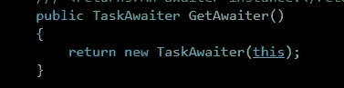

# 等待 C#中的任何类型

> 原文：<https://itnext.io/awaiting-any-type-in-c-44b021c38858?source=collection_archive---------0----------------------->


如果你经常使用 C#中的 async/await 特性(说实话，谁没有)，你可能对 Task 和 Task <t>很熟悉。</t>

更有甚者，如果您使用的是 C#版本≥ C# 8，您甚至可能以前使用过 ValueTask。

这些有什么共同点？非常简单，您可以等待他们来控制您的应用程序逻辑流。您可能倾向于认为这是编译器的魔力，但事实并非如此——毕竟，提到的类型和其他类型一样，只是它们似乎有一些特殊之处，允许它们被“等待”。

# 巧妙的表达

如果我们看一下 C#规范，有一个[段](https://learn.microsoft.com/en-us/dotnet/csharp/language-reference/language-specification/expressions#11882-awaitable-expressions)专门用于一个合适的表达式。现在，让我们跳过等待动态类型的可能性。

那么，一个可盈利的类型需要什么呢？GetAwaiter 的一个可访问的实例或扩展方法(这将在后面派上用场)没有任何参数，返回一个兼容的类型 t。

反过来，兼容的类型需要实现

*   INotifyCompletion(通常是 ICriticalNotifyCompletion)接口，它引入了 OnCompleted 方法。这个方法将被调用来传递给你的一个合适的类型它应该执行的延续。如果你想知道更多关于 INotifyCompletion 和 ICriticalNotifyCompletion 的区别，请查看[斯蒂芬·图布斯的博客](https://devblogs.microsoft.com/pfxteam/whats-new-for-parallelism-in-net-4-5-beta/)！
*   名为的属性已完成。这听起来有点奇怪，因为我们刚刚讨论了负责对延续进行排队的方法。那么，为什么我们需要显式控制呢？这很简单，如果异步状态机确定发生的工作单元**还没有**完成，它将只对一个延续进行排队。因此，我们需要这个属性来解决这个问题。
*   一个 GetResult 方法，用于获取完成后的结果。这个方法的返回类型是可变的，它决定了结果的类型！

所以，你可能从来没有处理过所有这些，你仍然一直使用 async/await，那么在默认情况下谁来处理这些呢？

您通常等待一个**任务**或**任务< T >** ，因此首先要检查的是它如何满足公开一个具有所需功能的 GetAwaiter 方法的第一个要求。

[看着 source.dot.net，这里的](https://source.dot.net/#System.Private.CoreLib/src/libraries/System.Private.CoreLib/src/System/Threading/Tasks/Task.cs,2443)正是:



因此，对于默认情况，似乎有一个默认的 [TaskAwaiter](https://source.dot.net/#System.Private.CoreLib/src/libraries/System.Private.CoreLib/src/System/Runtime/CompilerServices/TaskAwaiter.cs,16e40fc537484d93) 来为我们覆盖其余的需求。事实上，实现也是需要的。它接受任务并公开:

*   IsCompleted，指向任务本身的完成状态
*   OnCompleted，它在内部将延续排队到底层任务上(请随意深入研究——进一步的实现主要关注延续应该如何继续其流程，这可能会根据您的应用程序上下文如何处理同步上下文流程而有很大的不同)
*   GetResult，用于评估底层任务。注意，在这里抛出也是完全合法的，以防工作单元失败。

因此，有了这些知识，我们可以尝试重建我们自己的“awaiter”。

这个例子可能有点傻，但是让我们试着写一个自定义类，它在两秒钟的延迟后查询 google.com，并且可以被等待。

让我们从一个简单的类设置开始:

```
public class GoogleQuerier
{ 
 private async Task<string> GetDelayedGoogleResponse()
 {
  var client = new HttpClient();
  await Task.Delay(2000);
  return await client.GetStringAsync("[https://google.com](https://google.com)");
 }
}
```

到目前为止很简单。现在我们需要勾掉可盈利模式的方框。首先，我们需要实现我们自己的目标:

```
public class GoogleQueryAwaiter : ICriticalNotifyCompletion
{
 private readonly Task<string> _queryTask;

 public GoogleQueryAwaiter(Task<string> queryTask) => _queryTask = queryTask;

 public void OnCompleted(Action continuation) => _queryTask.ContinueWith(_ => continuation());public void UnsafeOnCompleted(Action continuation) => _queryTask.ContinueWith(_ => continuation());

 public bool IsCompleted => _queryTask.IsCompleted;public string GetResult() => _queryTask.Result;
}
```

这本质上非常类似于 TaskAwaiter。我们实现 ICriticalNotifyCompletion，这迫使我们实现 OnCompleted 和 UnsafeOnCompleted。我们简单地通过任务本身的 ContinueWith 对 continuation 进行排队，并通过简单地将任务委托给其他两个方法。

现在，让我们编写 Main 方法来设置整个调用:

```
async Task Main()
{
 var sw = Stopwatch.StartNew();

 var googleQuerier = new GoogleQuerier();
 var queriedData = await googleQuerier;

 Console.WriteLine($"Done - Elapsed time: {sw.Elapsed}");
 Console.WriteLine($"Result length: {queriedData.Length}");
}
```

然而，到目前为止，我们仍然收到一个错误，因为还有一件事要做:我们需要将 GetAwaiter()添加到 GoogleQuerier 类中！

```
public class GoogleQuerier
{
 public GoogleQueryAwaiter GetAwaiter()
 {
  return new GoogleQueryAwaiter(GetDelayedGoogleResponse());
 } ...
}
```

现在一切都编译好了，如果我们检查我们的输出:

```
Done - Elapsed time: 00:00:02.3029731
Result length: 13403
```

太好了，一切都解决了！我们的 GoogleQuerier 现在是可运行的，工作正常(我们等待 2 秒钟，然后得到结果)

# 这对我有什么用？

可以说，您可能永远都不需要编写自己的 awaiter，但是我仍然想介绍这个概念。TaskAwaiter 通常工作做得很好。

整个概念更强大的地方在于，通过实现 GetAwaiter 方法，您可以使任何类型变得可应用。一旦你记住你不一定要让它成为一个实例方法，但是你也可以使用一个扩展方法，那么就没有限制了，你甚至可以扩展框架类！

先说一个简单的:如果你有一个懒惰的<task>>，不停的写就有点烦了</task>

```
await lazy.Value;
```

那么，我们为什么不写一个小的扩展方法来使它变得更简单呢？

```
async Task Main()
{
 var lazy = new Lazy<Task<int>>(() => Task.FromResult(5));
 Console.WriteLine(await lazy);
}public static class LazyExtensions
{
 public static TaskAwaiter<T> GetAwaiter<T>(this Lazy<Task<T>> lazy)
 {
  return lazy.Value.GetAwaiter();
 }
}// 5
```

太棒了。

最近我还处理了一个情况，其中一个方法收到了一个我想“等待”的 cancel token，但是这是不可能的。那么，您会添加另一个参数 CancellationToken 取消时间吗？我们也可以简单地写一个扩展，让一个 CancellationToken 一直可用，直到用完为止！

```
async Task Main()
{
 var cts = new CancellationTokenSource(3000);
 Console.WriteLine("Starting");
 var sw = Stopwatch.StartNew();
 await cts.Token;
 Console.WriteLine($"Done - Elapsed time: {sw.Elapsed}");
}public static class CancellationTokenExtensions
{
 public static TaskAwaiter GetAwaiter(this CancellationToken ct)
 {
  if (ct.IsCancellationRequested) 
  {
   return Task.CompletedTask.GetAwaiter();
  }

  var tcs = new TaskCompletionSource();
  ct.Register(() => tcs.SetResult());
  return tcs.Task.GetAwaiter();
 }
}Done - Elapsed time: 00:00:03.0011042
```

正如您所看到的，我们也可以简单地在 GetAwaiter 中构建我们自己的任务，只要签名匹配，就返回我们喜欢的 waiter。

我们可以做的其他顺利的事情是利用任务。更方便的时候。让我们实现一个合适的元组和列表！

```
async Task Main()
{
 var (t1, t2) = await (Task.FromResult(5), Task.FromResult(3));
 Console.WriteLine($"t1: {t1}, t2: {t2}");var results = await new List<Task<int>>() { Task.FromResult(5), Task.FromResult(3), Task.FromResult(1) };
 Console.WriteLine($"t1: {results[0]}, t2: {results[1]}, t3: {results[2]}");
}public static class WhenAllExtensions
{
 public static TaskAwaiter<(T1 First, T2 Second)> GetAwaiter<T1, T2>(this (Task<T1> First, Task<T2> Second) tuple)
 {
  var (t1Task, t2Task) = tuple;
  return Task.WhenAll(t1Task, t2Task).ContinueWith(_ => (t1Task.Result, t2Task.Result)).GetAwaiter();
 }

 public static TaskAwaiter<T[]> GetAwaiter<T>(this List<Task<T>> list)
 {
  return Task.WhenAll(list).GetAwaiter();
 }
}t1: 5, t2: 3
t1: 5, t2: 3, t3: 1
```

整洁！

最终，我认为自定义 awaitables 真的很有趣。它们可能不是一个应该放在任何地方的特性，但是在某些情况下它会非常有用(tuple one 实际上是我每天都在使用的一个特性！).这绝对是鸭子打字的特性之一，玩起来感觉很好。