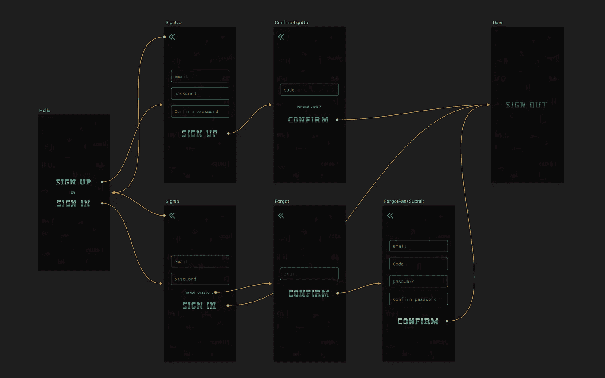
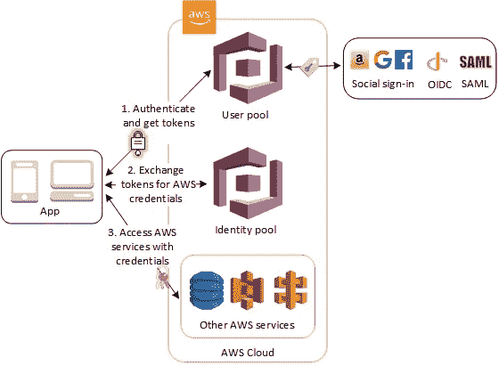
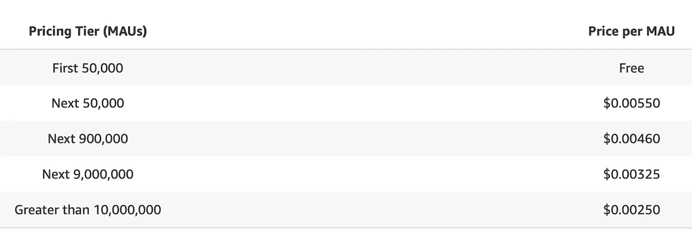
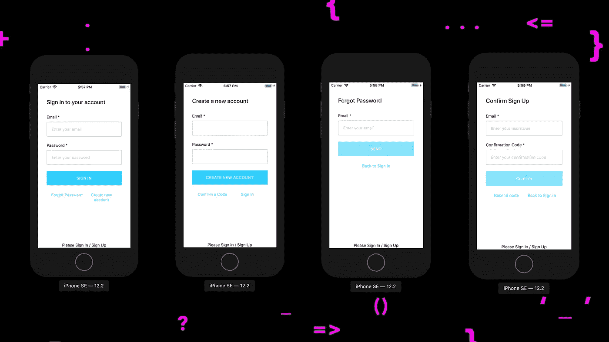
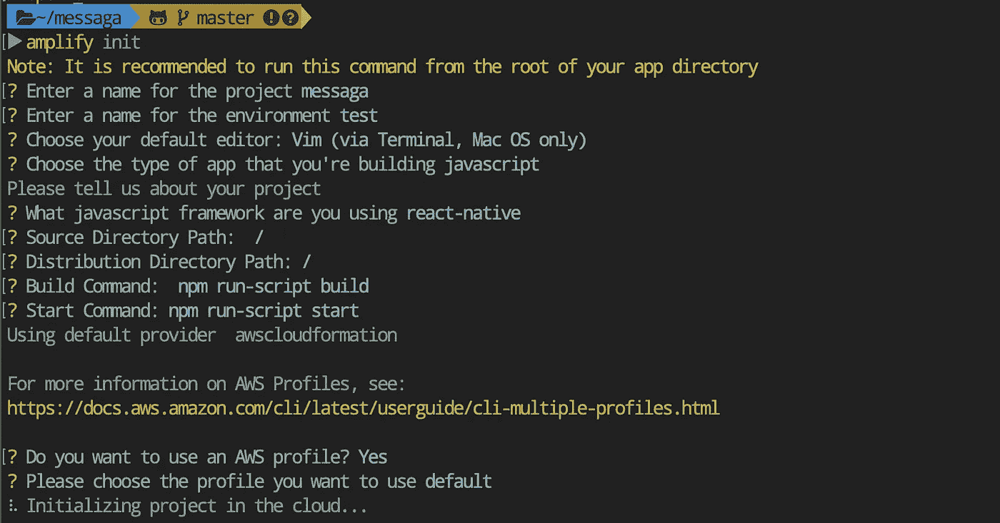
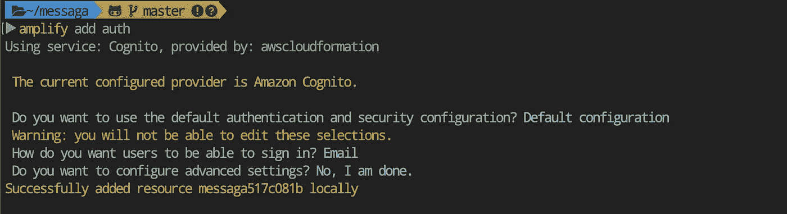
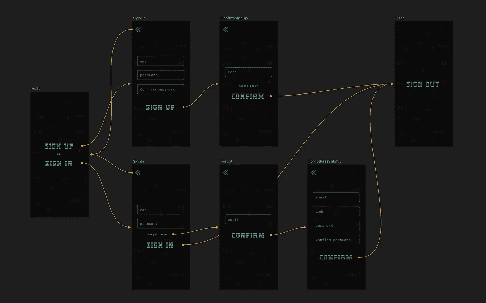

# AWS 放大+反应本地/认证🔐完整设置

> 原文：<https://itnext.io/aws-amplify-react-native-authentication-full-setup-7764b452a138?source=collection_archive---------0----------------------->


在我的渠道订户中请求最多的话题之一是 React 本机应用程序中的身份验证和授权。因此，我决定专门为这个问题写一篇文章，但是在我们开始编码之前，有必要处理一下身份验证/授权的定义。

**认证**是使用一些独特的信息(指纹、虹膜颜色、声音等)来验证主体与其试图冒充的人的一致性。)，在最简单的情况下——借助邮件和密码。

**授权**是根据先前执行的认证来验证和确定执行特定动作的权限

在本文的最后，我们将制作这个移动应用程序:



身份验证几乎是任何应用程序不可或缺的一部分。知道用户是谁、用户的唯一标识符、用户拥有什么权限以及他们是否登录，允许您的应用程序显示正确的视图并返回当前登录用户的正确数据。

大多数应用程序需要注册用户、登录、处理加密和更新密码以及许多其他与身份管理相关的任务的机制。现代应用程序通常需要 OAUTH(开放式身份验证)、MFA(多因素身份验证)和 TOTP(基于时间的时间密码)。

过去，开发人员必须从头开始手动构建所有这些身份认证功能。光是这项任务就可能花费开发团队几周甚至几个月的时间来做好每一件事并保证它的安全。在本文中，您将了解如何使用 Amazon Cognito 和 AWS Amplify 在 React 本地应用程序中正确安全地实现身份验证。

Amazon Cognito 是 AWS 的完全托管身份服务。Cognito 提供简单安全的用户注册、登录、访问控制、令牌更新和用户身份管理。Cognito 可以扩展到数百万用户，还支持登录脸书、谷歌和亚马逊等社交网络提供商。

# **Cognito 由两个主要部分组成:用户池和身份池。**

**用户池** —用户池提供了一个安全的用户目录，可存储您的所有用户，并可扩展至数亿用户。这是一项全面管理的服务。像无服务器技术一样，用户池易于配置，无需担心支持任何基础设施。用户池是管理所有注册和登录帐户的用户的，也是我们将在本文中关注的主要部分。

**身份池** —身份池允许您授权登录到您的应用程序的用户访问各种其他 AWS 服务。假设您想让一个用户访问一个 lambda 函数，这样他就可以从另一个 API 接收数据。您可以在创建身份池时指定这一点。用户池包括这样一个事实，即 Cognito 甚至脸书或谷歌用户池可以是这些标识符的来源。

# Amazon Cognito 用户池和身份池一起使用的场景。

参见通用 Amazon Cognito 脚本的图表。这里的目标是验证您的用户，然后让他访问另一个 AWS 服务。



1.在第一阶段，应用程序的用户通过用户池进入系统，并在成功认证后接收用户池的令牌。

2.然后，您的应用程序通过身份池将用户池令牌交换为 AWS 凭证。

3.最后，您的应用程序用户可以使用这些 AWS 凭证来访问其他 AWS 服务，如亚马逊 S3 或 DynamoDB。

Cognito 用户池允许您的应用程序调用服务的各种方法来管理用户身份验证的各个方面，包括:

*   用户注册
*   用户登录
*   用户注销
*   更改用户密码
*   重置用户密码
*   MFA 代码验证
*   Amazon Cognito 与 AWS Amplify 的集成

AWS Amplify 以多种方式支持 Amazon Cognito。首先，您可以直接从 AWS Amplify 命令行界面创建和配置 Amazon Cognito 服务。通过 CLI 创建认证服务，您可以使用 Amplify JavaScript 客户端库从 JavaScript 应用程序调用各种方法(例如，注册、登录和注销)。
Amplify 还具有预配置的用户界面组件，允许您仅用几行代码为 React、React Native、Vue 和 Angular 等环境构建完整的认证流程。

你问这一切要花多少钱？

**只为您使用的东西付费。没有最低费用。**

使用 Amazon Cognito Identity 创建用户池，您只需为每月活跃用户数(MAU)付费。mau 是在一个日历月内至少执行过一次身份验证操作的用户:注册、授权、令牌续订或密码更改。活跃用户和非活跃用户在本日历月的后续会话不支付费用。



编码时间👨🏼‍💻👩🏻‍💻

# 第一部分

这部分的所有代码都可以在 [Github](https://github.com/react-native-village/messaga/tree/Part1) 上找到。



# 第一步

**创建新项目⚛️**

```
react-native init [messaga](https://github.com/react-native-village/messaga)
```

我们开始这个项目🚀

ios

```
cd [messaga](https://github.com/react-native-village/messaga) && react-native run-ios
```

机器人

```
cd [messaga](https://github.com/react-native-village/messaga) && react-native run-android
```

# 第二步

**我们连接图标👾**

由于图标由 AWS Amplify 框架使用，因此我们根据[指令](https://github.com/oblador/react-native-vector-icons#installation)连接它们📃。
检查错误。添加到 **App.js**

```
import Icon from 'react-native-vector-icons/FontAwesome5'const App = () => {
  return (
    <>
      <Icon name="comments" size={30} color="#900" />
    </>
  )
}
```

# 第三步

**注册您的 AWS 帐户**

我们根据[这个指令](https://aws-amplify.github.io/docs/)进行注册📃并根据视频教程检查所有 5 个步骤..
注意！！！你需要一张银行卡💳，哪里应该超过 1 个亿💵
在这里，我们看到并放置了 Amplify 命令行界面(CLI)

# 第四步

在 React 本地项目中初始化 AWS Amplify

在 React 本地项目的根目录中初始化我们的后端。

```
amplify init
```

我们回答这些问题:



接下来是项目的初始化。🚀
⠧在云端初始化项目…
您的项目已成功初始化并连接到云端！

# 第五步

**连接认证插件— Auth🔐**

现在应用程序已经在云中了，您可以添加一些特性，比如允许用户注册我们的应用程序并登录。

我们连接认证插件。

```
amplify add auth
```

选择默认配置。这将在本地将授权资源配置添加到您的 **amplify/backend/auth** 目录中。

**选择我们想要使用的配置文件。默认。输入用户将如何登录。邮件(短信注销钱)。**



已成功在本地添加资源 yourname

**向云发送更改💭**

```
amplify push
```

✔所有的资源都在云中更新

# 第六步

**连接 AWS 放大器以对⚛️本地项目做出反应**

本[手册](https://aws-amplify.github.io/docs/js/react)中的详细信息📃简单地说，像这样的一条直线:

```
yarn add aws-amplify @aws-amplify/core aws-amplify-react-native amazon-cognito-identity-js @react-native-community/netinfo
```

安装后，请务必转到 ios 文件夹并设置 pod

```
cd ios && pod install && cd ..
```

# 第七步

**编辑项目结构**

创建 **/src** 目录，并将 **App.js** 文件转移到该目录，重命名为 **index.js** ，在根目录 **/yourname/index.js** 中包含以下内容
编辑导入

```
- import App from './App'
+ import App from './src'
```

# 第八步

最小项目配置和认证器模块

Amplify.configure —项目配置

认证器—[AWS Amplify 认证模块](https://aws-amplify.github.io/docs/js/authentication#using-components-in-react--react-native)为想要创建用户认证功能的开发人员提供认证 API 和构建块。

运行模拟器

# 第九步

编辑 App.js 中的输入

# 第十步

**改变 UI🖌的主题**

我们为未来的 components/src/components/index . js 创建一个导出点

```
export * from './AmplifyTheme'
```

并据此用内容创建/src/components/amplify theme/index . js**文件本身**

并将主题插入 Authenticator src/index . js**组件**

# **步骤 11**

****连接语言支持****

**将导出添加到/src/components/index.js**

```
export * from './Localei18n'
```

**创建/src/components/localei 18n/index . js 文件，其中包含以下内容**

**并且我们连接 src/index.js 中的 Localei18n 组件**

**第一部分完成✅**

# **第二部分**

**这部分的所有代码都可以在 [Github](https://github.com/react-native-village/messaga/tree/Part2) 上找到。**

****

**首先，在官方文件[中](https://docs.amplify.aws/lib/auth/manageusers/q/platform/js#managing-security-tokens) Amplify 说**

> ***使用标准存储适配器(浏览器中的* `*localStorage*` *和 React Native 上的* `*AsyncStorage*` *)时，数据以不加密方式存储。Amplify 让您可以选择使用自己的存储对象来保存数据。有了这个，你可以编写一个类似于*的简单的库包装器**
> 
> **`*react-native-keychain*`**
> 
> **`*react-native-secure-storage*`**
> 
> **世博会的安全商店**

**数据以未加密的形式存储，这是🕷信息安全的一个风险，可能会给🕸.带来负面影响**

**其次，来自 Amplify 的标准 UI 并不总是满足来自客户的 UX，所以我们将在这一部分解决这两个问题。**

**👉🏻[未完待续](https://www.jscamp.app/docs/auth1-02)**