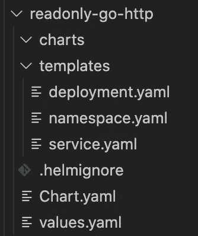
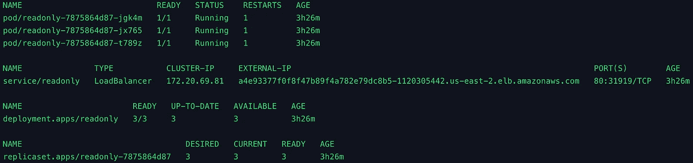

# EKS 自动气象站 CDK-操纵舵图

> 原文：<https://itnext.io/aws-cdk-for-eks-handling-helm-charts-aa002afedde4?source=collection_archive---------4----------------------->

在之前的一篇文章中，我简要介绍了如何使用 AWS 云开发工具包(CDK)和 Java 来构建亚马逊 EKS 集群，并使用 Kubernetes (k8s)清单来安装资源。在这篇文章中，我将看看自动气象站 CDK 如何处理舵图。

# 舵

根据[舵手文档记载](https://helm.sh/)舵手是:

> Kubernetes 的包管理器

文件继续写道:

> Helm 是查找、共享和使用为 Kubernetes 构建的软件的最佳方式。

Helm 是一个成熟的应用程序，是云本地计算基金会(CNCF)的[毕业项目](https://www.cncf.io/projects/)。有了 helm charts，k8s 用户可以轻松地*创建、版本化、共享和发布运行在 k8s 上的*软件。

# 图表

头盔包被称为图表。

> Helm 使用一种叫做图表的打包格式。图表是描述一组相关 Kubernetes 资源的文件集合。一个图表可以用来部署简单的东西，比如 memcached pod，或者复杂的东西，比如带有 HTTP 服务器、数据库、缓存等的完整 web 应用程序堆栈。



舵图文件系统布局

图表很酷的一点是，它们可以用于跨 k8s 集群安装资源；它们不限于单个名称空间。而且，这些资源都与正在安装的软件包的范围和版本相关。

尽管图表包括其他部分，但它们主要由模板文件和值文件组成。以下示例显示了 k8s 服务的模板文件。

```
kind: Service
apiVersion: v1
metadata:
  name: {{ .Values.service.name }}
  namespace: {{ .Values.service.namespace }}
  labels: {{ toYaml .Values.service.labels | nindent 4 }}
  {{- if .Values.service.annotations }}
  annotations:
    {{- toYaml .Values.service.annotations | nindent 4 }}
  {{- end }}
spec:
  ports:
    - port: {{ .Values.service.port }}
      targetPort: {{ .Values.service.targetPort }}
      protocol: TCP
      name: http
  type: {{ .Values.service.type }}
  selector: {{ toYaml .Values.service.selector | nindent 4 }}
```

模板和值背后的思想是配置既统一又灵活。模板中提供了基本配置；这减少了图表实例之间的*无差别重载*。值文件提供了定制点；用户可以提供自己的配置元素来自定义安装到集群的软件包。这也遵循了 12 因素应用程序方法学的[配置实践。下面的清单是*值*文件的一部分，它允许用户定制图表安装的服务。](https://12factor.net/config)

```
service:
  name: readonly
  namespace: readonly
  type: LoadBalancer
  port: 80
  targetPort: 8080
  labels: {owner: "jimmy", env: "dev", app: "readonly"}
  selector: {app: "readonly"}
  annotations: {service.beta.kubernetes.io/load-balancer-source-ranges: "10.0.0.1/32,192.168.0.1/32"}
```

前面的 YAML 文件使用[流样式](https://yaml.org/spec/1.2/spec.html#Flow)，通过显式指示器使其成为可能；这使得 YAML 更少依赖空白和缩进。为了使用这个标记，在模板中使用了 *toYaml* 函数。

```
labels: {{ toYaml .Values.service.labels | nindent 4 }}
```

*toYaml* 函数将格式转换为 Yaml，结果通过管道传递给 *nindent* 函数，在换行符后将元素缩进 4 个空格。如下面的代码片段所示，由*helm template readonly-go-http*命令创建，YAML 输出由模板和值组成。

```
kind: Service
apiVersion: v1
metadata:
  name: readonly
  namespace: readonly
  labels:
    app: readonly
    env: dev
    owner: jimmy
  annotations:
    service.beta.kubernetes.io/load-balancer-source-ranges: 10.0.0.1/32,192.168.0.1/32
spec:
  ports:
    - port: 80
      targetPort: 8080
      protocol: TCP
      name: http
  type: LoadBalancer
  selector:
    app: readonly
```

*舵模板*命令非常方便地验证舵图表模板和值的输出。使用 *kubectl apply* 命令可以将该输出直接应用到 Kubernetes 集群。

K8s 用户通常通过 *helm install* 命令安装图表，如下例所示。

```
helm install readonly jimmy-charts/readonly-go-http --debug -f readonly-go-http/values.yaml
```

在前面的例子中， *readonly* 是安装的 k8s 包的名称。这是程序包在群集上的名称。*Jimmy-charts/readonly-go-http*参数是用于安装实例的 helm 存储库和图表。在正常操作中通常不使用 *— debug* 参数，但是当图表没有正确安装时，它很有用。*-f readonly-go-http/values . YAML*是 k8s 用户提供自定义值的文件。

# 带自动气象站 CDK 的舵图

将 helm 与 AWS CDK 一起使用类似于 k8s 清单的处理方式。以下示例使用了 *HelmChart。构建器*对象为由 *cdk synth* 和 *cdk deploy* 命令生成的 AWS CloudFormation 模板构建舵图条目。

```
HelmChart.Builder.create(this, "readonly")
                .cluster(cluster)
                .chart("readonly-go-http")
                .repository("[https://git-helm.jimmyray.io](https://git-helm.jimmyray.io)")
                .values(YamlParser.parse(readonlyValues))
                .createNamespace(false)
                .version("0.1.1")
                .build();
```

*集群*参数指向安装了舵轮图的集群对象。*图表*参数是存储在舵图表存储库中的舵图表的名称:[https://git-helm . Jimmy ray . io](https://git-helm.jimmyray.io)。values 参数是经过解析的 YAML 值字符串。最后，*版本*参数指向舵图版本。

# 价值观念

final Values 类将值 YAML 文件存储在最终的 Java 文本块字符串中。如前一篇文章所述，这个 YAML 文件可以存储在一个外部文件中，并用 Java *FileReader* 或 *InputStream* 读取。

```
public final class Values {
    public static final String readonlyValues = """
            namespace:
              name: readonly
              labels: {owner: "jimmy",env: "dev",app: "readonly"}

            service:
              name: readonly
              namespace: readonly
              type: LoadBalancer
              port: 80
              targetPort: 8080
              labels: {owner: "jimmy", env: "dev", app: "readonly"}
              selector: {app: "readonly"}
              annotations: {service.beta.kubernetes.io/load-balancer-source-ranges: "10.0.0.1/32,192.168.0.1/32"}
...
             """;
...
```

*YamlParse.parse(…)* 方法解析 YAML 值，并将其作为 [AWS CloudFormation 自定义资源](https://docs.aws.amazon.com/AWSCloudFormation/latest/UserGuide/template-custom-resources.html)提供给堆栈。下面的片段来自 *cdk synth* 命令输出。

```
readonly40AF6D61:
    Type: Custom::AWSCDK-EKS-HelmChart
...
      Chart: readonly-go-http
      Version: 0.1.1
      Values: '{"namespace":{"name":"readonly","labels":{"owner":"jimmy","env":"dev","app":"readonly"}},"service":{"name":"readonly","namespace":"readonly","type":"LoadBalancer","port":80,"targetPort":8080,"labels":{"owner":"jimmy","env":"dev","app":"readonly"},"selector":{"app":"readonly"},"annotations":{"service.beta.kubernetes.io/load-balancer-source-ranges":"10.0.0.1/32,192.168.0.1/32"}},"deployment":{"name":"readonly","namespace":"readonly","labels":{"owner":"jimmy","env":"dev","app":"readonly"},"matchLabels":{"app":"readonly"},"revisionHistoryLimit":3,"podSecurityContext":{"fsGroup":2000},"replicaCount":3,"podTemplateLabels":{"owner":"jimmy","env":"dev","app":"readonly"},"containerName":"readonly","image":{"repository":"public.ecr.aws/r2l1x4g2/go-http-server","pullPolicy":"IfNotPresent","tag":"v0.1.0-23ffe0a715"},"securityContext":{"capabilities":{"drop":["ALL"]},"readOnlyRootFilesystem":true,"runAsNonRoot":true,"runAsUser":1000,"allowPrivilegeEscalation":false},"resources":{"limits":{"cpu":"200m","memory":"20Mi"},"requests":{"cpu":"100m","memory":"10Mi"}},"readinessProbe":{"tcpSocket":{"port":8080},"initialDelaySeconds":5,"periodSeconds":10},"livenessProbe":{"tcpSocket":{"port":8080},"initialDelaySeconds":15,"periodSeconds":20},"ports":[{"containerPort":8080}]}}'
...
```

像 AWS CDK 处理 k8s 清单一样，helm 图表是在部署过程中创建的，由 *cdk deploy* 启动，使用 AWS CDK 资产。提醒一下，在 *cdk 引导*操作期间，这些资产被安装在 *CDKToolkit* 堆栈中。CDkToolkit 提供了 helm 处理程序，使 *helm* 通过 [AWS Lambda](https://aws.amazon.com/lambda/) 调用目标集群。

已安装的 helm chart 包含 *readonly* 包，包括*名称空间*、*部署*和*服务*资源，以及应用*部署*隐式创建的 [*复制集*](https://kubernetes.io/docs/concepts/workloads/controllers/replicaset/) 资源。最后，还有一个由 Kubernetes AWS 云提供商创建的 AWS 经典负载平衡器(ELB)。

```
k get all -n readonly
```



舵图安装程序包

ELB 配备了一个 AWS 安全组，其入站规则与在*service.beta.kubernetes.io/load-balancer-source-ranges*注释中提供的 CIDR 范围相匹配。


ELB 安全组入站规则

# 摘要

AWS CDK 处理舵图并创建 AWS 云形成资源，以将包作为 Kubernetes 资源来应用。这些软件包的应用由 AWS CDK 引导操作安装的 AWS Lambda 资产处理。有了 AWS CDK，k8s 开发者可以使用他们已经熟悉的工具(比如 Java)在云中构建。这种对多种语言的开放性提高了采用率，并降低了云开发人员的准入门槛。

*这个帖子的示例代码可以从这个*[*GitHub repo*](https://github.com/jimmyraywv/aws-cdk-eks)*中得到。*

*掌舵人图表详见本* [*GitHub 回购*](https://github.com/jimmyraywv/helm-charts) *。*