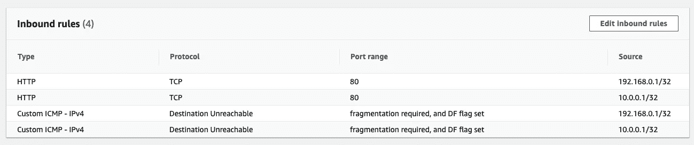
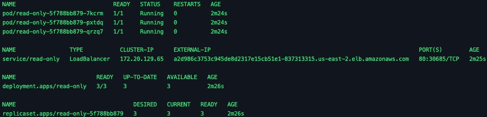
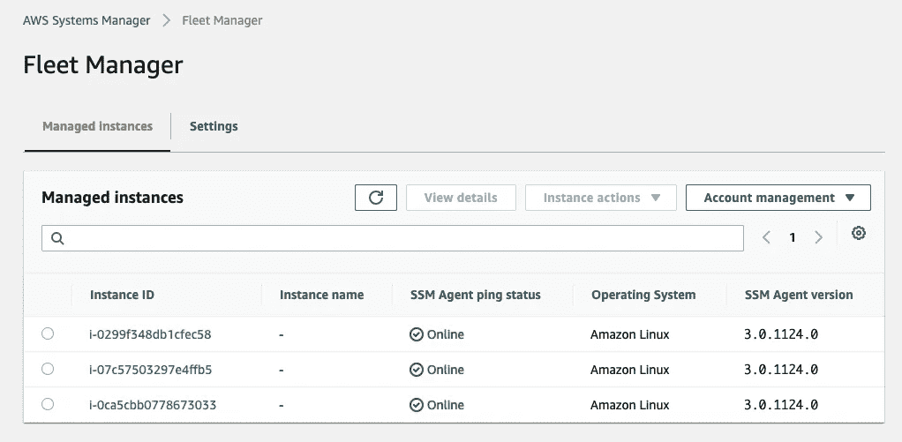

# EKS 的 AWS CDK-Kubernetes 清单处理

> 原文：<https://itnext.io/aws-cdk-for-eks-kubernetes-manifest-handling-ebdec52e7f01?source=collection_archive---------4----------------------->

YAML——构建与解析

> …Jimmy Ray 跟进了上一篇关于使用 AWS CDK 在亚马逊 EKS 上部署一个样本 Java 应用程序的文章，这篇文章深入探讨了 Kubernetes YAML 清单。从这些是什么到如何与 AWS CDK 一起使用它们，这是一个很好的帖子，可以帮助您了解在管理 Kubernetes 清单以及由此创建的 Kubernetes 资源时有哪些选择。— **Ricardo Sueiras，AWS 开源新闻和更新#68**

在[之前的一篇文章](https://jimmy-ray.medium.com/aws-cdk-where-imperative-meets-declarative-3d23fd4a4dbd)中，我简要介绍了如何使用 AWS Cloud Development Kit (CDK)和 Java 来构建亚马逊 EKS 集群和相关的 AWS 资源(VPC、子网等)。)，并将应用程序部署到创建的集群。在这篇文章中，我将看看 CDK 如何处理库伯内特 YAML 清单。

# 表明

任何与 Kubernetes(又名 k8s)合作过的人可能也处理过 YAML 的货物清单文件。以下示例是用于创建 k8s 命名空间的 YAML 清单。

```
apiVersion: v1
kind: Namespace
metadata:
  name: read-only
  labels:
    owner: jimmy
    env: dev
    app: read-only
```

通常，这些文件通过 *kubectl apply* 命令应用到 k8s 集群。以这种声明的方式将更改应用到集群被认为是一种最佳实践，而不是使用更强制性的 *kubectl create* 命令。

将 AWS CDK 与 Java 一起使用时,[kubernetasmifest。构建器](https://docs.aws.amazon.com/cdk/api/latest/java/software/amazon/awscdk/services/eks/KubernetesManifest.Builder.html)可以用来创建 k8s 清单。以下示例使用多个 k8s 清单对象(命名空间、部署、服务)创建一个 k8s 清单。

```
KubernetesManifest.Builder.*create*(this, "read-only")
        .cluster(cluster)
        .manifest((List<? extends Map<String, ? extends Object>>) List.*of*(ReadOnlyNamespace.*manifest*,
                ReadOnlyDeployment.*manifest*, ReadOnlyService.*manifest*))
        .overwrite(true)
        .build();
```

如代码所示，*kubernetasmifest*对象是地图对象的列表(序列)。这些映射还可以包含表示 YAML 结构的映射和列表，如下例所示。

```
public final class ReadOnlyNamespace {

    public static Map<String, ? extends Object> *manifest*;

    // Get properties object
    private static final Properties *properties* = Config.*properties*;

    static {
        *manifest* = Map.*of*("apiVersion", "v1",
                "kind", "Namespace",
                "metadata", Map.*of*("name", "read-only", "labels",
                        Map.*of*("owner", Strings.*getPropertyString*("labels.owner", *properties*,
                                Constants.*NOT_FOUND*.getValue()),
                                "env",
                                Strings.*getPropertyString*("labels.env", *properties*,
                                        Constants.*NOT_FOUND*.getValue()),
                                "app",
                                Strings.*getPropertyString*("labels.app", *properties*,
                                        Constants.*NOT_FOUND*.getValue())))
        );
    }
}
```

当 CDK 为这个栈创建 CloudFormation 模板时，k8s 清单作为 JSON 定制资源存储在 CloudFormation 模板中。在下面的示例中，三个 k8s 配置(名称空间、部署、服务)作为 JSON 存储在 CloudFormation 定制资源中。

```
readonlyB1EB06D3:
  Type: Custom::AWSCDK-EKS-KubernetesResource
  Properties:
    ServiceToken:
      Fn::GetAtt:
        - awscdkawseksKubectlProviderNestedStackawscdkawseksKubectlProviderNestedStackResourceA7AEBA6B
        - Outputs.EksStackawscdkawseksKubectlProviderframeworkonEvent47AB1AD9Arn
    Manifest: '[{"apiVersion":"v1","kind":"Namespace","metadata":{"name":"read-only","labels":{"aws.cdk.eks/prune-c8157df28ab1a464bab539b75e7483fab124b22805":"","owner":"jimmy","env":"dev"}}},{"apiVersion":"apps/v1","kind":"Deployment","metadata":{"name":"read-only","namespace":"read-only","labels":{"aws.cdk.eks/prune-c8157df28ab1a464bab539b75e7483fab124b22805":"","app":"read-only","owner":"jimmy","env":"dev"}},"spec":{"revisionHistoryLimit":3,"selector":{"matchLabels":{"app":"read-only"}},"replicas":3,"strategy":{"type":"RollingUpdate","rollingUpdate":{"maxSurge":10,"maxUnavailable":1}},"template":{"metadata":{"labels":{"app":"read-only","owner":"jimmy","env":"dev"}},"spec":{"securityContext":{"fsGroup":2000},"containers":[{"name":"read-only","image":"public.ecr.aws/r2l1x4g2/go-http-server:v0.1.0-23ffe0a715","imagePullPolicy":"IfNotPresent","securityContext":{"allowPrivilegeEscalation":false,"runAsUser":1000,"readOnlyRootFilesystem":true},"resources":{"limits":{"cpu":"200m","memory":"20Mi"},"requests":{"cpu":"100m","memory":"10Mi"}},"readinessProbe":{"tcpSocket":{"port":8080},"initialDelaySeconds":5,"periodSeconds":10},"livenessProbe":{"tcpSocket":{"port":8080},"initialDelaySeconds":15,"periodSeconds":20},"ports":[{"containerPort":8080}],"volumeMounts":[{"mountPath":"/tmp","name":"tmp"}]}],"volumes":[{"name":"tmp","emptyDir":{}}]}}}},{"kind":"Service","apiVersion":"v1","metadata":{"name":"read-only","namespace":"read-only","labels":{"aws.cdk.eks/prune-c8157df28ab1a464bab539b75e7483fab124b22805":"","app":"read-only","owner":"jimmy","env":"dev"}},"spec":{"ports":[{"port":80,"targetPort":8080,"protocol":"TCP","name":"http"}],"type":"LoadBalancer","selector":{"app":"read-only"}}}]'
    ClusterName:
      Ref: cdkeksDB67CD5C
    RoleArn:
      Fn::GetAtt:
        - cdkeksCreationRole8B89769F
        - Arn
    PruneLabel: aws.cdk.eks/prune-c8157df28ab1a464bab539b75e7483fab124b22805
    Overwrite: true
  DependsOn:
    - cdkeksKubectlReadyBarrierA155E2C2
  UpdateReplacePolicy: Delete
  DeletionPolicy: Delete
  Metadata:
    aws:cdk:path: EksStack/read-only/Resource/Default
```

# 解析 YAML

根据 k8s 对象配置的复杂程度，这些*kubernetasmifest*对象在 Java 中构建起来也可能相当复杂。如果 k8s 配置已经作为维护的 YAML 文件存在，那么 [SnakeYAML](https://bitbucket.org/asomov/snakeyaml/src/master/) 可以用于解析原始 YAML，并创建*kubernetsmanifest*对象所需的对象的*列表。*

在下面的例子中，我将原始的 YAMLs 作为静态的[文本块](https://docs.oracle.com/en/java/javase/15/text-blocks/index.html)存储在最终的 Java 类中。Java 文本块是 Java 中相对较新的内容，类似于 Groovy 语言中的[三双引号字符串。文本块是保留空白的多行文字字符串；它们是储存 YAML 的理想选择。这些 YAMLs 也可以存储在外部文件中，并通过 Java](https://groovy-lang.org/syntax.html#_triple_double_quoted_string) [FileReader](https://docs.oracle.com/en/java/javase/11/docs/api/java.base/java/io/FileReader.html) 或 [InputStream](https://docs.oracle.com/en/java/javase/11/docs/api/java.base/java/io/InputStream.html) 类读取。

```
*/**
 * Contains static text blocks of K8s manifest YAMLs
 */* public final class Yamls {
    public static final String *namespace* = """
                                    apiVersion: v1
                                    kind: Namespace
                                    metadata:
                                      name: read-only
                                      labels:
                                        owner: jimmy
                                        env: dev""";

    public static final String *deployment* = """
            apiVersion: apps/v1
            kind: Deployment
            metadata:
              name: read-only
              namespace: read-only
              labels:
                app: read-only
                owner: jimmy
                env: dev
            spec:
              revisionHistoryLimit: 3
              selector:
                matchLabels:
                  app: read-only
              replicas: 3
...
```

为了解析 YAML，我使用 SnakeYAML。在下面的例子中，我编写了一个带有静态方法的实用程序类，使用非线程安全的 *Yaml* 对象来解析字符串。

```
package io.jimmyray.utils;

import io.jimmyray.aws.cdk.manifests.Yamls;
import org.yaml.snakeyaml.Yaml;
import java.util.Map;

*/**
 * Provides helper methods for SnakeYaml parser
 */* public class YamlParser {
    public static void main(final String[] args) {
        Map<String, Object> out = YamlParser.*parse*(Yamls.*namespace*);
        System.*out*.println(out);

        out = YamlParser.*parse*(Yamls.*deployment*);
        System.*out*.println(out);

        out = YamlParser.*parse*(Yamls.*service*);
        System.*out*.println(out);
    }

    */**
     * Parses YAML String and returns Map
     ** ***@param*** *in
     ** ***@return*** **/* public static Map<String, Object> parse(final String in) {
        Yaml yaml = new Yaml();
        return yaml.load(in);
    }

    */**
     * Parses YAML String of multiple objects and returns Iterable
     ** ***@param*** *in
     ** ***@return*** **/* public static Iterable<Object> parseMulti(final String in) {
        Yaml yaml = new Yaml();
        return yaml.loadAll(in);
    }
}
```

通过使用 *List.of()* 方法，从 *parse* 方法返回的对象可以在*kubernetasmifest*列表对象中使用，如下面的代码片段所示。

```
KubernetesManifest.Builder.create(this, "read-only")
                .cluster(cluster)
                .manifest(List.of(YamlParser.parse(Yamls.namespace),
                        YamlParser.parse(Yamls.deployment),
                        YamlParser.parse(Yamls.service.replace("<REMOTE_ACCESS_CIDRS>",
                              Strings.getPropertyString("remote.access.cidrs", properties, "")))))
                .overwrite(true)
                .build();
```

注意，我用一个已解析的属性替换了*<REMOTE _ ACCESS _ CIDRS>*字符串。这会将逗号分隔的 CIDR 范围插入到*service.beta.kubernetes.io/load-balancer-source-ranges*注释中。这导致为创建负载平衡器时创建的安全组添加入站 IP 规则。

```
annotations:
                service.beta.kubernetes.io/load-balancer-source-ranges: <REMOTE_ACCESS_CIDRS>
```



ELB 入境规则

使用前面的*kubernetsmanifest*对象创建的堆栈使用在 *cdk 引导*操作期间安装在 *CDKToolkit* 堆栈中的 CDK 资产，通过 [AWS Lambda](https://aws.amazon.com/lambda/) 对目标集群进行 *kubectl* 调用。结果是在下面的 *kubectl* 命令中看到的对象。

```
kubectl -n read-only get all
```



CDK 创作的 Kubernetes 物品

# 从托管的 Git 存储库中提取原始文件

另一种获取 YAML 的方法是直接从托管的 Git 仓库(比如 GitHub)中获取原始文件。下面的 *WebRetriever* 方法就是这样做的，它使用了 [URLConnection](https://docs.oracle.com/en/java/javase/15/docs/api/java.base/java/net/URLConnection.html) 和 [BufferedReader](https://docs.oracle.com/en/java/javase/15/docs/api/java.base/java/io/BufferedReader.html) 对象。文件被下载并存储在 Java 文本块中。

```
*/**
 * Get raw file from GitHub
 ** ***@param*** *in
 ** ***@return*** *** ***@throws*** *IOException
 */* public static String getRaw(final String in) throws IOException {
    URL url;
    String file = """
            """;
    url = new URL(in);
    URLConnection uc;
    uc = url.openConnection();
    uc.setRequestProperty("X-Requested-With", "Curl");

    BufferedReader reader = new BufferedReader(new InputStreamReader(uc.getInputStream()));
    String line = null;
    while ((line = reader.readLine()) != null)
        file = file + line + "\n";

    return file;
}
```

下载后， *YamlParser.parseMulti(…)* 方法解析下载文件中的多个清单。

```
*/**
 * Parses YAML String of multiple objects and returns Iterable
 ** ***@param*** *in
 ** ***@return*** **/* public static Iterable<Object> parseMulti(final String in) {
    Yaml yaml = new Yaml();
    return yaml.loadAll(in);
}
```

然后解析后的 YAML 作为一个包含每个 YAML 清单的 [Iterable](https://docs.oracle.com/en/java/javase/15/docs/api/java.base/java/lang/Iterable.html) 返回，然后可以被迭代并添加到*kubernetsmain。建造者*。

```
/*
 * Parse multiple docs in same string
 */
String yamlFile = null;

/*
 * Try to get the YAML from GitHub
 */
try {
    yamlFile = WebRetriever.*getRaw*(Strings.*getPropertyString*("ssm.agent.installer.url", properties, ""));
} catch (IOException e) {
    e.printStackTrace();
}

if (yamlFile == null) yamlFile = Yamls.*ssmAgent*;

if (null != yamlFile && !yamlFile.isBlank()) {

    Iterable<Object> manifestYamls = YamlParser.*parseMulti*(yamlFile);
    List manifestList = new ArrayList();
    for (Object doc : manifestYamls) {
        manifestList.add((Map<String, ? extends Object>) doc);
    }

    KubernetesManifest.Builder.*create*(this, "ssm-agent")
            .cluster(cluster)
            .manifest(manifestList)
            .overwrite(true)
            .build();
}
```

在上面的示例中，YAML 被检索并用于一个 [AWS Systems Manager (SSM)代理安装程序](https://github.com/aws-samples/ssm-agent-daemonset-installer) k8s [Daemonset](https://kubernetes.io/docs/concepts/workloads/controllers/daemonset/) 资源，该资源将节点连接到 SSM，用于机群管理和其他操作用例。使用 SSM 代理将不再需要节点的 SSH 密钥。



AWS 系统经理车队管理控制台

# 排序配置

根据 [kubernetes.io](https://kubernetes.io/docs/concepts/configuration/overview/) 的说法，在同一个文件(甚至目录)中管理多个相关的配置被认为是最佳实践。在 AWS CDK 中，多个相关配置应该在同一个*kubernetasmifest 中进行管理。构建器*对象。使用多个*kubernetasmifest。管理相关 k8s 资源的构建器*对象，比如那些具有依赖关系的对象，会导致不确定的行为(竞争条件),从而导致 *kubectl apply* 调用失败。配置存储在 Java 列表中，这些列表是有序的序列，所以让代码来管理操作的依赖关系和顺序。

# 摘要

使用 AWS CDK，有多种方法来处理 YAML 和用于创建 Kubernetes 资源的结果对象图。

*这个帖子的示例代码可以从这个*[*GitHub repo*](https://github.com/jimmyraywv/aws-cdk-eks)*中得到。*