# AWS:cloud formation-嵌套堆栈和堆栈参数导入/导出

> 原文：<https://itnext.io/aws-cloudformation-nested-stacks-and-stacks-parameters-import-export-55d517c5008b?source=collection_archive---------0----------------------->


[AWS cloud formation 中的嵌套堆栈](https://docs.aws.amazon.com/AWSCloudFormation/latest/UserGuide/using-cfn-nested-stacks.html)是使用`[AWS::CloudFormation::Stack](https://docs.aws.amazon.com/AWSCloudFormation/latest/UserGuide/aws-properties-stack.html)`从另一个“父”堆栈创建的堆栈。

嵌套堆栈背后的主要思想是避免编写多余的代码，并使模板可重用。

相反，模板只创建一次，存储在 S3 桶中，在堆栈创建期间，您只需引用它。

例如，使用[条件](https://docs.aws.amazon.com/AWSCloudFormation/latest/UserGuide/conditions-section-structure.html)，您可以使用同一个模板文件创建两个具有不同参数和/或监听器的负载平衡器。

文档可用[这里> > >](https://docs.aws.amazon.com/AWSCloudFormation/latest/UserGuide/using-cfn-nested-stacks.html) ，好的帖子是[这里> > >](https://aws.amazon.com/ru/blogs/devops/use-nested-stacks-to-create-reusable-templates-and-support-role-specialization/) 。

在本帖中，我们将:

1.  创建一个根栈——它将描述我们的其他栈，就像一个框架
2.  会将另一个带有 VPC 的堆栈作为子堆栈添加到根堆栈
3.  和一个带有 AWS SecurityGroups 的子堆栈

此外，我们的嵌套堆栈必须能够在它们之间共享它们的参数，以便能够为各种环境使用相同的模板——Dev/Stage/Prod。

最后，我们将简要概述 AWS CloudFormation 参数在独立堆栈之间的导入/导出功能。

生成的模板可在 [Github](https://github.com/setevoy2/setevoy-aws-templates/tree/master/nested-stacks-example) 上获得。

## 陷阱

1.  不要手动删除嵌套堆栈—只能通过“根”堆栈
2.  对模板使用 AWS S3 版本控制

## 根堆栈

让我们从编写一个根栈的模板开始— `root-stack.json`:

```
{
  "AWSTemplateFormatVersion" : "2010-09-09",
  "Description" : "AWS CloudFormation Root stack",

  "Resources" : {
    "VPCStack": {
      "Type": "AWS::CloudFormation::Stack",
      "Properties": {
        "TemplateURL": "network-stack.yml"
      }
    }
  }
}
```

这里我们创建了唯一的资源— `[AWS::CloudFormation::Stack](https://docs.aws.amazon.com/AWSCloudFormation/latest/UserGuide/aws-properties-stack.html)`，通过根的`Properties`传递子栈模板文件`network-stack.yml`。

在`TemplateURL`将不得不设置一个 S3 桶网址-将很快更新它。

现在，创建`network-stack.yml`文件:

```
{
  "AWSTemplateFormatVersion" : "2010-09-09",
  "Description" : "AWS CloudFormation Nested Network Stack",

  "Resources" : {
    "VPC" : {
      "Type" : "AWS::EC2::VPC",
      "Properties" : {
        "CidrBlock" : "11.0.0.0/16"
      }
    }
  }
}
```

创建一个 S3 桶来存储我们的模板:

```
$ aws s3api create-bucket --bucket-name eks-cloudformation --region eu-west-3 --create-bucket-configuration LocationConstraint=eu-west-3 --profile arseniy --region eu-west-3
{
  “Location”: “http://eks-cloudformation.s3.amazonaws.com/"
}
```

记住地点:http://eks-cloudformation.s3.amazonaws.com/现在需要它。

对于这样一个桶来说，启用版本控制是一个非常好的主意。

启用它:

```
$ aws--region eu-west-3--profile arseniy s3api put-bucket-versioning --bucket bttrm-eks-cloudformation --versioning-configuration Status=Enabled
```

将您的`network-stack.yml`上传到桶中:

```
$ aws --profile arseniy --region eu-west-3 s3 cp network-stack.yml s3://bttrm-eks-cloudformationnn
upload: ./network-stack.yml to s3://bttrm-eks-cloudformation/network-stack.yml
```

回到`root-stack.json`，更新它的`TemplateURL`——现在将它设置为一个指向桶的 URL:

```
{
  "AWSTemplateFormatVersion" : "2010-09-09",
  "Description" : "AWS CloudFormation Root stack",

  "Resources" : {
    "VPCStack": {
      "Type": "AWS::CloudFormation::Stack",
      "Properties": {
        "TemplateURL": "https://bttrm-eks-cloudformation.s3.amazonaws.com/network-stack.yml"
      }
    }
  }
}
```

创建根堆栈:

```
$ aws cloudformation create-stack --stack-name nested-stacks-root --template-body file://root-stack.json --profile arseniy --region eu-west-3
{
  “StackId”: “arn:aws:cloudformation:eu-west-3:534****385:stack/nested-stacks-root/6450c320–57ab-11ea-be30–0a9cc8c39c1c”
}
```

检查一下:

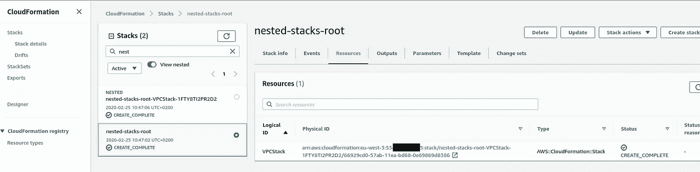

CloudFormation 用 VPC 创建了一个 *nested-stacks-root* 栈及其子栈，命名为*nested-stacks-root-VPC stack-1 fty 8 ti 2 pr 2d 2*，如`network-stack.yml`模板所述:

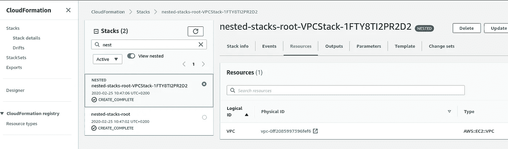

## AWS 云信息包和部署

为了避免手动上传模板，我们可以使用 AWS CLI CloudFormation `[package](https://docs.aws.amazon.com/cli/latest/reference/cloudformation/package.html)`和`[deploy](https://docs.aws.amazon.com/cli/latest/reference/cloudformation/deploy/index.html)`选项。

## `package`

`package`将指定文件或整个目录复制到一个 S3 桶中。

更新您的`root-stack.json` —将`VPCStack`资源的`TemplateURL`替换为本地路径——完整路径或相对于根堆栈文件的路径:

```
{
  "AWSTemplateFormatVersion" : "2010-09-09",
  "Description" : "AWS CloudFormation Root stack",

  "Resources" : {
    "VPCStack": {
      "Type": "AWS::CloudFormation::Stack",
      "Properties": {
        "TemplateURL": "network-stack.yml"
      }
    }
  }
}
```

打包模板并将其上传到 S3:

```
$ aws cloudformation package --template-file root-stack.json — output-template packed-nested-stacks.json --s3-bucket bttrm-eks-cloudformation --profile arseniy --region eu-west-3 --use-json
Uploading to ce12898553365980827b9aa59a99426d.template 187 / 187.0 (100.00%)Successfully packaged artifacts and wrote output template to file packed-nested-stacks.json.Execute the following command to deploy the packaged templateaws cloudformation deploy — template-file /home/setevoy/Work/devops/projects/EKS/roles/cloudformation/files/packed-nested-stacks.json — stack-name <YOUR STACK NAME>
```

这里:

1.  CLI 将在`root-stack.json`中找到的所有文件(工件)上传到 AWS S3
2.  将更新`TemplateURL`以设置 S3 URL 而不是本地路径
3.  将返回一个新生成的模板，可与`deploy`选项一起使用

`package`返回的模板将保存在`packed-nested-stacks.json`中(我使用的是`--use-json`，因为默认情况下将使用 YAML，检查[是什么:YAML-其概述、基本数据类型、YAML vs JSON 和 PyYAML](https://rtfm.co.ua/en/what-is-yaml-its-overview-basic-data-types-yaml-vs-json-and-pyyaml/) post)。

检查其内容:

```
{
    "AWSTemplateFormatVersion": "2010-09-09",
    "Description": "AWS CloudFormation Root stack",
    "Resources": {
        "VPCStack": {
            "Type": "AWS::CloudFormation::Stack",
            "Properties": {
                "TemplateURL": "https://s3.eu-west-3.amazonaws.com/eks-cloudformation/ce12898553365980827b9aa59a99426d.template"
            }
        }
    }
}
```

再来看看[*https://S3 . eu-west-3 . amazonaws . com/eks-cloud formation/ce 12898553365980827 b 9 aa 59 a 99426d . template*](https://s3.eu-west-3.amazonaws.com/eks-cloudformation/ce12898553365980827b9aa59a99426d.template)*文件内容:*

```
*$ aws --profile arseniy --region eu-west-3 s3 cp --quiet s3://eks-cloudformation/ce12898553365980827b9aa59a99426d.template /dev/stdoutAWSTemplateFormatVersion: ‘2010–09–09’
Description: AWS CloudFormation Nested Network Stack
Resources:
  VPC:
    Type: AWS::EC2::VPC
    Properties:
      CidrBlock: 11.0.0.0/16*
```

## *`deploy`*

*在我们执行了`package`命令之后，CLI 显示了关于以下步骤的提示:*

```
*…
Execute the following command to deploy the packaged templateaws cloudformation deploy — template-file /home/setevoy/Work/devops/projects/EKS/roles/cloudformation/files/packed-nested-stacks.json — stack-name <YOUR STACK NAME>*
```

*将其应用于几个步骤前创建的堆栈:*

```
*$ aws --profile arseniy --region eu-west-3 cloudformation deploy --template-file packed-nested-stacks.json --stack-name nested-stacks-root
Waiting for changeset to be created..
Waiting for stack create/update to complete
Successfully created/updated stack — nested-stacks-root*
```

*`deploy`创建了一个[变更集](https://docs.aws.amazon.com/AWSCloudFormation/latest/UserGuide/using-cfn-updating-stacks-changesets.html)并将其应用于根堆栈:*

*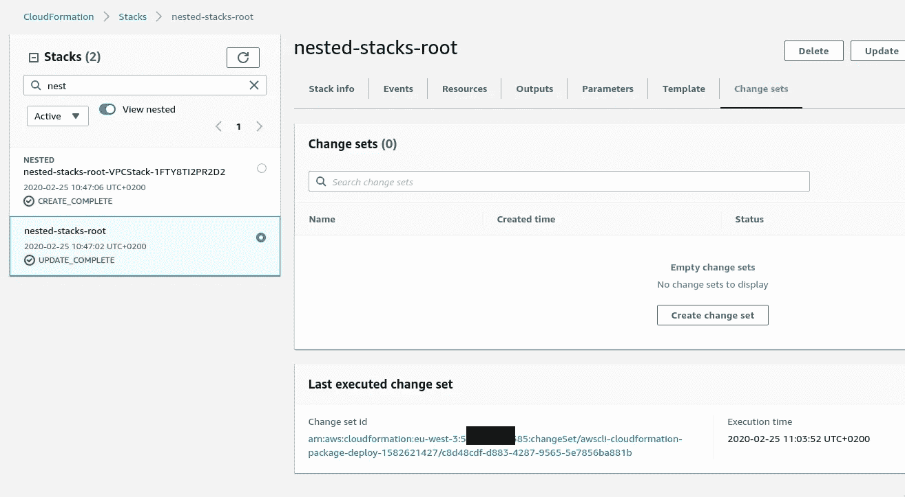*

## *嵌套堆栈—传递参数*

*此时，我们在模板中没有任何参数。*

*例如，在根栈中，我们可以设置一些全局值。*

*让我们添加一个 VPC 的 CIDR，它将被网络堆栈使用。*

*`Update theroot-stack.json`并添加带有一个参数`VPCCIDRBlock`及其默认值的`Parameters`块:*

```
*{
  "AWSTemplateFormatVersion" : "2010-09-09",
  "Description" : "AWS CloudFormation Root stack",

  "Parameters": {
    "VPCCIDRBlock": {
      "Description": "VPC CidrBlock",
      "Type": "String",
      "Default": "11.0.0.0/16"
    }
  },  
...*
```

*在`VPCStack`资源的`Resources`块中，添加带有`VPCCIDRBlock`参数的`Parameters`部分，我们将从“全局”参数传递我们的`VPCCIDRBlock`值:*

```
*{
  "AWSTemplateFormatVersion" : "2010-09-09",
  "Description" : "AWS CloudFormation Root stack",

  "Parameters": {
    "VPCCIDRBlock": {
      "Description": "VPC CidrBlock",
      "Type": "String",
      "Default": "11.0.0.0/16"
    }
  },

  "Resources" : {
    "VPCStack": {
      "Type": "AWS::CloudFormation::Stack",
      "Properties": {
        "TemplateURL": "network-stack.yml",
        "Parameters": {
          "VPCCIDRBlock" : { "Ref": "VPCCIDRBlock" }
        }
      }
    }
  }
}*
```

*在`network-stack.yml`模板中将其添加到 VPC 资源:*

```
*{
  "AWSTemplateFormatVersion" : "2010-09-09",
  "Description" : "AWS CloudFormation Nested Network Stack",

  "Parameters": {
    "VPCCIDRBlock": {
      "Description": "VPC CidrBlock",
      "Type": "String"
    }
  },

  "Resources" : {
    "VPC" : {
      "Type" : "AWS::EC2::VPC",
      "Properties" : {
        "CidrBlock" : { "Ref": "VPCCIDRBlock" }
      }
    }
  }
}*
```

*打包到 S3:*

```
*$ !518
aws cloudformation package --template-file root-stack.json --output-template packed-nested-stacks.json --s3-bucket bttrm-eks-cloudformation --profile arseniy --region eu-west-3 --use-json*
```

*部署:*

```
*$ aws --profile arseniy --region eu-west-3 cloudformation deploy --template-file packed-nested-stacks.json --stack-name nested-stacks-root --profile arseniy --region eu-west-3 --use-json*
```

*检查嵌套堆栈的`Parameters`:*

*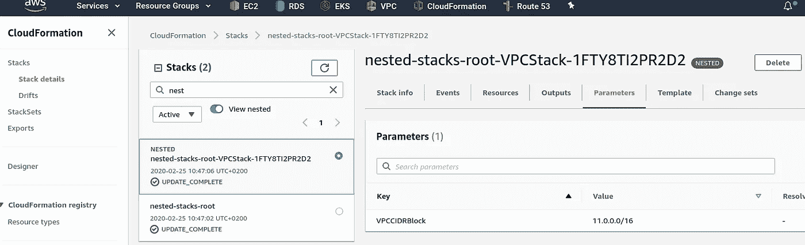*

*添加了`VPCCIDRBlock`。*

## *嵌套堆栈输出*

*此外，嵌套堆栈允许通过`[Fn::GetAtt](https://docs.aws.amazon.com/AWSCloudFormation/latest/UserGuide/intrinsic-function-reference-getatt.html)`函数使用其他堆栈`Outputs`。*

*让我们添加第三个名为 *SecurityGroupStack* 的堆栈，在这里将描述我们的 SecurityGroup。*

*我们将使用堆栈`network-stack.yml`的`Outputs`将 VPC ID 传递给这个 SecurotyGroup。*

*请记住，这样的参数只能从“底部”传递到“顶部”并返回。*

*也就是说，您不能将参数从 *VPCStack* 直接传递给 *SecurityGroupStack* ，但是您可以将一个值返回给根堆栈，然后将其用作子堆栈的参数。*

*为此:*

1.  *在 *VPCStack* ( `network-stack.yml`)堆栈中，我们将添加`Outputs`来返回装箱的 VPC 的 ID*
2.  *在根堆栈`root-stack.json`中，我们将描述一个名为 *SecurityGroupStack* 的新堆栈，它`Parameters`将接受来自 *VPCStack* `Outputs` ( `network-stack.yml`)的值*
3.  *将创建一个新的栈 *SecurityGroupStack* ，该模板将使用`Parameters` > `VPCID`*

## *`network-stack.yml`堆栈输出*

*为 VPC 添加输出:*

```
*...
  "Resources" : {
    "VPC" : {
      "Type" : "AWS::EC2::VPC",
      "Properties" : {
        "CidrBlock" : { "Ref": "VPCCIDRBlock" }
      }
    }
  },

  "Outputs" : {
    "VPCID" : {
      "Description" : "EKS VPC ID",
      "Value" : { "Ref" : "VPC" }
    }
  }
}*
```

## *`root-stack.json`堆栈*

*在根栈中添加一个新的栈 *SecurityGroupStack* 并将`VPCID`从 *VPCStack* 栈的`Outputs`添加到 *SecurityGroupStack* 的`Parameters`:*

```
*...
  "Resources" : {
    "VPCStack": {
      "Type": "AWS::CloudFormation::Stack",
      "Properties": {
        "TemplateURL": "network-stack.yml",
        "Parameters": {
          "VPCCIDRBlock" : { "Ref": "VPCCIDRBlock" }
        }
      }
    },
    "SecurityGroupStack": {
      "Type": "AWS::CloudFormation::Stack",
      "Properties": {
        "TemplateURL": "sg-stack.yml",
        "Parameters": {
          "VPCID" : { "Fn::GetAtt": ["VPCStack", "Outputs.VPCID"] }
        }
      }
    }
  }
...*
```

*为安全组创建新的模板文件— `sg-stack.yml`:*

```
*{
  "AWSTemplateFormatVersion" : "2010-09-09",

  "Description" : "AWS CloudFormation SecurityGroups stack",

  "Parameters" : {
    "VPCID": {
      "Description": "Network Stack VPC ID",
      "Type": "String",
    }
  },

  "Resources" : {
    "SecurityGroup": {
      "Type": "AWS::EC2::SecurityGroup",
      "Properties" : {
        "GroupDescription" : "Example SecurityGroup",
        "VpcId"            : { "Ref": "VPCID" },
        "SecurityGroupIngress" : [
          {
            "Description": "Allow HTTP",
            "IpProtocol" : "tcp",
            "FromPort"   : 80,
            "ToPort"     : 80,
            "CidrIp"     : "0.0.0.0/0"
          },
          {
            "Description": "Allow HTTPS",
            "IpProtocol" : "tcp",
            "FromPort"   : 443,
            "ToPort"     : 443,
            "CidrIp"     : "0.0.0.0/0"
          }
        ]
      }
    },
  }
}*
```

*在这里，在`"VpcId" : { "Ref": "VPCID" }`中，我们使用一个 VPC ID 值将这个 SecirtyGroup 添加到同一个 VPC 中。*

*打包、部署、检查堆栈:*

*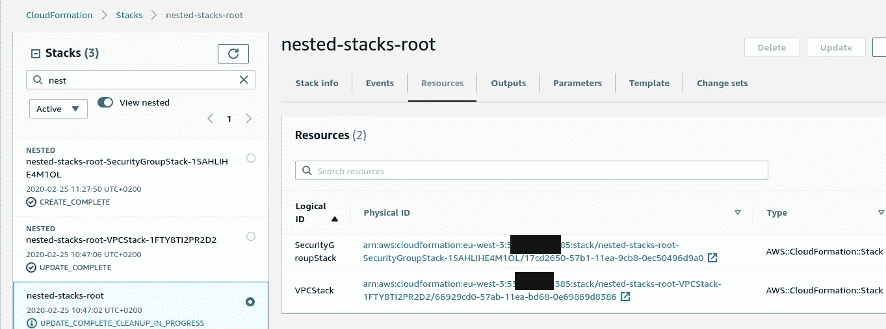*

*创建了一个新堆栈。*

*检查其参数:*

*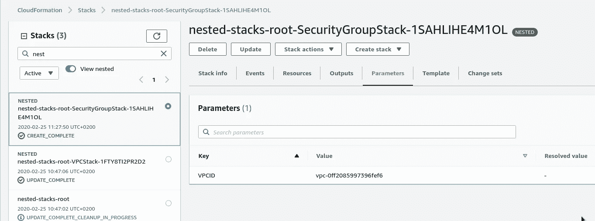*

*一切都好。*

## *模板重用*

*正如在开始时已经提到的，主要思想是模块化，当我们可以使用相同的模板文件来创建相似的资源。*

*比方说，我们想要两个具有不同 CIDRs 的 VPC。*

*我们可以使用 CloudFormation `Mappins`并在那里设置两个不同的网络块。*

*在根模板`root-stack.json`中，移除`"Parameters": "VPCCIDRBlock"`并添加`Mappings`:*

```
*{
  "AWSTemplateFormatVersion" : "2010-09-09",
  "Description" : "AWS CloudFormation Root stack",

  "Mappings": {
    "VPCCIDRBlock": {
      "vpc1": {
        "cidr": "11.0.0.0/16"
      },
      "vpc2": {
        "cidr": "12.0.0.0/16"
      }
    }
  },
...*
```

*在`Resources`中使用相同的模板文件添加另一个带有 VPC 的堆栈，但是现在在它的`Parameters`中使用`Fn::FindInMap`函数为`Property VPCCIDRBlock`获取一个值:*

```
*...
  "Resources" : {
    "VPCStack1": {
      "Type": "AWS::CloudFormation::Stack",
      "Properties": {
        "TemplateURL": "network-stack.yml",
        "Parameters": {
          "VPCCIDRBlock" : { "Fn::FindInMap" : [ "VPCCIDRBlock", "vpc1", "cidr" ] }
        }
      }
    },
    "VPCStack2": {
      "Type": "AWS::CloudFormation::Stack",
      "Properties": {
        "TemplateURL": "network-stack.yml",
        "Parameters": {
          "VPCCIDRBlock" : { "Fn::FindInMap" : [ "VPCCIDRBlock", "vpc2", "cidr" ] }
        }
      }
    },
...*
```

*不要忘记 SecurityGroup —再次添加另一个—使用同一个 SG 的模板`sg-stack.yml`，并将第二个 SecurityGroup 附加到第二个 VPC:*

```
*...
    "SecurityGroupStack1": {
      "Type": "AWS::CloudFormation::Stack",
      "Properties": {
        "TemplateURL": "sg-stack.yml",
        "Parameters": {
          "VPCID" : { "Fn::GetAtt": ["VPCStack1", "Outputs.VPCID"] }
        }
      }
    },
    "SecurityGroupStack2": {
      "Type": "AWS::CloudFormation::Stack",
      "Properties": {
        "TemplateURL": "sg-stack.yml",
        "Parameters": {
          "VPCID" : { "Fn::GetAtt": ["VPCStack2", "Outputs.VPCID"] }
        }
      }
    }
...*
```

*部署，检查:*

*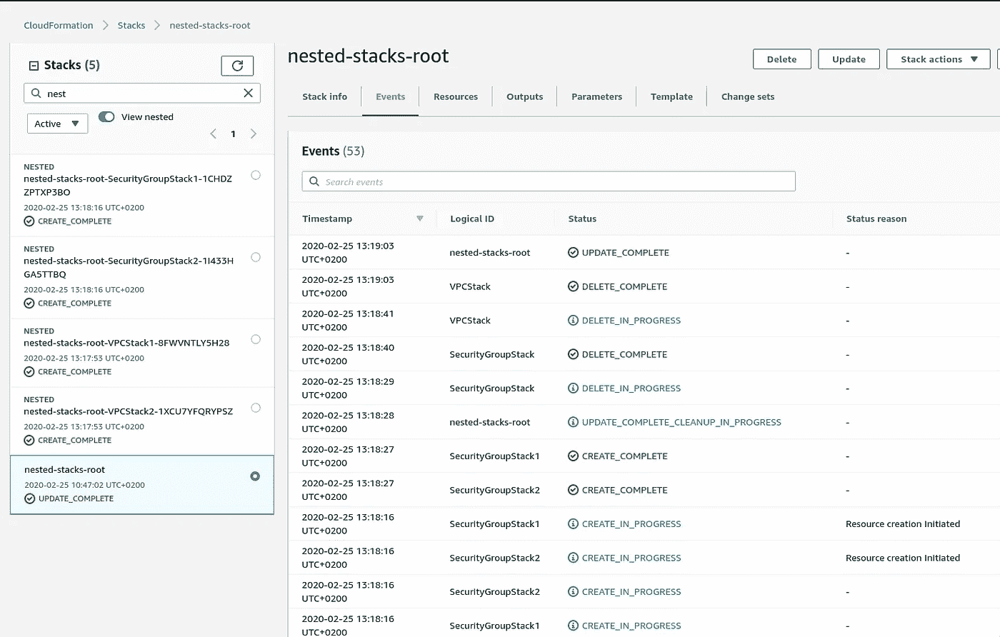*

*CloudFormation 移除了 *VPCStack* ，转而创建了两个新堆栈——*VPC stack 1*и*VPC stack 2*，同样的方式——用于*安全组*。*

## *导入/导出值与嵌套堆栈*

*嵌套堆栈中的`Outputs`有利于在关联的堆栈之间共享参数，但它仅适用于当前的堆栈“树”,不能与该 AWS 帐户中不相关的堆栈共享。*

*在这里，我们可以使用另一个 AWS CLoudFormatiuon 特性，称为[跨栈引用](https://docs.aws.amazon.com/AWSCloudFormation/latest/UserGuide/walkthrough-crossstackref.html)——在第一个栈中，您将创建一个`[Export](https://docs.aws.amazon.com/AWSCloudFormation/latest/UserGuide/using-cfn-stack-exports.html)`，在另一个栈中，您将创建它们的`[Import](https://docs.aws.amazon.com/AWSCloudFormation/latest/UserGuide/intrinsic-function-reference-importvalue.html)`。*

## *陷阱*

*   *导出的值只能在同一个 AWS 区域内访问*
*   *如果一个堆栈导入了任何其他堆栈使用的值，则不能删除该堆栈*

*为创建的 SecurityGroups 的 ID 添加一个导出，以便以后在其他独立的堆栈中使用。*

*为此，更新 SecurityGroup `sg-stack.yml`模板并将其 ID 添加到`Outputs`:*

```
*...
            "ToPort"     : 443,
            "CidrIp"     : "0.0.0.0/0"
          }
        ]
      }
    },
  },

  "Outputs" : {
    "SecurityGroupID" : {
      "Description" : "The SecurityGroup ID",
      "Value" :  { "Ref" : "SecurityGroup" }
    }
  }
}*
```

*在根模板中—更新其`Outputs`并为两个 *SecurityGroupStack* 堆栈添加`Export`:*

```
*...
  "Outputs" : {
    "SecurityGroup1" : {
      "Description" : "The SecurityGroup-1 ID",
      "Value" :  { "Fn::GetAtt": [ "SecurityGroupStack1", "Outputs.SecurityGroupID" ] },
      "Export": { "Name": { "Fn::Sub": "${AWS::StackName}-SecurityGroupStack1" } }
    },
    "SecurityGroup2" : {
      "Description" : "The SecurityGroup-2 ID",
      "Value" :  { "Fn::GetAtt": [ "SecurityGroupStack2", "Outputs.SecurityGroupID" ] },
      "Export": { "Name": { "Fn::Sub": "${AWS::StackName}-SecurityGroupStack2" } }
    }
  }
}*
```

*这里:*

*   *在`Value`中，我们从它的`Outputs`中获得一个安全组 ID*
*   *在带有`[Fn::Sub](https://docs.aws.amazon.com/AWSCloudFormation/latest/UserGuide/intrinsic-function-reference-sub.html)`的`Export: Name`中，我们正在生成一个唯一的名称。*

*部署，检查*安全组*的堆栈`Outputs`:*

*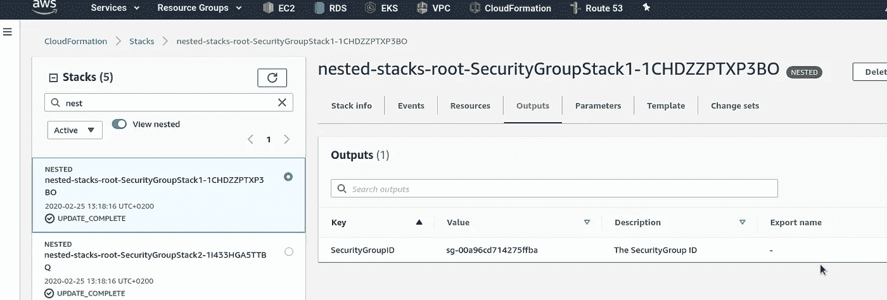*

*和根堆栈的`Outputs`-找到导出的值:*

*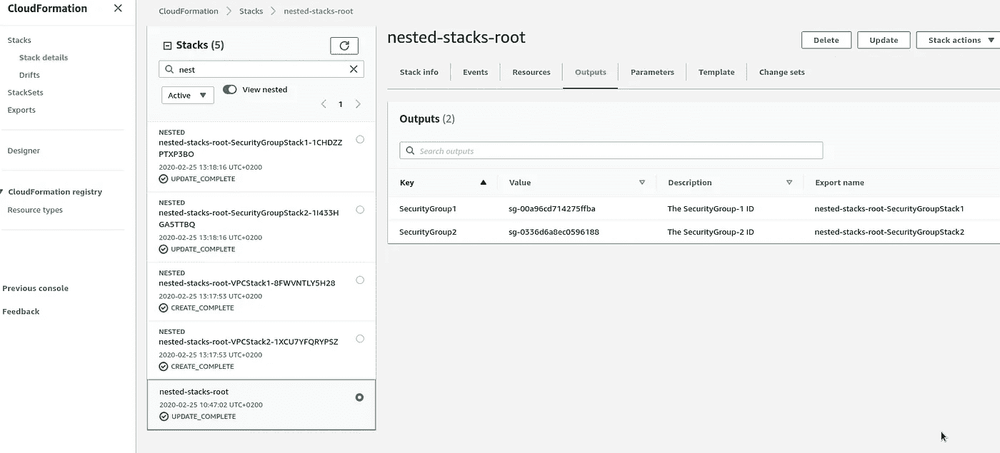*

*此外，它们现在可用于此帐户的整个 CloudFormation 的导出:*

*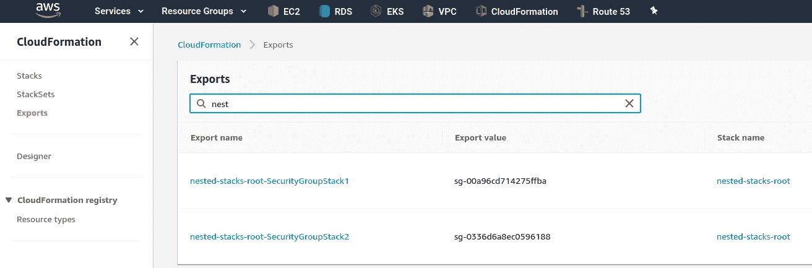*

*现在，我们可以将它用于其他堆栈。*

*为了检查它，让我们添加一个只有 VPC 资源的堆栈(因为 CloudFormation 堆栈必须至少有一个资源类型)，并且在它的`Outputs`中使用`[Fn::ImportValue](https://docs.aws.amazon.com/AWSCloudFormation/latest/UserGuide/intrinsic-function-reference-importvalue.html)`我们将显示来自*嵌套堆栈根*堆栈的 SecurityGroups IDs:*

```
*{
  "AWSTemplateFormatVersion" : "2010-09-09",
  "Description" : "AWS CloudFormation Nested Network stack",

  "Parameters": {
    "VPCCIDRBlock": {
      "Description": "VPC CidrBlock",
      "Type": "String",
      "Default": "13.0.0.0/16"
    }
  },

  "Resources" : {
    "VPC" : {
      "Type" : "AWS::EC2::VPC",
      "Properties" : {
        "CidrBlock" : { "Ref": "VPCCIDRBlock" }
      }
    }
  },

  "Outputs" : {
    "SecurityGroup1ID" : {
      "Description" : "The SecurityGroup ID",
      "Value" :  { "Fn::ImportValue" : "nested-stacks-root-SecurityGroupStack1" }
    },
    "SecurityGroup2ID" : {
      "Description" : "The SecurityGroup ID",
      "Value" :  { "Fn::ImportValue" : "nested-stacks-root-SecurityGroupStack2" }
    }
  }
}*
```

*部署它(更好的方法是像调用"*独立-* 或"*外部-* 而不是*嵌套-* "那样调用新堆栈)，并检查它的`Outputs`:*

*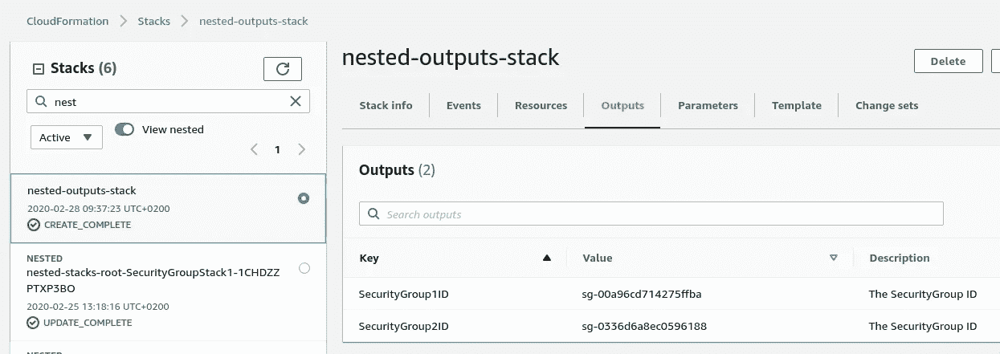*

*完成了。*

## *有用的链接*

*   *[使用嵌套堆栈](https://docs.aws.amazon.com/AWSCloudFormation/latest/UserGuide/using-cfn-nested-stacks.html)*
*   *[AWS 云信息最佳实践](https://docs.aws.amazon.com/AWSCloudFormation/latest/UserGuide/best-practices.html#nested)*
*   *[CloudFormation 嵌套堆叠引物](https://www.trek10.com/blog/cloudformation-nested-stacks-primer/)*
*   *[嵌套云形成堆栈的演练](https://medium.com/@janethavishka/walkthrough-with-nested-cloudformation-stacks-d7709b568162)*
*   *[了解嵌套云生成堆栈](https://cloudacademy.com/blog/understanding-nested-cloudformation-stacks/)*
*   *[使用嵌套堆栈创建可重用模板并支持角色专门化](https://aws.amazon.com/ru/blogs/devops/use-nested-stacks-to-create-reusable-templates-and-support-role-specialization/)*
*   *[云形成最佳实践](https://sbstjn.com/cloudformation.html#nested-stacks)*
*   *[造云包&展开](https://aws.nz/best-practice/cloudformation-package-deploy/)*
*   *[7 个可怕的云形成黑客](https://garbe.io/blog/2017/07/17/cloudformation-hacks/)*
*   *[使用 CloudFormation 交叉堆栈引用](https://www.1strategy.com/blog/2017/03/14/using-cloudformation-cross-stack-references/)*
*   *如何从 AWS CloudFormation 模板中引用另一个堆栈中的资源？*
*   *[如何在 AWS CloudFormation 模板中为单个参数使用多个值？](https://aws.amazon.com/ru/premiumsupport/knowledge-center/multiple-values-list-parameter-cli/)*
*   *[如何将 CommaDelimitedList 参数传递给 AWS CloudFormation 中的嵌套堆栈？](https://aws.amazon.com/ru/premiumsupport/knowledge-center/cloudformation-parameters-nested-stacks/)*
*   *[云形成两年:经验教训](https://sanderknape.com/2018/08/two-years-with-cloudformation-lessons-learned/)*

**最初发布于* [*RTFM: Linux、DevOps 和系统管理*](https://rtfm.co.ua/en/aws-cloudformation-nested-stacks-and-stacks-parameters-import-export/) *。**