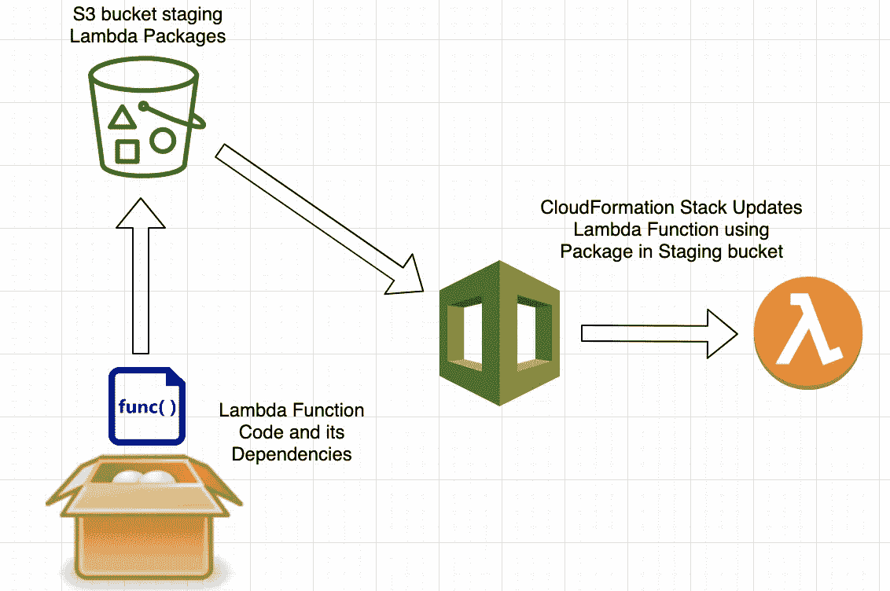

# 更新 Lambda 函数的 AWS CloudFormation

> 原文：<https://itnext.io/aws-cloudformation-to-update-lambda-functions-b95ce2eba4cf?source=collection_archive---------1----------------------->

大多数人已经熟悉了 AWS Lambda 函数。如果您有一个完全无服务器的部署，您可以利用 [AWS SAM](https://docs.aws.amazon.com/serverless-application-model/latest/developerguide/what-is-sam.html) 来管理、打包、部署和更新您的部署。山姆规模非常好，非常容易使用！但在许多情况下，云部署并非完全无服务器，即与 EC2、ECS 类型的资源混合。在这种情况下，SAM 是有帮助的，但还不够，因为要部署其他 AWS 资源类型，您需要在 CloudFormation 堆栈中管理它们。在大范围内，这可能会成为一个非常复杂的问题！

在这种情况下，您仍然可以受益于 [SAM 来创建和维护您的 lambda 部署包](https://medium.com/@amolkokje/package-and-deploy-aws-lambda-functions-4b734e7c8f8e)，但是您需要一种方法来更新您的 CloudFormation 堆栈。所以，现在这变成了一个两步的过程，可以用一些简单的技巧来管理。我在最近的项目中遇到了这个问题，所以在这篇文章中，我将提供一个对我非常有效的方法。

在这个例子中，我们有一个 staging bucket，它包含用于部署的 lambda 包。SAM 用于使用更新的 Lambda 包更新暂存桶。CloudFormation 模板定制资源代码复制包并在它们的 Lambda 函数资源中使用它们。



更新 Lambda 函数的 AWS CloudFormation

# 当代码或依赖关系发生变化时，我们如何更新 Lambda 函数资源？

当您应用 CloudFormation 堆栈更新时，它将检查任何已部署资源的属性是否有更新。如果没有更新，它将不会采取任何行动。它将只对已有属性更新的资源起作用。

当内存、超时、环境变量等 Lambda 资源属性发生更新时，不会有任何问题，因为 CloudFormation 会选择这些更改并相应地更新。

*当 Lambda 函数代码或其任何依赖项*有更新时，问题就出现了。由于这些不是资源属性更新，CloudFormation 无法知道是否有变化，也无法更新受影响的组件。

因此，在这里的解决方案中，这里的技巧是更新自定义资源中的属性以更新包，更新 Lambda 函数中的属性以更新 Lambda 函数包。这样，CloudFormation 就知道发生了变化，资源需要更新。

**注意** : *如果 Lambda 函数是使用部署在 s3 bucket 中的包创建的，更新包不足以更新 Lambda 函数。还需要调用 Lambda 函数更新 API。*

这个例子的所有源代码都位于我的 [GitHub repo](https://github.com/amolkokje/cfn_update_lambda) 中。

在这个例子中，SAM 用于生成 Lambda 包(SAM 不是这个解决方案的要求。你可以选择你喜欢的包装方式。).唯一需要注意的是*这个包必须有一个唯一的名字*，它将被 CloudFormation 用来检测资源属性的变化。

正如您在代码片段中看到的，' **CopyZips** 资源将把' **Objects** 中所有指定的包从暂存桶复制到部署桶。因此，我们需要在这个地方更新名称，以便添加/更新的名称将被复制到堆栈中。[完整模板代码](https://github.com/amolkokje/cfn_update_lambda/blob/master/template/update_lambda.yaml)。

CloudFormation 模板中的 CopyZips 资源

现在，我们有了更新的包，但是我们仍然需要更新 Lambda 函数。要实现这一点，您需要用包名更新 Lambda 函数资源' **S3Key** '属性。参见下面的片段以供参考。

CloudFormation 模板中的 Lambda 函数资源

为了简单起见，在这个例子中，只使用了一个 Lambda 函数。所以，要更新 Lambda 函数，你需要做的就是更新一个栈参数。但是真正的部署要复杂得多，可能有许多 Lambda 函数需要更新。对于这种情况，您必须使用一些高级的 CloudFormation 技巧来更新模板中的相关字符串。

实现这一点的一个方法是使用 Lambda 函数名到它们部署/使用的包名的映射。当需要更新时，用户只需更新映射中受影响包的包名。因为所有的模板代码都引用映射，所以当应用栈更新时，所有相关的 Lambda 函数都将被更新。

请参见下面的示例映射以供参考:

```
LambdaFunctionPackageMap:
    FirstLambdaFunction:
        PackageName: “b8a6ddc8a38e569f23eb12d0d8d020c9”
    SecondLambdaFunction:
        PackageName: “cd5dff37f7581343bd5e7e2851569dd2”
```

只要模板中使用了包名，就使用下面的结构从映射中获取名称。

```
!FindInMap [LambdaFunctionPackageMap, FirstLambdaFunction, PackageName]
```

在我的部署中，我花了相当多的迭代来找出一个干净的方法来实现这个功能。所以，我希望这篇文章和[示例代码](https://github.com/amolkokje/cfn_update_lambda)对你有用！如果您有任何相关问题，请随时联系我们。