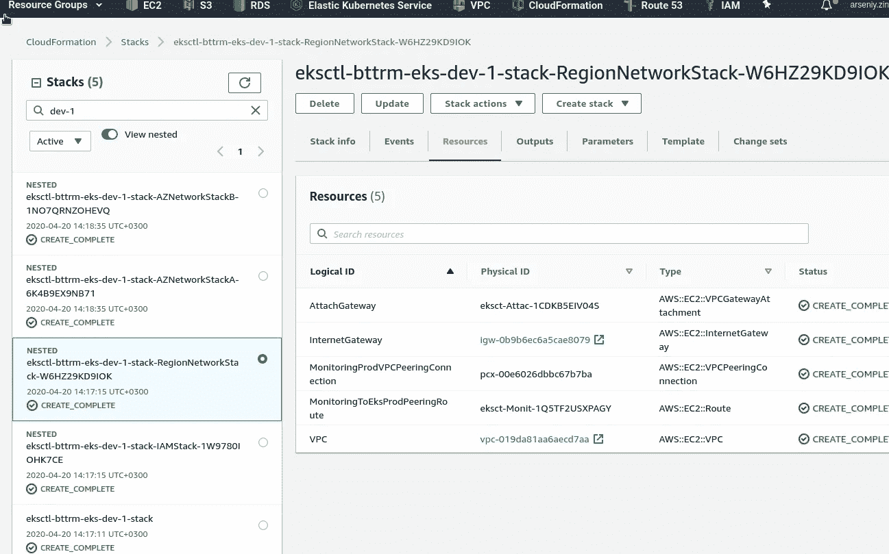
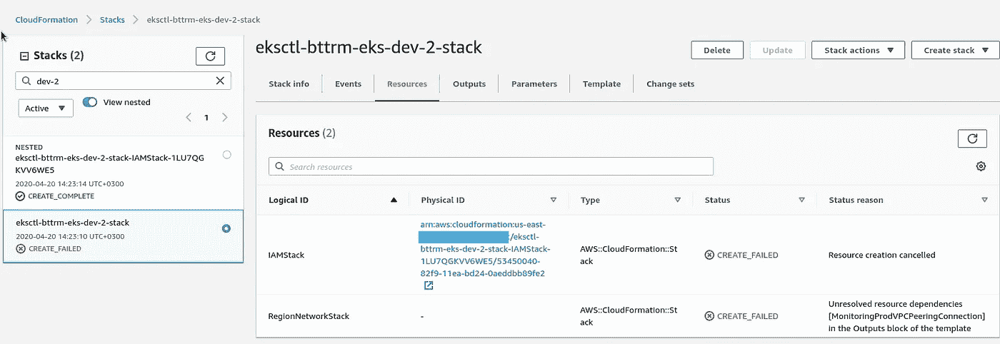
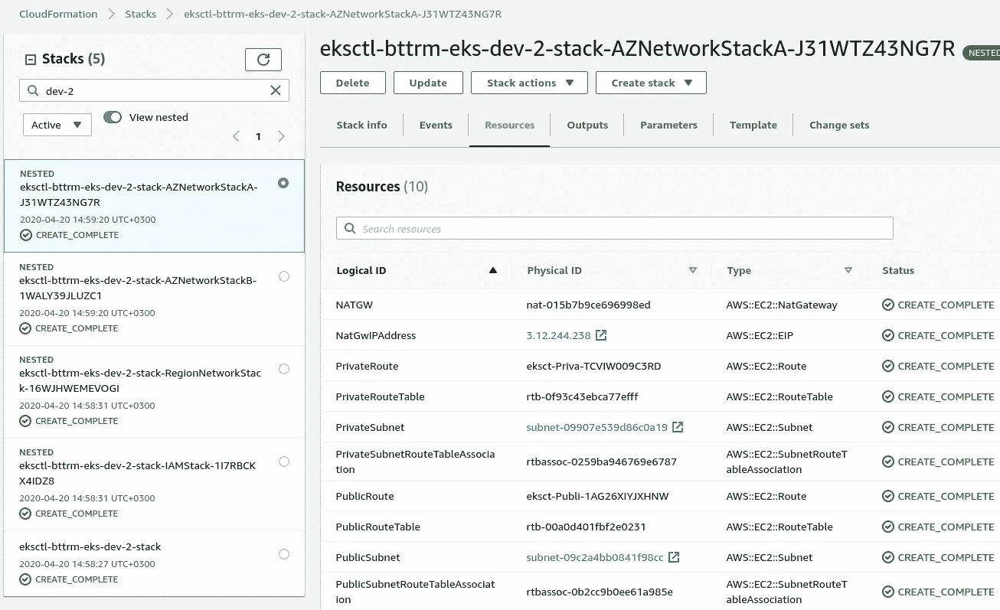
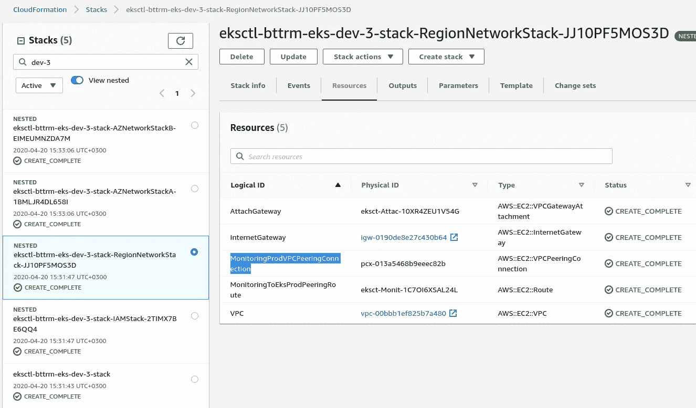

# AWS: CloudFormation —使用条件、Fn::Equals 和 Fn::If —示例

> 原文：<https://itnext.io/aws-cloudformation-using-conditions-fn-equals-and-fn-if-an-example-bf147336a25f?source=collection_archive---------2----------------------->


我有一个带有[VPC peering](https://rtfm.co.ua/aws-nastrojka-vpc-peering/)的云形成堆栈，在这种情况下，它是一个新的弹性 Kubernetes 服务集群的 VPC 和普罗米修斯监控堆栈的 VPC 之间的对等物。

在[AWS Elastic Kubernetes Service:a cluster creation automation，part 1 — CloudFormation](https://rtfm.co.ua/en/aws-elastic-kubernetes-service-a-cluster-creation-automation-part-1-cloudformation/) 和[AWS Elastic Kubernetes Service:a cluster creation automation，part 2 — Ansible，eksctl](https://rtfm.co.ua/en/aws-elastic-kubernetes-service-a-cluster-creation-automation-part-2-ansible-eksctl/) 的帖子中描述了 EKS 集群的堆栈及其整个自动化创建过程。

**任务**:增加一个选择能力，如果 CloudFormation 必须创建上面提到的对等，或者跳过这一步。

**解决方案**:使用 [AWS CloudFormation 条件](https://docs.aws.amazon.com/AWSCloudFormation/latest/UserGuide/conditions-section-structure.html):将添加一个新参数`VPCPeeringCreate`，该参数将接受来自 Jenkins 作业的*真*值*假*，然后 CloudFormation 将根据该值决定是否需要创建这样的对等和相关资源——对等本身和两条路由。

这个任务变得有点复杂，因为我在这里使用了嵌套的栈，并且资源是由不同的栈创建的，所以要创建一个对等体，它使用:

*   根堆栈:
*   将创建区域和可用性区域定位的堆栈
*   在区域堆栈中:
*   将创建`AWS::EC2::VPCPeeringConnection`
*   将使用普罗米修斯更新远程监控堆栈的路由表—将创建新的`AWS::EC2::Route`(从监控 VPC 到 EKS 堆栈的 VPC 的路由)
*   在其`Outputs`中将返回一个*MonitoringProdVPCPeeringConnectionID*
*   可用性区域-定位堆栈:
*   将抓取*MonitoringProdVPCPeeringConnectionID*
*   将创建一个`AWS::EC2::Route`(从 EKS 集群的 VPC 专用子网到监控堆栈 VPC 的路由)

所以，让我们把它们一个一个地加起来，看看这是如何工作的。

## 根堆栈

在根栈的参数中增加一个新的参数叫做 *VPCPeeringCreate* ，它可以接受*真*或*假*:

```
{
  "AWSTemplateFormatVersion": "2010-09-09",
  "Description": "AWS CloudFormation stack for Kubernetes cluster",

  "Parameters": {

...

    "VPCPeeringCreate": {
      "Description": "Create or not VPC peering connections",
      "Type": "String",
      "Default": true,
      "AllowedValues": [
          "true",
          "false"
      ]
    }
```

更新根堆栈模板中的区域堆栈资源-添加要传递给根堆栈模板的 *VPCPeeringCreate* 参数:

```
"Resources": {

    "RegionNetworkStack": {
      "Type": "AWS::CloudFormation::Stack",
      "Properties": {
        "TemplateURL": "eks-region-networking.json",
        "Parameters": {
          "VPCCIDRBlock": { "Ref": "VPCCIDRBlock" },
          "VPCPeeringCreate": { "Ref":  "VPCPeeringCreate"}
        }
      }
    },
...
```

## 区域堆栈

将接受 *VPCPeeringCreate* —删除此处的默认值，因为它将从根堆栈传递:

```
{
  "AWSTemplateFormatVersion" : "2010-09-09",
  "Description" : "AWS CloudFormation Region Networking stack for Kubernetes cluster",

  "Parameters" : {
...

    "VPCPeeringCreate": {
      "Description": "Create or not VPC peering connections",
      "Type": "String",
      "AllowedValues": [
          "true",
          "false"
      ]
    }
  },
...
```

## 情况

现在—这里的主要部分:添加名为 *DoVPCPeeringCreate* 的`Conditions`，我们将使用`[Fn::Equals](https://docs.aws.amazon.com/AWSCloudFormation/latest/UserGuide/intrinsic-function-reference-conditions.html#intrinsic-function-reference-conditions-equals)`检查 *VPCPeeringCreate* 的值，如果*为真*，则从条件中返回*为真*:

```
...
    "VPCPeeringCreate": {
      "Description": "Create or not VPC peering connections",
      "Type": "String",
      "AllowedValues": [
          "true",
          "false"
      ]
    }
  },

  "Conditions" : {
    "DoVPCPeeringCreate" : {"Fn::Equals" : [ {"Ref" : "VPCPeeringCreate"}, true] }
  },

...
```

接下来，添加对*MonitoringProdVPCPeeringConnection*和*monitoringetoksprodpeerinroute*资源— `"Condition" : "DoVPCPeeringCreate"`的检查:

```
...
    "MonitoringProdVPCPeeringConnection": {
      "Type": "AWS::EC2::VPCPeeringConnection",
      "Condition" : "DoVPCPeeringCreate",
      "Properties": {
        "VpcId": {
          "Ref": "VPC"
        },
        "PeerVpcId": { "Fn::ImportValue" : "monitoring-production-VPC-ID" },
        "PeerRegion": { "Fn::ImportValue" : "monitoring-production-StackRegion" },
        "Tags": [
          {
            "Key": "Name",
            "Value": { "Fn::Join": [ "-", [ {"Ref": "AWS::StackName"}, "vpc-monitoring-prod"] ] }
          }
        ]
      }
    },

    "MonitoringToEksProdPeeringRoute": {
      "Type": "AWS::EC2::Route",
      "Condition" : "DoVPCPeeringCreate",
      "Properties": {
        "RouteTableId": { "Fn::ImportValue" : "monitoring-production-VPC-PublicRouteTable" },
        "DestinationCidrBlock": { "Ref": "VPCCIDRBlock" },
        "VpcPeeringConnectionId": {
          "Ref": "MonitoringProdVPCPeeringConnection"
        }
      }
    },
...
```

因此，如果 *DoVPCPeeringCreate* `Condition`将返回 *True* ，那么*monitoringprodvpeeringconnection*和*monitoringoeksprodpeerinroute*资源将被触发创建。

运行检查—它们是这样创建的:



## *未解决的资源相关性*和`Fn::If`

现在—运行相同的操作，但此时指定*VPCPeeringCreate*= =*false*，您将得到一个错误，因为 th 区域堆栈上的`Outputs`中缺少值:



为什么这样嗯——因为我们已经禁止创建对等体，但是在区域堆栈的`Outpus`中，我们仍然尝试放置一个没有创建的对等体的 ID:

```
...
    "MonitoringProdVPCPeeringConnectionID": {
      "Description" : "MonitoringProdVPCPeeringConnection ID",
      "Value" : {"Ref" : "MonitoringProdVPCPeeringConnection" }
    }
...
```

要解决这个问题，请更新`Outputs`并使用`[Fn::If](https://docs.aws.amazon.com/AWSCloudFormation/latest/UserGuide/intrinsic-function-reference-conditions.html#intrinsic-function-reference-conditions-if)`来选择要返回的内容:

```
...
  "Outputs" : {

    "VPCID" : {
      "Description" : "EKS VPC ID",
      "Value" : { "Ref" : "VPC" }
    },

    "IGWID" : {
      "Description" : "InternetGateway ID",
      "Value" : { "Ref" : "InternetGateway" }
    },

    "MonitoringProdVPCPeeringConnectionID": {
      "Description" : "MonitoringProdVPCPeeringConnection ID",
      "Value" : { "Fn::If" : [ "DoVPCPeeringCreate", {"Ref" : "MonitoringProdVPCPeeringConnection" }, "Zero" ] }
    }

  }
}
...
```

也就是说，如果`DoVPCPeeringCreate`条件将返回*真*，那么我们将获取*MonitoringProdVPCPeeringConnection 的* ID，如果`DoVPCPeeringCreate` == *假*，那么我们将在输出中放入一些其他值，例如“零”。

## 可用性区域堆栈

在 AZ 堆栈中，我们需要做同样的事情——添加参数并添加`Conditions`——从区域堆栈中复制粘贴它，并为`AWS::EC2::Route`资源—`"Condition" : "DoVPCPeeringCreate"`创建一个检查:

```
...
    "EksToMonitoringProdPeeringRoute": {
      "Type": "AWS::EC2::Route",
      "Condition" : "DoVPCPeeringCreate",
      "Properties": {
        "RouteTableId": {
          "Ref": "PrivateRouteTable"
        },
        "DestinationCidrBlock": {
          "Fn::ImportValue" : "monitoring-production-VPC-CIDR"
        },
        "VpcPeeringConnectionId": {
          "Ref": "MonitoringProdVPCPeeringConnectionID"
        }
      }
    },
...
```

在 Root-стеке中添加要传递给 AZ 堆栈的 *VPCPeeringCreate* :

```
...
    "AZNetworkStackA": {
      "Type": "AWS::CloudFormation::Stack",
      "Properties": {
        "TemplateURL": "eks-azs-networking.json",
        "Parameters": {
          "VPCID": { "Fn::GetAtt": ["RegionNetworkStack", "Outputs.VPCID"] },
          "AZ": { "Fn::Select": [ "0", { "Ref": "AvailabilityZones" } ] },
          "IGWID": { "Fn::GetAtt": ["RegionNetworkStack", "Outputs.IGWID"] },
          "VPCPeeringCreate": { "Ref":  "VPCPeeringCreate"},
...
```

创建堆栈，但不创建对等:



检查—再次创建，使用 *VPCPeeringCreate == true:*



完成了。

*最初发布于* [*RTFM: Linux、DevOps 和系统管理*](https://rtfm.co.ua/en/aws-cloudformation-using-conditions-fnequals-and-fnif-an-example/) *。*