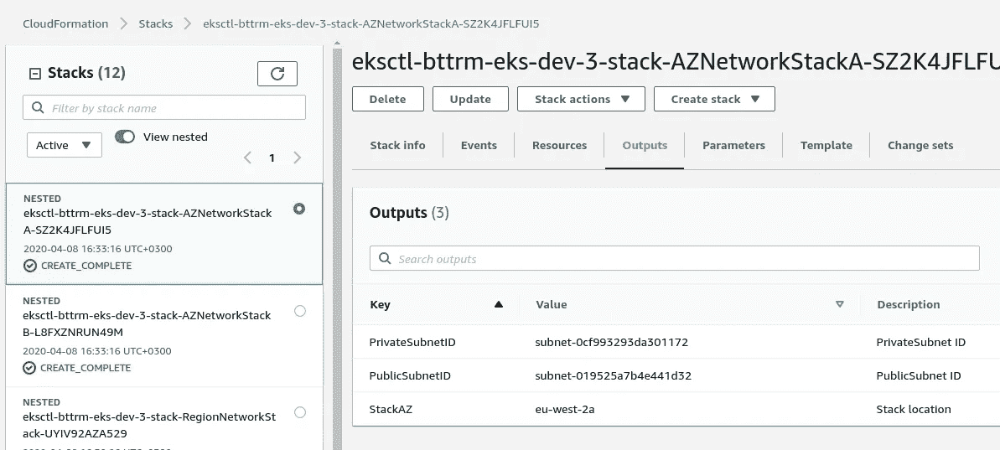

# AWS:cloud formation-在参数中使用列表

> 原文：<https://itnext.io/aws-cloudformation-using-lists-in-parameters-52982e78384f?source=collection_archive---------2----------------------->


除了[AWS Elastic Kubernetes Service:a cluster creation automation，第 1 部分— CloudFormation](https://rtfm.co.ua/en/aws-elastic-kubernetes-service-a-cluster-creation-automation-part-1-cloudformation/) 和[AWS Elastic Kubernetes Service:a cluster creation automation，第 2 部分— Ansible，eksctl](https://rtfm.co.ua/en/aws-elastic-kubernetes-service-a-cluster-creation-automation-part-2-ansible-eksctl/) 帖子之外，现在我将把一个参数作为一个带有多个值的列表传递给 CloudFormation 堆栈。

其思想是在 Ansible 中获取一个区域的所有 AvailabilityZones，然后将该列表用于`eksctl`，这将在专用 AvailabilityZones 中创建 WorkerNodes 组，并使用相同的列表用于 CloudFormation 在 right AvailabilityZone 中创建子堆栈。

对于 Jenkins 和 Ansible，它将以另一种方式工作:

1.  从 a Jenkins 中，作业参数取值为 *eu-west-3* 的`$REGION`
2.  一个 Jenkins 作业将启动一个 Docker 容器，Ansible 将`$REGION`变量作为环境变量传递
3.  Ansible 使用它的`{{ region }}`变量将获得 Jenkins 指定的区域的可用性区域列表
4.  并将该列表传递给 *cloudformation* 角色，以在两个 AvailabilityZones 中创建两个嵌套堆栈
5.  并将该列表传递给 *eksctl* 角色，以在两个可用性区域中创建节点组

此时，在我的云信息中，可用性区域是通过`Fn::GetAZs - { "Fn::Select": [ "0", { "Fn::GetAZs": "" } ] }`获取的:

```
...
    "AZNetworkStackA": {
      "Type": "AWS::CloudFormation::Stack",
      "Properties": {
        "TemplateURL": "eks-azs-networking.json",
        "Parameters": {
          "VPCID": { "Fn::GetAtt": ["RegionNetworkStack", "Outputs.VPCID"] },
          "AZ": { "Fn::Select": [ "0", { "Fn::GetAZs": "" } ] },
...
```

因此，不使用`{ "Fn::Select": [ "0", { "Fn::GetAZs": "" } ] }`——让我们在 Ansible 中添加一个新任务来获得一个区域的所有可用区域，在那里将创建一个 CloudFormation 堆栈，然后它的两个角色——*eks CTL*и*cloud formation*——将使用具有相同值的相同列表。

最初的例子是很久以前在这里搜索到的— [我如何在 AWS CloudFormation 模板](https://aws.amazon.com/ru/premiumsupport/knowledge-center/multiple-values-list-parameter-cli/)中为单个参数使用多个值，现在我有机会在一个真实的例子中使用它。

## Ansible

最困难的任务是以这样一种形式创建列表，即 CloudForamtion 可以以正确的方式使用它，所以让我们从这开始。

此外，由于这个列表将由 ansi ble-worth 中的两个独立角色使用，所以将它移动到一个专用任务中，并直接从角色中调用它，以避免重复代码。

所以，创建一个*普通*角色:

```
$ mkdir -p roles/common/tasks
```

创建一个新文件`roles/common/tasks/main.yml`，并在此创建一个任务，以获取所有可用区域，并将结果保存到一个`cluster_azs`变量中:

```
- name: "Getting AvailabilityZones list"
  command: "aws ec2 describe-availability-zones --region {{ region }} --query 'AvailabilityZones[*].ZoneName' --output text"
  register: cluster_azs
```

`cluster_azs`将返回给我们一个如下的结构:

```
…
ok: [localhost] => {
“msg”: {
“changed”: true,
“cmd”: [
“aws”,
“ec2”,
“describe-availability-zones”,
“ — region”,
“eu-west-2”,
“ — query”,
“AvailabilityZones[*].ZoneName”,
“ — output”,
“text”
],
“delta”: “0:00:00.993216”,
“end”: “2020–04–08 15:55:56.357234”,
“failed”: false,
“rc”: 0,
“start”: “2020–04–08 15:55:55.364018”,
“stderr”: “”,
“stderr_lines”: [],
“stdout”: “eu-west-2a\teu-west-2b\teu-west-2c”,
“stdout_lines”: [
“eu-west-2a\teu-west-2b\teu-west-2c”
]
}
}
…
```

现在，从带有"*eu-west-2a \ TEU-west-2b \ TEU-west-2c*"值的`stdout`字符串需要创建一个逗号分隔的列表。

这里的元素用制表符分隔，所以我们可以使用`split()`函数来分隔它们，然后通过管道将数据传递给`join()`，它会将它们连接到一个新的列表中——但是使用逗号作为分隔符:

```
...
- set_fact:
    cluster_azs_names: "{{ cluster_azs.stdout.split('\t') | join(',') }}"
```

并在最后添加一个调试程序来检查结果:

```
...
- debug:
    msg: "cluster_azs_names: {{ cluster_azs_names }}"
```

检查:

```
…
TASK [cloudformation : debug] ****
ok: [localhost] => {
“msg”: “cluster_azs_names: eu-west-2a,eu-west-2b,eu-west-2c”
}
…
```

酷毙了。

## 云形成参数

## `List<AWS::EC2::AvailabilityZone::Name`

转到 CloudFormation 模板，添加一个类型为“`List<AWS::EC2::AvailabilityZone::Name>`”的新参数。参见 [AWS 特定参数类型](https://docs.aws.amazon.com/AWSCloudFormation/latest/UserGuide/parameters-section-structure.html#aws-specific-parameter-types)中的完整列表:

```
{
  "AWSTemplateFormatVersion": "2010-09-09",
  "Description": "AWS CloudFormation stack for Kubernetes cluster",

  "Parameters": {

    "VPCCIDRBlock": {
      "Description": "VPC CidrBlock",
      "Type": "String",
      "Default": "10.0.0.0/16"
    },
    "AvailabilityZones": {
      "Type": "List<AWS::EC2::AvailabilityZone::Name>",
      "Description": "The list of the AvailabilityZones in a current Region",
      "Default": "eu-west-2a, eu-west-2b"
    }
  },

...
```

添加嵌套堆栈，并使用`{ "Fn::Select": [ "0", { "Ref": "AvailabilityZones" } ] }`代替`{ "Fn::Select": [ "0", { "Fn::GetAZs": "" } ] }`，从传递给 *AvailabilityZones* 参数的列表中获取第一个元素:

```
...
    "AZNetworkStackA": {
      "Type": "AWS::CloudFormation::Stack",
      "Properties": {
        "TemplateURL": "eks-azs-networking.json",
        "Parameters": {
          "VPCID": { "Fn::GetAtt": ["RegionNetworkStack", "Outputs.VPCID"] },
          "AZ": { "Fn::Select": [ "0", { "Ref": "AvailabilityZones" } ] },
...
```

打包它们(参见[可用性区域锯:云形成-嵌套堆栈和堆栈参数导入/导出](https://rtfm.co.ua/en/aws-cloudformation-nested-stacks-and-stacks-parameters-import-export/)):

```
$ aws --region eu-west-2 cloudformation package --template-file eks-root.json --output-template /tmp/packed-eks-stacks.json --s3-bucket eks-cloudformation-eu-west-2 --use-json
```

运行:

```
$ ansible-playbook eks-cluster.yml --tags infra
…
TASK [cloudformation : Getting AvailabilityZones list] ****
changed: [localhost]
TASK [cloudformation : set_fact] ****
ok: [localhost]
TASK [cloudformation : debug] ****
ok: [localhost] => {
“msg”: “cluster_azs_names: eu-west-2a,eu-west-2b,eu-west-2c”
}
TASK [cloudformation : Create EKS EKSCTL-BTTRM-EKS-DEV-3-STACK CloudFormation stack] ****
changed: [localhost]
PLAY RECAP ****
localhost : ok=5 changed=2 unreachable=0 failed=0 skipped=0 rescued=0 ignored=0
```

检查:



完成了。

*最初发表于* [*RTFM: Linux、DevOps 和系统管理*](https://rtfm.co.ua/en/aws-cloudformation-using-lists-in-parameters/) *。*