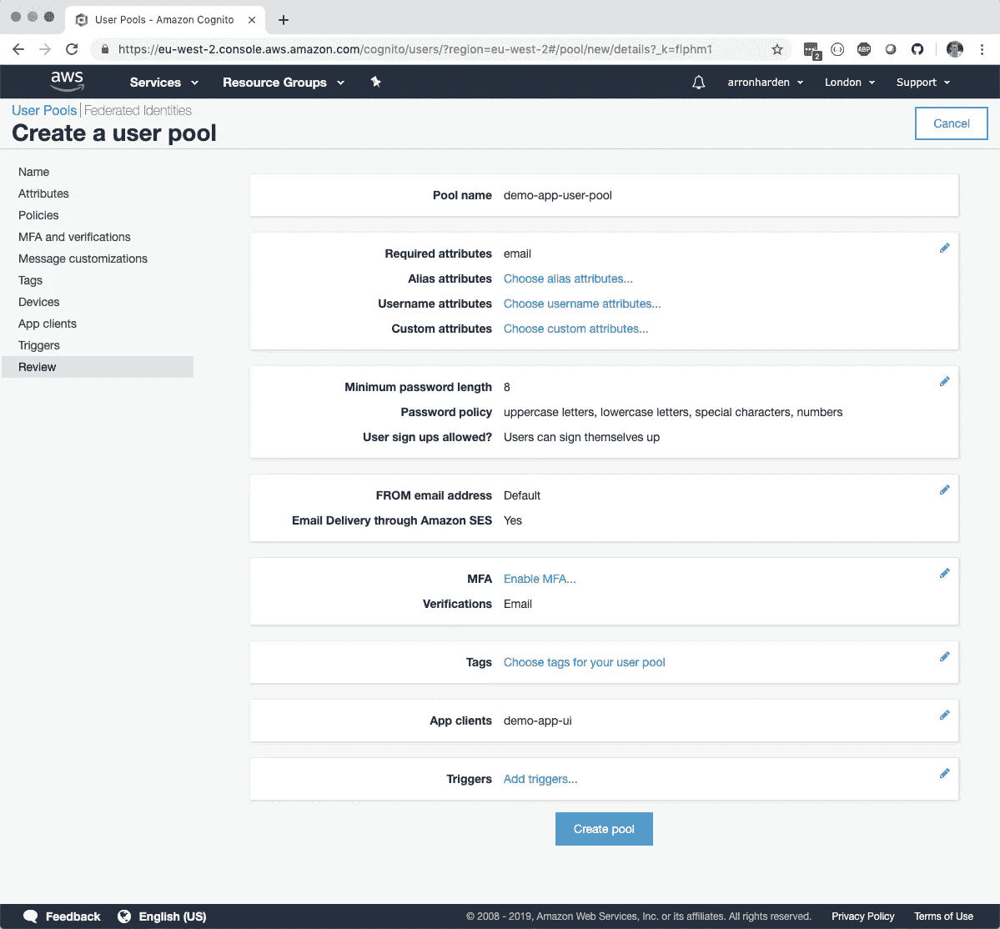
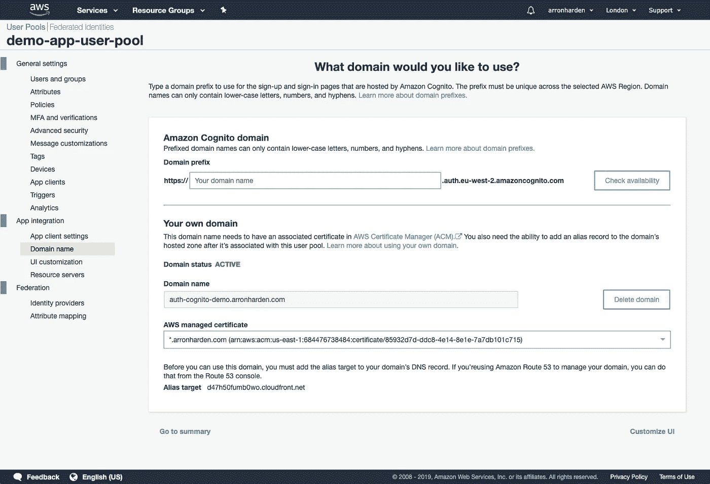
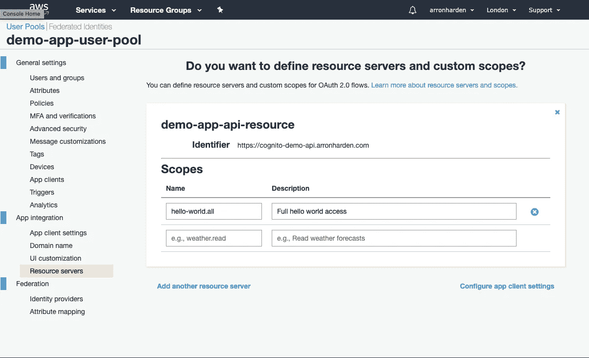
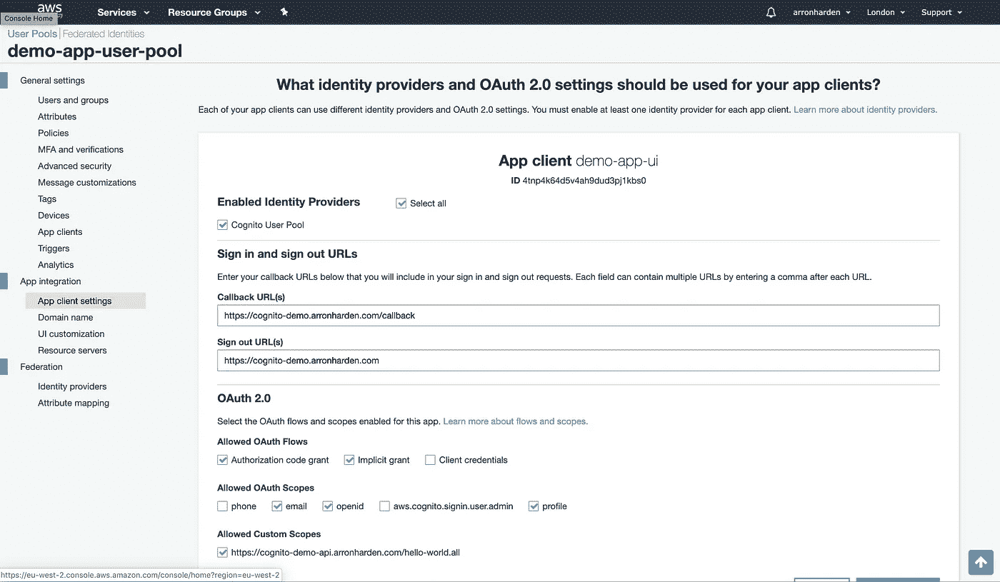
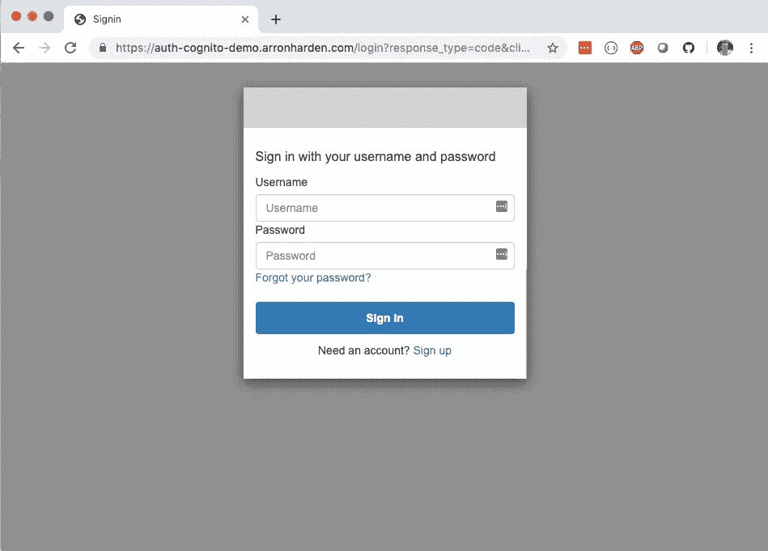
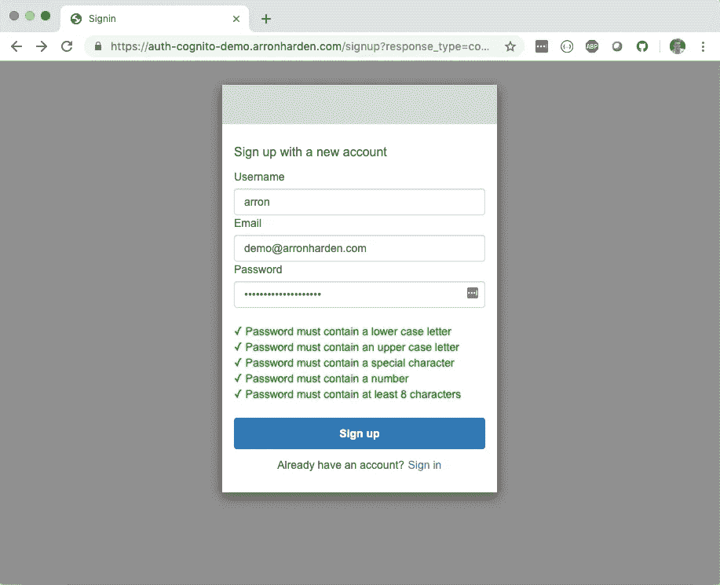
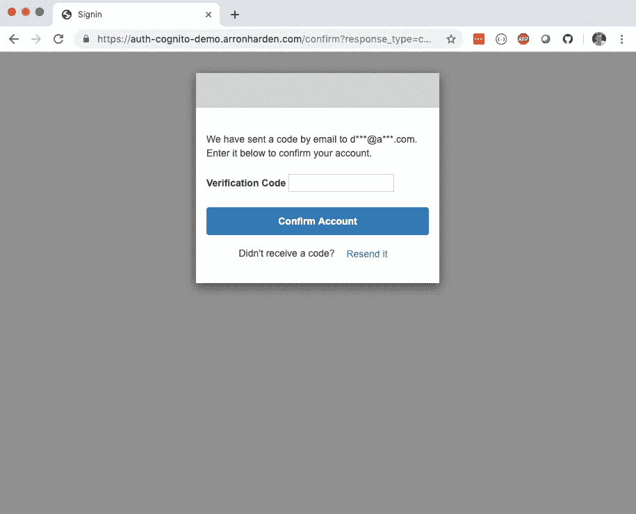
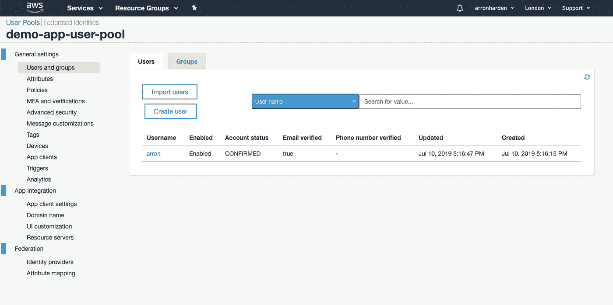

# 使用 React UI 和 Node.js REST APIs 的 AWS Cognito 示例—第 1 部分(Cognito 设置)

> 原文：<https://itnext.io/aws-cognito-example-using-react-ui-and-node-js-rest-apis-part-1-cognito-setup-5597acb02db4?source=collection_archive---------1----------------------->

在这组帖子中，我将讲述如何使用 [AWS Cognito](https://aws.amazon.com/cognito/) 服务为一个简单的应用程序堆栈提供用户管理，该堆栈由一个由 Node.js 实例提供的 React UI 和一个后端 REST API 组成，也是使用 Node.js 实现的，但在单独的实例中。

在我们的示例应用程序中，AWS Cognito 服务将用于提供以下功能:

*   用户登录和注册的 UI 内容(我们将自定义)
*   用于用户认证和令牌生成的后端 OAuth 实现
*   维护用户注册表，包括安全存储个人资料信息，如姓名和电子邮件地址

# 创建用户池

首先，我们创建了一个*用户池*。用户池是 AWS Cognito 用来保存和管理应用程序使用的所有用户身份的容器。找到 AWS Cognito 服务，创建一个新的用户池并为其命名。我们还需要为用户池创建一个*应用程序客户端*，这样我们的 UI 应用程序就可以与用户池进行交互。由于 UI 应用程序的前端将使用基于 JavaScript 的 UI (React ),我们还需要取消选中生成客户端密码选项，因为 JavaScript 客户端不支持该选项。

查看用户池设置，应类似于以下内容:

查看用户池配置

AWS Cognito 提供内置的 UI 页面来处理用户登录、注册等。这些可以定制，或者你可以推出自己的。

# 配置应用程序集成

现在我们已经创建了一个用户池，我们需要为它配置应用程序集成。这将允许我们使用该用户池控制应用程序的各个方面，例如用于身份验证的域名、身份验证发生后使用的 URL 回调，以及对初始登录/注册 UI 的定制。

对于这个示例应用程序，我将使用域*cognito-demo.arronharden.com*作为示例 UI 应用程序，使用域*auth-cognito-demo.arronharden.com*作为 AWS Cognito 端点。

## 域名

默认情况下，AWS Cognito 将使用在*amazoncognito.com*根目录下生成的子域。为了避免向您的最终用户公开这个域，您需要将其更改为使用您自己的应用程序的域名。为此，您需要能够做到以下几点:

*   在 AWS 证书管理器中为域创建或导入 SSL 证书。参见我的另一篇文章 [*在 AWS 证书管理器*](https://medium.com/@arron.harden/using-letsencrypt-ssl-certificates-in-aws-certificate-manager-c2bc3c6ae10) 中使用 LetsEncrypt SSL 证书，了解我如何为我的域创建和导入 LetsEncrypt 通配符证书。
*   能够为您的域创建一个 DNS CNAME 记录，以指向与您的用户池相关联的 AWS Cognito 目标。

我已经将这个用户池配置为使用域名*auth-cognito-demo.arronharden.com*，并为它创建了一个指向*d47h50fumb0wo.cloudfront.net 的 DNS CNAME 记录。*

指定用户池应用程序集成的域

## 资源服务器

因为我们要创建一个简单的后端 REST API 服务，所以我们需要为应用程序集成创建一个资源服务器。我们设置标识符来匹配后端 REST API 域的 URL，**，*，并定义一个名为 *hello-world.all* 的自定义范围，UI 认证流可以将该范围授予用户。*

**

*指定后端 REST API 资源服务器*

## *应用程序客户端设置*

*现在我们已经配置了域和资源服务，我们可以继续并配置在首次创建用户池时定义的应用程序客户端。我们设置回调和注销 URL 来匹配我们的 UI 应用程序 URL，[https://cognito-demo.arronharden.com](https://cognito-demo.arronharden.com)，注意对于回调，我们有额外的路径 */callback* ，这样 UI 应用程序可以处理成功的登录。对于 OAuth 流，我们选择*授权码授予*和*隐式授予*。作为我们的资源服务器的一部分创建的自定义作用域 *hello-world.all* 也是可用的，我们也想选择它。*

*对于本地开发，添加一个 localhost 回调 URL 是很有用的，例如， [http://localhost:3000/](http://localhost:3000/) ，这样您仍然可以使用通常的 auth 流，但是它将启动到您本地运行的 UI 应用程序，而不是真正的 UI 应用程序。但是，请记住不要在生产中使用本地主机回调。*

**

*指定应用程序客户端设置*

# *测试注册/登录用户界面*

*既然已经配置了应用程序集成，我们就可以继续测试身份验证 UI 流了。该示例的登录 URL 使用我们配置的域，对于查询参数，具有应用客户端 ID(显示在应用客户端设置中)以及我们定义的回调 URL。这个例子的完整网址是[https://auth-cognito-demo.arronharden.com/login?response _ type = code&client _ id = 4 TNP 4k 64 D5 v4 ah 9 dud 3 pj 1 kbs 0&redirect _ uri = https://cogn ITO-demo . arron harden . com/callback](https://auth-cognito-demo.arronharden.com/login?response_type=code&client_id=4tnp4k64d5v4ah9dud3pj1kbs0&redirect_uri=https://cognito-demo.arronharden.com/callback)。*

*继续尝试这个 URL 会显示默认的 AWS Cognito 身份验证 UI。*

**

*默认 AWS 认知身份验证用户界面*

*由于这是一个新用户池，我可以继续进行注册流程，这将创建一个新用户，并在允许用户进入系统之前发送一封带有验证码的电子邮件。*

**

*创建新用户*

**

*输入电子邮件中的验证码*

*由于还没有创建 UI 应用程序，最终重定向到我的应用程序集成回调 URL https://cognito-demo.arronharden.com/callback进入了死胡同，但这在现阶段是意料之中的。*

*作为最后的验证，我现在还可以看到用户 *arron* 已经在用户池中创建了。*

**

*用户已在用户池中创建*

*到目前为止，我们还没有编写任何代码，但我们已经有了一个强大而安全的用户管理服务和用户界面，可供我们的用户界面和后端 API 服务使用。在下一部分中，我将探索与 UI 应用程序的集成，展示如何通过认证流程以及如何定制登录/注册流程。*