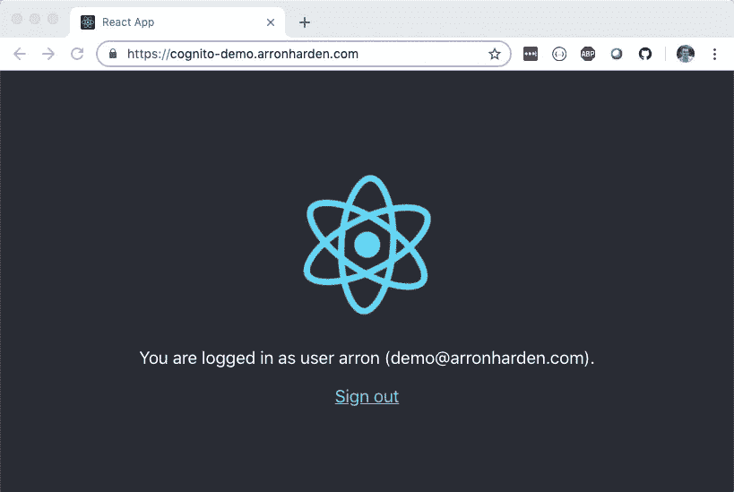
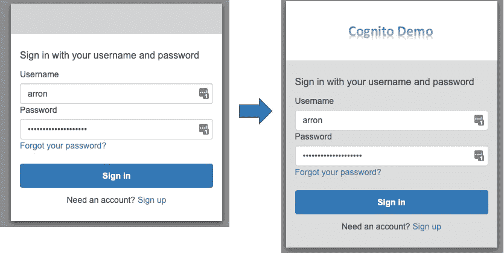

# 使用 React UI 和 Node.js REST APIs 的 AWS Cognito 示例—第 2 部分(React UI app with Redux)

> 原文：<https://itnext.io/aws-cognito-example-using-react-ui-and-node-js-rest-apis-part-2-react-ui-app-with-redux-6cc22610affe?source=collection_archive---------0----------------------->

在本系列的第二篇文章中，我将介绍如何将一个简单的 React UI 应用程序与我们在第一篇文章中配置的 AWS Cognito 用户池相集成。我将展示如何使用 Cognito 提供的内置登录和注册 UI 内容，以及如何将它们与 React UI 结合起来。我们还将探索这种内置 UI 内容的定制选项，并展示如何向它们添加我们自己的徽标和品牌。



与 Cognito 集成的 skeleton React 应用程序

回顾一下[的第一篇帖子](https://medium.com/@arron.harden/aws-cognito-example-using-react-ui-and-node-js-rest-apis-part-1-cognito-setup-5597acb02db4)，我们创建了一个 Cognito 用户池，并对其进行了配置，以便可以从客户端应用程序中使用。我们还为用户池配置了自定义域名，然后测试我们可以访问内置的登录和注册页面。

# 创建 React UI 应用程序

当我开始查看 Cogntio 时，我以为 AWS 文档中会有一个简单的例子，展示如何使用现有的 AWS 库将 Cogntio 巧妙地添加到 React 应用程序中——不幸的是没有，所以就交给 Google 了。再说一次，我发现没有什么是完全符合标准的。也许我的谷歌搜索还不够好，因为我找到的大多数例子都是展示如何使用自己的登录和注册页面，或者如何从更传统的 JavaScript UIs 调用 AWS 库，而不是我正在寻找的单页应用程序(SPA)方法。

所以回到绘图板，我决定从标准的 skeleton React 应用程序开始，编写我需要的代码，以演示与 Cognito 的集成。

## React 应用概述

我的简单 React 应用程序将使用 React 路由器配置 2 个 UI 路由。第一个是附加在 */* 路由上的，是常规的欢迎使用 React 页面，我将对其进行修改，以显示一条消息，指示用户当前是否登录。第二个附属于 */callback* 路由，将处理来自内置 Cognito 登录和注册内容的回调。

将路由绑定在一起是一个 Redux 存储，它包含会话信息，并使需要它的 UI 组件可以使用它。应用程序的最后一部分是位于 AWS Cognito JavaScript 库之上的一小组实用方法。

应用程序将被绑定到 URL[https://cognito-demo.arronharden.com](https://cognito-demo.arronharden.com)以匹配我们的用户池回调中配置的 URL。我使用 AWS Amplify 来管理 GitHub 的构建和部署，但是细节问题将留待下次讨论。完整的应用程序源代码可在 https://github.com/arronharden/cognito-demo-ui 的[GitHub 获得。](https://github.com/arronharden/cognito-demo-ui)

为了开始并使这个例子尽可能简单，我创建了一个样板 React 应用程序，并将其命名为 *cognito-demo-ui。*

```
npm init react-app cognito-demo-ui
```

## Redux

应用程序的 Redux 部分由 reducers、动作和存储组成。如果你是 Redux 的新手或者已经有一段时间没有使用它了，像[https://www.valentinog.com/blog/redux/](https://www.valentinog.com/blog/redux/)这样的东西是一个好的开始。

这个示例应用程序的 Redux 状态非常简单:

```
session: {
    isLoggedIn: <boolean>,
    user: {
        userName: <string>,
        email: <string>
    },
    credentials: <CognitoIdentityCredentials>
}
```

定义了 3 个动作； *clearSession* ， *setSession* 和最有趣的*initSessionFromCallbackURI*。这最后一个动作使用 *react-thunk* 来启动一个异步进程，以验证通过 URL 中的 *code* 查询参数传递给应用程序回调路由的验证码(例如，以[https:*//cognito-demo . arronharden . com/callback？代码= xxxxxxxx-xxxx-xxxx-xxxx-xxxxxxxxxxxx*](https://cognito-demo.arronharden.com/callback?code=xxxxxxxx-xxxx-xxxx-xxxx-xxxxxxxxxxxx))。一旦验证码被验证，它就会从 Cognito 获得一个会话，其中包含我们调用后端 REST APIs 所需的 JWT 令牌。一旦完成，它将使用从 Cognito 返回的会话在商店上调度 *setSession* 动作，该会话将包含用户信息和凭证。这些操作的代码如下所示:

会话还原操作(session.js)

Cognito 实用程序方法的相应代码如下所示。这独立于 Redux 实现，使其尽可能可重用。*(需要注意的一点是，它使用的 AWS 提供的库主要只支持浏览器，因为它们通常使用 XHR 进行 REST API 调用。对于我们的例子来说这不是问题，但是如果代码直接在 Node.js 中执行，这可能是个问题)。*

Cognito 实用方法(cognitoUtils.js)

## 申请途径

如前所述，应用程序需要定义 2 条路由，我们将使用 React 路由器来实现。/路由将会转到 *Home* 组件，而 */callback* 路由将会转到 *Callback* 组件。

定义了两条路线的主应用程序(App.js)

## 家用部件

根据用户是否登录，Home 组件将显示不同的消息。如果他们已经登录，它将显示他们登录时使用的用户名和电子邮件地址(来自 Redux store)以及一个可用于注销的链接。如果他们没有登录，它将显示一个到 Cognito 提供的登录页面的链接。

主页组件(Home.js)

## 回调组件

回调组件将简单地使用调用它的 URL 在存储上调用*initSessionFromCallbackURI*动作。一旦在存储中设置了会话细节，React 将自动调用 *render()* 方法，因为来自 Redux 存储的会话是回调组件的会话属性。回调部件然后将使用重定向部件重定向到路由部件，即归属部件。因为我们使用重定向组件，而不是 window.location 样式的重定向，所以 Redux 存储状态不会被清除，这使得 Home 组件能够检索会话细节。

回调组件(Callback.js)

# 定制 Cognito 托管的用户界面

您可能已经注意到，Cognito 用户池配置允许用户界面定制。在这里，我们将进行一些定制:

*   上传一个简单的标志
*   横幅`background-color`至`white`
*   背景`background-color`到`#ddd`

一旦这样做了，我们可以通过登录流程立即看到不同之处。



定制前后

虽然定制功能确实允许对托管登录和注册 UI 内容进行一些控制，但它在可以改变什么方面非常有限。例如，如果你试图定制内容来匹配 React skeleton 应用程序的样式(白色文本在`#282c34`背景上),你很快就会发现你做不到，因为你不能改变所有文本组件的颜色。定制也仅限于 CSS 的改变——目前不可能改变文本本身。还值得注意的是，文本语言似乎只硬编码为英语，它没有使用 *Accept-Language* 或 URL 查询参数来显示不同语言的选项。

总的来说，我认为内置的托管登录和注册 UI 内容对于入门、演示和小型项目来说是很好的，但在大多数情况下，您更可能希望为这些内容构建自己的 UI，并使用 AWS 库作为该 UI 的后端。

在下一部分中，我们将离开 UI，向下移动堆栈，查看 Node.js 中实现的 REST API，以及如何使用 UI 从 Cognito 获得的 JWT 令牌安全地调用它。