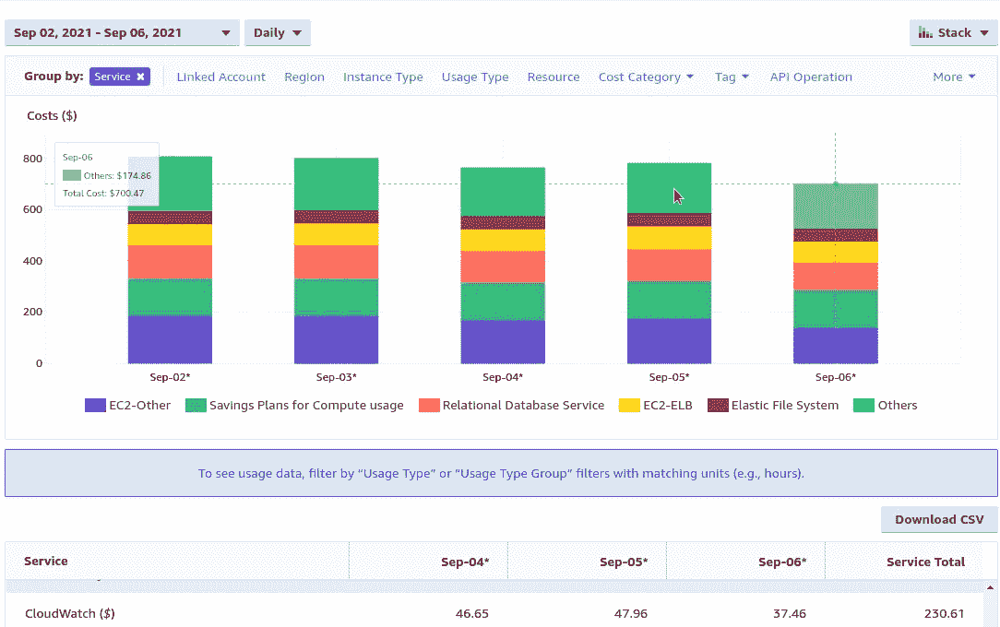
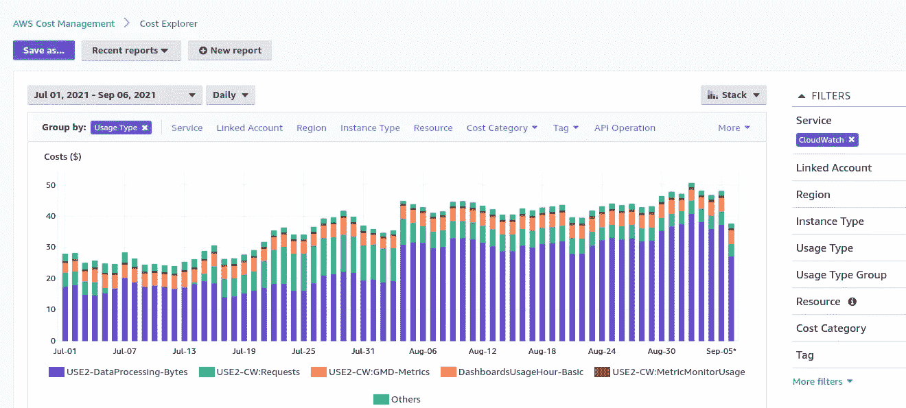
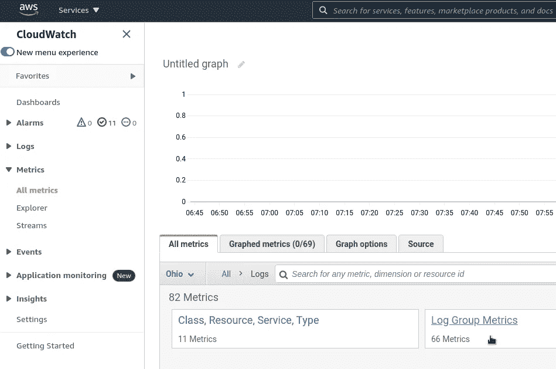
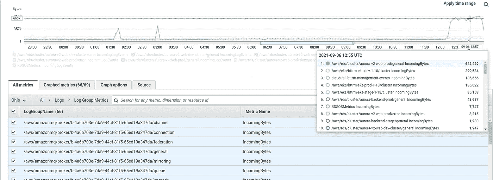
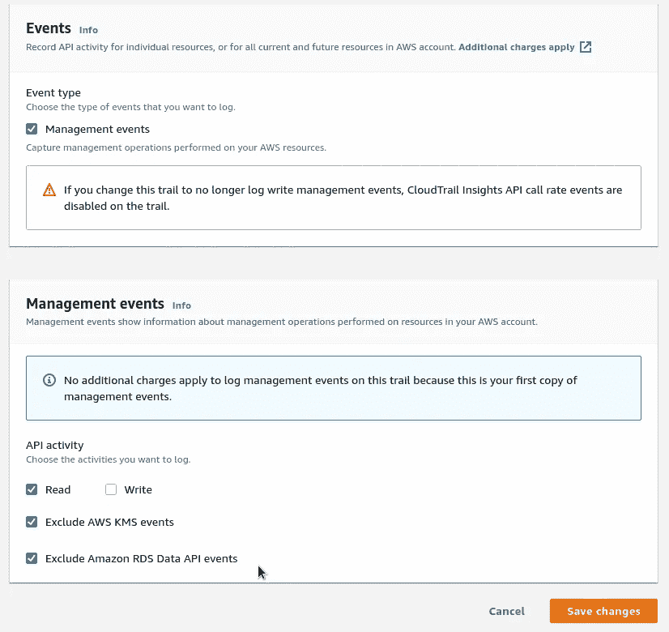
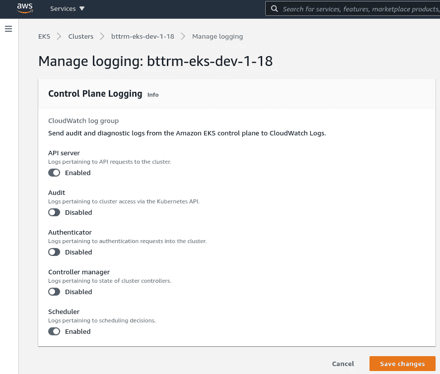

# AWS:Cost Explorer—cloud watch 日志上的成本检查示例

> 原文：<https://itnext.io/aws-cost-explorer-costs-checking-on-the-cloudwatch-logs-example-e2265c3ff076?source=collection_archive---------5----------------------->

这篇文章并不是对 AWS Cost Explorer 服务的概述，而只是一个如何检测你的 AWS 账户及其服务成本的简单例子。

因此，当我从[假期](https://rtfm.co.ua/poezdka-v-kemer-turciya-foto/)回来时，我注意到我们为 8 月份的 AWS CloudWatch 支付了比平时更多的费用——几乎每天 50 美元(包括下图中的*其他*):

为了找出 CloudWatch 到底花了我们多少钱，在*过滤器*中选择 *CloudWatch* ，并在*组中通过*使用*使用类型*:

我们可以看到，`DataProcessing-Bytes`在八月份增加了很多，这是 CloudWatch 日志的第一点。

让我们检查一下是不是这样—通过将*组切换到 *API 操作*:*

哇！现在我们可以看到，从每天 50 美元中，我们只支付 40 美元来将新事件写入 CloudWatch 日志！API 操作名`[PutLogEvents](https://docs.aws.amazon.com/AmazonCloudWatchLogs/latest/APIReference/API_PutLogEvents.html)`不言自明。

好了，现在我们需要找出哪个日志组产生的流量最多。

转到云观察指标，选择*日志* — *日志组指标*:

在这里，选择所有的`IncomingBytes`，你会看到你所有日志组的活动:

在顶部，我们有一个 Aurora 集群，它为监控启用了通用日志；一个 EKS 集群，我们的开发环境，其中有许多活动；以及一个*cloudtrail-Bt trm-management-events*日志组，其中有我们的 cloud trail 活动，请参见 [AWS: CloudTrail 概述以及与 CloudWatch 和 Opsgenie 的集成](https://rtfm.co.ua/en/aws-cloudtrail-overview-and-integration-with-cloudwatch-and-opsgenie/)。

因此，最后一件事是调整这些服务的日志设置。

对于 CloudTrail，我们可以禁用关于写操作的日志记录，因为我们没有将它们用于警报，并且排除一些 AWS KMS 和 AWS RDS 日志记录:

对于 EKS 集群，禁用所有或一组日志:

完成了。

*最初发布于* [*RTFM: Linux、DevOps、系统管理*](https://rtfm.co.ua/en/aws-cost-explorer-costs-checking-on-the-cloudwatch-logs-example/) *。*